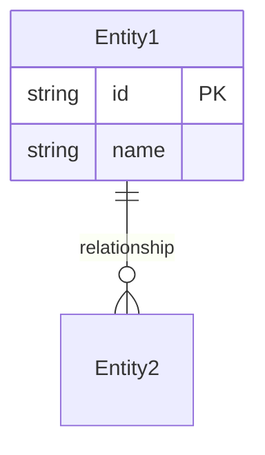

## テンプレート: 機能仕様書

```markdown
# 機能仕様書: [機能名]

## メタ情報
| 項目 | 内容 |
|------|------|
| ステータス | Draft / Review / Approved |
| 作成日 | YYYY-MM-DD |
| 更新日 | YYYY-MM-DD |
| 関連ADR | ADR-XXX (`../adr/XXX-*.md`) |

## 1. 概要

### 1.1 目的
[この機能が解決する課題、提供する価値]

### 1.2 ユーザーストーリー
```
As a [役割],
I want [機能],
So that [価値].
```

### 1.3 スコープ
**含む:**
- [スコープ内の項目]

**含まない:**
- [スコープ外の項目]

## 2. 機能要求

### FR-001: [要求名]
- **説明**: [要求の詳細]
- **優先度**: Must / Should / Could / Won't
- **受け入れ条件**:
  - [ ] [条件1]
  - [ ] [条件2]

### FR-002: [要求名]
...

## 3. 非機能要求

### NFR-001: パフォーマンス
- [具体的な指標]

### NFR-002: セキュリティ
- [セキュリティ要件]

## 4. データモデル



## 5. インターフェース

### API（該当する場合）
| メソッド | エンドポイント | 説明 |
|---------|---------------|------|
| GET | /api/xxx | 一覧取得 |

### UI（該当する場合）
[画面構成、遷移フロー]

## 6. 権限等級（v4.0.0）

各変更項目の PG/SE/PM 分類:

| 変更対象 | 権限等級 | 理由 |
|---------|---------|------|
| [変更1] | PG/SE/PM | [理由] |

権限等級の詳細: `.claude/rules/permission-levels.md`

## 7. 制約事項
- [技術的制約]
- [ビジネス制約]

## 8. 依存関係
- [他機能への依存]
- [外部サービスへの依存]

## 9. テスト観点
- [主要なテストケース]
- [エッジケース]

## 10. 未決定事項
- [ ] [要検討項目1]
- [ ] [要検討項目2]

## 11. 変更履歴
| 日付 | 変更者 | 内容 |
|------|--------|------|
| YYYY-MM-DD | | 初版作成 |
```

