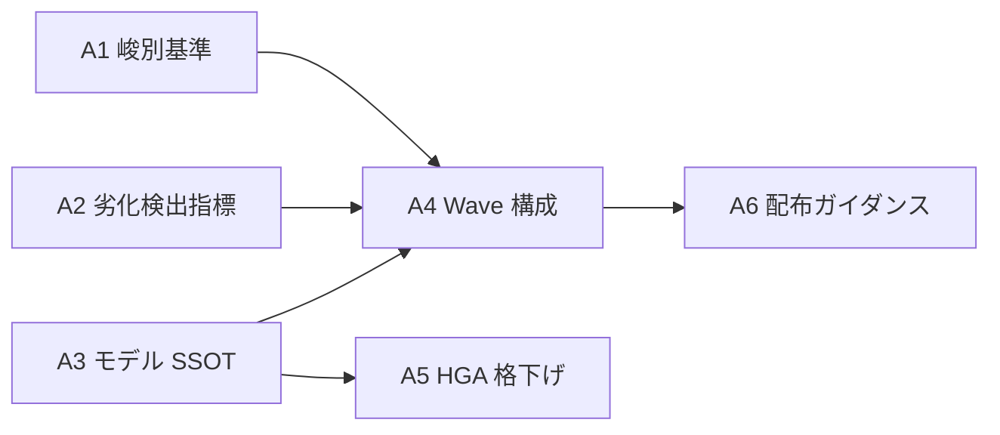

# MAGI ログ: M-1 (Opus 5 移行 + Anthropic 新 context engineering 原則の LAM 適用)

**モード**: **AoT 適用モード** (判断ポイント 6 / 影響レイヤー 4 / 選択肢 3+ per Atom)
**開始**: 2026-07-25
**議題**: LAM 憲法型ハーネスの規律群 (~8,200 行) のうち、Anthropic 新原則 (Rules→Judgement / Progressive Disclosure) に追随して削減すべきものと、LAM 固有価値として保全すべきものの峻別基準を定め、M-1 の設計軸を確定する
**実行モデル**: Opus 5 (2026-07-25 リリース / 本セッションで切替)

---

## Phase 0: Grounding

### 入力 1: Anthropic 公式指針 (Thariq @trq212 / 2026-07-25 / claude.com blog)

「The new rules of context engineering for Claude 5 models」。Claude Code の system prompt を **80%+ 削除しても coding eval に有意な低下なし**と実測。6 原則転換:

| # | Then | Now |
|:-:|:-----|:----|
| 1 | Give Claude Rules | **Give Claude Judgement** |
| 2 | Give Claude Examples | **Design Interfaces** |
| 3 | Put it all upfront | **Progressive Disclosure** |
| 4 | Repeat yourself | **Simple tool descriptions** |
| 5 | Memory in CLAUDE.md | **Auto-memory** |
| 6 | Simple specs | **Rich references** |

context 組立の優先順位: `Your prompt → References → System prompt → CLAUDE.MDs → Skills → Memory`

CLAUDE.md 推奨: 「repo の目的の簡潔記述 + codebase 内の gotchas」に絞る。**file system から明らかなことは書かない**。
Skills 推奨: 軽量ガイド。over-constrain 禁止。長い skill は progressive disclosure で分割。

**重要な原文の含意** (削減 ≠ 単純削除): Anthropic の実例は
「In code: default to writing no comments. Never write multi-paragraph docstrings...(列挙)」
→「Write code that reads like the surrounding code: match its comment density, naming, and idiom.」
であり、**列挙の削除ではなく「意図への圧縮」**である。

### 入力 2: LAM 現状実測 (Sonnet 調査 / 2026-07-25 / tool_uses 33)

| 領域 | ファイル数 | 総行数 | 最大 |
|:-----|:---------:|:------:|:-----|
| CLAUDE.md | 1 | 269 | — |
| .claude/rules/ | 16 | 2,176 | hga-summoning.md 330 |
| .claude/skills/ | 15 | 3,656 | full-review 951 |
| .claude/agents/ | 12 | 2,081 | quality-auditor 328 |
| **合計** | **44** | **8,182** | |

over-constrain pattern (rules/ 全体): 「禁止」39 / MUST 17 / MUST NOT 6 / NEVER 0。
うち **「禁止」の 59% (23/39) が `fable-l3-protocol.md` (12) + `phase-rules.md` (11) の 2 ファイルに集中**。

重複の実測:
- **F0-F4 実行プロトコル**と**60 秒実況**が `fable-l3-protocol.md` (定義本体) と `phase-rules.md` (発火点再掲) に**ほぼ同内容で二重記述**
- PM 級承認ゲート言及が 11 ファイル 64 箇所に分散

### 入力 3: R-2 tasks.md 実測 (L1 直読 / 2026-07-25)

R-2 残 Wave の内容と M-1 方向性の照合:

| R-2 Task | 内容 | M-1 との方向性 |
|:---------|:-----|:--------------|
| W1-T4/T5 | rule-002.md / subprocess-encoding-convention.md **新規** | 実測発火由来 → M-1 でも保全側 (**手戻りなし**) |
| W2-T9/T12/T13 | terminology.md §4.5 に **3 小節追加** | **逆行** (条項追加 / トリアージ対象になりうる) |
| W2-T13b | planning-quality-guideline.md §1.5 **新設** | **逆行** (同上) |
| W3-T24 | model-delegation-prompting.md **新設節** | **逆行** (かつ A4 の SSOT 対象そのもの) |
| W3-T15 | evaluation-kpi.md §7 **削除** | **同方向** |
| W3-T23 | deletions.md **template 化** | **M-1 の前提インフラ** (削減記録の器) |

---

## AoT Decomposition

| Atom | 判断内容 | 依存 |
|:-----|:---------|:-----|
| **A1** | 保全 / 圧縮 / 削減 の峻別基準を定義する | なし |
| **A2** | 劣化検出指標 (削減の安全網) を定義する | なし |
| **A3** | モデル世代交代 SSOT の設計 (予防策の本体) | なし |
| **A4** | M-1 の適用順序と Wave 構成 (R-2 との統合含む) | A1, A2, A3 |
| **A5** | Fable HGA 格下げの具体条件 | A3 |
| **A6** | 他プロジェクト配布ガイダンスの形式 | A4 |

**依存関係 DAG**:



Atom 3 条件の充足確認:
- **自己完結性**: A1/A2/A3 は互いの実装詳細に依存せず独立処理可能 (基準・指標・ファイル構成は直交)
- **契約**: 各 Atom の入出力を上表で明示
- **エラー隔離**: A1 が失敗しても A2/A3 の入力は変わらない (A4 のみが 3 者を統合)

---

## Atom A1: 保全 / 圧縮 / 削減 の峻別基準を定義する

### [MELCHIOR]

- **context 税の実額**: CLAUDE.md 269 行 + rules 2,176 行 = 2,445 行が毎セッション頭に載る。skills/agents は on-demand だが、頻用 skill (quick-load/save, ship, building) は実質常駐。削減は**毎セッション複利で効く**
- **Anthropic の実測は無視できない**: 80% 削減で劣化なし。しかも Anthropic の system prompt は LAM の規律より遥かに推敲されているはず。**推敲の甘い LAM 側にこそ削減余地が大きい**と考えるのが自然
- **conflicting messages が最大の害**: Anthropic が名指しした失敗は「1 リクエスト内で複数の矛盾指示」。LAM は F0-F4 と 60 秒実況を 2 ファイルで違う言い回しで書いている = **まさにこれ**。削減は単なる節約ではなく**品質改善**
- **既に「意図への圧縮」の前例が LAM 内にある**: rule-001 の「B-N 専用 regex → `[A-Z]-\d+` 汎化」(2026-07-06 / R-1 W-R1 S1 T6) は、列挙的対処を抽象パターンに畳んだ実例。trust-model.md §N 回目発火時の恒久解検討がこれを制度化済み。**同じ操作を規律文書に適用するだけ**
- Opus 5 は「指示が少ない方が良い結果」との観測 (Paweł Huryn: memory 有効で ~70%)。規律過多は Opus 5 の judgement を殺す

### [BALTHASAR]

- **エビデンスのドメイン差**: Anthropic の実測は **coding evaluations**。LAM の価値は「複数セッションにまたがる統治と一貫性」。**coding eval は LAM の価値を測っていない**。「80% 削っても劣化なし」を LAM に外挿する根拠は提示されていない
- **削除対象の性質が違う**: Anthropic が削ったのは「汎用エージェントが任意ユーザーに対して最悪ケースを避けるための防御」。LAM の PM 級承認ゲートは**モデルが賢いかどうかと無関係**に、**ユーザーが承認したいから**存在する。両者を同じ「Rules」として扱うのはカテゴリエラー
- **メタ規範の自己書き換えリスク**: `permission-levels.md` §PM 級パスの事前計算原則は「実行時に第 0 原則で PM 級を降格することを**禁止する**」と明記している。「Rules→Judgement」をこの条項に適用すると、**禁止条項自体を judgement で外す**ことになる。これは自己言及的に不正
- **儀式は L3 契約下にある**: 60 秒実況・自己監査 14 項目は Fable-Alembic L3 受け入れの一部 (`fable-l3-protocol.md` §0 導入宣言)。LAM 単独判断で削るのは L3 契約の一方的変更。かつ §3 帳簿単一原則が「削減は正義ではない / 半分だけの移植は移植しないより悪い」と**明示的に警告済み**
- **タイミングが最悪**: Opus 5 リリースから 24 時間未満。実挙動の実測ゼロ。この状態で 8,200 行の統治文書を書き換えるのは「新しい道具で大掃除」の典型的失敗
- **劣化検出の不在**: Green State は Critical/Warning **件数**であり、「規律が欠落したこと」を検出しない。削減の失敗は数週間かけたドリフトとして現れ、その時には原因特定が困難

### [Debate]

**争点 1: エビデンスのドメイン差 (BALTHASAR)**
→ MELCHIOR: 外挿できないなら**LAM 側で実測すればよい**。削減前後で指標を比較する。ただし指標設計は A2 の責務であり、A1 の基準はその実測が可能な粒度でなければならない = **条項単位で「何を削ったか」が追跡可能な形式**にする必要がある。
→ **合意**: 峻別基準の出力は「削減リスト」でなければならない (削除して終わりではなく、削除した条項の台帳を残す)。

**争点 2: カテゴリエラー (BALTHASAR)**
→ MELCHIOR: これは反論ではなく**基準の材料**である。「誰の判断を記録しているか」で分類すればよい。ユーザー意思の記録 = 保全、モデル誤り予防 = 削減候補。
→ **合意**: これを軸 1 とする。かつ **veto 権**を与える (他軸がどうであれ保全)。根拠: Hierarchy of Truth #1 = User Intent 最上位。

**争点 3: メタ規範の自己書き換え (BALTHASAR)**
→ MELCHIOR: 軸 1 の veto で自動的に保護される (PM 級パス列挙はユーザー意思の記録)。加えて**手続き的な二重化**を提案: トリアージの**判定は提案に留め、適用は PM 級承認を経る**。
→ BALTHASAR: それでも「承認疲れ」で形骸化する。→ MELCHIOR: R-2 W1 で実施済みの **K5 一括宣言パターン**を使う (トリアージ表全体を 1 承認イベントとして提出)。
→ **合意**。

**争点 4: 儀式と L3 契約 (BALTHASAR)**
→ MELCHIOR: L3 契約は「第 0 原則を default 判断基準に / 自己監査を完了宣言前ゲートに / 体験シミュを 3 点で MUST / F0-F4 を BUILDING 運転規則に」の 4 点。**契約は「採用する」であって「LAM 内で何回書くか」ではない**。二重記述の解消 (`phase-rules.md` の再掲を参照 1 行に畳む) は契約の削減ではなく**表現の圧縮**。
→ BALTHASAR: `fable-l3-protocol.md` §3 の警告「半分だけの移植 = 削減の色だけ規範化し命綱を落とす」に抵触しないか。
→ MELCHIOR: 抵触しない。命綱 (体験シミュ) の**発火点数は不変**とする。減らすのは記述箇所であって発火点ではない。§5.4 ガード 2 が「発火点数の一時的減少は禁止」と明記しており、これを M-1 の制約として引き継ぐ。
→ **合意**: 「発火点・ゲート・承認イベントの**数**は削減対象外」を明文の制約とする。

**争点 5: タイミング (BALTHASAR)**
→ MELCHIOR: A1 は**基準の定義**であり、適用の速度は A4 の責務。基準を今作ることのリスクはゼロ。
→ **合意** (適用速度の議論は A4 に送る)。

**争点 6: 削減 vs 圧縮の区別 (MELCHIOR 提起)**
→ Anthropic の実例自体が「削除」ではなく「意図への圧縮」だった。**3 値 (保全/圧縮/削減) にしないと Anthropic の指針を誤読する**。
→ BALTHASAR: 同意。ただし「圧縮」は最も判断を要する分類であり、圧縮の質が悪ければ削減と同じ害になる。**圧縮時は元条項を台帳に残す**ことを条件とする。
→ **合意**。

### [CASPAR]

**結論**: **条項トリアージ (Clause Triage)** を導入する。ファイル単位ではなく**条項単位**で 4 軸を評価し、決定木で 3 値 + 1 (SSOT 退避) に振り分ける。

#### 4 軸

| 軸 | 問い | 保全側 | 削減側 |
|:--|:-----|:------|:------|
| **軸 1 (帰属)** | 誰の判断を記録しているか | ユーザー/プロジェクトの意思 (統治・リスク許容度・方法論の選択) | モデルの誤り予防 (worst-case 回避) |
| **軸 2 (形式)** | 意図か、列挙か | 意図 (principle / 既に圧縮済) | 列挙 (enumerated do/don't) |
| **軸 3 (可逆性)** | 破ったとき巻き戻せるか | 不可逆 (承認ゲート / spec freeze / 破壊操作 / 外部公開) | 可逆 (書式 / 命名 / 手順 / 表現) |
| **軸 4 (根拠)** | 実測発火があるか | 実測インシデント由来 (検出イベント ≥ 1) | 予防的に書かれた (発火実績ゼロ) |

軸 3 は第 0 原則の 3 変数のうち可逆性・復旧コストを継承。軸 4 は `trust-model.md` §カウント単位の「検出イベント単位」定義をそのまま流用する (**新機構を作らない**)。

#### 決定木

```
軸1 = ユーザー意思/統治        → 保全 (veto / 他軸を問わない)
軸3 = 不可逆ガード             → 保全 (veto / 他軸を問わない)
上記いずれにも該当しない場合:
  ├ 帰属がモデル固有の事実      → SSOT 退避 (A3 のロスターへ / 削除ではなく移動)
  ├ 軸4 = 実測発火あり
  │    ├ 軸2 = 列挙            → 圧縮 (意図 1 行に畳む / 根拠は docs/artifacts へ退避)
  │    └ 軸2 = 意図            → 保全
  └ 軸4 = 発火ゼロ
       ├ 軸2 = 列挙            → 削減
       └ 軸2 = 意図            → 保全 (低優先 / 次回 retro で再評価)
```

#### 不変制約 (削減対象外 / MUST NOT)

以下は軸に関わらずトリアージの対象外とする:

1. **発火点・承認ゲート・宣言イベントの「数」** (体験シミュ 3 発火点 / PM 級ゲート / gabriel probe 起動条件)。減らすのは記述箇所であって発火点ではない (`fable-l3-protocol.md` §5.4 ガード 2 準拠)
2. **PM 級パス列挙** (`permission-levels.md` §ファイルパスベースの分類) — ユーザーが事前計算した第 0 原則の出力
3. **統治への自己書込禁止** (AUTONOMOUS フェーズ DENY 経路 / ADR-0005 FR-9.1)

#### 手続き

- トリアージの**判定は提案**に留める。**適用は PM 級承認**を経る (R-2 W1 の K5 一括宣言パターンを流用 = トリアージ表全体を 1 承認イベント)
- **圧縮・削減した条項は全件台帳に残す** (`docs/artifacts/` / R-2 W3-T23 の deletions template を器として流用)

**採用しなかった選択肢とその理由**:
- **(a) ファイル単位の保全/削除判定**: 実測で `fable-l3-protocol.md` と `phase-rules.md` に「LAM 固有価値」と「削減候補」が混在していることが確認済 (Sonnet crux 1)。ファイル単位では判定不能
- **(b) Anthropic 6 原則をそのままチェックリスト化**: 原則は Anthropic の製品文脈 (汎用コーディングエージェント) に紐付いており、LAM の統治文脈に写像する層がないと軸 1 のカテゴリエラーを起こす
- **(c) 2 値 (保全/削減)**: Anthropic の実例自体が「意図への圧縮」であり、2 値では指針を誤読する
- **(d) 削減量の数値目標 (例: 50% 削減)**: 目標が基準を歪める。Anthropic の 80% は結果であって目標ではない

---

## Atom A2: 劣化検出指標 (削減の安全網) を定義する

### [MELCHIOR]

- 既存の計測資産で足りる。**新機構を作る必要はない**:
  - `pytest` 全数 (現 988 passed + 15 skipped) — regression の直接指標
  - Green State (Critical/Warning 件数)
  - `.claude/tdd-patterns.log` の FAIL→PASS 発生率
  - `.claude/gabriel-metrics.log` の verdict 分布
  - PM 級ダイアログ発火頻度
- **`fable-l3-protocol.md` §9 検証課題に既に「PM ダイアログ頻度不変確認」「tdd-patterns.log の FAIL→PASS 発生率 導入前後比較」が書かれている**。L3 導入時に設計済みの枠組みをそのまま M-1 に再利用できる
- 削減の効果指標も同じ枠で測れる: CLAUDE.md + rules の実トークン数 (削減前/後)

### [BALTHASAR]

- **上記の指標はすべて「壊れたこと」は測るが「規律が緩んだこと」は測らない**。pytest は通る。Green State も通る。しかし「仕様を確認せずに実装した」「承認を取らずに PM 級を編集した」は数値に出ない
- 規律の欠落は**数週間のドリフト**として現れる。その時点で「削減が原因」と特定するのは事後的に困難 (交絡因子が多すぎる)
- **削減した条項の一覧がなければ、そもそも「何が失われたか」を問えない**
- ベースラインを取る前に削り始めたら、比較対象が永久に失われる。これは**不可逆**

### [Debate]

**争点 1: 定量指標の盲点 (BALTHASAR)**
→ MELCHIOR: 定量で測れないなら**定性的 tripwire** を足す。削減した条項リストを保持し、retro で「この条項がなくて困ったか」を明示的に問う。これは安価かつ失敗モードに直撃する。
→ BALTHASAR: retro は人間の記憶に依存する。数週間後に「困ったか」を思い出せない。
→ MELCHIOR: **trust-model.md の検出イベント機構に接続する**。削減条項の不在が原因の検出イベントが発生したら、既存の「同一パターン 2 回以上 → ルール候補提案」が自動的に発火する。**削減した条項は復活候補として trust-model の対象に入れる**。
→ **合意**。既存機構への接続であり新規実装不要。

**争点 2: ベースラインの順序 (BALTHASAR)**
→ MELCHIOR: 全面同意。反論なし。**ベースライン測定は削減の前** = M-1 の最初の Wave (W0) とする。
→ **合意** (BALTHASAR の主張を全面採用)。

### [CASPAR]

**結論**: **3 層の安全網**を敷く。うち第 1 層 (ベースライン) は削減着手の**前提条件** (未実施なら削減に進まない)。

| 層 | 内容 | 実施時期 | 新規実装 |
|:--|:-----|:--------|:--------|
| **第 1 層: 定量ベースライン** | pytest 全数/pass 率 / Green State 件数 / tdd-patterns.log FAIL→PASS 率 / gabriel verdict 分布 / PM 級ダイアログ発火数 / CLAUDE.md+rules トークン数 | **削減前 (W0) と各 Wave 末** | 不要 (既存資産) |
| **第 2 層: 削減台帳** | 圧縮・削減した全条項を「原文 / 判定軸 / 移動先」付きで記録 | トリアージ適用時 | 不要 (R-2 W3-T23 deletions template を流用) |
| **第 3 層: 復活経路** | 台帳の条項を `trust-model.md` の検出イベント対象に含める。不在起因の検出イベントが閾値 (2 回) に達したら復活候補として自動提案 | 削減後 (恒久) | 不要 (trust-model 既存機構) |

**採用しなかった選択肢とその理由**:
- **(a) 定量指標のみ**: BALTHASAR の指摘通り「規律の緩み」を捉えない
- **(b) 新規の規律遵守メトリクス実装**: LAM に監視機構をもう 1 本増やすことになり、`fable-l3-protocol.md` §3 の帳簿単一原則 (Green State 1 冊) に抵触する。既存機構への接続で足りる
- **(c) 段階的削減で様子見のみ (台帳なし)**: 「何が失われたか」を問えない。BALTHASAR の指摘通り

---

## Atom A3: モデル世代交代 SSOT の設計 (予防策の本体)

### [MELCHIOR]

- 今回の見直しが大変な理由は明快: **モデル固有記述が全域に散っている**。実測で確認できる散在箇所:
  - `CLAUDE.md` §作業体制 (「2026-07 以降は L1=Opus / L2=Sonnet / L3=Haiku」「Fable 5 は常駐させず」「L1=Opus 4.7 1M 等」)
  - `CLAUDE.md` §Context Management §モデル運用（Opus 4.8 試験運用時）— 節まるごと
  - `CLAUDE.md` §担当層の判断基準 — モデル名入りの表
  - `.claude/rules/model-delegation-prompting.md` — 全体 78 行が Sonnet 5 / Haiku 4.5 固有
  - `.claude/rules/hga-summoning.md` — Fable 5 単価・envelope・実測が 330 行の相当部分
  - `.claude/agents/*.md` の `model:` frontmatter (12 ファイル / sonnet 8 + haiku 3 + 不明 1)
- **構造的な予防策は 1 つ**: 他のルールファイルは**層名 (L1/L1.5/L2/L3/HGA) だけを使い、モデル名を書かない**。モデル名は SSOT 1 ファイルに集約する
- そうすればモデル交代時に触るのは **SSOT 1 ファイル + agents frontmatter** だけ。8,200 行の見直しが不要になる
- 検証は既存パターンで機構化できる: R-2 の `verify_import_availability.py` / `verify_reference_resolution.py` と同族の **grep 検証スクリプト**で「SSOT 外のモデル名直書き」を drift 検出

### [BALTHASAR]

- 「層名だけ使う」は理想論。**層とモデルは 1:1 ではない**。実測で `CLAUDE.md` §担当層の判断基準は「1-3 操作の小規模 Edit は L1 直」のように**層の内側でさらにモデル特性に依存した分岐**を持つ
- モデル固有の**挙動デルタ** (Sonnet 5 のリテラル解釈 / over-delivery / 否定形 drop-through) は、委譲プロンプトを書く側が知らないと使えない。SSOT に隔離すると**必要な場所で読まれなくなる**
- SSOT ファイル自体が肥大化する。`hga-summoning.md` 330 行 + `model-delegation-prompting.md` 78 行 + CLAUDE.md の該当節を全部集めたら 400 行超。これは新しい単一障害点
- `update-model` skill は**使用頻度が極端に低い** (モデル世代交代は年数回)。低頻度 skill は書いた時点の前提が陳腐化し、次に使うときには壊れている (LAM は既に `py_invoke.sh` の SPOF 認知を持っており、同じ問題を再生産する)

### [Debate]

**争点 1: 層とモデルの 1:1 でない部分 (BALTHASAR)**
→ MELCHIOR: それこそ SSOT に書くべき内容である。「L1 の内側で、どのモデルならどこまで直作業してよいか」は**モデル固有の判断**であって層の定義ではない。層の定義 (L1=判断 / L2=実行 / L3=採点) は不変、その内側の閾値がモデル依存。
→ **合意**: SSOT は「層の定義」ではなく「層 × モデルの割当と、そのモデル固有の閾値・挙動デルタ」を持つ。層の定義自体は `CLAUDE.md` に残す。

**争点 2: 隔離すると読まれない (BALTHASAR)**
→ MELCHIOR: これは Anthropic の **Progressive Disclosure** がまさに答える問題。「必要なときに読み込む」構造にすればよい。委譲プロンプトを書く局面で参照される導線を作る。
→ BALTHASAR: 導線が「CLAUDE.md に 1 行書く」なら、それは結局 CLAUDE.md に載る。
→ MELCHIOR: 1 行なら載ってよい。今は 100 行超が載っている。
→ **合意**: SSOT への導線は CLAUDE.md に 1-2 行。詳細は SSOT。

**争点 3: SSOT の肥大化 (BALTHASAR)**
→ MELCHIOR: 集約したものは A1 のトリアージにかける。400 行がそのまま移るのではなく、**トリアージ後の残りが移る**。特に `hga-summoning.md` は A5 で大幅に縮む見込み。
→ **合意**: **SSOT 化とトリアージは同一 Wave で行う** (集約してから削るのではなく、削りながら集約する)。

**争点 4: 低頻度 skill の陳腐化 (BALTHASAR)**
→ MELCHIOR: 有効な指摘。対策は「skill に手順を書く」のではなく「**検証スクリプトに手順を埋める**」。スクリプトは pytest で回るので陳腐化が検出される。skill は薄いラッパに留める。
→ BALTHASAR: それなら skill は不要では。
→ MELCHIOR: skill は「順序」を持つ (SSOT 更新 → grep 検証 → agents frontmatter 更新 → ベースライン再測定 → upstream 一次資料確認)。順序は文書で持つのが自然。ただし**各ステップの実体はスクリプト**。
→ **合意**: skill = 薄い順序表 + 各ステップは既存スクリプト/コマンドの呼び出し。skill 自体に判断ロジックを書かない。

### [CASPAR]

**結論**: **`.claude/rules/model-roster.md` (新設) を単一の SSOT とし、他ファイルからのモデル名直書きを禁ずる**。`update-model` skill は薄い順序表とし、実体は検証スクリプトに置く。

#### SSOT の内容 (4 節)

1. **現行ロスター表**: 層 (L1 / L1.5 / L2 / L3 / HGA) × モデル ID × 有効日
2. **層内閾値**: そのモデルにおける「L1 直作業の上限」等、層の内側のモデル依存パラメータ
3. **挙動デルタ**: モデル固有の癖 (現 `model-delegation-prompting.md` の内容をトリアージ後に吸収)
4. **単価・envelope**: 従量課金モデルのコスト情報 (現 `hga-summoning.md` の該当部を A5 のトリアージ後に吸収)

#### 不変条項 (SSOT に書かないもの)

- **層の定義** (L1=判断 / L1.5=司令塔 / L2=実行 / L3=採点) は `CLAUDE.md` §作業体制に残す。モデルが変わっても層は変わらない

#### 直書き禁止の機構化

- `.claude/scripts/verify_model_reference.py` (新規) で、SSOT 外のファイルにおけるモデル名 (`opus`, `sonnet`, `haiku`, `fable`, `claude-*-\d`) の出現を drift 検出
- 例外リスト: `model-roster.md` 本体 / `.claude/agents/*.md` の `model:` frontmatter / `docs/artifacts/` (時点記録) / `docs/adr/` (決定の記録)
- 実装は R-2 の `verify_reference_resolution.py` のパターン追加方式を踏襲 (**新規スクリプトを立てるか既存に追加するかは実装時判断**)

#### `update-model` skill (薄い順序表)

1. upstream 一次資料でモデル ID / 単価 / 特性を確認 (`upstream-first.md` 準拠)
2. `model-roster.md` を更新 (PM 級 = `.claude/rules/` 配下)
3. `verify_model_reference.py` 実行 → SSOT 外の直書きがゼロであることを確認
4. `.claude/agents/*.md` の `model:` frontmatter を更新
5. A2 第 1 層のベースライン指標を再測定
6. 差分を配布カタログ (A6) に 1 行追記

**採用しなかった選択肢とその理由**:
- **(a) 既存 `model-delegation-prompting.md` の拡張のみ**: 同ファイルは「委譲プロンプトの書き方」が主題であり、ロスター (誰がどの層か) を載せると主題が 2 つになる。かつ `hga-summoning.md` の Fable 情報を吸収する自然な場所がない
- **(b) ADR に決定を記録するのみ (規律追加なし)**: ADR は決定の記録であり、参照先としては使えるが「モデル名直書き禁止」という**継続的な制約**を担えない。次回の世代交代で同じ散在が再発する
- **(c) `CLAUDE.md` にロスター表を置く**: モデル交代のたびに憲法ファイルを触ることになり、PM 級承認が毎回発生。かつ CLAUDE.md ダイエットの方向と逆行
- **(d) skill に判断ロジックを持たせる (厚い skill)**: BALTHASAR の低頻度陳腐化の指摘が有効。実体をスクリプトに置き pytest で陳腐化を検出する方が堅い

---

## Atom A4: M-1 の適用順序と Wave 構成 (R-2 との統合含む)

### [MELCHIOR]

- ユーザー決定は確定済 (2026-07-25): 「R-2 W1 完了後に M-1 着手 / W2/W3 に入る前に M-1 と統合再スコープ」。**R-2 W2/W3 を M-1 の文脈で見直すことは既に承認されている**
- R-2 tasks.md の実測により、統合の具体像が見える:
  - **R-2 W1 (T4/T5) は手戻りしない**。rule-002 / subprocess-encoding-convention はいずれも実測発火由来 = A1 軸 4 で保全側
  - **R-2 W3-T15 (evaluation-kpi §7 削除) は M-1 と同方向**
  - **R-2 W2/W3-T24 は逆行**: terminology.md +3 小節 / planning-quality-guideline.md +1 節 / model-delegation-prompting.md +1 節 = **削るために書く**構図
- 解決は簡単: **R-2 W2/W3 の「まだ書かれていない条項」をトリアージ表に含める**。書く前に判定すれば手戻りゼロ
- W0 (ベースライン) と W1 (トリアージ = 分析) は Opus 5 の実挙動に依存しない。**分析を回している数日間が自然な実測期間になる**

### [BALTHASAR]

- **Opus 5 リリースから 24 時間未満**。実挙動の実測がゼロの状態で 8,200 行の統治文書を触るのは、LAM 自身のインシデント履歴 (Opus 4.8 malformed / 2026-06-26 再現報告 → 4.7 据置き) が示す通り危険
- **R-2 の spec は Approved**。W2/W3 のスキップ判断は tasks.md への記録で済むが、「M-1 が R-2 を吸収する」形にすると 2 つの Milestone の DoD が絡み合い、どちらも閉じられなくなる
- Wave 数が増えるほど途中で力尽きる。R-1 は 5 Wave で完走したが 12 日かかった。M-1 も同規模なら、その間 LAM は「規律が半分書き換わった状態」で運用される。**中途状態が最も危険**
- トリアージ (W1) は CLAUDE.md + rules 2,445 行を条項単位で判定する。条項数は 400-600 と推定され、**1 Wave に収まる規模ではない**可能性が高い
- 削減の適用 (W2) に入った瞬間から、A2 の台帳がなければ何が失われたか追えない。**W0 のスキップは絶対に許容できない**

### [Debate]

**争点 1: Opus 5 実測ゼロでの着手 (BALTHASAR)**
→ MELCHIOR: 分析フェーズ (W0/W1) は適用を伴わない。危険なのは適用 (W2 以降)。**W1 と W2 の間にゲートを置けばよい**。
→ BALTHASAR: ゲートの合格条件を先に決めなければ、その場の空気で通る。
→ MELCHIOR: A2 第 1 層の指標をそのまま使う。**W0 ベースラインからの逸脱ゼロ** (malformed 発生ゼロ / pytest regression ゼロ / gabriel verdict 分布の異常なし) を W2 着手条件とする。
→ **合意**: **W1 末に Opus 5 安定性ゲートを設置**。不合格なら 4.7 へフォールバックし M-1 を一時停止。

**争点 2: R-2 との Milestone 境界 (BALTHASAR)**
→ MELCHIOR: 吸収ではない。**R-2 W2/W3 の予定条項を M-1 トリアージの「入力」として扱う**だけ。判定結果は R-2 に feedback し、R-2 の各 Task は「実施 / 圧縮形で実施 / スキップ」のいずれかで**R-2 として閉じる**。R-2 の DoD は R-2 のまま。
→ BALTHASAR: それなら R-2 の完了は M-1 W1 の完了に依存する。R-2 が M-1 より先に閉じられない。
→ MELCHIOR: 事実その通りだが、それはユーザー決定 (「W2/W3 に入る前に統合再スコープ」) の必然的帰結であり、新たに導入する結合ではない。
→ **合意**: 依存関係を明示的に記録する (R-2 W2/W3 は M-1 W1 完了後に着手)。R-2 の DoD 自体は変更しない。

**争点 3: 結合を増やさない (BALTHASAR 派生)**
→ BALTHASAR: R-2 W3-T23 (deletions template) を M-1 W0 に前倒しすれば台帳の器が手に入るが、それは新たな結合。
→ MELCHIOR: 前倒ししない。**M-1 は自前の単純な台帳表で始める**。R-2 T23 は後から r-1-deletions と M-1 台帳の両方を素材に template 化できる (素材が増える分むしろ good)。
→ **合意** (結合を作らない)。

**争点 4: W1 の規模 (BALTHASAR)**
→ MELCHIOR: 有効な指摘。**トリアージ対象を CLAUDE.md + rules/ に限定**する (2,445 行)。skills/agents は「削減判断」ではなく「progressive disclosure = 構造改善」であり別軸・別 Wave。
→ BALTHASAR: それでも 2,445 行。
→ MELCHIOR: 全条項を等しく扱う必要はない。**A1 の veto 2 軸 (ユーザー意思 / 不可逆) で先に保全を確定させれば、残りだけが精査対象**になる。実測で `permission-levels.md` (124 行) はほぼ全域が veto。`terminology.md` (228 行) / `test-result-output.md` (108 行) は over-constrain pattern ゼロで精査優先度が低い。**実質的な精査対象は over-constrain が集中する 2 ファイル (`fable-l3-protocol.md` 234 + `phase-rules.md` 245 = 479 行) + CLAUDE.md 269 行 = 約 750 行**
→ **合意**: W1 は「veto 先行スクリーニング → 残りを精査」の 2 段構成。1 Wave に収まる。

**争点 5: 中途状態のリスク (BALTHASAR)**
→ MELCHIOR: Wave ごとに Green State (pytest 全通) を維持する既存の Wave 末ゲート運用をそのまま適用する。規律文書の変更は実行時挙動を壊さないため、中途状態でも LAM は動く。
→ BALTHASAR: 「動く」と「規律が効いている」は別。
→ MELCHIOR: だから W2 (規律本体) を 1 Wave に閉じ、**規律が半分書き換わった状態を Wave 内に閉じ込める**。W3 (skills/agents) は規律ではなく構造なので、跨いでも規律の一貫性は壊れない。
→ **合意**。

### [CASPAR]

**結論**: **W0-W4 の 5 Wave 構成**とする。R-2 は吸収せず、W1 のトリアージ出力を R-2 に feedback する形で統合する。

#### Wave 構成

| Wave | 内容 | 主な成果物 | 規模 |
|:----:|:-----|:----------|:----:|
| **W0** | 準備 | A2 第 1 層ベースライン測定結果 / 削減台帳の器 (単純表) | S |
| **W1** | **トリアージ** (判定のみ / 適用しない) | 条項トリアージ表 (CLAUDE.md + rules/ + **R-2 W2/W3 の予定条項**) / PM 級一括承認 (K5 パターン) | **L** |
| — | **Opus 5 安定性ゲート** | W0 ベースラインからの逸脱ゼロ確認 | — |
| **W2** | 規律本体の適用 | `model-roster.md` 新設 / SSOT 退避・圧縮・削減の実行 / HGA 格下げ (A5) / `verify_model_reference` 機構 / **R-2 W2/W3 の再スコープ実行** | L |
| **W3** | skills / agents の構造改善 | progressive disclosure 化 (full-review 951 行ほか) / agents 統廃合 | M |
| **W4** | 検証・確定 | ベースライン再測定 / `update-model` skill / 配布カタログ (A6) / Milestone retro | M |

#### W1 の 2 段構成 (規模制御)

1. **veto 先行スクリーニング**: A1 の veto 2 軸 (ユーザー意思 / 不可逆) に該当する条項を先に保全確定させ、精査対象から除外
2. **残りを精査**: over-constrain が集中する `fable-l3-protocol.md` (234) + `phase-rules.md` (245) + `CLAUDE.md` (269) ≈ 750 行が実質的な精査対象

#### R-2 との統合ルール

- R-2 は **M-1 に吸収しない**。DoD は R-2 のまま
- R-2 W2/W3 の**予定条項**を M-1 W1 のトリアージ表に含める (書く前に判定 = 手戻りゼロ)
- 判定結果を R-2 に feedback し、R-2 の各 Task は「実施 / 圧縮形で実施 / スキップ」のいずれかで R-2 として閉じる
- 依存: **R-2 W2/W3 の着手は M-1 W1 完了後**。これはユーザー決定の必然的帰結であり新規結合ではない
- R-2 W3-T23 (deletions template) は**前倒ししない** (結合を作らない / M-1 台帳が後から T23 の素材になる)

#### Opus 5 安定性ゲート (W1→W2)

合格条件 (全て満たすこと):
- malformed / tool 呼び出し異常の発生ゼロ
- pytest regression ゼロ (W0 ベースライン比)
- gabriel verdict 分布に異常なし

不合格時: Opus 4.7 へフォールバックし M-1 を一時停止。A1 の峻別基準 (分析成果) は保持されるため損失は Wave 1 本分に留まる。

**採用しなかった選択肢とその理由**:
- **(a) R-2 を M-1 に吸収**: 2 Milestone の DoD が絡み合い、どちらも閉じられなくなる (BALTHASAR)
- **(b) R-2 完走後に M-1 着手**: R-2 W2/W3 が「削るために書く」構図になる。実測で 3 ファイル 5 条項が該当
- **(c) 適用を先に、分析を後に (実践しながら基準を作る)**: A2 の第 1 層 (ベースライン) が取れず、劣化検出が永久に不可能になる
- **(d) skills/agents もトリアージ対象に含める (1 Wave 集約)**: 判断軸が異なる (削減判断 vs 構造改善)。かつ W1 が 1 Wave に収まらない
- **(e) Opus 5 の実測を数週間待ってから着手**: W0/W1 は適用を伴わず実挙動に依存しない。待つことの利得より、分析期間そのものが実測になる利得が大きい

---

## Atom A5: Fable HGA 格下げの具体条件

### [MELCHIOR]

- ユーザー決定は確定済: 「**Opus 5 でも詰まった時のみ**に格下げ」
- 現行 `hga-summoning.md` の召喚ゲートは 5 条件。うち 2 つが**無条件召喚** (spec/design 初期 / 不可逆な設計コミット)。これが実質「PLANNING のたびに召喚」を意味しており、格下げの主対象
- 格下げは**既存経路への接続**で実現できる。MAGI の `AC-W-C-7` (gabriel critical refute 2 回目 → 人間エスカレーション) は現在「人間に投げる」で終端している。ここに「**または HGA 召喚**」を足すのが構造的に自然
- コスト影響は大きい: 実 $ envelope 月 $10-40 が大幅減。ただしユーザー確認済の通り「週間利用 50% サブスク枠が 7/20 以降も継続 = 必要とあればためらわない」ため、**制約はコストではなく「Opus 5 で足りるかの実測」**

### [BALTHASAR]

- 「Opus 5 が Fable 5 より優れている」の情報源は readme.txt の**伝聞** (「〜とされる」)。一次資料未確認。かつ観測リプライ (BowTied Biohacker) は「Opus 5 は大幅に性能向上」と言っているが、**Fable 5 を上回るとは言っていない**
- 無条件召喚を廃止すると、「本当に必要だった局面」で召喚されなくなる。しかもその失敗は**設計が劣化した形**で現れ、検出が遅れる
- **自己言及の罠**: M-1 自体が「spec/design 初期の不可逆な設計コミット」である。新ゲートを M-1 に適用すると召喚しない。**新ゲートが間違っていた場合、M-1 の設計そのものが劣化する**。これは新ゲートの検証を新ゲート自身に委ねる構造
- `hga-summoning.md` §争点 E (枠棄却) の再論禁止規律は「条件変化 (価格レジーム変化・サブスク復帰・Fable 能力の大幅変化) まで再論しない」と定めている。**Opus 5 の登場は「条件変化」に該当する**ため再論は正当だが、逆に言えば**今が ADR-0009 の決定を見直す正式なタイミング**であり、規律の微修正では済まない可能性がある

### [Debate]

**争点 1: 一次資料の不在 (BALTHASAR)**
→ MELCHIOR: `upstream-first.md` 準拠で M-1 W0 に「Opus 5 / Fable 5 の公式スペック・単価の一次資料確認」を入れる。それまでは伝聞として扱う。
→ **合意**: 単価・性能の断定は W0 の裏取り後。**A5 の規律改訂は W2** であり、W0 の裏取り結果を前提にできる。

**争点 2: 自己言及の罠 (BALTHASAR)**
→ MELCHIOR: 有効な指摘。**M-1 では旧ゲートを適用する** (移行期の扱い)。新ゲートは M-1 完了後 (W4 の retro 時点) から発効。これで自己言及を切れる。
→ BALTHASAR: では M-1 の PLANNING で実際に Fable を召喚するのか。
→ MELCHIOR: 旧ゲートは「無条件召喚」だが、ユーザー memory (2026-07-04 運用決定) は「Fable は HGA スポット + 難決断の区切りセッションのみ」。**今回は Opus 5 + MAGI + gabriel で回し、gabriel が critical refute を出した場合に召喚を検討する**のが妥当。これ自体が A5 の最初の実測になる。
→ **合意**: M-1 PLANNING は Opus 5 単独で回す。gabriel critical refute 発生時に召喚を再検討。ユーザーが明示指示した場合は即召喚。

**争点 3: ADR-0009 の見直し規模 (BALTHASAR)**
→ MELCHIOR: 「条件変化」に該当するのは事実。ただし争点 E (HGA 型そのものの棄却) を再論する必要はない — **ユーザーは既に「格下げ (廃止ではない)」を選択済**。再論の対象は召喚ゲートの閾値であって枠組みではない。
→ BALTHASAR: それなら ADR-0009 の**追補** (Superseded ではなく Amendment) で足りる。
→ **合意**: 新規 ADR ではなく ADR-0009 への追補 + `hga-summoning.md` の召喚ゲート節の改訂。

### [CASPAR]

**結論**: 召喚ゲートを「事前条件 (無条件召喚)」から「**事後条件 (Opus 5 で詰まったことの証跡)**」に転換する。既存の MAGI 人間エスカレーション経路に接続し、新規機構を作らない。

#### 新召喚ゲート (M-1 完了後に発効)

| # | 条件 | 種別 |
|:-:|:-----|:-----|
| 1 | MAGI (AoT + gabriel) を実施し、gabriel が `verdict=refuted & severity=critical` を **2 回**出した (= `AC-W-C-7` 再 MAGI 上限到達) | 事後条件 |
| 2 | 第 0 原則 3 変数で「不可逆 かつ 復旧コスト極大」と判定され、**かつ Opus 5 の結論に L1 自身が確信を持てない** | 事後条件 |
| 3 | ユーザーが明示的に召喚を指示 | 明示 |

**廃止**: 無条件召喚 2 条件 (spec/design 初期 / 不可逆な設計コミット) — これらは条件 2 の判定材料に格下げ。
**維持**: `MUST` の召喚記録 (`docs/artifacts/hga-summon-log.md`) / ステートレス規律 / Outbound Write Ban / 下調べパイプライン。

#### 移行期の扱い (自己言及の回避)

- **M-1 実施中は旧ゲートを適用**。新ゲートは M-1 完了 (W4 retro) 後に発効
- M-1 PLANNING は Opus 5 + MAGI + gabriel 単独で回す。gabriel が critical refute を出した場合に召喚を再検討。**これ自体が A5 の最初の実測**

#### 文書上の扱い

- **ADR-0009 への追補** (Superseded ではなく Amendment)。争点 E (HGA 型そのものの棄却) は再論しない
- `hga-summoning.md` §召喚ゲート の改訂 + 単価・envelope 情報の `model-roster.md` (A3) への退避
- 単価・性能の断定は M-1 W0 の upstream 裏取り後に確定

**採用しなかった選択肢とその理由**:
- **(a) HGA 廃止**: ユーザーは「格下げ」を選択済。かつ Fable 5 の絶対性能が Opus 5 を上回る可能性の反証が未取得
- **(b) 現状維持**: ユーザー決定と齟齬
- **(c) 新規の召喚判定機構を作る**: MAGI の `AC-W-C-7` が既に「自力で解けない」を判定する機構として存在する。二重化は `fable-l3-protocol.md` §3 帳簿単一原則に抵触
- **(d) 新ゲートを M-1 から即適用**: 自己言及の罠 (新ゲートの検証を新ゲート自身に委ねる)

---

## Atom A6: 他プロジェクト配布ガイダンスの形式

### [MELCHIOR]

- 前例がある: `D:\work7\自律実行の既定-他プロジェクト提案-2026-07-21.md` (LAM リポジトリ外に単一 md を書き出す方式 / 2026-07-21 実施)。**効いた方式は踏襲する**
- 配布先は複数 (Kage-Shiki / Mossarium / etm-diary / 他 LAM 派生)。プロジェクトごとに migration guide を書くのは非現実的
- **カタログ形式**が最適: 変更 N 件をリスト化し、各項目に「適用条件 / 依存 / 取捨選択の判断軸」を付ける。受け手が自分で選ぶ

### [BALTHASAR]

- LAM の変更が他プロジェクトに適用可能かは、そのプロジェクトの **harness バージョン**に依存する (`init-harness` skill が `.claude/harness.json` で管理)。バージョン非互換の変更を無差別配布すると壊す
- **LAM 固有度**が項目ごとに違う。`model-roster.md` は汎用的に有用だが、`fable-l3-protocol.md` の圧縮は Fable-Alembic L3 を採用しているプロジェクトにしか意味がない
- 配布物が LAM リポジトリ外にあると、**LAM 側に履歴が残らない**。何を配ったかを後から追えない
- 受け手プロジェクトが Opus 5 に移行していない場合、Anthropic 新原則ベースの変更は逆効果になりうる

### [Debate]

**争点 1: 適用可能性の判定材料 (BALTHASAR)**
→ MELCHIOR: カタログの各項目に**メタデータ列**を付ける。「必要 harness バージョン」「LAM 固有度 (高 = 移植不可 / 中 = 要調整 / 低 = そのまま可)」「前提モデル世代」。これで受け手が判定できる。
→ **合意**。

**争点 2: 履歴が残らない (BALTHASAR)**
→ MELCHIOR: **カタログ本体は `docs/artifacts/` に置き、配布用コピーを外に出す**。LAM 側に正本が残る。
→ **合意**。

**争点 3: 受け手のモデル世代 (BALTHASAR)**
→ MELCHIOR: 「前提モデル世代」列で表現できる。かつ A3 の `model-roster.md` 自体が**世代交代のための道具**なので、これを最優先で配るのが受け手にとって最も価値が高い。
→ **合意**: カタログの推奨適用順を「`model-roster.md` パターン → 構造改善 → 個別条項」とする。

### [CASPAR]

**結論**: **`docs/artifacts/m-1-distribution-catalog.md` を正本とし、配布用コピーを LAM リポジトリ外に書き出す** (2026-07-21 前例を踏襲)。

#### カタログの列構成

| 列 | 内容 |
|:--|:-----|
| 変更項目 | 何を変えたか (1 行) |
| 種別 | 規律 / 構造 / 機構 / 削除 |
| **LAM 固有度** | 高 (移植不可) / 中 (要調整) / 低 (そのまま可) |
| **必要 harness バージョン** | `.claude/harness.json` の最低要件 |
| **前提モデル世代** | Claude 5 世代必須 / 世代非依存 |
| 依存 | 先に適用が必要な他項目 |
| 判断軸 | 採否を決めるための 1 行 |

#### 推奨適用順

1. `model-roster.md` パターン (世代交代の道具そのもの / 固有度・低)
2. 構造改善 (progressive disclosure / 固有度・低-中)
3. 個別条項の圧縮・削減 (固有度・高)

**採用しなかった選択肢とその理由**:
- **(a) プロジェクトごとの migration guide**: 配布先が複数あり非現実的。かつ受け手の状況を LAM 側が把握できない
- **(b) 汎用 `distribute-changes` skill**: 配布は Milestone ごとに内容が変わる。汎用化のコストに見合わない (A3 の低頻度 skill 陳腐化の議論と同型)
- **(c) 配布物を LAM リポジトリ外のみに置く**: LAM 側に履歴が残らない (BALTHASAR)

---

## gabriel probe

- **verdict**: refuted
- **severity**: warning
- **affected_atoms**: [A1, A3, A4]
- **confidence**: 0.72
- **recommended_action**: proceed
- **所要**: 約 294 秒 (タイムアウト目安 60 秒を超過したが、`recommended_action=proceed` かつ有効な指摘を伴うため inconclusive 扱いとせず内容を採用する。**この判断自体を retro 議題とする**)
- **検証で読まれた実ファイル**: 本ログ全文 / `docs/internal/06_DECISION_MAKING.md` / `docs/adr/0009-hga-fable-summoning.md` / `docs/specs/r-2-consolidation/tasks.md` / `.claude/rules/auto-generated/trust-model.md` / `.claude/rules/fable-l3-protocol.md` §5.4 / `.claude/agents/gabriel.md` / `quality-auditor.md` / `doc-writer.md` / `goal-driven-l2-foreman.md` / `task-decomposer.md`

### reasoning (原文)

> confidence を下げている主犯は A3 の直書き禁止機構の例外リスト不備 (可動部)。A3 はモデル名直書き禁止の例外を model-roster.md 本体 / `.claude/agents/*.md` の `model:` frontmatter / docs/artifacts/ / docs/adr/ に限定したが、`.claude/agents/gabriel.md` L21 の本文「同一モデル (Opus) の別ペルソナであり盲点が相関する」は frontmatter 外の literal モデル名であり、現行例外リストでは verify_model_reference.py の drift 誤検出を招く。MAGI 争点 1-4 はこの本文プローズ例外を一度も検討していない。この仮定 (frontmatter のみで足りる) が崩れると、A3・A4 (Wave W2 実装) の verify_model_reference 導入直後に false positive が発生し手戻りになる。副次的に A1 の不変制約 #1 は `fable-l3-protocol.md` §5.4 ガード 2 (60 秒実況の同型構文検出限定の警句 / L110「発火点数の一時的減少は禁止」) を PM 級ゲート・gabriel probe 起動条件の数にまで拡大引用しており根拠が過大 (ただし permission-levels.md 等の独立根拠で結論自体は支持されるため severity は上げない)。R-2 tasks.md NFR-3・ADR-0009 移行期注記・AC-W-C-7 との整合は個別に確認し矛盾なしと判定した。

### 処理 (AC-W-C-6 / refuted + warning)

以下の指摘を MAGI 結論に併記して進む。CASPAR の結論は破棄しない。

> **[WARNING by gabriel]**
> (1) **A3 の例外リストが不完全**: モデル名は frontmatter 以外に「本文プローズ」としても出現する (`.claude/agents/gabriel.md` の「同一モデル (Opus) の別ペルソナ」)。frontmatter のみを例外とする設計では `verify_model_reference` 導入直後に false positive が出る。
> (2) **A1 の不変制約 #1 の根拠が過大**: `fable-l3-protocol.md` §5.4 ガード 2 は体験シミュ発火点に限定された警句であり、PM 級ゲート・gabriel probe 起動条件の数まで同条項を根拠にするのは拡大引用。結論は独立根拠で支持されるが、根拠の記述を分離すべき。
> 最終判断はユーザー (L1 統括) に委ねる。

### gabriel が確認し「矛盾なし」と判定した項目 (CASPAR 結論の補強)

- **A4**: R-2 の DoD (NFR-3 承認イベント 4±1 回) と「R-2 を吸収しない」方針は両立する
- **A5**: `hga-summoning.md` §移行期注記 (2026-07-07 以降スポット召喚が既定) と「移行期は旧ゲート適用」は矛盾しない
- **A5**: MAGI `AC-W-C-7` (critical refute 2 回目 → 人間エスカレーション) への接続は既存仕様と整合

---

## AoT Synthesis

### 統合結論

M-1 は **「削減の Milestone」ではなく「峻別基準と予防機構を作る Milestone」** である。Anthropic 新原則を LAM に写像する層 (= 条項トリアージ) を先に作り、その最初の適用として削減を行う。削減量は結果であって目標ではない。

3 つの成果物が M-1 の本体である:

1. **条項トリアージ (A1)** — 何を保全し何を圧縮・削減するかの判定基準。LAM 自身の第 0 原則・Hierarchy of Truth・trust-model から導出され、Anthropic 指針の外挿ではない
2. **`model-roster.md` + 直書き禁止機構 (A3)** — モデル世代交代のたびに 8,200 行を見直す構造を、1 ファイル + grep 検証に畳む。**これが「予防策」の本体**
3. **3 層の安全網 (A2)** — 削減が劣化を招いた場合に検出・復活できる経路。既存機構 (pytest / Green State / trust-model 検出イベント) への接続のみで、新機構を作らない

### gabriel 指摘の反映 (最終結論への修正 2 点)

#### 修正 1: A3 の直書き禁止機構に「検出後の 3 分岐」を追加する

`verify_model_reference` は「モデル名の出現をすべて禁じる」のではなく、**検出結果を 3 分岐で処理する**設計とする:

| 検出された記述の性質 | 処理 |
|:--------------------|:-----|
| **層への割当** (「L1 = Opus」等) | SSOT (`model-roster.md`) へ退避 |
| **設計上の性質の説明** (「MAGI 3 者は同一モデルの別ペルソナ」) | **圧縮** — モデル名を落として意味が通るなら落とす (この例では「同一モデルの別ペルソナ」で十分。「(Opus)」は世代交代で陳腐化する) |
| **時点記録** (`docs/artifacts/` / `docs/adr/` / 実測ログ) | 例外登録 (変更しない) |

例外リストは「ファイルパス」ではなく「**記述の性質**」で定義する。パスベースの例外リストは gabriel が指摘した通り穴が開く。

#### 修正 2: A1 の不変制約 #1 の根拠を分離する

不変制約 #1「発火点・承認ゲート・宣言イベントの『数』は削減対象外」の根拠を、対象ごとに独立に記述する:

| 対象 | 根拠 |
|:-----|:-----|
| **体験シミュ発火点 (3 点)** | `fable-l3-protocol.md` §5.4 ガード 2 (「発火点数の一時的減少は禁止」/ 同型構文検出の文脈) |
| **PM 級承認ゲート** | `permission-levels.md` §PM 級パスの事前計算原則 (「実行時に第 0 原則で降格することを禁止する」) |
| **gabriel probe 起動条件** | ADR-0007 / FR-W-C-3 (AoT 適用時は MUST / 軽量モードでは MUST NOT) |

§5.4 ガード 2 を 3 対象すべての根拠として引用する記述は誤り。M-1 の設計書 (design.md) では上表の形で記述すること。

### 最終結論 (Atom 別 / gabriel 反映後)

| Atom | 最終結論 |
|:-----|:---------|
| **A1** | 条項トリアージ (4 軸 + 決定木 + 不変制約 3 件)。**不変制約 #1 の根拠は対象ごとに分離記述する (gabriel 修正 2)** |
| **A2** | 3 層の安全網。第 1 層 (ベースライン) は削減着手の前提条件 |
| **A3** | `model-roster.md` 新設 + 直書き禁止機構 + 薄い `update-model` skill。**機構は検出後 3 分岐 / 例外は記述の性質で定義 (gabriel 修正 1)** |
| **A4** | W0-W4 の 5 Wave。R-2 は吸収せず W1 出力を feedback。W1→W2 に Opus 5 安定性ゲート |
| **A5** | 召喚ゲートを事前条件から事後条件へ。MAGI `AC-W-C-7` に接続。移行期 (M-1 実施中) は旧ゲート適用 |
| **A6** | メタデータ列付きカタログ。正本は `docs/artifacts/`、配布コピーはリポジトリ外 |

### Action Items

1. **R-2 W1 の残 Task (T4 / T5 / T6 / T7 / T8) を完走** し W1 末ゲート (pytest 980+ PASS) を通す — M-1 着手の前提 (ユーザー決定)
2. **ADR-0010 起草**: M-1 の設計軸 (条項トリアージ + `model-roster.md` SSOT + 3 層安全網)。PM 級 = `docs/adr/`
3. **ADR-0009 追補**: HGA 召喚ゲートの事後条件化 (Amendment / Superseded にしない。争点 E は再論しない)。PM 級
4. **`docs/specs/m-1-opus5-migration/` 起票**: requirements → design → tasks の 3 成果物。各成果物の承認要求提出直前に 60 秒実況 (`phase-rules.md` PLANNING §承認ゲート / 計 3 発火)
5. **W0 で upstream 一次資料を裏取り**: Opus 5 / Fable 5 の公式スペック・単価 (`upstream-first.md` 準拠 / A5 の単価断定はこれ以降)
6. **retro 議題として記録**: (a) gabriel の所要 294 秒がタイムアウト目安 60 秒 (NFR-W-C-1 / SHOULD) を大幅超過した件の扱い (b) T20 drift 16 件の性質 (R-2 からの持ち越し)

### 未解決 (M-1 PLANNING で解く)

- **トリアージの条項粒度の定義**: 「1 条項」をどう区切るか (見出し単位 / 箇条書き 1 項単位 / 文単位)。W1 の規模見積りに直結する
- **skills / agents の判定軸**: A1 の 4 軸は規律文書向け。progressive disclosure 化 (W3) の判定軸は別途必要
- **`quality-auditor` (328 行) と `code-reviewer` (97 行) の守備範囲重複**: Sonnet 調査 §5.2 で指摘されたが、呼び出し実績データが存在しないため判断材料不足。W3 で扱う

---

## 追補: 合議後に判明した仕様整合 2 件 (2026-07-25 / L1 自己検出)

ADR 起草の準備で `docs/adr/` を走査した際、**MAGI 合議中に参照されなかった既存 ADR 2 件**が A3 / A6 に直接影響することが判明した。gabriel probe も `ADR-0009` のみを読み、`ADR-0001` / `ADR-0010` を読んでいない (probe の reasoning に記載なし)。

**これは AoT「前提検証」観点の穴である**。議題が「既存規律の全面見直し」であるにもかかわらず、**既存 ADR 一覧の棚卸しを Phase 0 Grounding に含めなかった**。再 MAGI は行わない (下記 2 件はいずれも CASPAR 結論を否定せず、制約を**追加**するのみ) が、**retro 議題として記録する**。

### 追補 1: ADR-0001 (モデルルーティング戦略 / Accepted 2026-07-10) との関係 — A3 に影響

ADR-0001 の決定:
- 「**Opus は hooks/subagents で使用しない。メインセッション専用。**」
- 実装は `.claude/agents/*.md` frontmatter の `model:` 個別指定 (第 2 層 prompt/haiku は 2026-07-10 に**不採用**確定)

**A3 への影響**:
- `model-roster.md` は ADR-0001 を **supersede しない**。ADR-0001 が決めたのは**ルーティングの構造** (どの層で誰が判定するか / Opus をメインセッション専用にする)。`model-roster.md` が持つのは**モデル名の束縛**のみ。両者は直交する
- `update-model` skill のステップ 4 (`.claude/agents/*.md` の `model:` 更新) は、**ADR-0001 の「Opus 不使用」制約を破らないことの確認**を含めなければならない

**併せて検出した drift (実例)**: ADR-0001 §改訂履歴は「12 agents で `command|sonnet|haiku|fable` 混在指定」と記述するが、Sonnet 現状調査 (2026-07-25) の実測は **sonnet 8 / haiku 3 / 不明 1 (gabriel)** で `fable` 指定は検出されていない。**`verify_model_reference` が検出すべき drift の実例が既に存在する** — A3 の機構が解こうとしている問題の実在証明。ただし ADR は「決定の記録」であり時点記述として正当な可能性があるため、**M-1 W0 で実ファイル突合により確定させる**。

### 追補 2: ADR-0010 (グローバル `~/.claude` 資産の統治 / Accepted 2026-07-04) との関係 — A6 を修正

ADR-0010 は既に**配布チャネルを確立している**:
- **I-6**: 共有 **agent** の配布は versioned plugin の `agents/` ディレクトリ経由。personal 層直置きは禁止
- **I-1**: 共有 harness は名前空間付き plugin (`lam-harness` / marketplace `lam-global` / 実体 `~/claude-global-assets/lam-marketplace/`) としてのみ配布
- **R-3**: plugin への skill/agent 追加時に I-1〜I-6 への適合を確認する

**A6 の修正 (2 経路に分割)**:

| 配布対象 | 経路 | 根拠 |
|:--------|:-----|:-----|
| **skills / agents の変更** (M-1 W3 の成果物) | **ADR-0010 の plugin チャネル** (`lam-harness` の version bump)。カタログではない | ADR-0010 I-6 / I-1 |
| **規律の変更** (CLAUDE.md / rules の圧縮・削減 / `model-roster.md` パターン) | **カタログ** (A6 の当初結論通り / 各 PJ が取捨選択) | plugin チャネルに載らない性質のため |

**A4 (Wave 構成) への追加制約**: M-1 **W3 (skills / agents の構造改善) は ADR-0010 の I-1〜I-6 適合確認を伴う** (R-3 の発火)。W3 の完了条件に含めること。

### 追補による最終結論の修正

| Atom | 修正内容 |
|:-----|:---------|
| **A3** | `model-roster.md` は ADR-0001 を supersede しない (直交)。`update-model` skill に「ADR-0001 の Opus 不使用制約の確認」を追加 |
| **A4** | W3 の完了条件に ADR-0010 I-1〜I-6 適合確認 (R-3) を追加 |
| **A6** | 配布を 2 経路に分割 (skills/agents = plugin チャネル / 規律 = カタログ) |

---

## メタ情報

| 項目 | 内容 |
|:-----|:-----|
| 実行日 | 2026-07-25 |
| モード | AoT 適用モード |
| Atom 数 | 6 (A1-A6) |
| gabriel verdict | refuted / warning / confidence 0.72 / proceed |
| 再 MAGI | 実施せず (warning のため / AC-W-C-6) |
| 書込者 | CASPAR (Single-Writer) |
| 入力データ | Anthropic 公式指針 (2026-07-25) / LAM 現状実測 (Sonnet / tool_uses 33) / R-2 tasks.md (L1 直読) |
