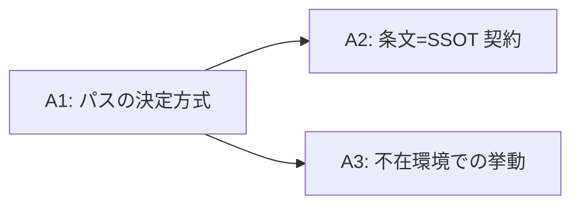

# MAGI: Outbound Write Ban のハードコード絶対パスの解消

**議題**: `_OUTBOUND_WRITE_BAN_ROOTS = (Path("D:/work7/Fable-Alembic"),)` / `_OUTBOUND_WRITE_ALLOW_ROOTS = (Path("D:/work7/etc-to-alembic/handoff"),)` をどう扱うか
**モード**: **AoT 適用**（判断ポイント 3 / 選択肢 4 / 影響 = hook・テスト・条文・配布物の 4 面）
**起票**: 2026-07-27 セッション 17（背景タスク `task_f4ea2504` の前段）
**ADR 走査**: 実施済。**同じ判断を決めた既存 ADR は存在しない**（ADR-0010 は global/personal/project の層配置であり、リポジトリ内部の配布境界とは別軸）

---

## AoT Decomposition

| Atom | 判断内容 | 依存 |
|:---|:---|:---|
| **A1** | パスの決定方式（ハードコード維持 / 兄弟導出 / 設定ファイル / パッケージング境界での選別） | なし |
| **A2** | 「条文が SSOT・機構はミラー・drift はテストが検出」という設計契約を維持するか放棄するか | A1 |
| **A3** | 対象ディレクトリが存在しない環境（= 配布先）での挙動 | A1 |

---

## Atom A1: パスの決定方式

**[MELCHIOR]**（推進）

- **O2 兄弟導出**（`project_root.parent / "Fable-Alembic"`）はコード 1 行で、`work7` ツリーごと移動しても生き延びる。実測で兄弟配置は成立している（`D:/work7/{LivingArchitectModel, Fable-Alembic, etc-to-alembic}`）
- `_check_outbound_write_ban()` は既に `project_root` を引数で受け取っており、導出のための配線は**既に存在する**。追加の依存ゼロ
- ハードコードされた個人の絶対パスが配布ハーネスの不可逆ガードに埋まっている状態は、**経路 2 の配布列**（「この条項は私の環境・他プロジェクトを参照するか」）に真っ向から該当する。放置は G2（配布物品質）の負債
- **O4 パッケージング境界**での選別が本丸。`init-harness` は既に選別機構を持っており、新規機構を作らずに済む

**[BALTHASAR]**（批判）

- **問題のフレーミングが誤っている。** 他人の環境でこの定数が指すディレクトリは存在せず、ban は vacuous になるが **無害**（守る対象がないため書込も起きない）。実害があるのは**所有者の環境でパスが変わったときに沈黙して守らなくなる**ことだけ。「配布可搬性バグ」は症状の名前として不正確
- **O2 は沈黙を直さない。** 兄弟導出も「Fable-Alembic は自分の兄弟である」という**自分の環境の構造への仮定**であり、質的にハードコードと変わらない。LAM 単独を移動すれば同じく沈黙して死ぬ。得られるのは「`work7` ごと移動したとき」だけという**低頻度シナリオ 1 つ**
- **O3 設定ファイルは最悪**。`.claude/settings*.json` は AI 編集不可であり新しい設定面を作る。未設定時に fail-open にすれば現状と同じ病、fail-closed にすれば他人の環境が壊れる
- **O2 の代償が大きい**（→ A2）。得るものが低頻度シナリオ 1 つに対し、失うのは drift 検出契約そのもの

**[CASPAR]** 結論:

**O1（ハードコード維持）を採る。O2 は棄却。O4 は本丸として別途記録する。**

判断の分岐点は「何が実害か」である。BALTHASAR の指摘が正しい —— **実害は沈黙であって、ハードコードそのものではない**。O2 は見た目のハードコードを消すが、沈黙の条件を「`work7` ごと移動」から「LAM 単独移動」へずらすだけで、**沈黙の可能性自体は消えない**。低頻度シナリオ 1 つと引き換えに A2 の契約を失うのは割に合わない。

O4（パッケージング境界）は正しい方向だが、`init-harness` の選別機構に手を入れる作業であり本 Atom のスコープを超える。**「O4 が本丸である」ことを記録して別タスクに残す**。

**採用しなかった選択肢とその理由**（MUST）:
- **O2 兄弟導出**: 沈黙を消さず（条件をずらすのみ）、A2 の契約を壊す代償に見合わない
- **O3 設定ファイル**: AI 編集不可 + 新規設定面 + 未設定時の挙動が二択とも悪い
- **O4 パッケージング境界**: 方向は正しいが本タスクのスコープ外。別タスクとして残す（棄却ではなく延期）

---

## Atom A2: 条文 = SSOT 契約の扱い

**[MELCHIOR]**

- 現契約（条文が SSOT / 機構がミラー / drift をテストが突合）は**沈黙に対して最初から無力**である。`test_banned_root_matches_rule_document` が守るのは「条文と機構が同じ文字列を持つこと」だけで、**その文字列が実在するかは検査していない**。`work7` を移動すれば条文と機構は仲良く同じ嘘をつき、テストは緑のまま通る
- つまり守っている契約は、守りたかったものを守っていない。維持する価値を過大評価すべきでない

**[BALTHASAR]**

- 「無力だから壊してよい」は成立しない。契約が防いでいるのは**片側だけの更新**（機構だけ直して条文を忘れる / その逆）であり、これは実際に起きる編集事故である。**二人が同じ嘘をつく**シナリオを防げないことは、**一人だけが嘘をつく**シナリオを防いでいる事実を否定しない
- そして A1 で O1 を採る以上、契約を放棄する理由が消える。**契約は維持コストゼロで既に動いている**
- MELCHIOR の指摘は契約の**破棄**ではなく**補完**を要求するものである。すなわち「文字列一致」に加えて「実在」も検査すればよい（→ A3）

**[CASPAR]** 結論:

**契約を維持する。** A1 で O1 を採った時点で、契約を壊す動機は消えている。`.claude/rules/fable-l3-protocol.md` §2 は**無変更**とし、本件は **PM 級ファイルに一切触れない**。

ただし MELCHIOR の指摘は正当であり、契約の**穴**（文字列一致は実在を保証しない）は A3 で扱う。契約の破棄ではなく補完として。

**採用しなかった選択肢とその理由**（MUST）:
- **契約の放棄**: A1 で O1 を採ったため動機が消滅。かつ片側更新事故への防御を失う
- **条文パースによる単一 SSOT 化**: HGA #18 自己修正 2「病理は『機構であること』ではなく『**散文に結合した機構であること**』」に真正面から抵触。現在の drift テストが「部分文字列の存在確認のみ / prose の構造解析は行わない」と docstring で自制しているのは、まさにこの病理の回避

---

## Atom A3: 対象不在環境での挙動

**[MELCHIOR]**

- hook 側は現状の fail-open で正しい。存在しないディレクトリへの書込は発生しえず、ban が vacuous なのは**正常動作**である
- 補うべきは検査側。「ban root が実在すること」を検査すれば、`work7` 移動時の沈黙が可視化される

**[BALTHASAR]**

- **`pytest.mark.skipif(not path.exists())` は罠である。** 検出したい事象（パスが実在しない）でちょうど skip する検査は、検査ではない。この形は採ってはならない
- **より重大な問題**: `fable-l3-protocol.md` は現在 **R1 = 配布物に含まれる**。したがって「ban root の実在を要求するテスト」を test suite に追加すると、**他人が `pytest` を走らせた瞬間に落ちる**。すなわち **配布物を壊す機構を、配布物品質を理由に追加する**という自己矛盾になる
- LAM に CI は存在せず、テストを走らせるのは事実上所有者だけ —— だが「事実上そうだから良い」は「配布可能性を維持する」方針（CHANGELOG 決定 2）と正面から矛盾する。**現実の頻度を根拠に方針違反を許すのは WC-7b（較正という名の粉飾）と同型**
- 新規の検査経路（`/doctor` 等の所有者限定コマンド）に逃がす案もあるが、それは **R3 の会計**（設計 §1.1）に載る新規機構であり、「機構 1 件 = 恒常監視面 1」を消費する

**[CASPAR]** 結論:

**hook は fail-open のまま無変更。実在検査は追加しない。**

BALTHASAR の指摘が決定的である。実在検査は (i) `skipif` 形なら検査として無意味 (ii) 無条件形なら配布物を壊す (iii) 所有者限定経路なら新規機構の計上が発生する —— **3 経路すべてが塞がっている**。

そして塞がっている理由は共通で、**`fable-l3-protocol.md` が配布物に含まれているから**である。これは A1 で「本丸」と判定した O4（パッケージング境界）と**同一の根**を持つ。

したがって本 Atom の結論は「**今は何も足さない**」であり、これは消極的な妥協ではなく、**根が O4 にあると特定できたことによる意図的な保留**である。O4 を解けば 3 経路のうち (ii) が自動的に開く（配布物に条文が含まれなければ、無条件の実在検査を置ける）。

**採用しなかった選択肢とその理由**（MUST）:
- **`skipif` つき実在検査**: 検出したい事象で skip するため検査として機能しない
- **無条件の実在検査**: 配布先の pytest を落とす = 配布物を壊す
- **`/doctor` 等の所有者限定経路**: 新規機構が R3 の会計に載る。得る利得（低頻度シナリオの検出）に対して恒常監視面 1 の消費は割高
- **hook 起動時の stderr 警告**: 全 tool call でノイズを出す。UX 破壊（`memory/feedback-skill-auto-script-exec-noise.md` の教訓と同型）

---

## CASPAR Convergence（Step 3 完結）

**3 Atom すべてで「現状維持」に収束した。** これは怠慢ではなく、以下の構造の帰結である。

1. 実害は「ハードコードされていること」ではなく「パス変更時に沈黙すること」（A1）
2. 沈黙は導出方式を変えても消えない —— 条件がずれるだけ（A1）
3. 沈黙を検出する機構は、3 経路すべてが塞がっている（A3）
4. 塞がっている根は共通で、**`fable-l3-protocol.md` が配布物に含まれていること**（A1 O4 / A3）

**したがって本件の正しい一手は、機構をいじることではなく「根は配布境界にある」と特定して記録することである。**

**本 MAGI の成果物**: コード変更ゼロ。記録のみ。背景タスク `task_f4ea2504` のスコープを「パスの修正」から「**配布境界の決定**」へ差し替える。

---

## gabriel probe

- **verdict**: `inconclusive`
- **severity**: `info`
- **affected_atoms**: `["A3"]`
- **recommended_action**: `proceed`
- **confidence**: **0.40**
- **tool_uses**: 11 / duration 316 秒（タイムアウト 360 秒以内）

**reasoning（要約）**: A1 / A2 の技術的根拠は一次資料と突合して正確で堅い。**confidence を下げている主犯は A3 の「3 経路すべてが塞がっている」という網羅性の主張**である。BALTHASAR は `skipif(not path.exists())` の**循環性**（検出したい事象自体が skip 条件になる）を根拠に条件つきテストを**一般に**棄却したが、この反論は当該実装固有の欠陥であり、**所有者判定を別シグナルに置いた `skipif(not is_owner_env())` + `assert path.exists()` は循環せず、配布物の pytest も壊さない**。この変種は未検討であり、A3 の「検出手段は尽きた」という結論はこの一点でのみ根拠が不足する。

**処理**: `verdict=inconclusive` のため MAGI 結論を確定し inconclusive 注記を添付する（再 MAGI なし / SKILL.md §Step 4.1）。ただし gabriel が特定した A3 の未検討変種は Step 5 Synthesis で評価する。

> **[NOTE]**: gabriel は確信をもって判定できませんでした（confidence=0.40）。A1 / A2 の結論は維持されます。A3 についてのみ、未検討の第 4 経路が指摘されました。

---

## AoT Synthesis（Step 5）

### gabriel 指摘の評価 —— A3 は動く

gabriel の指摘は正当である。BALTHASAR は**特定の実装（`skipif(not path.exists())`）の循環性**を、**条件つきテスト一般**の棄却理由に拡大していた。これは論点のすり替えであり、A3 の「3 経路すべてが塞がっている」は**網羅していなかった**。

**第 4 経路の具体化**: 所有者判定のシグナルとして **`SESSION_STATE.md` の存在**を使う。

| 要件 | 充足 |
|:---|:---|
| **非循環** | `SESSION_STATE.md` の存在は Fable-Alembic のパスと**独立**。検出したい事象で skip しない ✅ |
| **配布物を壊さない** | `SESSION_STATE.md` は **gitignore 済**（ローカル限定 / commit 不可）。clone した他人の環境には存在せず skip される ✅ |
| **沈黙を検出する** | 所有者環境で `work7` を移動すれば ban root が消え、テストが落ちる ✅ |
| **新規機構を作らない** | 既存テストファイルへの数行追加。新規ファイル・新規コマンド・新規設定面はゼロ。**R3 の会計に載る「機構 1 件」に当たらない** ✅ |
| **同時更新義務なし**（§1.1 (iii)） | `SESSION_STATE.md` は `/quick-save` が常に書き出す。外部の漂流入力を追わない ✅ |

gabriel が「再 MAGI でこの変種の追加コストが（iii）と同じく割高と判定されれば結論は不動、**数行で足りると判定されれば A3 が動く**」と述べた分岐について、**数行で足りる**と判定する。gabriel が例示した `git remote` 判定は外部の漂流入力を持つため採らず、`SESSION_STATE.md` を採る。

**残る弱点（明記する）**: 所有者が `SESSION_STATE.md` を削除すると検査が静かに skip される。ただし同ファイルは `/quick-save` の中核成果物であり、所有者環境での不在は実質的に起こらない。**この弱点は受忍する。**

### 最終結論

| Atom | CASPAR 結論 | gabriel 反映後の最終結論 |
|:---|:---|:---|
| **A1** | O1 ハードコード維持 / O2 棄却 / O4 は本丸として別途 | **不変**（gabriel は A1 を「堅い」と評価） |
| **A2** | 条文 = SSOT 契約を維持 / PM 級ファイルに触れない | **不変**（同上） |
| **A3** | 何も足さない | **変更** —— **非循環な所有者ゲートつきの実在検査を追加する** |

**本件は最後まで PM 級ファイルに触れない**（`.claude/rules/fable-l3-protocol.md` は無変更）。変更は `.claude/tests/hooks/test_outbound_write_ban.py` のみ = **SE 級**。

### Action Items

1. **`test_outbound_write_ban.py` に 2 テストを追加**（SE 級）
   - `SESSION_STATE.md` の存在を所有者ゲートとし、`_OUTBOUND_WRITE_BAN_ROOTS` / `_OUTBOUND_WRITE_ALLOW_ROOTS` の**実在**を検査する
   - **上記が vacuous でないことを保証する検査**を併設する（存在しないパスを与えて検出されることを確認 / 所有者ゲートなしで全環境で走る）
2. **hook 本体（`pre-tool-use.py`）は無変更**。fail-open のまま
3. **背景タスク `task_f4ea2504` のスコープを差し替える** —— 「パスの修正」から「**配布境界の決定**（`fable-l3-protocol.md` を配布物に含めるか / `init-harness` の選別機構）」へ
4. 本 MAGI ログを記録として残す（**A1 の O2 = 兄弟導出は棄却済**。将来の再発明を防ぐ）

### 記録: 死んだ案（再発明防止）

| 案 | 死因 | 殺した主体 |
|:---|:---|:---|
| **兄弟導出**（`project_root.parent / "Fable-Alembic"`） | 沈黙を消さず条件をずらすだけ（`work7` ごと移動 → LAM 単独移動）。低頻度シナリオ 1 つと引き換えに条文 = SSOT 契約を失う | CASPAR（BALTHASAR A1） |
| **設定ファイル化** | `settings*.json` は AI 編集不可 + 新規設定面 + 未設定時が fail-open（現状と同じ病）か fail-closed（他人が壊れる）の二択 | CASPAR（BALTHASAR A1） |
| **条文パースによる単一 SSOT 化** | HGA #18 自己修正 2「病理は『散文に結合した機構であること』」に抵触 | CASPAR（A2） |
| **`skipif(not path.exists())` つき実在検査** | 検出したい事象で skip する = 検査として機能しない | BALTHASAR（A3） |
| **無条件の実在検査** | 配布先の pytest を落とす | BALTHASAR（A3） |
| **`/doctor` 等の所有者限定コマンド経路** | 新規機構が R3 の会計（恒常監視面 1）に載る。利得に対し割高 | CASPAR（A3） |
| **hook 起動時の stderr 警告** | 全 tool call でノイズ = UX 破壊 | CASPAR（A3） |
