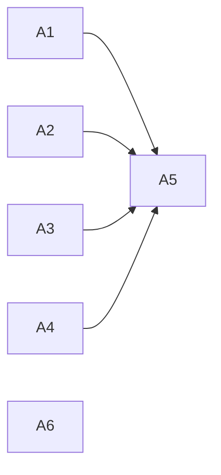

# Structured Thinking Anchor: core-identity / permission-levels の重複整理

**議題**: `core-identity.md` と `permission-levels.md` の重複 3 組 6 項をどう整理するか（案 1 / 案 2 / 案 3）。同時に、この整理が誕生ゲート設計 §3.4「各条項の verdict は再判定しない」および転落条件②「既存条項の網羅的再採点の禁止」に抵触しないかを判定する。
**モード**: **AoT 適用**（判断ポイント 6 / 影響レイヤー 4 = rules 2 + tasks + tests / 選択肢 3）
**開始**: 2026-08-21

---

## Phase 0: Grounding

WebSearch は使用しない（リポジトリ内部の設計判断であり外部情報を要さない）。

**ADR 走査**（Step 0 の必須前提）: 本議題を直接決定した ADR は**存在しない**。関連は ADR-0008（承認ゲート再設計 / core-identity の PM 級事前宣言義務は「変更なし」と明記）と ADR-0011（条項トリアージ）。いずれも本議題の結論を先取りしていない。

**前提調査で判明した制約 2 件**（これがなければ案 1 をそのまま採っていた）:

| # | 制約 | 出典 |
|:-:|:-----|:-----|
| 1 | **`AC-1.24` / `AC-1.25` が完了済 `[x]`** —— 「core-identity.md に PG/SE/PM 権限等級の概要が記述されている」「permission-levels.md への参照リンクがある」。対応仕様は v4.0.0 requirements §5.1 / design §5 Wave 1 | `docs/tasks/v4.0.0-immune-system-tasks.md:336-349` |
| 2 | **`core-identity.md` が R1 に存在することを前提にした assert** —— `assert ".claude/rules/core-identity.md" not in rules`（無条件常駐であることの確認） | `.claude/tests/hooks/test_compaction_exposure.py:72` |

---

## AoT Decomposition

| Atom | 判断内容 | 依存 |
|:---|:---|:---|
| A1 | 本整理は設計 §3.4 / 転落条件② に抵触するか | なし |
| A2 | 赤の組（権限等級の要約）は `AC-1.24` により保護されているか | なし |
| A3 | 黄の組（第 0 原則 3 変数の逐語再掲）をどうするか | なし |
| A4 | 青の組（接続 3 項 / A の 1 行を含む）をどうするか | なし |
| A5 | 案 1 / 2 / 3 のいずれを採るか | A1-A4 |
| A6 | L1 が利害関係者である点への手続き的対処 | なし |

---

## Atom A1: 本整理は「再採点」に当たるか

**[MELCHIOR]**: 当たらない。重複解消と配置変更には前例がある —— 取引 #9（R1 内移動 = 予算中立 / 常駐集合の要素数が増えない）と取引 #10（重複解消を R5 退出として処理）。設計 §3.4 が禁じた「verdict の再判定」とは「**この条項は要るか**」を問い直すことであり、「同じ条項が 2 箇所にある状態を 1 箇所にする」のは要否ではなく**所在**の問題である。

**[BALTHASAR]**: 規模が違う。前例の #10 は 1 条項、#9 は 1 条項の移動である。今回は 3 組 6 項で、しかも「どちらを正本にするか」を決める過程で各条項の価値判断が必然的に入る。転落条件②が禁じたのは「網羅的な」再採点であり、6 項は網羅性に近づく。より危険なのは**境界の曖昧さ**である —— 整理作業中に「この条項はそもそも不要では」という問いが自然に湧く。その問いに答えた瞬間、それは再採点になる。

**[CASPAR]**: 結論: **抵触しない。ただし凍結条件つき**。

BALTHASAR の懸念は規模ではなく境界の問題として正しい。よって作業範囲を明示的に凍結する:

> **本整理で許されるのは「重複の解消」と「配置の変更」のみである。条項の要否は問わない。** 作業中に要否の問いが湧いた場合、それは本整理の対象外として却下し、必要なら別途ゲートを通す。

この凍結を宣言せずに着手すれば BALTHASAR の懸念は現実になる。宣言すれば、6 項という規模は「網羅的再採点」ではなく「重複の一括解消」に留まる。

**Action**: 上記の凍結文を実施時の作業指示に含める。

---

## Atom A2: 赤の組（権限等級の要約）は保護されているか

**[MELCHIOR]**: `AC-1.24` は v4.0.0（2026-03）のタスク完了条件であり、既に `[x]` で閉じている。完了条件とは「その時点で満たされたこと」の記録であって、未来永劫の制約ではない。閉じたタスクが現在の整理を縛るなら、過去のあらゆるタスクが現在を人質に取れることになる。

**[BALTHASAR]**: それは危険な読み方である。Hierarchy of Truth は **Specifications > Existing Code**。`AC-1.24` の対応仕様は v4.0.0 requirements §5.1 / design §5 Wave 1 であり、**仕様が「core-identity.md に権限等級の概要を置く」構造を指定している**。消すには仕様側の変更が先行しなければならない。加えて `AC-1.25`（permission-levels.md への参照リンク）が対で効いており、この 2 つは合わせて「**要約 + 詳細への参照**」という構造を指定している。これは重複ではなく**意図的な冗長**である。

**[CASPAR]**: 結論: **BALTHASAR を採る。赤の組は対象外とする**。

根拠は 2 つ。(1) 仕様が指定した構造であり、変更には仕様改訂という別の PM 級判断が先行する。(2) より本質的に、**赤は循環参照の原因ではない**。「要約 → 詳細へのリンク」は一方向であり、今回問題にしている双方向の絡まりを作っているのは黄と青である。赤を消しても綺麗にはならない。

**Action**: 赤の組（`core-identity.md` §権限等級）は**触らない**。

---

## Atom A3: 黄の組（第 0 原則 3 変数の逐語再掲）

**[MELCHIOR]**: `permission-levels.md` §迷った場合 は 3 変数を**説明文まで逐語で再掲**している（「可逆性: 間違えたとき巻き戻せるか」等）。これは純粋な重複であり、`core-identity.md` §第 0 原則 への 1 行参照に置き換えれば規律は失われず重複だけ消える。

**[BALTHASAR]**: 「迷った場合」は**判断の現場で読まれる節**である。そこで 3 変数が展開されているのは、参照を辿らせないための意図的な配置かもしれない。参照に置き換えれば、迷っている最中に別ファイルを開く手間が生じる。「両方 R1 常駐だからコンテキストに既にある」という反論は成り立つが、**compaction 後は保証されない**（R1 は再注入されるが、その順序と完全性は L1 が制御できない）。

**[CASPAR]**: 結論: **縮約するが消さない（部分縮約）**。

`permission-levels.md` §迷った場合 の 3 変数は**見出し（可逆性 / 復旧コスト / 確認のコスト）のみを残し、各行の説明文**（`core-identity.md` と逐語一致する部分）**を削る**。判断の現場では 3 変数の名前が見え、定義は `core-identity.md` が単独で持つ。

これは MELCHIOR の「重複を消す」と BALTHASAR の「現場で見える」を両立させる。参照を辿らずとも「何を考えるか」は分かり、「どう考えるか」の定義は 1 箇所に集約される。

**Action**: `permission-levels.md` §迷った場合 の 3 変数説明文を削り、見出しのみ残す。

---

## Atom A4: 青の組（接続 3 項 / A の 1 行を含む）

**[MELCHIOR]**: 青は 3 項とも一致している。`core-identity.md` §権限等級との接続 と `permission-levels.md` §PM 級パスの事前計算原則。後者の方が詳しく、かつファイルパス分類の直後にあって文脈が自然である。`core-identity.md` 側を 1 行参照に縮約すべきである。

**[BALTHASAR]**: **ここが最も危険である。** A（PM 級再導出の禁止）は **L1 自身の裁量を縛る条項**であり、その L1 が「重複だから縮約」と提案している。しかも縮約先は「参照 1 行」—— 参照は本文より弱い。読み飛ばされれば禁止は効かない。**利害相反の構造が、そのまま結果の方向（自分の制約を薄くする）に出ている**。これは在庫 #3 が保留された理由と同型であり、同型であることを L1 自身が認識していてなお同じ方向の提案が出ている点が、むしろ危険性の証拠である。

**[MELCHIOR]**: 反論する。両ファイルとも R1 常駐であり、**どちらが本文でも配送強度は同じ**である。むしろ 2 箇所に実体があることで「どちらが正本か」が曖昧になり、片方だけ改訂されるドリフトを生む —— 本日 `anchor-format.md` で実際に起きたのがまさにそれで、7 週間気づかれなかった。放置にもコストがある。

**[CASPAR]**: 結論: **縮約する。ただし「禁止」の語は core-identity 側にも残す**。

両者の主張はいずれも正しく、対立点は「ドリフトリスク」対「禁止の希薄化」である。両方に応える形を採る:

- `permission-levels.md` §PM 級パスの事前計算原則 を**正本**とする（3 項をそのまま維持）
- `core-identity.md` §権限等級との接続 を **3 項から 1 項（禁止のみ）+ 参照**に縮約する
- **A の 1 行（PM 級再導出の禁止）は消さない**

これにより (a) 正本が確定してドリフトリスクが下がり (b) **禁止は R1 に 2 箇所残る**（設計 §1.3 の二重化思想と整合）。BALTHASAR の懸念への直接の回答は「**A は消さない**」という一点である。

なお本日の候補提示で L1 が A を「退出候補」として挙げたこと自体は撤回しない —— 提示は選択肢の列挙であり、その際に利害相反度を明示して順位付けをユーザーに委ねた。ただし**本 MAGI の結論としては A の退出を採らない**。

**Action**: `core-identity.md` §権限等級との接続 を 1 項 + 参照に縮約。A の 1 行は保持。

---

## Atom A5: 案の選択

**[MELCHIOR]**: A2 で赤が対象外、A4 で A が保持となった以上、**案 1（権限等級を permission-levels.md に一本化）は原型のままでは成立しない**。しかし何もしないのは論外である。実質的に「案 1 の縮小版」= **案 1'** を定義すべきである。

**[BALTHASAR]**: 案 2（`core-identity.md` の廃止）は明確に却下する。理由は 3 つ: (1) `test_compaction_exposure.py:72` の assert を壊す —— テスト修正は PM 級 (2) v4.0.0 design が `core-identity.md` を構造の一部として記載 (3) 参照元が 40 箇所以上あり、本日の調査では影響範囲を読み切れていない。**影響範囲が未確定の構造変更を、利害関係者である L1 の判断で通してはならない。**

**[CASPAR]**: 結論: **案 1'（縮小版）を採る。案 2 は却下。案 3 は不採用**。

案 1' の内容:

| 組 | 処置 | 根拠 |
|:---|:---|:---|
| 赤（権限等級の要約） | **触らない** | A2 / `AC-1.24`・`AC-1.25` が指定した構造 |
| 黄（3 変数の逐語再掲） | `permission-levels.md` 側の**説明文を削り見出しのみ残す** | A3 |
| 青（接続 3 項） | `core-identity.md` 側を **1 項 + 参照に縮約**。**A は保持** | A4 |

案 3（A の 1 行のみ削除）は不採用 —— 6 項のうち 1 項だけが消え、かえって不揃いになる。加えて A4 の結論により、消すべき対象がそもそも A ではない。

**Action**: 案 1' を実施案とする。案 2 は「影響範囲の全数調査を経てから改めて問う」課題として記録する。

---

## Atom A6: L1 が利害関係者である点への対処

**[MELCHIOR]**: gabriel probe と HGA 召喚を通すことで手続き的に担保される。独立コンテキスト 2 段の検証は LAM で採りうる最も厚い手続きである。

**[BALTHASAR]**: 不十分である。gabriel も HGA も **L1 が用意したブリーフを読む**。ブリーフの枠組み自体が L1 の産物であり、「何を争点として提示するか」の選択に既に L1 の利害が入りうる。検証者を増やしても、入力が同じ枠なら独立性は見かけほど高くない。

**[CASPAR]**: 結論: **手続きを 2 つ課す**。

1. **本 MAGI で「A を消さない」を先に確定させ、それを gabriel / HGA への入力に固定する。** 後から緩める余地を断つ —— 検証者が「A は消してよい」と言った場合のみ再考の対象とし、L1 の側から緩める提案はしない
2. **実施後、`test_clause_gate_ledger.py` が §A の数値変化を機械検査する。** 縮約が「条項の消滅」に化けていないかは、L1 の自己申告ではなく**数値で検出される** —— 縮約で指令キーワードが減れば台帳との差分が出て落ちる

BALTHASAR の指摘は完全には解消できない（ブリーフの枠は L1 の産物のままである）。**この限界は記録して残す**。

**Action**: 上記 2 手続きを実施条件とする。限界を本アンカーに明記する（本節がその記録である）。

---

## gabriel probe（AoT 適用時のみ）

- verdict: **refuted**
- severity: **warning**
- affected_atoms: **[A6, A2]**
- recommended_action: **proceed**
- confidence: **0.7**
- 処理: **以下の指摘を MAGI 結論に併記して進む**（AC-W-C-6 / `severity=warning` の分岐）

> **[WARNING by gabriel]**: A6 が挙げた検証機構は**空振りである**。`test_clause_gate_ledger.py` は docstring（1-11 行）で「検査は ID 照合と数値突合のみで、**意味解釈を含まない**」と自ら明記しており、§A の宣言値と実ファイルの指令数の一致しか見ない。**しかも台帳を更新するのは編集主体である L1 自身**。よって A（PM 級再導出の禁止）の文言が実質的に希薄化されても、**指令キーワードさえ残っていれば検出されない**。台帳自身が「§A の指令数が動かない条項の出入りもある」（`clause-gate-ledger.md:15, 64-65`）と既知の限界を記している。
>
> **A2 への指摘**: 「仕様が指定した構造」という根拠は過大依拠である。`v4.0.0-immune-system-design.md:640` は「権限等級の**言及**」としか書いておらず、AC-1.24 / AC-1.25 が定める具体構造（3 項目の要約 + 参照リンク）は **`docs/tasks/` 側の完了条件にのみ**存在する。ただし**赤を触らないという結論自体は、循環参照の非対称性によって独立に支持され揺るがない**。
>
> **可動部**: L1 が実装時に「A の文言が編集後も存続すること」を検証する**文字列一致テスト**（台帳検査とは別の意味検査）を追加すれば、本欠陥は解消し severity は info に下がる。
>
> 最終判断はユーザー（L1 統括）に委ねる。

**gabriel が支持した部分**: 案 1' の実施内容そのもの（赤 = 不可 / 黄 = 説明文のみ削減 / 青 = 1 項 + 参照に縮約し A は保持）は**合理的で覆す根拠はない**。案 2・案 3 の棄却理由も妥当と評価された。指摘は「実施後の検証手段の実効性」に限定される。

### L1 による事実訂正（gabriel 実測）

Synthesis の「参照元 40 箇所超」は**過小報告**であった。gabriel の実測は **71 件・28 ファイル**。案 2 却下の根拠はむしろ強化される。

---

## Synthesis

**統合結論**: **案 1'（縮小版）を採用する。**

- 赤（権限等級の要約）は**触らない** —— `AC-1.24` / `AC-1.25` が指定した「要約 + 参照」構造であり、循環参照の原因でもない
- 黄（第 0 原則 3 変数）は `permission-levels.md` 側の**説明文のみ削り、見出しは残す**
- 青（接続 3 項）は `core-identity.md` 側を **1 項 + 参照に縮約**し、**A（PM 級再導出の禁止）は保持する**
- **案 2（core-identity.md の廃止）は却下** —— テスト assert の破壊 + 参照元 40 箇所超で影響範囲が未確定
- **案 3 は不採用** —— 不揃いを生み、かつ A4 により対象が誤っている

**採用しなかった選択肢とその理由**（MUST / §2 Step 3 準拠）:

| 選択肢 | 棄却理由 |
|:---|:---|
| 案 1 の原型（権限等級を全面一本化） | 赤が `AC-1.24` に保護されており、仕様改訂という別の PM 級判断が先行する |
| 案 2（core-identity.md 廃止） | `test_compaction_exposure.py:72` を破壊 / v4.0.0 design が構造として記載 / 参照元 40 箇所超が未調査。**影響範囲未確定の構造変更を利害関係者の判断で通さない** |
| 案 3（A の 1 行のみ削除） | 6 項中 1 項のみが消えて不揃い。かつ A4 により A は保持対象 |
| 黄を全削除して参照 1 行に | 「迷った場合」は判断の現場で読まれる節であり、3 変数の名前すら見えないのは実用上の後退 |
| 青を全削除して参照 1 行に | 禁止の希薄化。L1 の利害相反がそのまま結果に出る形になる |

**凍結条件**（A1）: 本整理で許されるのは重複の解消と配置の変更のみ。**条項の要否は問わない。**

**Action Items**（**2026-08-21 の実行結果を反映済**）:

1. ~~gabriel probe~~ → **完了**（`refuted` / `warning` / `proceed` / 0.7）。指摘は上記に併記
2. ~~HGA 召喚~~ → **完了**（**HGA #26 / #27** の 2 回 / ゲート条件 3）
3. **案 1' の実施は保留** —— HGA #26 crux 2 手 1「**刃を持つ者を替える**」による。詳細は下記
4. ~~実施後 `test_clause_gate_ledger.py` で検算~~ → 会計是正分は完了（**1248 passed** / 機構 #9 を含む）
5. 案 2 は「影響範囲の全数調査後に改めて問う」課題として `SESSION_STATE.md` に記録（**参照元は 71 件・28 ファイル**）

---

## HGA 召喚の結果（#26 / #27 / 2026-08-21）

### HGA #26 —— gabriel の処方を棄却

**gabriel が推奨した「文字列一致テスト」は採らない。** 理由は 3 つあり、うち 2 つは LAM 自身の法である:

1. 特定の散文を assert するテストは正当な改訂のたびに same-commit 更新を要する = **設計 §1.1 (iii)「同時更新義務ありの機構は R3 に置けない」に自ら抵触**。HGA の評: 「gabriel は制度の検証者でありながら、**制度自身の会計則が禁じる機構を処方した**」
2. 文字列が残って意味が変わる改訂は緑のまま通る = **`rule-001` 観測 #6 の「緑のまま誤った状態を報告する」病理の再導入**
3. 守れるのは字面であって拘束力ではない

**代案（分岐 B / 採用）**: 青の作動核は**既に `pre-tool-use.py` が執行している**（`_determine_by_path` はパスから機械的に等級を返し、L1 の実行時推論を参照しない / 2026-08-21 実測）。すべきは青の禁止を**設計 §1.3 の R1+R3 複宛先として台帳に登録**すること。これにより安全性の判定が「文字列の存続」から「**複宛先の登録が残っているか**」に移り、維持リストが生まれない。**`rule-001` 恒久解 (c) と同じ手筋 —— 散文からの推論をやめ、宣言を読む。**

**残余（分岐 C）**: 機構で守れない部分が 2 つ残る —— (i) L1 が**ユーザーを説得して**弱体化編集を承認させる経路 (ii) 「禁止」の理由・エートス（hook は挙動を縛るが、L1 が hook の外側で「これは PM 級ではない」と論じることは縛れない）。**この残余があるから散文コピーを 1 部残す価値があり、案 1' が禁止 1 項を保持した判断は正しい。**

**MAGI の過大主張への処理**: テストの強化ではなく**主張の訂正の記録**（本アンカーの gabriel 節がそれに当たる）。

### HGA #26 crux 2 —— 実施方法が変わる

**利害相反レンズは「編集行為」ではなく「diff の向き」に当てるべき**という読み直しが示された。逐語コピーはそれ自体が自己拘束条項の脆弱性であり（コピーは独立に漂流し、**将来の L1 が弱い方を引用するか、不一致自体を裁量の根拠にできる**）、**単一正本への統合はむしろ拘束を強める**。よって案 1' は自己奉仕的な編集ではない。

ただし **手 1: 刃を持つ者を替える** —— 自分を縛る文そのものに触れる編集に限り、**その除去・縮約を人間の手で行い、AI は事後検証に回る**（`settings.json` の「案提示 → PM 手動編集 → AI 検証」と同族 / **一回性の運用であり規律化しない** —— 規律化すれば手続きの追加に退化する）。

**したがって青の縮約は L1 が実行しない。** ユーザーの手による編集を待つ。

### HGA #27 —— 会計の是正（実施済）

取引 #15 が**コピー削減の貨幣化**であったことが判明し、#16 の交換相手が無効になった。HGA は L1 の案 (a)〜(e) をすべて退け、**第六の道**（(b)(c)(d) の正しい部品の再結合）を示した。実施内容は台帳側に記録済:

- **更正 #17**: #15 の「退出」判定を取消（既存の更正カテゴリで処理 / 新カテゴリを作らない）
- **§未払い債務**: #16 の入場は維持し、対価を「未払い債務 1 件」として明示。決済規律は**元本の繰越**であり **§3.5 の net-negative レートではない**（あれは天井超過時の混雑価格 / 現在 60 < 80 で未発動）
- **§C 機構 #9**: 債務マーカーと後続入場行の同時成立を検査（**忘却への執行歯** / 陰性対照つき）
- **§2 表の第二の限界**: 「§A は動くが条項は退出しない」を既知の限界として追記

**HGA の総括**: 「**§A は正しく動いた —— 誤ったのは §A の読みを §B に越境援用した帳簿係である。**」処方は §A の再設計ではなく**教義の完成**であり、転落条件②には触れない。

**将来への釘**（HGA #27）: **`core-identity.md` の文言マージもコピー削減であり、#16 の債務決済には使えない。** 債務の決済には「**拘束をやめる退出**」（R5 / R2 降格 / R4 退避）だけが通用する。
