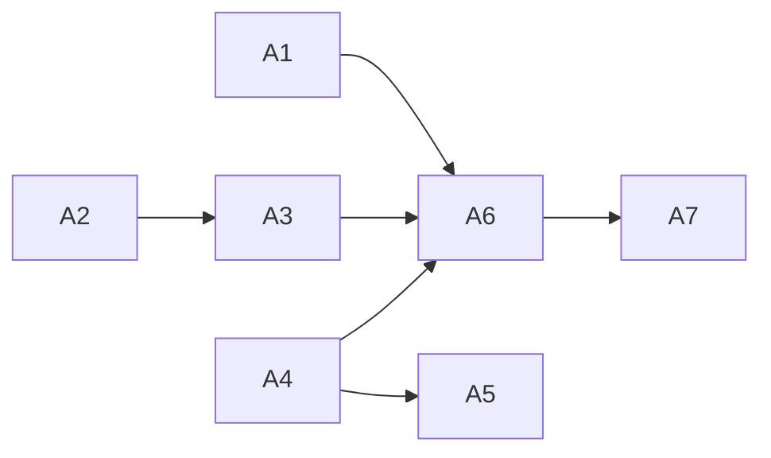

# Structured Thinking Anchor: `core-identity.md` の処遇

**議題**: `core-identity.md` を案 A（役割分離）/ B（pointer 化）/ C（部分移動）/ D（R2 降格）/ E（現状維持）のいずれで処遇するか。併せて **§PM 級編集の事前宣言義務の R2 適格性**、**未払い債務（取引 #16）への充当可否**、**実施主体**を判定する。
**モード**: **AoT 適用**（判断ポイント 4 / 影響レイヤー 4 = rules 2 + 台帳 + テスト + 配布物 / 選択肢 5）
**開始**: 2026-08-22
**前提文書**: `docs/artifacts/2026-08-22-core-identity-scope-survey.md`（全数調査の正本）/ `docs/artifacts/2026-08-21-magi-core-identity-merge.md`（前回 MAGI・HGA #26/#27）

---

## Phase 0: Grounding

**ADR 走査**（Step 0 の必須前提）: 本議題を直接決定した ADR は**存在しない**。関連は ADR-0008（「既存 PM 級事前宣言義務は**変更なし**」と明記 / Accepted 2026-06-30）、ADR-0011 決定 1（条項トリアージの枠組み / Accepted 2026-07-25）、ADR-0001（ルーティング構造）。いずれも本議題の結論を先取りしていない。

**外部調査**（2026-08-22 / 3 系統・並列）: 上流仕様の裏取り / 重複指示と遵守率 / 規範文書アーキテクチャ。**前回 MAGI（2026-08-21）は外部資料ゼロで判断していた**。今回の資料で覆る前提が複数ある。

### 判断に効く外部事実（出典つき）

| # | 事実 | 出典 | 効く先 |
|:-:|:---|:---|:---|
| E1 | **`paths:` 付き規範は compaction で失われる**（「Lost until a matching file is read again」）。公式は逆向きの処方まで書く（「compaction を跨がせたいなら `paths:` を外すか project-root CLAUDE.md へ移せ」） | `code.claude.com/docs/en/context-window` | A4（案 D） |
| E2 | **条件ロードの発火は「Claude がファイルを**読んだ**とき」**。「Read を経ない Edit / Write だけで発火するか」は**公式記述なし** | `…/memory` §Path-specific rules + `…/hooks`（`trigger_file_path` = "access"） | A4 |
| E3 | **`@import` は文脈量を減らさない**（「imports … doesn't reduce context, since imported files load at launch」） | `…/memory` | A6（案 B） |
| E4 | **複数ファイルは上書きされず連結される**（「concatenated into context rather than overriding each other」）。矛盾時は「**Claude may pick one arbitrarily**」 | `…/memory` | A1 |
| E5 | **矛盾を検出しても黙って片方を採る**。Claude-4.5-Sonnet が矛盾をユーザーに知らせるのは **45%**。GPT-4o は矛盾 1-2 個で **97.5%** が通知なしに応答生成 | ConInstruct, arXiv 2511.14342（AAAI / 査読） | A1 |
| E6 | **指示数が増えるほど遵守率が落ち、主因は指示間の緊張と衝突**。500 指示で最良モデルも 68% | arXiv 2510.14842 / IFScale arXiv 2507.11538 | A1 |
| E7 | **反復の利得は推論モデルでほぼ消える**（非推論では 47 勝 0 敗 / 推論有効では 5 勝 1 敗 22 中立）。MS 公式も反復技法を「推論モデルには非推奨」 | arXiv 2512.14982 / Microsoft Foundry | A1 |
| E8 | **既存文書を複製した context file は成功率を上げず、コストを +20% 増やす**。README/docs を除去すると逆に +2.7% | ETH Zurich, arXiv 2602.11988 | A1 |
| E9 | **ISO/IEC Directives 10.1: 繰り返しではなく参照せよ**（「Repetition introduces the risk of error or inconsistency」）。**16.5: 定義は要求事項を含んではならない** | ISO/IEC Directives Part 2 | A2 / A6 |
| E10 | **Diátaxis: explanation を他へ混ぜると双方が壊れる**（「it's bad for the explanation too, because it's not allowed to develop appropriately and do its own work」）。explanation は「他を吸収したがる」性質を持つ | diataxis.fr | A2 / A3 |
| E11 | **Anthropic 自身は「原理と規則の併用」を採る**。2023 実験「both general and specific principles have value」/ 2026 Constitution「broad principles rather than mechanically following specific rules」 | anthropic.com（公式） | A3 |
| E12 | **反証**: 集中配置は本文を断片化し、読者に別単位の結合を強いる（カナダ法務省 Legistics）。過剰な統合は「誤った抽象」を生み、重複より高くつく（Metz） | justice.gc.ca / sandimetz.com | A2 |
| E13 | **類推の限界**: 分離論はすべて「読者が必要な章だけを選んで読む」を前提とする。**全文が毎回一括で届く読み手には、分離の主便益が成立しない** | 調査担当の判定 | A2 |
| E14 | 実測: `CLAUDE.md` 243 行 + 無条件 rules 13 ファイル **1,909 行**が毎セッション・毎 compaction で入る。公式の目安は「1 CLAUDE.md ファイルあたり 200 行」のみで、**指示総量の閾値は上流に存在しない** | 実測 + `…/memory` | A1 / A6 |
| E15 | **subagent は `CLAUDE.md` 階層を丸ごと積む**（Explore / Plan を除く） | `…/sub-agents` | A6 |

**空白の明示**（推測で埋めないための記録）: 「同一の規律を距離の離れた 2 つの別文書に書いた場合の遵守率」を測定した研究は**存在しない**。反復の証拠（E7）はすべて隣接連結であり、本件への外挿は**未検証**。

---

## AoT Decomposition

| Atom | 判断内容 | 依存 |
|:---|:---|:---|
| A1 | 本件の**目的**を何と定義するか（重複の解消 / 矛盾の予防 / 配送量の削減） | なし |
| A2 | 外部の「分離せよ」知見を LAM の R1 に適用してよいか（類推の限界の処理） | なし |
| A3 | 原理（第 0 原則 / Active Retrieval）の置き場をどうするか | A2 |
| A4 | §PM 級編集の事前宣言義務は R2 に降格できるか | なし |
| A5 | A4 が成立する場合、取引 #16 の債務決済に充ててよいか | A4 |
| A6 | 案 A〜E のいずれを採るか | A1, A2, A3, A4 |
| A7 | 実施主体（人間の手か L1 か） | A6 |

---

## Atom A1: 本件の目的は何か

**[MELCHIOR]**: 目的は「重複の解消」でよい。3 組 6 項が別々の時期に生えた以上、構造が誘発している。案 1' で結果は消したが原因は残っている。

**[BALTHASAR]**: **その目的定義は外部証拠に支えられていない。** 公式が問題として名指しするのは「矛盾」（E4/E5）と「総量」（E6/E14）であって、**矛盾のない重複ではない**。「同一規律を離れた 2 文書に書いた場合の遵守率」を測った研究は存在しない（Phase 0 の空白）。ここで「重複それ自体が有害」を前提に構造改変を通せば、**証拠のない前提で PM 級ファイルを触る**ことになる。

さらに悪いことに、E8（ETH Zurich）は逆向きの示唆すら持つ —— 既存文書を複製した context file は成功率を上げずコストだけ +20% 増やし、**複製を除去したら性能が上がった**。これは「重複は無害」ではなく「**重複はコストとして実測されている**」ことを意味するが、測っているのは遵守率ではなく効率である。目的の言い換えが要る。

**[MELCHIOR]**: 反論する。E4 + E5 の組み合わせが決定的だ。複数ファイルは**上書きされず連結される**。ならば 2 箇所の記述が乖離した瞬間、それは「新しい方が勝つ」のではなく「**矛盾が 2 つ文脈に入る**」状態になる。そして E5 は、その状態が **45%（Claude 4.5 Sonnet）でしかユーザーに知らされない**ことを示す。つまり **乖離は沈黙のうちに解決される**。7 週間漂流した `anchor-format.md` のコピーが実例だ。

**[CASPAR]**: 結論: **目的を「重複の解消」から「将来の乖離＝矛盾の芽を断つこと」へ再定義する**。

BALTHASAR の指摘は正しく、MELCHIOR の反論も正しい。両立する定式は 1 つしかない —— **今ある非矛盾の重複は害の証拠を持たない。害を持つのはそれが乖離した後の状態であり、乖離は沈黙のうちに解決される（E5）ため事後には気づけない。** よって本件は「今の害を除去する」施策ではなく「**将来の不可視な害の発生源を減らす**」施策である。

この再定義は 3 つの帰結を持つ:

1. **緊急性はない**（今の害はゼロ）。「やらない」も正当な選択肢として残る
2. **効果は測定できない**（防いだ矛盾は観測されない）。したがって**実施しても「効果があった」と記録してはならない**
3. **コストが小さいことが採否の主条件になる**。効果が不可視である以上、大きなコストを正当化できない

**Action**: A6 の評価軸を「効果の大きさ」ではなく「**コストの小ささと、乖離可能性の減少**」に置く。

---

## Atom A2: 外部の「分離せよ」知見を R1 に適用してよいか

**[MELCHIOR]**: 一次資料の非対称は圧倒的だ。**明文の規則として「分離せよ」を持つのは ISO（E9）と Diátaxis（E10）と Red Hat**。「原理を各則へ分配せよ」と積極的に主張するものは**一つもない**。これで足りる。

**[BALTHASAR]**: 足りない。**E13 が全部を無効化しうる。** Diátaxis の分離が機能するのは、how-to を読む人が explanation を*読まない*からである。LAM の R1 は**全文が毎回一括で届く**。読み手が全部読むなら、「分離」は配送面で何も生まない。加えて E12（カナダ法務省）は逆向きの一次資料だ —— 集中配置は本文を断片化し、読み手に別単位の結合を強いる。**LAM の読み手はまさに「全部を結合して読む」立場にある**。

**[MELCHIOR]**: だから配送面では何も主張していない。**E9 の根拠は読み手の種類に依存しない** —— 「Repetition introduces the risk of error or inconsistency」。誤りと不整合のリスクは、読むのが人間でも AI でも、**書く側の力学**として同じく発生する。E10 の「explanation は他を吸収したがる」も同様に執筆側の性質だ。

**[BALTHASAR]**: それは認める。ただし**得られる利得の範囲が変わる**ことを結論に書け。配送面の利得はゼロ。取れるのは執筆・保守面だけだ。

**[CASPAR]**: 結論: **適用してよい。ただし利得の範囲を明示的に限定する**。

| 面 | 分離の利得 | 根拠 |
|:---|:---|:---|
| **配送**（何が文脈に入るか） | **ゼロ** | R1 は全文一括。ファイルを分けても Claude は全部読む（E13 / E3 も同じことを言う） |
| **執筆・保守**（誰がどこに書くか） | **あり** | E9（繰り返しは誤り・不整合のリスク）/ E10（吸収の力学）はいずれも読み手ではなく**書き手側**の性質 |

したがって本件で追うべきは「**話題の所有権を排他にする**」ことであり、「ファイル数を減らす」ことでも「配送量を減らす」ことでもない。**ファイル数は目的変数ではない** —— この一点が、案 2 の原型（廃止）が方向を誤っていた理由である。

**反証の保存**（E12）: 集中配置には断片化のコストがある。よって**参照の往復が増える形は採らない**。移動先は「その話題を読みに行く自然な場所」でなければならない。

**Action**: A6 の候補評価で「ファイル数の増減」を評価項目から外す。「話題の所有権が排他になるか」を評価項目に入れる。

---

## Atom A3: 原理（第 0 原則 / Active Retrieval）の置き場

**[MELCHIOR]**: 全数調査 §4 のとおり、第 0 原則は「全 LAM 規則に射程が及ぶ」条項であり、Active Retrieval には受け皿がない。**原理は独立の置き場を保つ**でよい。E11（Anthropic 自身が原理と規則の併用を採用）が直接支持する。

**[BALTHASAR]**: 「独立の置き場」と「独立**ファイル**」は違う。`CLAUDE.md` に原理節を作る選択肢を検討したか。

**[MELCHIOR]**: 検討した上で退ける。**`CLAUDE.md` は既に 243 行で公式目安 200 行を超えており**（E14）、公式自身が「a single CLAUDE.md at the repository root tends to either grow to cover every subsystem's conventions … or stay too generic」と述べている。原理をそこへ入れれば、まさに公式が警告する肥大の一部になる。

**[BALTHASAR]**: 承認する。ただし条件を付ける。**原理ファイルに手続き規定を残さないこと**。現行 `core-identity.md` には §PM 級編集の事前宣言義務（＝ 手続き）が同居している。E9 の 16.5「定義は要求事項を含んではならない」および E10 の「吸収」の力学は、まさにこの同居を問題にする。原理ファイルを守るなら、**手続きは出さねばならない**。

**[CASPAR]**: 結論: **原理は独立ファイルを維持する。ただし原理ファイルから手続き規定を出す**。

- `core-identity.md` は**原理の置き場として存続**する（第 0 原則 / Active Retrieval）
- **§PM 級編集の事前宣言義務は手続き規定であり、原理ファイルの住人ではない**（E9 16.5 / E10）
- **ファイル名は変更しない**。「Living Architect 行動規範」は原理の名として適切であり、かつ改名は参照 92 件を無意味に壊す

**Action**: A6 の案 A を「原理ファイルの純化」として具体化する。

---

## Atom A4: §PM 級編集の事前宣言義務は R2 に降格できるか

**[MELCHIOR]**: 形式要件（設計 §1.2）は 4 つとも満たす。(i) 繋留先は PM 級パス集合 = **ファイル繋留** / (ii) 配送先は `paths:` glob で明記可能 / (iii) 軸 3 = 可逆（宣言を忘れても `pre-tool-use.py` の PM 級ダイアログ自体は出る。損なわれるのは「何を承認するのかの説明の質」であって承認ゲートそのものではない）/ (iv) 再武装は自己再武装型（PM 級パスに触れば再ロード）。成立すれば **R1 → R2 の真正な退出**であり、債務決済の原資になる。

**[BALTHASAR]**: **成立しない。上流仕様が 2 箇所で殺している。**

1. **E2**: 条件ロードの発火は「Claude がファイルを**読んだ**とき」であり、**Read を経ない Edit / Write で発火するかは公式に記述がない**。本条項の要求は「**編集する前に宣言する**」である。届くのが「触った後」なら、規範が届いた時点で既に違反している。これは取引 #8・#11 の「R2 配送は触った後に届く」弱点と同型だが、**本条項では弱点が致命的になる** —— あちらは「書き始める最初の 1 手に間に合わない」で済んだが、こちらは**条項の要求そのものが「前」を指定している**
2. **E1**: `paths:` 規範は compaction で失われる。**失効が最も痛いのは長セッション** —— PM 級編集が積み重なるのはまさにそこだ。しかも公式は「compaction を跨がせたい規範は `paths:` を外せ」と逆向きの処方を明記している

**[MELCHIOR]**: (iv) の再武装で救えないか。

**[BALTHASAR]**: 救えない。再武装が起きるのは**次に PM 級パスを読んだとき**であり、その時点で宣言のタイミングは過ぎている。**「前」を要求する条項は、事後配送の機構に載せられない。** これは設計 §2 Step 2 が「軸 3 = 不可逆ガードは R1（条件ロードは構造的に間に合わない）」と定めたのと同じ論理であり、**不可逆性ではなく時制**が理由である点だけが違う。

**[CASPAR]**: 結論: **R2 降格は不適格。R1 に維持する**。

理由は **(iii) 軸 3 の可逆性ではなく、(i)(iv) の実効性**にある。形式要件の文面は満たすが、**配送タイミングが条項の時制要求（「編集する前」）と構造的に噛み合わない**（E2）。加えて失効が最も痛い局面で失効する（E1）。

**副産物として設計へ返す知見**（本 MAGI の射程外だが記録する）: 設計 §1.2 の R2 要件は「繋留先の種類」と「再武装」を問うが、「**条項が要求する時制**」を問うていない。「前に〜せよ」型の条項は、繋留先がファイルであっても R2 に置けない。**要件の追加は予算を要する**（設計 §1.2 の予算上限が明記されている）ため、本 MAGI では**提案せず記録に留める**。

**Action**: 案 D を棄却。時制の論点は §7 の派生課題として記録する。

---

## Atom A5: 債務決済への充当（A4 依存）

**[CASPAR]**: A4 が不成立のため**本 Atom は成立しない**（充当できる退出が存在しない）。

記録として残すべき帰結は 1 つ: **案 A〜C はいずれも R1 内移動であり予算中立**（取引 #9 の前例）。したがって**本件のどの案を採っても未払い債務（取引 #16）は決済されない**。債務の決済には別途「拘束をやめる退出」が要る（HGA #27 の釘）。

**Action**: 本件の実施と債務決済を**同一コミットに混ぜない**。混ぜると「移動を退出として計上した」と読める記録が残り、取引 #15 → 更正 #17 と同型の事故になる。

---

## Atom A6: 案の選択（A1-A4 依存）

**[MELCHIOR]**: A1（目的 = 乖離の予防 / コストの小ささが主条件）、A2（利得は執筆・保守面のみ / ファイル数は目的でない）、A3（原理ファイル存続 + 手続きの排出）、A4（案 D 棄却）を通すと、残るのは **A か C か E** である。B は E3 により import 形が無効、単なる 1 行参照は「中身のない R1 ファイル」を生むだけで、A2 の反証（往復の増加 / E12）に直撃する。

**案 A** を推す。内容は以下:

| 対象 | 移動 | 移動先 |
|:---|:---|:---|
| §権限等級（PG/SE/PM の 3 行要約 + 「迷ったら SE 級」） | **移す**（消さない） | `permission-levels.md` の該当見出し |
| §PM 級編集の事前宣言義務 | **移す** | `permission-levels.md`（§セッションスコープ降格の近傍 = 既に相互参照している場所） |
| §Context Compression | **移す** | `CLAUDE.md` §Context Management（全数調査 §4 で「無損失」と判定済） |
| §第 0 原則 / §Active Retrieval | **残す** | `core-identity.md`（原理ファイルとして純化） |

結果、**権限等級の話題は `permission-levels.md` のみ、原理の話題は `core-identity.md` のみ**となり、所有権が排他になる（A2 の評価項目）。

**[BALTHASAR]**: 3 点で抵抗する。

1. **赤は前回 MAGI の A2 が「意図的な冗長」として保護した組である。** 今それを動かすのは §3.4「各条項の verdict は再判定しない」に触れないか
2. **`permission-levels.md` が肥大する。** E6（指示数が増えるほど遵守率が落ちる）は「1 ファイルあたり」ではなく総量の話だが、E14 の 200 行目安は**ファイル単位**である。移動先の行数を確認したか
3. **「移動」を名目に拘束が弱まる余地**。事前宣言義務は L1 自身を縛る条項であり、移動時の言い換えで実質的に薄まりうる

**[MELCHIOR]**: 順に答える。

1. **触れない。** 前回 A2 の結論は「**赤は循環参照の原因ではないから触らない**」であり、根拠は `AC-1.24` の保護と非対称性だった。今回の全数調査で **`AC-1.24` は完了記録であり将来拘束ではない**ことが確定した（仕様に `core-identity` は 0 件）。そして今回提案しているのは**要否の再判定ではなく所在の変更**である。前回 A1 が定めた凍結条件「**許されるのは重複の解消と配置の変更のみ。条項の要否は問わない**」の範囲内に収まる —— **消さずに移す**限りにおいて
2. 実測する。移動後も `permission-levels.md` は 200 行前後に収まる見込みだが、**着手前に実測して超えるなら案 C に落とす**
3. 同意する。**移動の検証条件**を付ける（A7 で扱う）

**[CASPAR]**: 結論: **案 A を採る。ただし 4 条件つき。案 C は fallback として保持。案 B・D・E は不採用**。

**条件**:

| # | 条件 | 理由 |
|:-:|:---|:---|
| 1 | **消さずに移す**（逐語を保つ / 要約・言い換えをしない） | 前回 A1 の凍結条件（要否は問わない）に留まるための境界。言い換えた瞬間に「要否の再判定」に化ける |
| 2 | **移動前後で §A の指令数の総和が不変であることを実測** | 台帳 §A は機械検査対象（機構 #1）。かつ「移動を退出として計上した」事故（取引 #15）の再発防止 |
| 3 | **移動先の行数を着手前に実測し、`permission-levels.md` が 200 行目安を大きく超えるなら案 C に落とす** | E14（公式目安はファイル単位）。肥大させて遵守率を落とせば本末転倒 |
| 4 | **本件の実施と債務決済を同一コミットに混ぜない** | A5 |

**案 E（現状維持）を不採用とする理由と、その弱さの明示**: A1 のとおり今の害はゼロであり、**E は否定されていない**。不採用の根拠は「乖離の可能性を減らす」という予防的利得が、条件 1-4 を守る限りの小さいコストを上回るという判断に留まる。**これは強い根拠ではない。** ユーザーが「触らない」を選ぶことは十分に合理的であり、その場合も全数調査（§3）は将来の資産として残る。

**採用しなかった選択肢とその理由**（MUST / §2 Step 3 準拠）:

| 選択肢 | 棄却理由 |
|:---|:---|
| 案 B（pointer 化） | `@import` 形は文脈量を減らさない（E3）。単なる 1 行参照は「中身のない R1 ファイル」を生み、参照の往復だけが増える（E12 の断片化） |
| 案 D（R2 降格） | A4。上流仕様が「読んだとき」発火（E2）かつ compaction で失効（E1）。「編集する前に」を要求する条項は事後配送に載せられない |
| 案 E（現状維持） | 上記のとおり**否定されていない**。予防的利得とコストの比較でのみ退けた |
| **案 2 の原型（ファイル廃止）** | A2 —— ファイル数は目的変数ではない。かつ原理の受け皿が消える（A3 / 全数調査 §4） |
| 権限等級の要約を**消す**（移さずに削除） | 前回 A1 の凍結条件違反（要否の再判定）。かつ §A の指令数が動き、退出として誤計上される危険 |
| `core-identity.md` の改名 | 参照 92 件を無意味に壊す。「行動規範」は原理の名として適切 |

---

## Atom A7: 実施主体（A6 依存）

**[MELCHIOR]**: HGA #26 手 1（刃を持つ者を替える）は「**その除去・縮約**を人間の手で行う」と述べており、対象は除去と縮約である。案 A は**移動であって除去でも縮約でもない**（条件 1 で逐語保持を課している）。かつ手 1 自身が「**一回性の運用であり規律化しない**」と明記する。よって L1 が実施してよい。

**[BALTHASAR]**: 形式的にはそうだ。だが**事前宣言義務は L1 自身を縛る条項**であり、移動の過程で薄まる余地は残る。HGA #26 crux 2 が示した正しいレンズは「編集行為」ではなく「**diff の向き**」だった。ならば必要なのは主体の交代ではなく**向きの検証**である。

**[CASPAR]**: 結論: **L1 が実施してよい。ただし diff の向きを機械的に検証する**。

- 手 1 の射程は「除去・縮約」であり、**逐語を保った移動は射程外**（かつ一回性・非規律化が明記されている）
- 代わりに**検証を課す**: (a) 移動した各条項が移動先に**逐語で存在すること**を diff で確認 (b) §A の指令数の総和が不変であること (c) `pytest` 全数が緑であること
- **ただし条件 1 に違反しそうになった場合**（＝ 移動先の文脈に合わせて言い換えたくなった場合）は、**その時点で手を止めてユーザーに戻す**。言い換えは要否の再判定への入口である

**Action**: 実施時、上記 3 検証の結果を報告に含める。

---

## gabriel probe（AoT 適用時のみ）

- verdict: **refuted**
- severity: **warning**
- affected_atoms: **[A1, A6, A7]**
- recommended_action: **re-magi**
- confidence: **0.55**
- 処理: **severity=warning のため、以下の指摘を MAGI 結論に併記して進む**（AC-W-C-6 / 分岐優先順位に従い `recommended_action=re-magi` は `severity=critical` 時のみ再 MAGI を強制する）。ただし gabriel の**可動部が HGA 再召喚を名指し**しているため、A7 を確定させる前に **HGA #28** を召喚する

### gabriel が支持した部分

- **A1**: 「今の害はゼロ、防いだ矛盾は観測不能」の論証は健全。「効果は測定できない」と「実施する」の間に**論理矛盾はない** —— 測れないのは「特定の乖離を防いだか」という反実仮想であり、「複製が 1 つ減れば乖離の可能性が構造的に減る」は**測定不要の a priori 命題**。ただしこの区別が本文に書かれておらず暗黙の飛躍として残る
- **A2**: 配送面ゼロ / 執筆面ありの切り分けは E9・E10・E13 と整合し、過大主張していない
- **A3**: E11・E14 の使い方は妥当。改名しない判断も参照 92 件の実測を踏まえており堅い
- **A4**: E1・E2 の引用は正確。「時制」基準は §1.2 の文言だけからは導けないが、**CASPAR 自身が「副産物」として自己申告し、公式基準へ格上げしないと抑制している** —— これは密輸ではなく**開示された拡張**である
- **A5**: A4 依存で論理的に妥当
- **仕様整合（rubric #2）**: §3.4 / 転落条件② への**新たな違反はない**。前回 MAGI が確立した「所在の変更は要否の再判定ではない」の範囲内

### [WARNING by gabriel] 支持できない部分

> **1. A7 の HGA #26 援用は、射程外の条項への類推適用である**（最重要）。HGA #26 の「刃を持つ者を替える」裁定は **§権限等級との接続（A = PM 級再導出の禁止）** に対するものであり、今回の移動対象である **§PM 級編集の事前宣言義務は当時審査されていない別条項**（`core-identity.md` 実物で確認 / 両者は独立した見出しで、赤・黄・青のいずれにも属さない）。「除去・縮約のみが人間の手 / 移動は対象外」という区別は HGA #26 の**文言**には整合するが、HGA #26 が守ろうとした**趣旨（自己拘束条項の希薄化防止）**に対応する検証がない。
>
> **2. 顕在性低下リスクが未処理**。独立見出しを持つ `core-identity.md` から、多数の規定が同居する `permission-levels.md` の一節へ移すことは、**逐語を保っても「読まれる確率」を下げうる**。BALTHASAR の懸念 3 への CASPAR の回答は diff 方向の検証（内容が変わっていないこと）のみで、**視認性の変化に触れていない**。
>
> **3. 条件 1「消さずに移す」の境界が未定義のまま実務投入されている**。「移動先の文脈に合わせた接続文」が許容される言い換えかどうかの基準がなく、A7 の「違反しそうになったら止める」は L1 の自己判断に依存する —— **rubric #3 が問題視する利害関係者性の再導入**。
>
> **4. 条件 4（実施と債務決済を同一コミットに混ぜない）に機械検査がない**。取引 #15 → 更正 #17 という直接の前例がありながら、条件 2・3 には pytest / 行数実測という検出手段があるのに条件 4 は人手の規律のみ。
>
> **記録に値する構造**: 「所在の変更は要否の再判定ではない」は **2 回連続で MAGI が自らの凍結条件を自己解釈**したものであり、**独立検証者（HGA）が「移動」というカテゴリ自体を一度も審査していない**。
>
> 最終判断はユーザー（L1 統括）に委ねる。

### gabriel の可動部（何を直せば severity が下がるか）

1. **A7 を HGA に再召喚**し、「§PM 級編集の事前宣言義務の移動」を明示的な審査対象として問う（HGA #26 の分岐 B / C のいずれに該当するかの再判定）→ `severity` は `info` へ、`verdict` は `confirmed` 寄りへ動く見込み
2. 条件 1 に「連結詞・見出し語の許容範囲」を 1 行で定義し、条件 4 に台帳突合の pytest（取引 #15 型の検出）を追加する
3. A1 の飛躍を CASPAR 結論部に 1 文で明示する（「防止対象は特定事象ではなく構造的可能性であり、後者は構造上自明に減る」）

---

## HGA #28 の裁定（2026-08-22 / ゲート条件 3 + gabriel 可動部の名指し）

### crux 1: 逐語移動は安全な操作か

> **「射程の内か外か」という問いの立て方自体が誤りである。** 手 1 は「**一回性の運用であり規律化しない**」と自ら明記した裁定であり、**規律でないものは許可の源泉にも禁止の源泉にもならない**。一回性の裁定を先例法として運用することが、L1 と gabriel に共通する誤りだった。

HGA #26 が実際に確立した統治原理は手 1 ではなく **crux 2 のレンズ（利害相反は編集行為ではなく diff の向きで判定する）**である。このレンズで見ると、逐語移動の安全性は **3 不変量**で決まり、3 つ揃えば diff に「向き」が存在しない。

| # | 不変量 | 本件の充足 |
|:-:|:---|:---|
| 1 | **条項本文の同一性**（逐語 = 意味 diff ゼロ） | 条件 1 が課す |
| 2 | **配送クラスの同一性**（R1 → R1 = 配送 diff ゼロ） | 両ファイルとも無条件連結（上流 E4） |
| 3 | **保護等級の同一性**（移動先が同じ PM 級ゲート内にあること） | **実測で確認**: `permission-levels.md`（`^\.claude/rules/.*\.md$`）も `CLAUDE.md`（`^CLAUDE\.md$` / **2026-07-26 追加**）も `_hook_utils.py` の `_PM_PATH_PATTERNS` に含まれる |

> **第 3 の不変量は L1 の結論にも gabriel の反論にも欠けていた観点である。** 逐語移動が危険になる典型は本文でも顕在性でもなく、**移動先の編集保護が弱い場合**（PM 級パス外への移動 = 将来の弱体化編集が承認ゲートを迂回する）である。

**gabriel の手続き指摘（未審査カテゴリを利害関係者が自己クリアした）は正当**であり、その欠陥は**本召喚がカテゴリ審査そのものとして機能することで治癒する**。以後「3 不変量を満たす逐語移動」は**審査済みカテゴリ**である。1 つでも欠ける移動は未審査に戻る。

**棄却された分岐**: (A) 手 1 の文言解釈で自己クリアを追認 → 利害関係者の自己判定を先例化する / (B) 移動も人間の手に移す → 手 1 の「**規律化すれば手続きの追加に退化する**」に正面から抵触し、HGA #26 自身の裁定を破る。

### crux 2: 顕在性の低下は希薄化か

> **顕在性の変化は実在しうるが、会計上の「条項の退出」には相当しない。** 台帳自身の教義が既に決めている —— 判定は「**その指令は R1 のどこかでまだ拘束しているか**」の 1 問のみ（§B 第二の限界）。逐語で R1 内に在る以上、答えは Yes。

根拠 3 点:

1. 顕在性を会計に入れることは、取引 #15 → 更正 #17 で咎められた「ゲージの動きを通貨の証拠として越境援用する」誤りの**さらに悪い形**である —— **§A は少なくとも観測できたが、顕在性は計器が存在しない**。測れない量を貨幣化すれば、台帳の証拠能力（「行が真であること」）が原理的に検証不能になる
2. **対称性から不条理が出る**: 顕在性低下が退出なら、顕在性を上げる移動は入場として予算を要する。**見出しの付け替えが通貨操作の手段になる**
3. **向き自体が自明でない**: 独立見出しの喪失と引き換えに、移動先は §セッションスコープ降格の近傍 = **その規律が発動する判断の現場**である。連結全文が一括で届く読者（E13）には、見出しの独立性より関連指示との近接が効く可能性がある（**要検証の仮定**）

**担保は計器ではなく移動先の選定条件に置く** ——「移動先はその話題を読みに行く自然な場所であること」（A2 の反証の保存が既に要求しており、案 A は満たす）。**顕在性の計器は新設しない**（質量注記が確立した先例 = 測定単位を持たない量を §A の計数対象に加えない / WC-16「第二憲法化」の入口）。

### crux 3: 「消さずに移す」は運用可能か

> **運用可能。ただし「許容される言い換え」というカテゴリ自体を廃止し、機械検証可能な二分に置換する**ことで境界問題を消滅させる。

| 区分 | 扱い | 担保 |
|:---|:---|:---|
| **条項本文** | **逐語**（移動元の文が移動先に完全一致部分文字列として存在） | 実施コミット時の**一回性の diff 検証**。**HGA #26 が棄却した「常設の文字列一致テスト」とは別物** —— 棄却理由は同時更新義務 = 恒常税であり、一回性の検証には発生しない（設計 §1.1 (iii) に触れない） |
| **接続文・見出し語** | 「言い換え」ではなく「**追加**」 | 追加テキストとして既存の統治に服する（§A 不変 = 指令キーワードを含まない + PM 級ゲートの diff をユーザーが見る） |

> **再帰的担保の発見**: **移動対象の条項（§PM 級編集の事前宣言義務）自身が、この移動という編集を統治する** —— 宣言 + PM ダイアログ + ユーザーの diff 承認により、利害関係者性は**既に外部化されている**。

A7 の逃し弁（条項本文を言い換えたくなったら手を止めてユーザーに戻す）は保持する。

### 付随観測（裁定外 / **実測で確認済**）

**§PM 級編集の事前宣言義務の本文が列挙する PM 級パス 4 種に `CLAUDE.md` が含まれておらず、hook 実装と既に乖離している**（hook 側は 2026-07-26 に追加済 / `_hook_utils.py:71`）。同じ乖離は `permission-levels.md` §ファイルパスベースの分類 にもある。**これは移動が生む問題ではなく、移動が保存する既存ドリフト**であり、E5「乖離は沈黙のうちに解決される」の実例である。

### HGA #28 の要検証の仮定

1. 「連結全文で届く LLM 読者には、見出しの独立性より関連指示との話題隣接が遵守に効く」—— **未測定**（E13 の空白の裏面。crux 2 の結論はこの仮定の真偽に**依存しないよう**、計器化ではなく選定条件に置いた）
2. `CLAUDE.md` の PM 級ゲートはソース上で確認したが、**hook の実発火は未実測**
3. compaction 後の R1 再注入が 2 ファイル間の**順序・完全性**を保存すること（上流 E1 は再注入自体のみを保証）
4. §Context Compression を「自己拘束条項ではない」とする分類（本裁定の主対象は権限等級 2 条項）

---

## Synthesis

**統合結論**: **案 A（役割分離）を採用する。** ただし正統性の根拠と条件は HGA #28 により差し替わった。

### 最終結論

| 項目 | 内容 |
|:---|:---|
| **採る案** | **A（役割分離）** —— `core-identity.md` を原理（第 0 原則 / Active Retrieval）に純化し、§権限等級の要約・§PM 級編集の事前宣言義務を `permission-levels.md` へ、§Context Compression を `CLAUDE.md` §Context Management へ、**いずれも逐語で移す** |
| **正統性の根拠** | 「手 1 の射程外」という**文言解釈ではない**（HGA #28 crux 1 がこの問いの立て方を棄却）。根拠は **3 不変量**（本文逐語 / 配送クラス同一 / **保護等級同一**）と、条件 1 の機械検証可能な二分への置換 |
| **実施主体** | **L1**。担保は主体の交代ではなく機構側にある（PM 級ダイアログ + 事前宣言 + ユーザーの diff 承認 = **再帰的担保**） |
| **顕在性** | **会計に入れない**。担保は移動先の選定条件のみ。**計器を新設しない** |
| **債務** | **決済されない**（R1 内移動 = 予算中立）。実施と決済を同一コミットに混ぜない |
| **A1 の飛躍の明示**（gabriel 可動部 3） | **防止対象は特定事象ではなく構造的可能性であり、後者は複製が 1 つ減れば構造上自明に減る。** ゆえに「効果は測定できない」と「実施する」は両立する —— 測定不能なのは反実仮想（防いだ乖離）であって、可能性の減少ではない |

### 実施条件（HGA #28 により差し替え済 / 旧条件 1-4 は本表に置換される）

| # | 条件 | 検証手段 |
|:-:|:---|:---|
| **1'** | **条項本文は逐語**（完全一致部分文字列として移動先に存在） | 実施コミット時の**一回性 diff 検証**（常設テストにしない = §1.1 (iii) 回避） |
| **2'** | **接続文・見出し語の追加は可**。ただし**指令キーワードを含まない** | §A の総和不変を機構 #1（`test_clause_gate_ledger.py`）で確認 |
| **3'** | **3 不変量の充足**（本文逐語 / R1 → R1 / 移動先が PM 級パス内） | 実測済（`_hook_utils.py:61-72`） |
| **4'** | **移動先はその話題を読みに行く自然な場所であること** | 人手の判定（顕在性の担保 / 計器は作らない） |
| **5'** | **実施と債務決済を同一コミットに混ぜない** | 人手の規律（下記のとおり機構化しない） |
| **6'** | 本文を言い換えたくなったら**手を止めてユーザーに戻す** | 逃し弁（A7 保持） |

**gabriel 可動部 2 後半（条件 5' の機構化）を採らない理由**: 「移動を退出として計上していないか」の判定には「**何が退出か**」の意味解釈が要り、設計 §1.1 (c)「意味解釈が不要」を満たさないため **R3 に置けない**。機構 #9（債務マーカーと後続入場行の同時成立）が既に隣接領域を守っており、本条件は実施報告への明記で担保する。

### Action Items

1. **実施は保留**。PM 級 4 ファイル（`core-identity.md` / `permission-levels.md` / `CLAUDE.md` / 台帳 §A）に触れるため、`core-identity.md` §PM 級編集の事前宣言義務に従い**対象・回数・内容を宣言してユーザー承認を得る**
2. 実施時は条件 1'〜6' の検証結果を報告に含める（逐語 diff / §A 総和 / pytest 全数）
3. **付随観測（PM 級パス列挙の hook 実装との乖離）は本件に混ぜない** —— 列挙の拡張は「所在の変更」ではなく**要否の判定**であり、前回 A1 の凍結条件に抵触する。**別件として起票**する
4. 未払い債務（取引 #16）は**本件と無関係に開いたまま**。決済には真正な退出が要る
5. 全数調査 §7 の未決 4 点はすべて決着（1 = 案 A / 2 = R2 不適格 / 3 = 成立せず / 4 = L1 実施 + 機構担保）

---

## 実施後レビュー（2026-08-22 / 締めの工程 = ユーザー常設指示）

| 検証者 | 結果 |
|:---|:---|
| **gabriel（実施の敵対検証）** | **`confirmed` / `info` / `proceed` / confidence 0.85**。条件 1'（逐語）・2'（§A 不変）・3'（3 不変量）を**実測で確認**（編集前原文との直接照合 / 指令数 1・3・4 が台帳宣言値と完全一致 / `_hook_utils.py:61-72` の両パターン実在）。落とした 2 行は「**規範的内容の消失なし**」と判定。修正指示なし |
| **quality-auditor（横断監査）** | **Critical 0 / Warning 5 / Info 3 / 総合 B**。W-1（台帳の行数誤記）・W-4（別件起票の未実施）・W-5（CHANGELOG 未記載）・W-2（守備範囲注記の配置）を**採用して是正**。W-3・I-1 は**記録のみ**（`…-scope-survey.md` §10.3） |

### gabriel が残した軽微な指摘（記録 / 将来の正規化候補）

`core-identity.md` に追加した「**本ファイルの守備範囲**」ブロックは、実施条件 1'〜6' に個別列挙されていない追加であり、「接続文・見出し語」を超えた独立パラグラフである。gabriel は (a) 指令キーワードなし (b) 新たな行動要求を課さない (c) 既存 R2 ファイルの冒頭注記と様式が一致、の 3 点から**新条項には当たらない**と判定したうえで、次のように付言した:

> **この種の追記を続けるなら、次回以降の MAGI Synthesis の実施条件に「移動元への案内注記の追加」を明示的に 1 項目立てて正規化すべき。**

**採用する**（次に同型の移設を行うときの条件表に 1 行加える）。本件では遡って条件表を書き換えない —— 実施後に条件を追加することは、事後の自己正当化と区別がつかないため。
