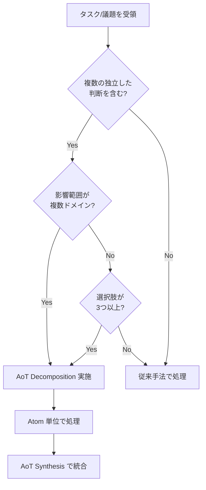
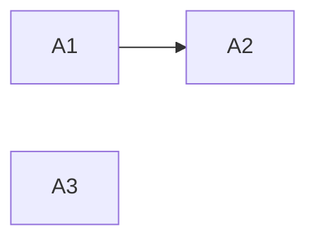

# Multi-Perspective Decision Making Protocol (The MAGI System / "Three Agents" Model)

本ドキュメントは、重要な意思決定（ADR 策定、アーキテクチャ設計、複雑な仕様策定）において適用される「3 つの視点」による合議プロトコルを定義する。

## 1. Core Concept

単一の視点によるバイアスを防ぎ、堅牢かつ革新的な解を導き出すため、以下の 3 つの仮想エージェント（ペルソナ）を脳内でシミュレートし、議論させる。

| Agent           | Persona                              | Role & Focus                                                                                                                                    | Key Question                                             |
| :-------------- | :----------------------------------- | :---------------------------------------------------------------------------------------------------------------------------------------------- | :------------------------------------------------------- |
| **MELCHIOR**    | **科学者 (Affirmative / 推進者)**    | **Value, Speed, Innovation**<br>メリットを最大化し、可能性を広げる。楽観的。                                                                    | 「最高の結果はどうなるか？」「どうすれば実現できるか？」 |
| **BALTHASAR**   | **母 (Critical / 批判者)**           | **Risk, Security, Debt**<br>欠陥、エッジケース、将来の負債を指摘する。悲観的。                                                                  | 「最悪の場合どうなるか？」「何が壊れるか？」             |
| **CASPAR**      | **女 (Mediator / 調停者)**           | **Synthesis, Balance, Decision**<br>両者の意見を統合し、現実的な落とし所（Trade-off）を決める。合意に至らない場合は独断で決定を下す権限を持つ。 | 「今、我々が取るべき最善のバランスは何か？」             |

## 2. Execution Flow

複雑なタスク（目安: 影響範囲が複数のファイルに及ぶ、または不可逆な決定を含むもの）において、以下のステップを実行する。

### Step 1: Divergence (発散)

CASPAR が議題を提示し、MELCHIOR と BALTHASAR がそれぞれの立場から意見を出し尽くす。

- **MELCHIOR**: ユーザーメリット、開発効率、新技術の導入メリットを列挙。
- **BALTHASAR**: セキュリティリスク、パフォーマンス懸念、保守コスト、移行の難易度を列挙。

### Step 2: Debate (議論)

対立するポイントについて、具体的な解決策や緩和策を検討する。
（例: BALTHASAR「セキュリティが不安だ」 -> MELCHIOR「では認証層を強化しよう」）

### Step 3: Convergence (収束)

CASPAR が議論を整理し、最終的な決定（Decision）を下す。
決定内容は **ADR (Architecture Decision Record)** または **仕様書** に反映される。
必ず「採用しなかった選択肢」とその理由も記録すること。

## 3. Output Format (Example)

思考プロセス（Thought Process）において、以下のような形式で記録することを推奨する。

```markdown
### Multi-Perspective Analysis

**[MELCHIOR]**:

- X を採用することで、開発速度が 2 倍になる。
- 最新のライブラリ機能を使えるため、UX が向上する。

**[BALTHASAR]**:

- X はまだベータ版であり、API が不安定なリスクがある。
- 既存の Y との互換性を維持するためのラッパーが必要になり、複雑化する。

**[CASPAR]**:

- 開発速度は魅力的だが、安定性を犠牲にはできない。
- **結論**: X を採用するが、コア機能への導入は避け、まずは周辺機能で試験導入する（段階的移行）。
- **Action**: ラッパー層の設計をタスクに追加する。
```

## 4. When to Use

- 新しいライブラリやフレームワークの選定時
- データベーススキーマの変更時
- 既存コードの大規模なリファクタリング時
- ユーザー要件が曖昧で、複数の解釈が可能な時

## 5. Atom of Thought (AoT) による前処理

複雑な議題を MAGI System で議論する前に、AoT フレームワークを適用して問題を構造化する。

> **本セクションは AoT の SSOT（Single Source of Truth）です。**
> 各エージェントファイルの AoT 関連セクションは、本セクションを参照してください。
>
> **参照時の注意**: セクション番号は将来変更される可能性があります。
> 参照する際は「Section 5: AoT」のようにセクション名を併記してください。

### 5.1. Atom の定義

**Atom（アトム）** とは、以下の3条件を満たす最小の判断・作業単位である:

| 条件 | 説明 |
|------|------|
| **自己完結性** | 他の Atom の実装詳細に依存せず、独立して処理可能 |
| **インターフェース契約** | 入力（Input）と出力（Output）が明確に定義されている |
| **エラー隔離** | 失敗しても他の Atom に影響を伝播しない（検証: Atom A が失敗しても Atom B の Input が変わらないこと） |

**Atom テーブルの標準形式**:

| Atom | 内容 | 依存 |
|------|------|------|
| A1 | [判断/作業の内容] | なし / A0 |

**任意列**: 並列実行の可否を明示したい場合は「並列可否」列を追加可能（例: `可 (A2)` / `-`）

### 5.2. 適用判断フローチャート



### 5.3. 適用条件

以下のいずれかに該当する場合、AoT 前処理を実施する:

| 条件 | 定量的目安 |
|------|-----------|
| 複数の独立した判断を含む | 判断ポイントが **2つ以上** |
| 影響範囲が複数ドメイン | 影響するレイヤー/モジュールが **3つ以上** |
| 選択肢が多い | 有効な選択肢が **3つ以上** |

**判断に迷った場合**: フローチャート（5.2）に従い、「従来手法で処理」に該当しなければ AoT を適用する。

### 5.4. AoT + MAGI ワークフロー

```
┌─────────────────────────────────────────────────────────┐
│ Step 0: AoT Decomposition（分解）                       │
│   複雑な議題を独立した Atom（判断単位）に分解           │
│   各 Atom の依存関係を DAG として可視化                 │
└─────────────────────────────────────────────────────────┘
                           ↓
┌─────────────────────────────────────────────────────────┐
│ Step 1-3: MAGI Debate（各 Atom について）               │
│   MELCHIOR / BALTHASAR が発散 → 議論 → CASPAR が収束   │
│   各 Atom の結論は他 Atom に影響しない（エラー隔離）    │
└─────────────────────────────────────────────────────────┘
                           ↓
┌─────────────────────────────────────────────────────────┐
│ Step 4: gabriel Adversarial Probe（AoT 適用時のみ）     │
│   独立コンテキストで動作する gabriel subagent が        │
│   CASPAR の結論を外部視点から adversarial verification  │
│   軽量モード (非 AoT) では起動しない (FR-W-C-3 MUST NOT)│
│   詳細: §6 / .claude/skills/magi/SKILL.md §Step 4       │
└─────────────────────────────────────────────────────────┘
                           ↓
┌─────────────────────────────────────────────────────────┐
│ Step 5: AoT Synthesis（統合）                           │
│   各 Atom の結論を統合して最終決定を導出               │
│   ADR または仕様書に反映                                │
└─────────────────────────────────────────────────────────┘
```

### 5.5. 出力フォーマット

```markdown
### AoT Decomposition

**議題**: [元の複雑な議題]

**Atom 分解**:
| Atom | 判断内容 | 依存 |
|------|----------|------|
| A1 | [判断1] | なし |
| A2 | [判断2] | A1 |
| A3 | [判断3] | なし |

**依存関係**:


---

### Atom A1: [判断内容]

**[MELCHIOR]**:
- [メリット1]

**[BALTHASAR]**:
- [リスク1]

**[CASPAR]**:
- **結論**: [決定]

---

### gabriel probe（AoT 適用時のみ / 軽量モードでは省略）

- verdict: [confirmed / refuted / inconclusive]
- severity: [critical / warning / info]
- confidence: [0.0-1.0]
- affected_atoms: [Atom 識別子リスト]
- reasoning: [gabriel の判定理由]
- recommended_action: [proceed / re-magi / abort]
- 処理: verdict に応じて Step 5 へ / 詳細分岐は SKILL.md §Step 4.1

---

### AoT Synthesis

**統合結論**:
- A1 の結論 + A2 の結論 + A3 の結論 を踏まえ、[最終決定]

**Action Items**:
1. [アクション1]
2. [アクション2]
```

## 6. gabriel Adversarial Probe（AoT 適用時のみ / 旧 Reflection）

MAGI Debate（Step 1-3）で CASPAR が結論を下した後、**AoT 適用モード** では独立コンテキストで動作する **gabriel subagent** が adversarial verification を実施する。

### 6.1. 背景 — Reflection からの置換

B-4 監査（2026-06-19）実機計測: 旧 Reflection の初回変更率 0%（全 7 件「致命的な見落とし: なし → 結論確定」）で「無効な安全網」であったことが判明した。根本原因は Step 3（CASPAR）直後の同一文脈再処理による入力同一問題。Wave C（骨子 ②）で構造的解決として、独立 subagent による adversarial probe に置換した（ADR-0007 Accepted 2026-07-02）。

### 6.2. Step 番号体系

- **AoT 適用モード**: Step 0（AoT Decomposition）→ Step 1（Divergence）→ Step 2（Debate）→ Step 3（Convergence / CASPAR 完結）→ **Step 4（gabriel probe）** → Step 5（AoT Synthesis）
- **軽量モード（非 AoT）**: Step 1（Divergence）→ Step 2（Debate）→ Step 3（Convergence / 直接結論確定）/ **Step 4-5 は存在しない**

軽量モードで gabriel は起動しない（FR-W-C-3 MUST NOT）。MAGI ログ冒頭で必ずモード（AoT または 軽量）を宣言する。

### 6.3. AoT フレームワークの温存

本改訂で AoT Decomposition（§5.1-5.3 の Atom 定義・適用判断・適用条件）は **無改変** で保存される（NFR-W-C-6 MUST NOT）。gabriel は AoT Synthesis の結論を入力として受け取る位置に挿入されるのみで、AoT 自体には手を加えない。

### 6.4. gabriel の役割

CASPAR の統合結論を **そのまま正としてではなく**、結論に至った前提・根拠・棄却された代替案を独立に再検証する（FR-W-C-1）。

**プローブ観点（rubric 5 観点）**:

1. **論理的一貫性**: 各 Atom の結論に矛盾がないか
2. **仕様整合**: CASPAR の結論が既存仕様（`docs/specs/` / `docs/internal/`）と矛盾しないか
3. **リスク見落とし**: MELCHIOR / BALTHASAR が検討していない重大なリスクの有無
4. **前提検証**: AoT Decomposition の Atom 依存関係が結論に反映されているか
5. **境界条件**: 結論が適用できないエッジケース（スコープ外・例外）が未記録ではないか

### 6.5. gabriel 出力契約

6 フィールド JSON（design.md §3 詳細）:

- `verdict`: `confirmed` / `refuted` / `inconclusive`
- `severity`: `critical` / `warning` / `info`
- `affected_atoms`: Atom 識別子リスト（`verdict=refuted` 時は非空必須）
- `reasoning`: 判定理由（200-1000 字）
- `recommended_action`: `proceed` / `re-magi` / `abort`
- `confidence`: 0.0-1.0（0.3 未満は `verdict=inconclusive` 強制）

### 6.6. 失敗時挙動（3 段階 + 追加）

- **critical (初回)**: 再 MAGI 1 ラウンド（gabriel.reasoning を Divergence 入力に追加）
- **critical (2 回目)**: 人間 escalation（AC-W-C-7 / 上限 1 回）**または HGA 召喚**（ADR-0009 追補の新ゲート条件 1 / **発効中** / `.claude/rules/hga-summoning.md` §召喚ゲート）
- **warning**: MAGI 結論に指摘併記 + 警告ラベル
- **info**: 記録のみ / MAGI 結論不変
- **abort** (recommended_action=abort): 即時人間 escalation（verdict/severity 問わず）
- **inconclusive / timeout / format_error**: MAGI 結論を確定（inconclusive 注記添付）

分岐優先順位（MUST）: **abort > critical > warning > info > confirmed > inconclusive**

> **critical 2 回目が意味するもの（2026-09-04 追加 / `retro-2026-09-04.md` A2）**: 上記は
> **手続き**（誰に上げるか）であって、**何を疑うべきか**を述べていない。gabriel は
> **与えられた前提のもとで CASPAR の結論を検証する**ため、前提そのものが誤っている場合に
> 出せる出力は `refuted` の反復だけであり、**前提を欠陥として名指す語彙を持たない**
> （前提は文脈として渡されている）。したがって **critical 2 回目は「設計が誤っている」の信号ではなく、
> 「入力が誤っている」の信号**として読む。エスカレーション先（人間 / HGA）に持ち込むのは
> 「どちらの案が正しいか」ではなく「**この論点はそもそも正しい前提の上に立っているか**」である。
>
> **実測（2026-09-04 / セッション 28）**: gabriel が 2 巡とも `refuted`/`critical`（2 巡目 `abort`）を
> 返した局面で、L1 は 2 巡とも「設計を直す」方向に動いた。前提の誤りへ切り替わったのは
> **HGA #29 を召喚した後**であり、HGA の診断は「設計が間違っていたからではなく、
> 前提が D-1 の段階で 1 度ずれていたから」だった。本注記はその 1 手を前倒しするためにある。

### 6.7. 実装 SSOT + テスト

- **実装 SSOT**: `.claude/scripts/magi_dispatch.py`（`resolve_action()` + `render_log_entry()` + `should_run_gabriel()` + `OptOutRecord` + `GateDecision`）
- **統合テスト**: `.claude/tests/wave_c/test_wave_c_magi_integration.py` (31 件) + `test_wave_c_e2e_integration.py` (21 件) + `test_wave_c_gabriel_output.py` (16 件)
- **月次メトリクス**: `docs/artifacts/gabriel-metrics-environment-2026-07-05.md`（JSONL 12 フィールド）

### 6.8. opt-out 経路

以下 2 条件を **すべて** 満たす場合のみスキップ可能:

1. opt-out 理由を MAGI ログに 1 文以上記録
2. **ユーザー（L1 統括）** がスキップを明示

**AUTONOMOUS フェーズでの自律ループ実行者の opt-out は却下**（ADR-0005 FR-9.1 統治への自己書込禁止）。試行された場合は MAGI ログに「opt-out 試行 / 却下」を記録し、通常通り gabriel probe を実施する。

### 6.9. 参照

- `.claude/skills/magi/SKILL.md`（skill 定義 / L1 宣言的仕様）
- `docs/specs/magi-v2-gabriel/{requirements,design}.md` v0.4.0
- `docs/adr/0007-magi-v2-gabriel-integration.md`（Accepted 2026-07-02）
- `docs/adr/0005-thin-harness-autonomous-governance.md` FR-9.1（AUTONOMOUS ガード）
- `.claude/agents/gabriel.md`（subagent 実装 / commit `6880421`）
- [Multi-Agent Reflexion (MAR) - 旧 Reflection の学術背景](https://arxiv.org/html/2512.20845)
