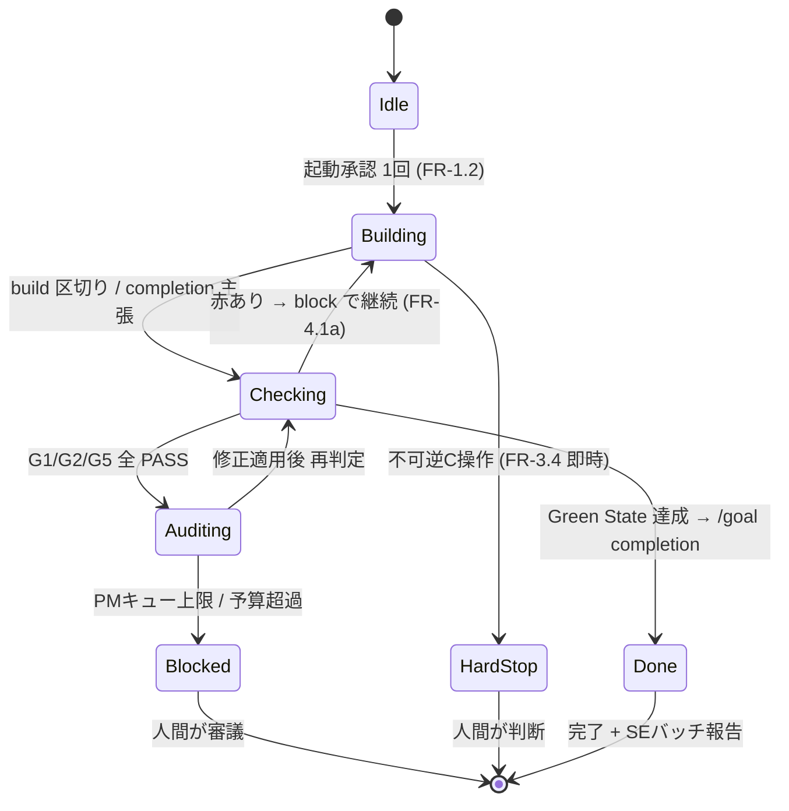

# 設計: 自律統治モード（autonomous-mode）

最終更新: 2026-05-30 / フェーズ: PLANNING（design）/ ステータス: **approved（2026-05-30 ユーザー承認）**
関連: [ADR-0005](../../adr/0005-thin-harness-autonomous-governance.md)（採用決定）, [requirements.md](./requirements.md)（FR-1〜9 / SC-1〜7）, [green-state-definition.md](../green-state-definition.md)（checker 接地点）

> 本書は「どう実現するか（How）」を定義する設計書である。「何を（What）」は [requirements.md](./requirements.md)、採用の根拠は [ADR-0005](../../adr/0005-thin-harness-autonomous-governance.md) を参照（重複させない）。
> 設計判断は design-architect（Sonnet）の骨子・選択肢出しを土台に、Living Architect（Opus）とユーザーが確定した（2026-05-30）。

## 1. Problem Statement

requirements が「何を」を定義した。design が解く設計課題は、自律ループを **$100 Max・/goal ベース**で安全に回すための5つの機構である。

1. **自律ループ状態機械**: build→audit を Green State 達成まで自動で回す「エンジン」の構造と状態の持ち方。
2. **PM キュー**: 可逆 PM 事項をバッチ化しつつ、merge 前に全件審議を強制する機構（FR-3）。
3. **決定的 checker 接地**: Green State G1/G2/G5 を、モデルの自己宣言に依存せず判定する機構（FR-4）。
4. **last-line 段階化**: エスカレーション予算と tripwire を、コストで段階化する機構（FR-5.6）。
5. **第4モード統合**: 独立第4モードの追加と、FR-9（自己統治の不可侵）の実装的強制。

## 2. Non-Goals（design スコープ外）

- 実装コード・スクリプトの生成（BUILDING フェーズが担う）。
- dynamic workflows / Agent Teams の採用設計（[future-candidates.md](./future-candidates.md) に隔離。D6）。
- 憲法本体（CLAUDE.md / docs/internal/）の変更。
- 既存 hooks の内部実装の全面書換（**接続点と拡張方針の定義に留める**。関数レベルの実装は BUILDING）。
- tripwire 昇格の具体アルゴリズム実装（design では変数 N とアクションの定義まで）。

## 3. アーキテクチャ概観

`AUTONOMOUS` モードは、対象 spec を入力に取り `/goal` ベースで build⇄audit を回す。完了判定は **Stop hook が厳密実行する決定的 checker**（G1/G2/G5）に接地する。PM 事項は可逆なら `pm_queue` へ蓄積（merge 前に審議強制）、不可逆 C は即時ハードストップ。重量級検証（MAGI / full-review）は予算内で last-line 自己起動する。状態は独立ファイル `autonomous-state.json` が保持する。



**権限エンベロープ（FR-2）**: ループ内で PG は無断実行、SE は `se_log` に蓄積し完了時一括報告、PM は無断実行せず分岐（可逆→`pm_queue` / 不可逆→即時停止）。

## 4. 設計詳細（D1〜D6）

### D1 自律ループ状態機械

**状態ファイルは独立**: `.claude/autonomous-state.json` を新設し、`lam-loop-state.json`（`/full-review` が使用）と**分離**する。

> 分離の理由: full-review は FR-5.6 により autonomous ループの**内側から last-line として起動**し、自前で `lam-loop-state.json` を生成・使用する。同一ファイルに相乗りするとネスト競合が起きる。独立ファイルなら競合フリー（コスト: Stop hook に検出ロジックを1つ追加）。

**スキーマ（`autonomous-state.json`）**:

```json
{
  "active": true,
  "mode": "autonomous",
  "spec_target": "docs/specs/<target>/requirements.md",
  "phase": "building",
  "iteration": 0,
  "max_iterations": 20,
  "started_at": "2026-05-30T00:00:00Z",
  "checker_results": { "g1_exit": null, "g2_exit": null, "g5_exit": null, "checked_at": null },
  "pm_queue": [],
  "pm_queue_limit": 5,
  "se_log": [],
  "escalation_budget": { "magi_count": 0, "magi_limit": 3, "full_review_count": 0, "full_review_limit": 1 },
  "consecutive_clean_runs": 0,
  "tripwire_n": 3,
  "tripwire_level": 0,
  "log": []
}
```

- `phase`: `building | checking | auditing | blocked | done` の状態機械の現在状態。
- `max_iterations`（暫定 20）: 無限ループ防止の上限。到達で `active=false` 停止。外部化し調整可。
  - ⚠️ **Stop hook block cap 制約（T0-1 裏取り）**: Claude Code は Stop hook が **8回連続 block すると override してターン終了**する。`max_iterations`（20）を活かすには、自律ラン中は環境変数 **`CLAUDE_CODE_STOP_HOOK_BLOCK_CAP`** を `max_iterations` 以上に引き上げ（または **`0` で cap 無効化**＝P-2 確認）、かつ `lam-stop-hook` は入力の **`stop_hook_active`** を見て進捗がなければ早期 exit して停止を許す（無限 block 回避）。
- 数値（`pm_queue_limit` / `max_iterations` / `escalation_budget` / `tripwire_n`）はすべて**この状態ファイルに外部化**し、ハードコードしない（FR-5.5 の観測可能な昇格に対応）。

**遷移条件**:
- `building → checking`: Claude が build 区切り or completion を主張して停止しようとした時。
- `checking → auditing`: checker（D3）が G1/G2/G5 全 PASS を返した時。
- `checking → building`: checker が赤を返した時（Stop hook が block でループ継続）。
- `auditing → checking`: audit 指摘の修正適用後、再判定へ。
- `checking → done`: Green State 達成（後述の G3/G4 含む完了条件）→ `/goal` の completion へ接続。
- `* → blocked`: `pm_queue` 上限到達 or エスカレーション予算超過。
- `building → HardStop`: 不可逆 C 操作の検出（PreToolUse の既存 deny / FR-3.4）。

**`/goal` completion 接続（v2.1.139+ 前提・T0-1 裏取り反映）**: `/goal <条件>` をターンまたぎ自律エンジン兼「ユーザー完了条件宣言の UX」として用いる。ただし `/goal` の evaluator（既定 Haiku の small fast model）は**会話の文面のみで判定しコマンドを実行しない非決定的判定**であり、これを完了の唯一根拠にしない（FR-4.1b）。**決定的な完了判定は D3 の script-based Stop hook（`lam-stop-hook`）が G1/G2/G5 を厳密実行し block で gate する**。両 Stop hook はターン後に共存発火する（`/goal`=prompt 版ショートカット / LAM=script 版・決定的）。複数 Stop hook の block 合成は **P-2 実機検証で「いずれか block→継続」（OR / most-restrictive）を確定**（[findings](../../artifacts/research/2026-05-30-goal-survey/findings.md) P-2c）。これにより決定的 `lam-stop-hook`(block) が `/goal` evaluator(stop) に**優先**し、モデルの非決定的判定が「完了」と stop を返しても決定的 checker が赤なら継続＝完了 gate を維持する。`/goal` 条件文には `or stop after N turns`（N=`max_iterations`）を含め stuck を bound する（`/goal` 自体に自動 stuck 検知はない）。resumable は `--resume`/`--continue`（アクティブ goal を復元・turn/timer/token baseline はリセット）＋ `autonomous-state.json` 永続化で担保（FR-7.1）。

### D2 PM キュー構造

- **格納**: `autonomous-state.json` の `pm_queue[]`（各要素 `{item, reason, level, timestamp}`）。
- **invariant**: `pm_queue.length > 0` ⇒ 論理的に「審議待ち」。Stop hook はこの非空を検出して `merge/ship` を抑止する。
- **merge 前審議ゲート（FR-3.2）**: PreToolUse hook を拡張し、「`autonomous-state.json` の `pm_queue` が非空、かつ `git push` / `git merge` / `/ship` 相当の操作」を検出したら **block**。`pm_queue` が空になるまで merge/ship 不可。
- **bounded（FR-3.3）**: `pm_queue.length >= pm_queue_limit`（暫定 5）で `active=false` にしてループ停止、ユーザーに `pm_queue` 一覧を報告。
- **不可逆 C はキュー化しない（FR-3.4）**: `security-commands.md` の deny 系（rm / push / 秘密露出 / spec・ADR・rules・hooks 書換）は `pm_queue` を経由せず**即時ハードストップ**。これは PreToolUse の既存 deny 判定と D5 の FR-9 強制で実現する。

### D3 決定的 checker 接地（hook が厳密実行）

**Stop hook が checker を厳密実行する**（モデルは結果を改竄できない）。これは FR-4.1b「モデルの自己宣言を完了の唯一根拠にしない」を実装レベルで完全充足する設計である。

**フロー**:
1. Claude が build/audit 作業を終え、completion を主張して停止しようとする → Stop hook 発火。
2. Stop hook は `autonomous-state.json` の `active=true` を検出すると、**自身で** G1（test）/ G2（lint）/ G5（security）をサブプロセス実行する（`green-state-definition.md` の自動検出ロジックを checker スクリプト化して呼ぶ）。
3. 実 exit code を `checker_results` に記録（hook が書くため Claude は改竄不能）。
4. 判定:
   - 全 exit 0 → `phase` を次へ進め、Green State の非決定的観点（G3/G4）評価へ。最終的に completion 許可（`active=false`）。
   - 1つでも非 0 → **block**（Stop hook が継続指示）。Claude に「どの checker が赤か」を返し、ループを `building` へ戻す。

**hook 入出力仕様（T0-1 裏取り・B）**: checker スクリプト（`checkers/`）は `exit 2`＝該当 G の FAIL（stderr に赤の詳細）/ `exit 0`＝PASS。`lam-stop-hook` は checker 群を実行し、1つでも FAIL なら **`{"decision":"block","reason":"<どの checker が赤か>"}`** を stdout に返してループ継続を指示、全 PASS なら exit 0 で停止許可。`stop_hook_active=true` かつ進捗なしなら早期 exit（block cap=8 回避）。

**コスト配慮**: checker 実行は「毎応答」ではなく、**Claude が completion/区切りを主張して停止しようとした時のみ**発火する（作業継続中の応答では Claude は停止しない）。test が重くてもループ区切りごとの実行に限定される。

**決定的/非決定的の分担（FR-4.1 / 4.2）**:
- 決定的（hook が機械実行・block 権限あり）: **G1 test exit0 / G2 lint exit0 / G5 security**。
- 非決定的（モデル/監査エージェント判断・根拠明示）: G3 Issue 解決 / G4 仕様差分 / 設計品質・命名（FR-4.2）。これらは D4 の last-line（MAGI/full-review）や audit サブルーチンが担う。

### D4 last-line 段階化（FR-5.6）

last-line（MAGI / full-review / 8 subagent / 敵対 verify）は**削除せず**、コストで段階化して自己起動する。

| last-line | コスト | 自己起動条件 | 予算 |
|-----------|:------:|-------------|------|
| **MAGI**（in-context 合議・fan-out なし） | 安価 | 難所（G1/G2 が N 回連続 FAIL、想定外エラー、設計判断の分岐） | `magi_limit`（暫定 3 / ループ） |
| **full-review**（並列 subagent） | 高価 | G1/G2/G5 全 PASS だが SE 品質懸念が残る / `tripwire` 判定時 | `full_review_limit`（暫定 1 / ループ） |

- **予算超過時**: full-review を実行せず「human review 推奨」を `pm_queue` へ降格（FR-5.6）。
- **人間はいつでも last-line を起動可**（予算と無関係）。
- **tripwire 昇格（FR-5.5）**: `consecutive_clean_runs`（checker が赤を1件も拾わなかった連続ラン数）が `tripwire_n`（暫定 3）に達したら `tripwire_level` を 1 段上げ、A 層の自動起動トリガを1段緩める。具体的な「緩める対象」（例: MAGI 自己起動の閾値引き上げ）は段階表として design 付録に定義し、実装は BUILDING。
- 予算・閾値はすべて `autonomous-state.json` に外部化（観測可能・調整可能）。

> 注記（ADR-0005 と整合）: MAGI を「安価（in-context・fan-out なし）」と前提する。将来 MAGI を subagent 並列実装へ変える場合、本段階分けを見直す。

### D5 第4モード統合

**モード名: `AUTONOMOUS`**（ADR-0005「autonomy with a constitution」と直結）。

- **`current-phase.md`**: 既存フォーマット（`**AUTONOMOUS**` で始まる行）で値を追加。PreToolUse hook の `_read_current_phase()`（`**([A-Z]+)**` 抽出）は**変更なしで動作**する。
- **`phase-rules.md`**: 既存 PLANNING/BUILDING/AUDITING と同等構造で `## AUTONOMOUS` 節を追加。記述内容 = 権限エンベロープ（FR-2）/ PM キュー運用 / FR-9 制約 / ループ終了条件。
- **新スキル `.claude/skills/autonomous/SKILL.md`**: 責務 =
  - 起動: `spec_target` を引数に取り、完了条件（適用 Green State 条件群）を明示してユーザーの**1回承認**を得てループに入る（FR-1.2）。
  - 駆動: build サブルーチン → checker → audit サブルーチン → checker を Green State 達成まで反復。既存 building/auditing スキルは**変更せず**、内側で相当処理を駆動（in-place 独立 / ADR CASPAR 方針5）。
  - 管理: `pm_queue` 積み上げ・`se_log` 記録・`escalation_budget` 消費。
  - 終了: 完了報告 + SE バッチ報告 + `pm_queue` 残件の一括審議要求。

**FR-9（自己統治の不可侵）の実装的強制 — PreToolUse hook 条件分岐**:

FR-9.1 は MUST NOT であり、プロンプティングでは不十分。**PreToolUse hook で強制 block** する（門番が門番自身を守る）。

```
# PreToolUse hook 拡張（設計方針・擬似コード）
if current_phase == "AUTONOMOUS" and write_target matches FR9_PATTERNS:
    deny（書込不可。自律ループ外の人間承認ゲートでのみ変更可）

FR9_PATTERNS = [
  .claude/rules/**, docs/adr/**, .claude/settings*.json,
  .claude/hooks/**, .claude/skills/autonomous/**   # ← モード自身の定義も対象（自己破壊的再帰防止）
]
```

- `.claude/hooks/` と `.claude/skills/autonomous/` を**含む**ことが要点（FR-9.1 の「hooks」「モード自身の定義」に対応）。これにより、自律エンジンが FR-9 強制機構そのものを書き換える再帰ハザードを塞ぐ。
- worktree 隔離下でも有効（FR-9.2）: 強制点は書込時の PreToolUse であり、merge 着地を待たない。不可逆 C の即時ハードストップは隔離と独立。

### D6 future-candidates（参照のみ）

dynamic workflows / Agent Teams は本設計のスコープ外（RQ-5）。見送り理由・採用再評価条件・ロードマップは [future-candidates.md](./future-candidates.md) に隔離し、design 本体では重複させない。

### D7 auto mode 統合（FR-2 / 3.4 / 9 の強化 — T0-1 裏取り反映・段階的）

T0-1 裏取りで、Claude Code ネイティブの **auto mode**（`claude --permission-mode auto`）が LAM の権限思想と高度に整合すると判明（[findings](../../artifacts/research/2026-05-30-goal-survey/findings.md) §C/E）。auto mode classifier は各 tool call を分類し不可逆・破壊的・環境外指向を block する。デフォルト `soft_deny` に "Self-Modification"（≒FR-9.1）/ "Irreversible Local Destruction"（≒FR-3.4）/ "Create Unsafe Agents" 等が既存。

**三層の権限強制（決定的 → 利便）**:

| 層 | 機構 | 性質 | LAM 対応 |
|----|------|------|---------|
| 1（最前段・決定的・上書き不可）| **`permissions.deny`**（managed/settings）| classifier より前に走り override 不可 | **FR-9.1 MUST NOT の強制点**（統治ファイル）+ FR-3.4 C層 |
| 2（既存）| **PreToolUse hook**（`pre-tool-use.py`）| パス/操作の PG/SE/PM 分類 | FR-2.4 等級判定の再利用 |
| 3（利便・非決定的）| **auto mode classifier** | per-tool 自動承認 + 不可逆 block | FR-2.1 PG無断の自動化 |

**MVP（Wave 1）の採用 — 専用 settings 注入（T1-4 層1 裏取り 2026-06-01 反映）**: 層1（`permissions.deny`）に FR-9 統治ファイル（`.claude/rules/**` / `docs/adr/**` / `.claude/settings*.json` / `.claude/hooks/**` / `.claude/skills/autonomous/**`）を deny する。ただし**共有 `.claude/settings.json` には置かない**（常時 deny は人間の通常作業も縛る＝自己ロック）。代わりに **autonomous 専用ファイル `.claude/settings.autonomous.json` を新設し、起動時に `claude --permission-mode auto --settings .claude/settings.autonomous.json` で注入**する。`--settings` の値は settings precedence の第2位「command line arguments」として読まれ、**deny-first・any-scope の deny が any-scope の allow を覆す**ため autonomous セッション内で決定的に効く（managed 以外で override 不可）。起動時のみ効くため**人間の通常 `claude` は無縛り＝自己ロック回避**。これは D5 の PreToolUse hook 強制と**二重防御**（hook はプロンプティング層、`permissions.deny` は決定的層・hook 戻り値に関係なく deny-first で効く）。deny 書式は `Edit(/path/**)`＋`Write(/path/**)` 併記（MUST NOT 境界の防御的指定）。裏取り: [findings.md](../../artifacts/research/2026-06-01-layer1-settings/findings.md)。

> 🔴 **protected-paths の含意（裏取り）**: auto mode のデフォルト protected directories は `.claude` を含むが **`.claude/skills` は例外**（無保護）。よって `.claude/skills/autonomous/**` は classifier 任せにできず**明示 deny が層1 の必須責務**。`.claude/rules` / `.claude/hooks` / `.claude/settings*.json` も auto mode では非決定的 classifier にルーティングされるため、決定的保証は層1 deny が担う。

> **フェイルセーフ**: `--settings` 付け忘れ時は層1 が無効（層2=phase 条件 deny は残る）。`/autonomous` 起動時に層1 有効性を自己点検し、無ければ warn/中止する（SKILL.md 前提条件）。`disableBypassPermissionsMode:"disable"` で `--dangerously-skip-permissions` 経由の deny 回避を封鎖。

**段階的本採用**: auto mode classifier（層3）は本環境で可用（T0-1 確認）。FR-2.1 PG 無断実行の自動化として `claude --permission-mode auto` ＋ `/goal` ＋ script Stop hook の三位一体で回す。classifier 自体は非決定的なので、**決定的に守るべき境界（FR-9/C層）は必ず層1に置く**。LAM autonomous は「1回承認＋決定的 checker＋permissions.deny＋PMキュー」を備えることで auto mode の "Create Unsafe Agents" soft_deny の例外（established safety framework）として成立する。

> 注: auto mode は Anthropic API のみ（Bedrock/Vertex/Foundry 不可）/ Model Opus 4.6+ or Sonnet 4.6+。`autoMode`・`defaultMode:"auto"` は共有 `.claude/settings.json` / local からは読まれず、**`--settings`（CLI scope）/ user / managed 経由**で指定する（findings 2026-06-01 §G）。

## 5. Alternatives Considered（design レベルで棄却した案）

| 案 | 概要 | 棄却理由 |
|----|------|---------|
| **状態ファイル相乗り** | `lam-loop-state.json` に `command=autonomous` で相乗り | full-review が last-line で内側から同ファイルを使うネスト競合。独立ファイル（D1）を採用 |
| **checker = Claude 実行（hybrid）** | Claude が exit code を `checker_results` に記録、Stop hook は副次確認 | `checker_results` をモデルが書くため改竄余地。FR-4.1b を厳密充足する hook 厳密実行（D3）を採用 |
| **/full-review 直接拡張** | `--autonomous` フラグで full-review を反復 | 責務混在（full-review はコードレビュー1機能）。RQ-6「独立第4モード」に反する |

## 6. Success Criteria（design 完了判定 → requirements SC 接続）

design.md は「D1〜D6 が確定し BUILDING 着手可能」で完成とする。

| SC | design での接地点 |
|----|------------------|
| SC-1（end-to-end 1回成立）| D1 状態機械が Green State まで回るループとして設計済み |
| SC-2（PG無断 / SEバッチ / PM無断ゼロ）| D5 の FR-9 hook 強制 + D1 の `se_log` + 権限エンベロープ |
| SC-3（決定的 Green State 接地）| D3 の Stop hook 厳密実行 + `checker_results` |
| SC-4（テストスイート回帰なし）| D3 が G1（test exit0）を区切りごとに機械実行 |
| SC-5（MAGI/full-review 残存）| D4 で削除せず段階化（last-line 保持） |
| SC-6（B層・C層が機能）| D2 PM キューが C層（即時ハードストップ）と共存 / B層は不変 |
| SC-7（統治ファイル無断改変なし）| D5 の FR-9 PreToolUse hook 強制（autonomous 自身も対象）+ D7 の `permissions.deny` 上書き不可（二重防御） |

## 7. 影響を受けるコンポーネント（BUILDING の作業見取り図）

| コンポーネント | 変更種別 | 等級 |
|---------------|---------|------|
| `.claude/autonomous-state.json` | 新規スキーマ | SE |
| `.claude/hooks/lam-stop-hook.py` | checker 厳密実行 + autonomous 検出を追加 | SE（hook ロジック） |
| `.claude/hooks/pre-tool-use.py` | FR-9 強制 + merge前ゲート条件分岐 | SE |
| `.claude/hooks/checkers/`（新規） | G1/G2/G5 を実行する checker スクリプト | SE |
| `.claude/settings.json`（`permissions.deny` + `autoMode`） | FR-9 統治ファイルを上書き不可で deny（D7 層1）+ auto mode 設定 | **PM**（settings 変更） |
| `.claude/skills/autonomous/SKILL.md` | 新規スキル | PM（モード追加） |
| `.claude/current-phase.md` | `AUTONOMOUS` 値追加 | PM相当（運用値） |
| `.claude/rules/phase-rules.md` | `## AUTONOMOUS` 節追加 | PM（rules 変更） |
| `docs/specs/autonomous-mode/future-candidates.md` | 新規（D6） | SE |

> 上表のうち PM 級（phase-rules.md / settings 影響 / モード追加）は、実装時に人間承認ゲートを経る。design 段階では方針確定まで。

## 8. 権限等級

| 対象 | 等級 | 備考 |
|------|------|------|
| 本 design の確定 | **PM** | モード追加の設計。ユーザー承認が前提（design 承認ゲート） |
| 各コンポーネント実装 | §7 の表で再分類 | tasks で確定 |

## 9. 変更履歴

| 日付 | 変更者 | 内容 |
|------|--------|------|
| 2026-05-30 | design-architect(Sonnet) + Living Architect(Opus) + sougetuOte | 初版起草。D1〜D6 確定（状態独立ファイル / checker hook 厳密実行 / 初期値暫定）。**ユーザー承認（approved）** |
| 2026-05-30 | Living Architect(Opus) + sougetuOte | T0-1 裏取り反映: D1「/goal completion 接続」精緻化（evaluator 非決定的・決定的判定は script hook）/ block cap=8 制約（A）/ hook exit code 仕様（B）/ **新節 D7 auto mode 統合（permissions.deny を FR-9 上書き不可強制点に・段階的）**（C）/ §6 SC-7・§7 表更新 |
| 2026-05-30 | Living Architect(Opus) + sougetuOte | P-2 実機検証反映: 複数 Stop hook 合成を **OR（いずれか block→継続）** で確定し D1 の `/goal` completion 接続を更新（決定的 hook 優先）/ block cap `0` 無効化を追記（D1）/ auto mode・`permissions.deny` 前段 override 不可を 2.1.158 で再確認（D7・findings P-2 反映） |
| 2026-06-01 | Living Architect(Opus) + sougetuOte | T1-4 層1 裏取り反映（[findings 2026-06-01](../../artifacts/research/2026-06-01-layer1-settings/findings.md)）: D7 MVP 採用を **共有 settings → 専用 `.claude/settings.autonomous.json` を `--settings` 注入（CLI scope・自己ロック回避）** へ精緻化 / protected-paths 含意（`.claude/skills` 例外＝明示 deny 必須）/ フェイルセーフ（起動自己点検・`disableBypassPermissionsMode`）/ auto mode スコープ注記更新 |
