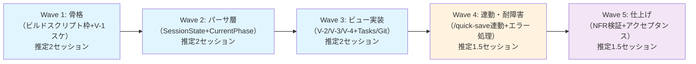

# タスク定義書: b4-dashboard（可視化レイヤー）

- バージョン: 0.1.0
- 作成日: 2026-06-20
- ステータス: Draft（PM 承認待ち）
- マイルストーン: B-5（LAM プロジェクト骨子 ⑤）
- 根拠文書:
  - `docs/specs/b4-dashboard/requirements.md`（v0.2.0）
  - `docs/specs/b4-dashboard/design.md`（v0.1.0）
  - `.claude/rules/planning-quality-guideline.md`（SPIDR / WBS 100% Rule）

---

## §1 概要 / マイルストーン位置

### マイルストーン B-5 の位置付け

B-5 は LAM プロジェクト骨子 ⑤「可視化レイヤー（ダッシュボード）」に対応するマイルストーン。
SESSION_STATE.md および `docs/specs/` に分散する作業状態を単一 HTML ダッシュボードで可視化し、
全体像の即時把握を実現する。

### PLANNING フェーズ完了状況

- requirements.md: v0.2.0 確定（Q1〜Q5 PM 回答済み・2026-06-20）
- design.md: v0.1.0 確定（14 章・530 行・未解決設計事項 UQ-1〜UQ-6 記録済み）
- glossary-draft.md: v0.2.0 確定

### BUILDING フェーズの構成方針

本タスク定義では以下の原則に従い Wave を構成する:

1. **垂直分割優先**: 各 Wave で全層（パーサ→ビルダ→HTML 出力）の最小通る経路を完成させる
2. **1 PR = 1 Wave（推奨）**: 各 Wave を 1 PR でまとめ、レビュー単位を明確化
3. **SPIDR 適用**: Paths（正常系 / エラー系）と Data（データソース別）軸を活用
4. **WBS 100% Rule**: requirements の全 FR/NFR/AC を網羅的にカバー

---

## §2 Wave 分割戦略

### 分割根拠（SPIDR 分析）

| 軸 | 分割方法 | b4-dashboard への適用 |
|----|---------|-------------------|
| Spike | 未解決設計事項（UQ-1〜UQ-6）の検証 | Wave 1 で実装時に決定（SESSION_STATE.md パース堅牢性・スキル名確定） |
| Paths | 正常系（全データ存在）vs エラー系（データ源欠如） | Wave 4・Wave 5 で耐障害性検証 |
| Interfaces | パーサ・ビルダ・スキル・HTML の 4 層 | Wave 1（骨格）→ Wave 2-3（パーサ・ビュー）→ Wave 4（連動）に積層 |
| Data | 4 つのデータソース（SessionState / CurrentPhase / Tasks / GitHistory） | Wave 2（SessionState + CurrentPhase）→ Wave 3（Tasks / GitHistory）に分離 |
| Rules | NFR-4（生成 30 秒以内）・NFR-6（耐障害性）・AC-1（/quick-save 連動）の 3 制約 | 各 Wave で段階的に検証 |

### Wave 構成案



---

## §3 各 Wave のタスク詳細

### Wave 1: 骨格（Build Script Skeleton + V-1 Minimal）

**概要**: `build_dashboard.py` のスケルトン実装、BaseParser 定義、V-1 Project サマリービュー最小実装、
初回 HTML 出力確認までの最小通る経路を完成させる。

**対応 FR/NFR/AC**:
- FR-7（単一 HTML ファイル出力）
- FR-8（出力先 `docs/artifacts/dashboard/`）
- FR-9a/9b（ビルドコマンド環境対応）
- NFR-1（500KB 未満）の基盤
- AC-2 部分（V-1 が HTML に含まれることを確認）

**Wave 内タスク**:

#### W1-B5-T1: BaseParser インターフェース定義

| 項目 | 内容 |
|------|------|
| **Task ID** | W1-B5-T1 |
| **概要** | `.claude/scripts/dashboard/parsers/base.py` に BaseParser 抽象クラスを定義 |
| **対応 FR** | FR-4（データソース読み込みの共通インターフェース） |
| **完了条件** | ・`parse() -> dict` メソッドシグネチャが design.md §5 と一致<br/>・`ok` / `error` / `data` キー構造が実装されている<br/>・docstring が PR レビュー時に実装内容を説明できる量 |
| **依存** | なし |
| **推定工数** | S（30 分） |
| **関連設計** | design.md §5「パーサ共通インターフェース」|

#### W1-B5-T2: build_dashboard.py スケルトン + DashboardBuilder 基本型

| 項目 | 内容 |
|------|------|
| **Task ID** | W1-B5-T2 |
| **概要** | `.claude/scripts/build_dashboard.py` のメインエントリ・パーサ呼び出しループ・エラーハンドリング枠を実装。DashboardBuilder の基本型（`__init__` + `render()`）を定義 |
| **対応 FR** | FR-9a/9b（ビルドコマンド実行）/ FR-6（エラー耐障害性の枠組み） |
| **完了条件** | ・`python .claude/scripts/build_dashboard.py --project-root D:/work7/LivingArchitectModel` が実行可能<br/>・`DashboardData` モデルが design.md §5 と一致<br/>・パーサ呼び出しループが `try/except` で保護されている<br/>・stdout に「HTML generated at ...」メッセージが出力される |
| **依存** | W1-B5-T1 |
| **推定工数** | M（1 時間） |
| **関連設計** | design.md §6「ビルドコマンド設計」・§9「エラー耐障害性設計」|

#### W1-B5-T3: V-1 Project サマリービュー最小実装

| 項目 | 内容 |
|------|------|
| **Task ID** | W1-B5-T3 |
| **概要** | DashboardBuilder が V-1（Project サマリー）のみを含む HTML を生成する。`<section id="v1-project-summary">` が design.md のイメージと一致する構造で出力される |
| **対応 FR** | FR-1（V-1 ビュー構成）/ FR-7（HTML ファイル出力）|
| **完了条件** | ・生成 HTML が `docs/artifacts/dashboard/dashboard.html` に出力される<br/>・`<section id="v1-project-summary">` が存在<br/>・Project 名「LAM」・タイムスタンプが表示される<br/>・ブラウザで開いて表示確認ができる |
| **依存** | W1-B5-T2 |
| **推定工数** | S（45 分） |
| **関連設計** | design.md §4「V-1: Project サマリービュー」|

#### W1-B5-T4: 単一 HTML 出力形式の基本化（CSS/JS インライン化）

| 項目 | 内容 |
|------|------|
| **Task ID** | W1-B5-T4 |
| **概要** | DashboardBuilder のテンプレート展開時に最小限の inline CSS（ステータスバッジ色）を埋め込み、外部 CDN 依存なしの単一ファイルであることを確認する |
| **対応 FR** | FR-5（オフライン動作）/ NFR-1（500KB 未満） |
| **完了条件** | ・生成 HTML が `<style>` タグで inline CSS を含む<br/>・外部 link / script を参照していない<br/>・ネットワークケーブルを抜いた状態でブラウザでファイルを開いて表示可能<br/>・`stat docs/artifacts/dashboard/dashboard.html | grep Size` で 500KB 未満 |
| **依存** | W1-B5-T3 |
| **推定工数** | S（30 分） |
| **関連設計** | design.md §8「出力形式」|

#### W1-B5-T5: `/visualize` スキル（仮）の最小実装

| 項目 | 内容 |
|------|------|
| **Task ID** | W1-B5-T5 |
| **概要** | `.claude/skills/` に `/visualize` スキルを新規作成。`build_dashboard.py` を呼び出し、成功・失敗の結果を表示する。スキル命名規則・フロントマター書式を既存スキルに準拠 |
| **対応 FR** | FR-10（スキル `/visualize`） |
| **完了条件** | ・スキルフロントマター（`disable-model-invocation: true` 推奨）が既存スキルと統一<br/>・`/visualize` 実行で `build_dashboard.py` が呼ばれる<br/>・スキル名が最終確定（UQ-3 解決） |
| **依存** | W1-B5-T2 |
| **推定工数** | S（30 分） |
| **関連設計** | design.md §6「`/visualize` スキル」/ §13「UQ-3」|

#### W1-B5-T6: Wave 1 統合テスト（最小通る経路）

| 項目 | 内容 |
|------|------|
| **Task ID** | W1-B5-T6 |
| **概要** | T1〜T5 実装後、`build_dashboard.py` → HTML 生成 → ブラウザ表示までの最小通る経路が完全に動作することを確認 |
| **対応 FR** | FR-1（V-1 含有）/ FR-7（HTML 出力） |
| **完了条件** | ・PR コメントに「Wave 1 統合テスト：PASS」と記載<br/>・生成 HTML のスクリーンショット（V-1 表示）を PR に添付<br/>・エラーメッセージ 0 件 |
| **依存** | W1-B5-T5 |
| **推定工数** | S（15 分） |

**Wave 1 推定総工数**: 2 セッション

---

### Wave 2: パーサ層 フェーズ 1（SessionState + CurrentPhase Parser）

**概要**: SESSION_STATE.md と .claude/current-phase.md を読み込むパーサを実装し、
V-2（Milestone 一覧）の表示に必要なデータを抽出する。

**対応 FR/NFR/AC**:
- FR-4（データソース読み込み SessionState / CurrentPhase）
- FR-2（状態値 4 値の表示）
- AC-4（SESSION_STATE.md の「進行中タスク」が V-2 に反映）
- NFR-6（ファイル不在時もビルド完了）

**Wave 内タスク**:

#### W2-B5-T7: SessionStateParser 実装（設計 UQ-1 対応）

| 項目 | 内容 |
|------|------|
| **Task ID** | W2-B5-T7 |
| **概要** | `.claude/scripts/dashboard/parsers/session_state.py` を実装。SESSION_STATE.md を regex で解析し、Milestone 一覧・進行中タスク・完了タスク・ブロック中タスク・状態値を抽出 |
| **対応 FR** | FR-4（SessionState データソース）/ FR-2（状態値） |
| **完了条件** | ・`parse()` が `ok: True, data: {milestones, waves, in_progress, blocked, completed}` を返す<br/>・実データ（プロジェクトルート `SESSION_STATE.md`）を使ってテストし、データが正しく抽出される<br/>・`##` `###` 見出しパターンの変動に対応可能（UQ-1 「堅牢性」の実装検証）<br/>・ファイル不在時は `ok: False` を返す |
| **依存** | W1-B5-T1 |
| **推定工数** | M（1.5 時間） |
| **関連設計** | design.md §5「SessionStateParser」・§13「UQ-1」|

#### W2-B5-T8: CurrentPhaseParser 実装

| 項目 | 内容 |
|------|------|
| **Task ID** | W2-B5-T8 |
| **概要** | `.claude/scripts/dashboard/parsers/current_phase.py` を実装。`.claude/current-phase.md` の 1 行目から Phase 文字列（"PLANNING" / "BUILDING" / "AUDITING"）を抽出 |
| **対応 FR** | FR-4（CurrentPhase データソース） |
| **完了条件** | ・`parse()` が `ok: True, data: {phase: "PLANNING"}` を返す<br/>・ファイル不在時は `ok: False` を返す<br/>・1 行目が "PLANNING\n" である場合、strip() で余分な改行を削除 |
| **依存** | W1-B5-T1 |
| **推定工数** | S（30 分） |
| **関連設計** | design.md §5「CurrentPhaseParser」|

#### W2-B5-T9: V-2 Milestone 一覧ビュー実装

| 項目 | 内容 |
|------|------|
| **Task ID** | W2-B5-T9 |
| **概要** | DashboardBuilder が V-2（Milestone 一覧）を HTML テーブルで生成。SessionStateParser と CurrentPhaseParser のデータを使用。アンカーリンク `#v3-waves-<milestone>` を張る |
| **対応 FR** | FR-1（V-2 ビュー構成）/ FR-3（ナビゲーション V-2 → V-3） |
| **完了条件** | ・`<section id="v2-milestones">` が存在<br/>・テーブルに Milestone 名・現在の Step・状態カラムが表示される<br/>・状態値が design.md §5 「状態値の決定ロジック」に従って決定される<br/>・アンカーリンクが `<a href="#v3-waves-<milestone>">` 形式で張られている |
| **依存** | W2-B5-T7、W2-B5-T8 |
| **推定工数** | M（1 時間） |
| **関連設計** | design.md §4「V-2: Milestone 一覧ビュー」|

#### W2-B5-T10: パーサエラーサマリー表示（FR-6 実装）

| 項目 | 内容 |
|------|------|
| **Task ID** | W2-B5-T10 |
| **概要** | DashboardBuilder が `DashboardData.parser_errors` を HTML の `<section id="parser-errors">` に表示する。1 件以上のパーサエラーがある場合、非エンジニア向けメッセージで「一部データが取得できていない」と明示 |
| **対応 FR** | FR-6（ファイルパース失敗の扱い） |
| **完了条件** | ・パーサエラーがない場合、`<section id="parser-errors">` が生成されない<br/>・パーサエラー 1 件以上の場合、セクションが生成され、エラー内容が表示される<br/>・ユーザーが見て「何かおかしい」と判断できる文言 |
| **依存** | W2-B5-T9 |
| **推定工数** | S（30 分） |
| **関連設計** | design.md §9「パーサエラーの HTML 表示」|

#### W2-B5-T11: Wave 2 統合テスト

| 項目 | 内容 |
|------|------|
| **Task ID** | W2-B5-T11 |
| **概要** | T7〜T10 実装後、SESSION_STATE.md のデータが V-1・V-2 に正しく反映されることを確認。AC-4（進行中タスク反映）の検証を含む |
| **対応 FR** | AC-4（SESSION_STATE が V-2 に反映） |
| **完了条件** | ・SESSION_STATE.md の「進行中タスク」セクションのデータが V-2 に表示される<br/>・パーサエラーがない場合のスクリーンショット<br/>・SessionStateParser をファイル不在で実行し、エラーハンドリング確認 |
| **依存** | W2-B5-T10 |
| **推定工数** | S（20 分） |

**Wave 2 推定総工数**: 2 セッション

---

### Wave 3: ビュー実装 フェーズ 2（V-3 / V-4 + TasksParser / GitHistoryParser）

**概要**: 残る 2 つのデータソース（TasksParser・GitHistoryParser）と 2 つのビュー（V-3 Wave 一覧・V-4 Task 一覧）を実装。
SPIDR Paths 分割（正常系＝全データ存在の場合）を完成させる。

**対応 FR/NFR/AC**:
- FR-4（TasksParser・GitHistoryParser）
- FR-1（V-3、V-4 ビュー）
- AC-2（全ビュー V-1〜V-4 含有確認）
- AC-3（状態値 4 値表示）

**Wave 内タスク**:

#### W3-B5-T12: TasksParser 実装（設計 UQ-2 対応）

| 項目 | 内容 |
|------|------|
| **Task ID** | W3-B5-T12 |
| **概要** | `.claude/scripts/dashboard/parsers/tasks.py` を実装。`docs/specs/<milestone>/tasks.md` をすべての Milestone 分走査し、チェックボックス行から Task エントリを抽出 |
| **対応 FR** | FR-4（MilestoneTasks データソース） |
| **完了条件** | ・`parse()` が `ok: True, data: {tasks: list[TaskInfo]}` を返す<br/>・regex `^-\s\[( |x)\]\s(.+)$` でチェックボックス行を検出<br/>・`[x]` → `completed`、`[ ]` → `not-started` に正規化<br/>・`docs/specs/` を glob で走査し、すべての Milestone の tasks.md をスキャン（UQ-2 対応）<br/>・tasks.md 不在 Milestone は `ok: True, data: []` を返す |
| **依存** | W1-B5-T1 |
| **推定工数** | M（1.5 時間） |
| **関連設計** | design.md §5「TasksParser」・§13「UQ-2」|

#### W3-B5-T13: GitHistoryParser 実装（設計 UQ-4 対応）

| 項目 | 内容 |
|------|------|
| **Task ID** | W3-B5-T13 |
| **概要** | `.claude/scripts/dashboard/parsers/git_history.py` を実装。`subprocess.run(["git", "log", "--oneline", "-100"])` のコマンド出力から Wave・Task の完了情報を regex で補完抽出 |
| **対応 FR** | FR-4（GitHistory データソース）/ FR-6（git 実行失敗時も継続） |
| **完了条件** | ・`parse()` が `ok: True, data: {completed_waves, completed_tasks}` を返す<br/>・git コマンド実行失敗時は `ok: False` を返し、スクリプトは継続（MUST NOT エラー終了）<br/>・実 git log を参照し、terminology.md §4 のコミットメッセージパターンを確認（UQ-4 実装）<br/>・regex パターン例: `feat\(b[4-5].*\).*wave\s*(\d+)` 等 |
| **依存** | W1-B5-T1 |
| **推定工数** | M（1.5 時間） |
| **関連設計** | design.md §5「GitHistoryParser」・§13「UQ-4」|

#### W3-B5-T14: V-3 Wave 一覧ビュー実装

| 項目 | 内容 |
|------|------|
| **Task ID** | W3-B5-T14 |
| **概要** | DashboardBuilder が V-3（Wave 一覧）を HTML テーブルで生成。SessionStateParser（基本）と GitHistoryParser（補完）のデータを使用。アンカーリンク `#v4-tasks` を張る |
| **対応 FR** | FR-1（V-3 ビュー構成）/ FR-3（ナビゲーション V-3 → V-4） |
| **完了条件** | ・`<section id="v3-waves-<milestone>">` が Milestone ごとに生成される<br/>・テーブルに Wave 番号・Task 数・状態カラムが表示される<br/>・状態値が design.md §5 「Wave の状態決定」ロジックに従う<br/>・`<a href="#v4-tasks">` リンクが張られている |
| **依存** | W3-B5-T12、W3-B5-T13、W2-B5-T7 |
| **推定工数** | M（1 時間） |
| **関連設計** | design.md §4「V-3: Wave 一覧ビュー」|

#### W3-B5-T15: V-4 Task 一覧ビュー実装

| 項目 | 内容 |
|------|------|
| **Task ID** | W3-B5-T15 |
| **概要** | DashboardBuilder が V-4（Task 一覧）を HTML テーブルで生成。TasksParser（基本）と SessionStateParser（補完）のデータを使用 |
| **対応 FR** | FR-1（V-4 ビュー構成） |
| **完了条件** | ・`<section id="v4-tasks">` が存在<br/>・テーブルに Task ID・担当・状態カラムが表示される<br/>・状態値が design.md §5 「Task の状態決定」ロジックに従う<br/>・全 Task が表示される（Orphan Task 検出用） |
| **依存** | W3-B5-T12、W2-B5-T7 |
| **推定工数** | M（1 時間） |
| **関連設計** | design.md §4「V-4: Task 一覧ビュー」|

#### W3-B5-T16: 状態値決定ロジック統合テスト

| 項目 | 内容 |
|------|------|
| **Task ID** | W3-B5-T16 |
| **概要** | design.md §5 「状態値の決定ロジック」が実装に反映されていることを確認。優先順位順に Task・Wave の状態が正しく決定されることを実データで検証 |
| **対応 FR** | FR-2（状態値 4 値表示）/ AC-3（各エントリに状態値のいずれか） |
| **完了条件** | ・実プロジェクトのデータを使用し、SESSION_STATE.md に「進行中」と記載された Task が V-3/V-4 で「進行中」と表示される<br/>・ブロック中タスク・完了タスクも同様に確認<br/>・状態値が `not-started` / `in-progress` / `blocked` / `completed` の 4 値のみである |
| **依存** | W3-B5-T15 |
| **推定工数** | S（20 分） |

#### W3-B5-T17: 全ビュー統合テスト（AC-2）

| 項目 | 内容 |
|------|------|
| **Task ID** | W3-B5-T17 |
| **概要** | V-1〜V-4 のすべてのビューが HTML に含まれていることを確認 |
| **対応 FR** | AC-2（V-1〜V-4 のビューが HTML に含まれること） |
| **完了条件** | ・`grep -c "id=\"v1-\|id=\"v2-\|id=\"v3-\|id=\"v4-" docs/artifacts/dashboard/dashboard.html` で 4 件以上ヒット<br/>・ブラウザでスクロールして全ビューが表示可能<br/>・PR に全ビューのスクリーンショット 4 枚を添付 |
| **依存** | W3-B5-T16 |
| **推定工数** | S（15 分） |

**Wave 3 推定総工数**: 2 セッション

---

### Wave 4: 連動・耐障害性（/quick-save 連動 + エラーハンドリング強化）

**概要**: `/quick-save` スキルへの Step 5 追加、エラー耐障害性の詳細テスト（AC-5 検証）、
NFR-4（30 秒以内生成）の初期計測。

**対応 FR/NFR/AC**:
- FR-11（`/quick-save` 連動）
- FR-6（エラー耐障害性）
- NFR-4（生成時間 30 秒以内）
- AC-1（HTML 自動生成）
- AC-5（データソース欠如時のビルド完了）
- AC-8（`/quick-save` 総実行時間 30 秒以内）

**Wave 内タスク**:

#### W4-B5-T18: `/quick-save` SKILL.md Step 5 追加

| 項目 | 内容 |
|------|------|
| **Task ID** | W4-B5-T18 |
| **概要** | `.claude/skills/quick-save/SKILL.md` の Step 4「完了報告」直後に Step 5「ダッシュボード更新」を追加。`build_dashboard.py` を呼び出す手順を記述 |
| **対応 FR** | FR-11（`/quick-save` 連動）/ AC-1（HTML 自動生成） |
| **完了条件** | ・SKILL.md に Step 5 が追加されている<br/>・実行コマンド `python .claude/scripts/build_dashboard.py` が明記されている<br/>・失敗時の対応「警告表示・quick-save 全体は正常完了」が記述されている<br/>・既存 Step 0〜4 が変更されていない |
| **依存** | W3-B5-T17（Wave 3 完了確認後） |
| **推定工数** | S（20 分） |
| **関連設計** | design.md §7「`/quick-save` 連動設計」|

#### W4-B5-T19: パーサエラー時のフォールバック動作確認（AC-5）

| 項目 | 内容 |
|------|------|
| **Task ID** | W4-B5-T19 |
| **概要** | 各データソースファイルを意図的に削除・破損させ、`build_dashboard.py` がエラーハンドリング（design.md §9）に従い HTML を生成することを確認 |
| **対応 FR** | FR-6（エラー時の扱い）/ NFR-6（全データ源欠如時も HTML 生成） |
| **完了条件** | ・SESSION_STATE.md 削除時：CurrentPhaseParser・TasksParser・GitHistoryParser は正常実行。V-1 は ハードコード値で表示<br/>・.claude/current-phase.md 削除時：V-2 の Step 列が「UNKNOWN」または空白<br/>・いずれかの Milestone の tasks.md 削除時：該当 Milestone の V-4 が空<br/>・全データソース削除時：HTML は生成される（エラー終了なし） |
| **依存** | W3-B5-T16 |
| **推定工数** | M（1 時間） |
| **関連設計** | design.md §9「フォールバック設計」|

#### W4-B5-T20: NFR-4 初期計測（生成時間 30 秒以内の基盤確認）

| 項目 | 内容 |
|------|------|
| **Task ID** | W4-B5-T20 |
| **概要** | `build_dashboard.py` の処理開始・完了時刻を記録し、生成時間を計測。NFR-4（30 秒以内）が現時点で満たされていることを確認する初期基準線を設定 |
| **対応 FR** | NFR-4（生成時間 30 秒以内） |
| **完了条件** | ・`time python .claude/scripts/build_dashboard.py` の実行結果を記録<br/>・実測値が 30 秒以内であることを確認<br/>・PR 説明に「生成時間: X 秒（NFR-4 基準値：30 秒以内）」と記載<br/>・計測環境：Windows 11（プロジェクトルート）でのローカル実行 |
| **依存** | W4-B5-T19 |
| **推定工数** | S（20 分） |

#### W4-B5-T21: `.gitignore` に `docs/artifacts/dashboard/` 追記

| 項目 | 内容 |
|------|------|
| **Task ID** | W4-B5-T21 |
| **概要** | `.gitignore` に `/quick-save` 連動で頻繁に生成される `docs/artifacts/dashboard/` ディレクトリを除外する行を追記 |
| **対応 FR** | FR-8 注記（gitignore 推奨） |
| **完了条件** | ・`.gitignore` に `docs/artifacts/dashboard/` が追加されている<br/>・`git status` で dashboard.html が表示されない<br/>・権限等級：SE 級（permission-levels.md 参照） |
| **依存** | なし（W4 内いつでも可） |
| **推定工数** | S（5 分） |
| **関連設計** | design.md §8「`.gitignore` 方針」|

#### W4-B5-T22: Wave 4 統合テスト（AC-1 / AC-8）

| 項目 | 内容 |
|------|------|
| **Task ID** | W4-B5-T22 |
| **概要** | `/quick-save` 実行時に HTML が自動生成されることを確認。実行時間が 30 秒以内に収まることを計測 |
| **対応 FR** | AC-1（HTML 自動生成）/ AC-8（`/quick-save` 総実行時間 30 秒以内） |
| **完了条件** | ・`/quick-save` 実行後、`docs/artifacts/dashboard/dashboard.html` が更新されている<br/>・実行時間を計測し「`/quick-save` 実行時間: Y 秒（含ダッシュボード生成）」を PR に記載<br/>・総実行時間が 30 秒以内 |
| **依存** | W4-B5-T21 |
| **推定工数** | S（15 分） |

**Wave 4 推定総工数**: 1.5 セッション

---

### Wave 5: 仕上げ（NFR 検証 + PoC アクセプタンス）

**概要**: 全 NFR の検証（ブラウザ表示時間・オフライン動作・ファイルサイズ）、
受け入れ条件 AC-1〜AC-8 の最終確認、既存 retro action との関連確認。

**対応 FR/NFR/AC**:
- NFR-2（ブラウザ表示完了時間 3 秒以内）
- NFR-3（対応ブラウザ Chrome/Edge 120+）
- NFR-5（外部依存なし）
- AC-6（ブラウザ 3 秒以内表示）
- AC-7（オフライン動作）

**Wave 内タスク**:

#### W5-B5-T23: NFR-2 検証（ブラウザ表示時間 3 秒以内）

| 項目 | 内容 |
|------|------|
| **Task ID** | W5-B5-T23 |
| **概要** | Chrome DevTools Lighthouse または手動計測で、HTML を開いてからビュー描画完了までの時間を計測。NFR-2（3 秒以内）を確認 |
| **対応 FR** | NFR-2（表示完了時間）/ AC-6（3 秒以内表示確認） |
| **完了条件** | ・Chrome DevTools Lighthouse でパフォーマンススコア・FCP / LCP / CLS を計測<br/>・LCP が 3 秒以内であることを確認<br/>・手動計測（秒時計等）でも確認可能<br/>・PR に計測スクリーンショットを添付 |
| **依存** | W4-B5-T22 |
| **推定工数** | S（20 分） |

#### W5-B5-T24: NFR-5 検証（外部依存なし・Python 標準ライブラリのみ）

| 項目 | 内容 |
|------|------|
| **Task ID** | W5-B5-T24 |
| **概要** | `build_dashboard.py` のインポート行をスキャンし、Python 標準ライブラリのみ使用していることを確認。パッケージ管理ファイル（pyproject.toml / requirements.txt）に追加されていないことを確認 |
| **対応 FR** | NFR-5（外部依存なし） |
| **完了条件** | ・`grep "^import\|^from" .claude/scripts/build_dashboard.py` で使用 import を全出力<br/>・すべてが `os`, `sys`, `pathlib`, `json`, `re`, `datetime`, `dataclasses` 等の標準ライブラリ<br/>・外部ライブラリ import（requests / pandas 等）がないことを確認<br/>・pyproject.toml / requirements.txt に新規依存が追加されていない |
| **依存** | W5-B5-T23 |
| **推定工数** | S（15 分） |

#### W5-B5-T25: AC-7 検証（オフライン動作確認）

| 項目 | 内容 |
|------|------|
| **Task ID** | W5-B5-T25 |
| **概要** | ネットワークケーブルを抜いた状態（またはネットワーク無効化）で生成 HTML をブラウザで開き、全ビューが表示されることを確認 |
| **対応 FR** | FR-5（オフライン動作）/ AC-7（ネットワーク接続なしで表示完了） |
| **完了条件** | ・ネットワーク接続を無効化<br/>・Chrome / Edge で `file://` または localhost 経由で HTML を開く<br/>・全ビュー（V-1〜V-4）が表示される<br/>・外部 CDN エラーがブラウザコンソールに出力されない |
| **依存** | W5-B5-T24 |
| **推定工数** | S（15 分） |

#### W5-B5-T26: NFR-3 検証（対応ブラウザ Chrome/Edge 120+）

| 項目 | 内容 |
|------|------|
| **Task ID** | W5-B5-T26 |
| **概要** | Chrome 120+、Edge 120+ で HTML を開き、レイアウト・表示が崩れないことを確認。テーブル表示・ステータスバッジ・ナビゲーションリンクが正常に機能すること |
| **対応 FR** | NFR-3（対応ブラウザ） |
| **完了条件** | ・Chrome 最新安定版で開く<br/>・Edge 最新安定版で開く<br/>・テーブル行・セル が正しく配置されている<br/>・ステータスバッジ（色付きラベル）が表示される<br/>・アンカーリンク（V-1 → V-2 → V-3 → V-4）がクリック可能 |
| **依存** | W5-B5-T25 |
| **推定工数** | S（20 分） |

#### W5-B5-T27: AC トレーサビリティ最終確認（AC-1〜AC-8 全検証）

| 項目 | 内容 |
|------|------|
| **Task ID** | W5-B5-T27 |
| **概要** | AC-1〜AC-8 を一覧にし、各 AC の検証が完了したタスク ID を記録。全 AC が PASS していることを確認 |
| **対応 FR** | 全 AC（AC-1〜AC-8） |
| **完了条件** | ・PR の説明欄に「AC トレーサビリティ表」を記載：<br/>  AC-1: W4-B5-T22 PASS<br/>  AC-2: W3-B5-T17 PASS<br/>  ...<br/>  AC-8: W4-B5-T22 PASS<br/>・FAIL / UNKNOWN タスク 0 件 |
| **依存** | W5-B5-T26 |
| **推定工数** | S（15 分） |

#### W5-B5-T28: design.md 未解決設計事項（UQ-1〜UQ-7）の対応確認

| 項目 | 内容 |
|------|------|
| **Task ID** | W5-B5-T28 |
| **概要** | design.md §13 の未解決設計事項（UQ-1〜UQ-7）が BUILDING フェーズで対応・確定されたことを確認。対応内容を PR に記録 |
| **対応 FR** | 設計の完全性 |
| **完了条件** | ・UQ-1（SESSION_STATE.md パース堅牢性）: W2-B5-T7 で実装・実データテスト完了<br/>・UQ-2（tasks.md 不在 Milestone の扱い）: W3-B5-T12 で「空リスト返却」に確定<br/>・UQ-3（`/visualize` スキル名確定）: W1-B5-T5 で確定<br/>・UQ-4（git log regex の定義）: W3-B5-T13 で実装・terminology.md 参照<br/>・UQ-5（`.gitignore` 権限等級）: W4-B5-T21 で SE 級実施<br/>・UQ-6（DashboardBuilder テンプレート管理）: f-string 実装を選択し PR に記載<br/>・UQ-7（複数 Milestone 時 Step 表示）: BUILDING フェーズで判断・記録（現状 LAM 単一 Milestone のため棚上げ可）<br/>・PR に「設計未解決事項 UQ-1〜UQ-7: 全対応済み」と宣言 |
| **依存** | W5-B5-T27 |
| **推定工数** | S（15 分） |

#### W5-B5-T29: PoC 最終レビュー・ユーザー確認

| 項目 | 内容 |
|------|------|
| **Task ID** | W5-B5-T29 |
| **概要** | 生成ダッシュボード HTML をユーザーに見せ、「作業状態が視覚的に把握できるか」を PoC 観点で確認。フィードバック記録 |
| **対応 FR** | requirements.md §1 Problem Statement「一目で示す」確認 |
| **完了条件** | ・ユーザーにダッシュボード HTML を表示<br/>・「Project サマリー・Milestone 進捗・Wave・Task 状態が把握できるか」をヒアリング<br/>・フィードバック内容を `docs/artifacts/b4-dashboard-poc-review.md` に記録<br/>・「次フェーズ（UI 仕上げ・機能拡張）への改善提案」を collected |
| **依存** | W5-B5-T28 |
| **推定工数** | S（30 分） |

#### W5-B5-T30: Wave 5 最終統合テスト

| 項目 | 内容 |
|------|------|
| **Task ID** | W5-B5-T30 |
| **概要** | B-5 マイルストーンの全タスク完了を確認。PR レビュー・マージ準備 |
| **対応 FR** | 全要件 |
| **完了条件** | ・PR が開かれている<br/>・すべての検査（lint / テスト）が PASS<br/>・PR 説明に「B-5 PoC 完了・requirements AC-1〜AC-8 全検証」と明記<br/>・マージの判断をユーザーに求める |
| **依存** | W5-B5-T29 |
| **推定工数** | S（10 分） |

**Wave 5 推定総工数**: 1.5 セッション

---

## §4 依存関係グラフ

```mermaid
flowchart LR
    %% Wave 1: Skeleton
    T1[W1-B5-T1<br/>BaseParser]
    T2[W1-B5-T2<br/>build_dash+Builder]
    T3[W1-B5-T3<br/>V-1 実装]
    T4[W1-B5-T4<br/>HTML形式確定]
    T5[W1-B5-T5<br/>/visualize]
    T6[W1-B5-T6<br/>Wave1統合テスト]

    T1 --> T2
    T2 --> T3
    T3 --> T4
    T2 --> T5
    T5 --> T6
    T4 --> T6

    %% Wave 2: Parser 1
    T7[W2-B5-T7<br/>SessionStateParser]
    T8[W2-B5-T8<br/>CurrentPhaseParser]
    T9[W2-B5-T9<br/>V-2実装]
    T10[W2-B5-T10<br/>エラー表示]
    T11[W2-B5-T11<br/>Wave2統合]

    T1 --> T7
    T1 --> T8
    T7 --> T9
    T8 --> T9
    T9 --> T10
    T10 --> T11

    %% Wave 3: Parser 2 + Views
    T12[W3-B5-T12<br/>TasksParser]
    T13[W3-B5-T13<br/>GitHistoryParser]
    T14[W3-B5-T14<br/>V-3実装]
    T15[W3-B5-T15<br/>V-4実装]
    T16[W3-B5-T16<br/>状態値ロジック]
    T17[W3-B5-T17<br/>全ビュー統合]

    T1 --> T12
    T1 --> T13
    T12 --> T14
    T13 --> T14
    T7 --> T14
    T12 --> T15
    T7 --> T15
    T15 --> T16
    T16 --> T17

    %% Wave 4: Integration
    T18[W4-B5-T18<br/>/quick-save Step5]
    T19[W4-B5-T19<br/>エラーハンドリング]
    T20[W4-B5-T20<br/>生成時間計測]
    T21[W4-B5-T21<br/>.gitignore]
    T22[W4-B5-T22<br/>Wave4統合]

    T17 --> T18
    T19 --> T20
    T20 --> T22
    T21 -.可-> T22
    T18 --> T22

    %% Wave 5: Validation
    T23[W5-B5-T23<br/>NFR-2検証]
    T24[W5-B5-T24<br/>NFR-5検証]
    T25[W5-B5-T25<br/>AC-7検証]
    T26[W5-B5-T26<br/>NFR-3検証]
    T27[W5-B5-T27<br/>AC最終確認]
    T28[W5-B5-T28<br/>UQ対応確認]
    T29[W5-B5-T29<br/>PoC最終レビュー]
    T30[W5-B5-T30<br/>Wave5統合]

    T22 --> T23
    T23 --> T24
    T24 --> T25
    T25 --> T26
    T26 --> T27
    T27 --> T28
    T28 --> T29
    T29 --> T30

    style T6 fill:#e1f5ff
    style T11 fill:#e1f5ff
    style T17 fill:#e1f5ff
    style T22 fill:#fff3e0
    style T30 fill:#f3e5f5
```

---

## §5 SPIDR 分割の根拠

### Spike（調査）

- **UQ-1 SESSION_STATE.md パース堅牢性**: 実装時に実データを使って regex パターンを試行錯誤し、セクション見出しのばらつきに対応する（W2-B5-T7）
- **UQ-4 git log コミットメッセージパターン**: 実 git log を走査し、terminology.md §4 のパターンに合致するものを特定（W3-B5-T13）

### Paths（ワークフロー）

- **正常系**: 全データソースファイル存在の場合の標準処理フロー（W1→W2→W3→W4）
- **エラー系**: データソース不在・パース失敗時の耐障害処理（W4-B5-T19、W2-B5-T10、§9 フォールバック）

### Interfaces（インターフェース種別）

- **パーサ層**: 4 種類のパーサ（SessionState / CurrentPhase / Tasks / GitHistory）を共通インターフェース（BaseParser）で統一（W1-B5-T1）
- **ビルダ層**: DashboardBuilder が パーサ出力を HTML に変換（W1-B5-T2、W2-B5-T9 以降）
- **スキル層**: `/visualize` スキルが build_dashboard.py をオーケストレーション（W1-B5-T5）
- **出力層**: 単一 HTML ファイル形式（W1-B5-T4）

### Data（データ操作）

- **Wave 2**: SessionState + CurrentPhase パーサ（3 つの情報源：進行中・完了・ブロック中）
- **Wave 3**: Tasks + GitHistory パーサ（2 つの情報源：チェックボックス・git コミット）
- **Wave 4-5**: 各パーサの出力をビュー描画・検証

### Rules（ビジネスルール）

- **状態値決定ロジック**: 複数データソースの優先順位ルール（design.md §5）を W3-B5-T16 で統合テスト
- **エラー耐障害性ルール**: 部分失敗時も HTML 生成続行（design.md §9）を W4-B5-T19 で検証

---

## §6 WBS 100% Rule 検証

### FR 対応表（仕様→タスク）

| FR | 対応タスク |
|----|----------|
| FR-1（ビュー構成 V-1〜V-4） | W1-B5-T3, W2-B5-T9, W3-B5-T14, W3-B5-T15 |
| FR-2（状態値 4 値） | W2-B5-T7, W3-B5-T16 |
| FR-3（ナビゲーション） | W2-B5-T9, W3-B5-T14 |
| FR-4（データソース読み込み） | W2-B5-T7, W2-B5-T8, W3-B5-T12, W3-B5-T13 |
| FR-5（オフライン動作） | W1-B5-T4, W5-B5-T25 |
| FR-6（エラー扱い） | W2-B5-T10, W4-B5-T19 |
| FR-7（HTML 形式） | W1-B5-T3 |
| FR-8（出力先） | W1-B5-T2 |
| FR-9a/9b（ビルドコマンド） | W1-B5-T2 |
| FR-10（`/visualize` スキル） | W1-B5-T5 |
| FR-11（`/quick-save` 連動） | W4-B5-T18 |

**Gap（FR にあるがタスクにないもの）: 0 件**

### NFR 対応表

| NFR | 対応タスク |
|----|----------|
| NFR-1（500KB 未満） | W1-B5-T4 |
| NFR-2（3 秒以内表示） | W5-B5-T23 |
| NFR-3（Chrome/Edge 120+） | W5-B5-T26 |
| NFR-4（30 秒以内生成） | W4-B5-T20 |
| NFR-5（外部依存なし） | W5-B5-T24 |
| NFR-6（データ欠如時も生成） | W4-B5-T19 |

**Gap: 0 件**

### AC 対応表

| AC | 対応タスク |
|----|----------|
| AC-1（`/quick-save` 自動生成） | W4-B5-T18, W4-B5-T22 |
| AC-2（V-1〜V-4 含有） | W3-B5-T17 |
| AC-3（状態値 4 値表示） | W3-B5-T16 |
| AC-4（SESSION_STATE が V-2 に反映） | W2-B5-T11 |
| AC-5（データソース欠如時ビルド完了） | W4-B5-T19 |
| AC-6（ブラウザ 3 秒以内表示） | W5-B5-T23 |
| AC-7（オフライン動作） | W5-B5-T25 |
| AC-8（`/quick-save` 総時間 30 秒以内） | W4-B5-T22 |

**Gap: 0 件 / Orphan: 0 件**

**WBS 100% Rule: ✓ PASS（FR/NFR/AC 全カバレッジ）**

---

## §7 権限等級（permission-levels.md 準拠）

| タスク群 | 権限等級 | 理由 |
|---------|--------|------|
| W1-B5-T1〜T6 | SE 級 | `.claude/scripts/` 新規ファイル追加・スキル追加 |
| W2-B5-T7〜T11 | SE 級 | `.claude/scripts/` ファイル追加・内部ロジック |
| W3-B5-T12〜T17 | SE 級 | 同上 |
| W4-B5-T18 | SE 級 | `.claude/skills/quick-save/SKILL.md` 内部 Step 追加（公開 API 不変） |
| W4-B5-T19〜T22 | SE 級 | テスト・計測・設定追記（`.gitignore`） |
| W5-B5-T23〜T30 | SE 級 | 検証・テスト・レビュー |

**注**: すべてのタスクが SE 級以下。PM 級（仕様変更）タスクは存在しない（requirements.md / design.md は既確定）。

---

## §8 Definition of Ready チェックリスト

### 全タスク共通

- [x] 対応する仕様書（requirements.md の FR/NFR/AC）が存在する
- [x] 受け入れ条件（DoD）がテスト可能な形式で定義されている
- [x] 1 PR で完結するサイズである（各 Wave = 1 PR）
- [x] 依存関係が明確である

### タスク個別 DoR 確認

| Wave | タスク数 | PR 単位 | テスト可能 |
|------|---------|--------|----------|
| W1 | 6 | 1 PR | ビルド成功・HTML 出力確認 |
| W2 | 5 | 1 PR | grep・python テスト・実データ検証 |
| W3 | 6 | 1 PR | grep・状態値検証・表示確認 |
| W4 | 5 | 1 PR | スキル実行・エラーシミュレーション・時間計測 |
| W5 | 8 | 1 PR（最終統合） | DevTools・ブラウザテスト・ユーザーレビュー |

---

## §9 既知リスク・前提条件

### R-1: SESSION_STATE.md パース堅牢性（UQ-1）

SESSION_STATE.md のセクション見出しパターンが標準化されていない場合、W2-B5-T7 の regex が
失敗する可能性がある。**対応**: 実データを使った try-and-fix を W2-B5-T7 で実施し、
パターンを確定させる。

### R-2: git log コミットメッセージ パターン（UQ-4）

terminology.md §4 のコミットメッセージ規約に Wave・Task キーワードが含まれていない場合、
W3-B5-T13 の補完機能が機能しない。**対応**: 実装時に実 git log を走査し、
実際のパターンに合わせて regex を調整する。

### R-3: NFR-4（30 秒以内生成）の計測環境差異

ローカル環境の負荷・ディスク性能により計測値が変動する可能性がある。
**対応**: W4-B5-T20・W4-B5-T22 で環境情報（OS / CPU / メモリ）を記録し、
ベースライン値として確立する。

### R-4: Windows 環境での Bash ツール実行

`.claude/scripts/build_dashboard.py` を Bash ツール経由で実行する場合、
Git Bash 環境での動作確認が必須。**対応**: すべてのタスクで Windows 11 / Git Bash を前提とし、
スクリプト内パスはフォワードスラッシュを使用する。

### R-5: ブラウザ互換性（NFR-3）

Chrome / Edge 120+ では検証するが、他のブラウザ（Firefox / Safari）での動作は
本スコープ外。**対応**: requirements.md Non-Goals で明記済み。

---

## §10 参照

- `docs/specs/b4-dashboard/requirements.md`（v0.2.0、SSOT）
- `docs/specs/b4-dashboard/design.md`（v0.1.0、設計実装方針）
- `docs/specs/b4-dashboard/glossary-draft.md`（v0.2.0、用語定義）
- `.claude/rules/terminology.md`（階層用語・コミットメッセージ規約）
- `.claude/rules/planning-quality-guideline.md`（SPIDR / WBS 100% Rule）
- `.claude/rules/permission-levels.md`（権限等級分類）
- `docs/specs/v5-fat-reduction/tasks.md`（タスク定義書の参考）
- `SESSION_STATE.md`（マイルストーン配置・進捗状態）

---

