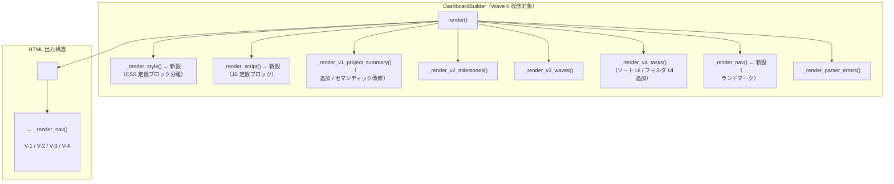

# b4-dashboard Wave 6 — design.md

- バージョン: 0.3.0
- 作成日: 2026-06-24
- 更新日: 2026-06-25（spec-critic 第 2 回レビュー反映）
- ステータス: **Approved**（PM 承認 2026-06-25 / requirements.md v0.2.0 と整合済）
- 関連:
  - `docs/specs/b4-dashboard/wave6/requirements.md` v0.1.0（Wave 6 要件書 / 承認済 / 最優先）
  - `docs/specs/b4-dashboard/wave6/clarify-2026-06-24.md`（PLANNING インタビュー記録）
  - `docs/specs/b4-dashboard/design.md` v0.1.0（PoC 設計書 / 継承元）

---

## §1 Problem Statement

B-5 b4-dashboard は Wave 1〜5 の BUILDING を経て PoC 完了（AC-1〜AC-8 全 GREEN）したが、
CSS スタイリングが最小限で視認性が低く、テーブルソートおよびフィルタリング機能が存在しないため、
Wave 6 でこの実用化ギャップを解消する（requirements.md v0.1.0 §1 より）。

---

## §2 Non-Goals

requirements.md §3 を設計観点でブリッジする。以下は Wave 6 設計スコープ外とする。

| 非スコープ | 設計への影響 |
|-----------|------------|
| 完全レスポンシブ対応 | Grid/flexbox は PC 幅（768px 以上）での動作のみ保証。viewport meta タグは継承維持 |
| CSS フレームワーク採用 | builder.py の `<style>` タグは純 CSS 定数で管理。外部 @import なし |
| 独自ブランドカラー設計 | Radix Colors 標準パレット（gray / blue / green / amber）のみ使用 |
| JS ライブラリ採用 | `<script>` タグ内は Vanilla JS のみ。DOM API 直接操作 |
| FC-7 完全対応（複数 Milestone Step 独立管理） | V-2 の Step 列は全 Milestone 共通値を継続 |
| グラフ・チャート統計可視化 | V-1〜V-4 のテーブル/定義リスト構造を維持 |

---

## §3 Alternatives Considered

### Three Agents Model 観点による設計選択の評価

#### A3-1: CSS 変数命名 — Radix 公式スケール変数 vs. 意味ベース変数のみ

**[MELCHIOR]**: Radix 公式変数（`--gray-1` 等）をそのまま HTML に転記して使用すると、
設計書と実装の対応が1対1で追跡しやすく、将来の Radix Colors バージョン追従が容易。

**[BALTHASAR]**: `--gray-1` のままでは「これが背景色なのか？テキスト色なのか？」が
コードから判読できない。意味ベース変数（`--color-bg`, `--color-text` 等）の中間層を
置かないとダークモード対応時に全 CSS を書き直すリスクがある。

**[CASPAR]**: 採用: **2層構造**。
- Layer 1: Radix 公式スケール変数（`--gray-1`〜`--gray-12` 等）を `:root` に転記
- Layer 2: 意味ベースのエイリアス変数（`--color-bg`, `--color-text-primary` 等）が Layer 1 を参照
- ダーク切替は Layer 2 のエイリアスを `@media (prefers-color-scheme: dark) :root` で上書き
- 実装側は Layer 2 のみを参照するため、将来の色差替えが Layer 2 変数の書換えだけで完結

#### A3-2: ライト/ダーク切替 — class ベース vs. prefers-color-scheme メディアクエリ

**[MELCHIOR]**: Radix 公式は `.dark` クラスベース切替を推奨する。JavaScript で
`matchMedia` を検出してクラスを付与すると、ユーザーが手動でテーマを上書きする拡張も可能。

**[BALTHASAR]**: LAM のダッシュボードは外部 JS 禁止・単一 HTML・ユーザーが手動切替を
必要としない開発用ツールである。JavaScript でクラスを操作するのは NFR-W6 の要件範囲超過であり、
`@media (prefers-color-scheme: dark)` だけで十分。JS を増やせば AC-W6-10 の行数管理も複雑化する。

**[CASPAR]**: 採用: **`@media (prefers-color-scheme: dark) :root` のみ**。
Radix 公式の `.dark` クラスは使用しない（JS 不要・LAM 適合）。
Layer 2 のエイリアス変数を `@media (prefers-color-scheme: dark) :root` で上書きする2 セット構造を採用。

#### A3-3: ソート実装 — `Array.from(tbody.rows).sort()` vs. `<table>` 外部ソートライブラリ

**[MELCHIOR]**: DataTables 等の外部ライブラリは高機能で実装が速い。

**[BALTHASAR]**: NFR-5（外部依存なし）・FR-5（オフライン動作）と完全矛盾。却下。

**[CASPAR]**: 採用: requirements.md FR-W6-4 確定の **Vanilla JS DOM 再挿入方式**。
`Array.from(tbody.rows).sort()` + DOM 再挿入。

#### A3-4: フィルタ実装 — `row.style.display` vs. CSS クラストグル

**[MELCHIOR]**: CSS クラストグル（`row.classList.toggle('hidden')`）は CSS で一元管理できる。

**[BALTHASAR]**: `aria-live` 件数表示や「全行再表示」リセット処理を考えると
`style.display` で行数を直接カウントする方が単純で AC-W6-10 の行数節約にもなる。

**[CASPAR]**: 採用: requirements.md FR-W6-5 確定の **`row.style.display` 切替方式**。
フィルタ数のカウントは `querySelectorAll(...rows)` で `style.display !== 'none'` を数える。

#### A3-5: `<script>` タグ位置 — `</body>` 直前 vs. `<head>` 内 defer

**[MELCHIOR]**: `defer` 属性付き `<head>` 内 script は現代的なベストプラクティス。

**[BALTHASAR]**: inline script に `defer` は無効（MDN 仕様）。`</body>` 直前配置が
DOM の解析完了を保証する。

**[CASPAR]**: 採用: **`</body>` 直前配置**（inline script に defer 無効のため）。

---

## §4 Success Criteria

Wave 6 design.md v0.1.0 は requirements.md §6 の AC-W6-1〜AC-W6-11 を全て達成可能な設計を提供する。

| AC ID | 設計での達成手段 |
|-------|----------------|
| AC-W6-1 | §6 Layer 2 エイリアス変数 `--color-text-primary: var(--gray-12)` / `--color-text-secondary: var(--gray-11)` でテキストに step 11/12 を割当、Radix 公式値を `:root` に転記 |
| AC-W6-2 | §8 セマンティック HTML（`<main>`追加）+ §6 コントラスト確保 + §9 ソート/フィルタ ARIA 対応 |
| AC-W6-3 | §6 `@media (prefers-color-scheme: dark) :root` 2 セット構造で全 V-1〜V-4 カバー |
| AC-W6-4 | §9 `sortTable()` 関数・DOM 再挿入・`aria-sort` 更新 |
| AC-W6-5 | §10 `applyFilters()` 関数・`row.style.display` 切替 |
| AC-W6-6 | §10 AND 条件結合ロジック（3 フィルタ変数の論理積） |
| AC-W6-7 | §10 `aria-live="polite"` 付き件数表示要素を `applyFilters()` が更新 |
| AC-W6-8 | §7 CSS サイズ試算（Radix 96 値 ≒ 4〜6KB + レイアウト 2〜3KB = 合計 ≦ 10KB）/ §12 フルサイズ制御 |
| AC-W6-9 | 全 JS は inline・外部依存なし（既存 NFR-5 継承） |
| AC-W6-10 | §11 JS 行数管理フロー（SHOULD 検証の運用基準） |
| AC-W6-11 | §4 に収束するデザイン品質を Wave 6 PoC レビューでユーザーが評価 |

### 既存 PoC NFR 継承宣言

PoC 設計書（design.md v0.1.0）の Non-Goals に「具体的な CSS スタイリング・配色設計は PoC 後のフェーズ」と記載されていた。Wave 6 はこれを解消する正式対応フェーズである。以下 NFR は全て Wave 6 でも維持する。

| NFR | 継承内容 |
|-----|---------|
| NFR-1 | HTML 全体 500 KB 未満（追加 CSS ≦ 10KB で余裕あり） |
| NFR-4 | スクリプト実行から HTML 生成完了まで 30 秒以内 |
| NFR-5 | Python 標準ライブラリのみ / JS は外部依存なし |
| FR-5 | オフライン動作・外部 CDN 参照 MUST NOT |

---

## §5 全体アーキテクチャ

### builder.py 改修ポイント

Wave 6 では `builder.py` に以下の改修を行う。他のファイル（`models.py` / パーサ群 / `build_dashboard.py`）は変更しない。



### セマンティック HTML 全体構造

```
<!DOCTYPE html>
<html lang="ja">
<head>
  <meta charset="UTF-8">
  <meta name="viewport" content="width=device-width, initial-scale=1.0">
  <title>LAM Dashboard</title>
  <style>...</style>   ← _render_style() 出力（Wave 6 追加）
</head>
<body>
  <nav id="nav-landmarks">
    <a href="#main-content">メインコンテンツへスキップ</a>  ← スキップリンク
    <ul>
      <li><a href="#v1-project-summary">Project サマリー</a></li>
      <li><a href="#v2-milestones">Milestone 一覧</a></li>
      <li><a href="#v3-waves-…">Wave 一覧</a></li>
      <li><a href="#v4-tasks">Task 一覧</a></li>
    </ul>
  </nav>
  <main id="main-content">
    <section id="v1-project-summary">...</section>
    <section id="v2-milestones">...</section>
    <section id="v3-waves-B-5">...</section>
    <section id="v4-tasks">
      <!-- フィルタ UI -->
      <div id="filter-controls" role="search">...</div>
      <p id="filter-result-count" aria-live="polite"></p>
      <!-- テーブル（ソート UI 付き） -->
      <table id="tasks-table">...</table>
    </section>
  </main>
  <section id="parser-errors">...</section>  ← エラーがある場合のみ
  <script>...</script>   ← _render_script() 出力（Wave 6 追加）
</body>
</html>
```

---

## §6 Radix Colors 適用設計

### upstream-first 裏取り結果（§17 と連動）

**確定した CSS 変数名書式**: `--{colorname}-{1..12}`（例: `--gray-1`, `--blue-12`）
- `@radix-ui/colors` npm パッケージの CSS ファイル（`gray.css`, `gray-dark.css`）の
  変数名は `--gray-1` 〜 `--gray-12` 形式で確定（意味ベースの別名 `--gray-app` 等は
  Radix Themes の上位レイヤーであり、Radix Colors 単体のスケール変数とは別物）

**確定したライト/ダーク構造**:
- Radix 公式: ライトは `:root`（または `.light` クラス）、ダークは `.dark` クラスに適用
- LAM では npm インポートも JS クラス操作も使用しない（NFR-5 / FR-5）
- **採用方針**: Radix の `:root` 変数値を手動転記し、ダーク用は
  `@media (prefers-color-scheme: dark) :root { ... }` で上書き（§3 A3-2 CASPAR 結論）

### 使用するカラースケール

| カラー | step 1-2 用途 | step 11-12 用途 | step 6-8 用途 |
|--------|-------------|----------------|--------------|
| gray | ページ背景・カード背景 | 本文テキスト | ボーダー・区切り線 |
| blue | not-started バッジ背景 | バッジテキスト（高コントラスト） | テーブルヘッダ行背景 |
| green | completed バッジ背景 | バッジテキスト | — |
| amber | in-progress / blocked バッジ背景 | バッジテキスト | — |

> blocked は amber step 3（やや濃い背景）+ amber step 11 テキストで差別化する。

### Layer 1: Radix スケール転記（CSS 変数定義）

`:root` に転記するスケール変数（ライト値）:
- `--gray-1` 〜 `--gray-12`（12 変数）
- `--blue-1` 〜 `--blue-12`（12 変数）
- `--green-1` 〜 `--green-12`（12 変数）
- `--amber-1` 〜 `--amber-12`（12 変数）
- 合計: 48 変数（ライト）

`@media (prefers-color-scheme: dark) :root` に転記するスケール変数（ダーク値）:
- 同じ 48 変数を Radix dark scale 値で上書き
- 合計: 48 変数（ダーク）

総 Radix 転記変数: 96 変数 ≒ 4〜6 KB（requirements.md §4 FR-W6-2 根拠値と整合）

転記元 URL:
- ライト: https://www.radix-ui.com/colors の P3 非対応値（sRGB hex / oklch のいずれか）
- ダーク: 同ページのダークスケール値

### Layer 2: 意味ベースエイリアス変数

ライト用 `:root` 末尾に定義するエイリアス変数:

```css
/* ─── Layer 2: 意味ベースエイリアス（ライト） ─── */
:root {
  /* 背景 */
  --color-bg-page:        var(--gray-1);
  --color-bg-surface:     var(--gray-2);
  --color-bg-header:      var(--blue-3);

  /* テキスト */
  --color-text-primary:   var(--gray-12);
  --color-text-secondary: var(--gray-11);
  --color-text-muted:     var(--gray-9);

  /* ボーダー */
  --color-border:         var(--gray-6);
  --color-border-table:   var(--gray-5);

  /* フォーカス */
  --color-focus-ring:     var(--blue-8);

  /* 状態バッジ */
  --color-status-completed-bg:   var(--green-4);
  --color-status-completed-text: var(--green-11);
  --color-status-progress-bg:    var(--blue-4);
  --color-status-progress-text:  var(--blue-11);
  --color-status-blocked-bg:     var(--amber-4);
  --color-status-blocked-text:   var(--amber-11);
  --color-status-notstarted-bg:  var(--gray-3);
  --color-status-notstarted-text:var(--gray-11);

  /* ソート UI */
  --color-sort-indicator:        var(--blue-9);
  --color-sort-hover:            var(--blue-2);

  /* フィルタ UI */
  --color-filter-bg:             var(--gray-2);
  --color-filter-border:         var(--gray-6);
}
```

ダーク用オーバーライド（`@media (prefers-color-scheme: dark) :root` 末尾に追加）:

```css
/* ─── Layer 2: 意味ベースエイリアス（ダーク） ─── */
@media (prefers-color-scheme: dark) {
  :root {
    --color-bg-page:        var(--gray-1);    /* ダーク gray-1 ≒ #111113 */
    --color-bg-surface:     var(--gray-2);
    --color-bg-header:      var(--blue-3);
    --color-text-primary:   var(--gray-12);   /* ダーク gray-12 ≒ #eeeef0 */
    --color-text-secondary: var(--gray-11);
    --color-text-muted:     var(--gray-9);
    --color-border:         var(--gray-6);
    --color-border-table:   var(--gray-5);
    --color-focus-ring:     var(--blue-8);
    --color-status-completed-bg:   var(--green-4);
    --color-status-completed-text: var(--green-11);
    --color-status-progress-bg:    var(--blue-4);
    --color-status-progress-text:  var(--blue-11);
    --color-status-blocked-bg:     var(--amber-4);
    --color-status-blocked-text:   var(--amber-11);
    --color-status-notstarted-bg:  var(--gray-3);
    --color-status-notstarted-text:var(--gray-11);
    --color-sort-indicator:        var(--blue-9);
    --color-sort-hover:            var(--blue-2);
    --color-filter-bg:             var(--gray-2);
    --color-filter-border:         var(--gray-6);
  }
}
```

### Layer 2 ダーク上書きブロックの存在理由（C-2 対応）

Layer 1 の Radix スケール変数自体が `:root` でライト値、`@media (prefers-color-scheme: dark) :root`
でダーク値に上書きされているため、Layer 2 のエイリアスは同じ変数名のまま両テーマで正しく動作する。

つまり上記ダーク用 Layer 2 ブロック（行 296〜325 相当）は **実装時点では Layer 1 上書きと同値であり、CSS 計算結果として no-op**（書いても書かなくても同じ）である。それでも明示的に上書きブロックを設けるのは、以下の **将来の編集ポイント（プレースホルダー）として機能させるため**:

| 想定シナリオ | このブロックが必要な理由 |
|------------|--------------------|
| Lighthouse で「ダーク時 status-blocked の amber-4 がコントラスト不足」と判明した場合 | ライトでは amber-4、ダークでは amber-5 に切替える必要がある。Layer 2 ダークブロックで `--color-status-blocked-bg: var(--amber-5);` と上書きすればライトに影響を与えずダークだけ調整可能 |
| ダーク時のフォーカスリングを目立たせたい | Layer 2 ダークブロックで `--color-focus-ring: var(--blue-10);` と上書き |
| ダーク時のテーブルヘッダ背景を変更 | 同様にダーク Layer 2 ブロックで意味ベース変数を再代入 |

このブロックを削除すると、上記調整が必要になった際に「Layer 2 を 1 から書き直す」または「Layer 1 を直接いじる（Radix 公式値からの逸脱）」という選択を迫られる。

**保守ルール**: BUILDING フェーズでこのブロックを「冗長」として削除してはならない。実装時に同値であっても残置する。Stage 4 の Lighthouse 結果次第で実体を持つ可能性が高い。

### CSS カスタムプロパティ `var()` 評価モデルの補足（W-NEW-2 対応）

「Layer 2 ダーク Layer が no-op」が成立する技術的根拠:

- CSS カスタムプロパティの `var(--foo)` 参照は **宣言時ではなく使用時に解決**される（CSS Custom Properties for Cascading Variables Module Level 1 §3.2）
- ライト環境下では Layer 1 `:root { --gray-1: #fcfcfd; }` が有効 → Layer 2 `--color-bg-page: var(--gray-1)` は `#fcfcfd` を返す
- ダーク環境下では Layer 1 `@media (prefers-color-scheme: dark) :root { --gray-1: #111113; }` が後勝ちで有効 → Layer 2 `--color-bg-page: var(--gray-1)` は同じ宣言のまま `#111113` を返す
- このため Layer 2 ライト宣言だけで両テーマに対応し、Layer 2 ダーク Layer は文字通りの no-op になる
- **警告**: Layer 2 でリテラル hex 値（例: `--color-bg-page: #fcfcfd;` のように `var()` を使わない記述）を書くと、Layer 1 のテーマ切替が伝播せず Layer 2 ダーク Layer の上書きが必須になる。Layer 2 では必ず `var(--{radix-name}-{step})` 形式の参照を使うこと（リテラル禁止）。

---

## §7 CSS 構造設計

### セクション分割

builder.py 内の `_render_style()` メソッドが返す CSS 定数の構造:

```
1. Reset / base
   - box-sizing: border-box; すべての要素に適用
   - margin: 0; body

2. Layer 1: Radix Colors スケール転記（ライト）
   :root { --gray-1 〜 --gray-12, --blue-1〜12, --green-1〜12, --amber-1〜12 }

3. Layer 1: Radix Colors スケール転記（ダーク）
   @media (prefers-color-scheme: dark) { :root { ... } }

4. Layer 2: 意味ベースエイリアス（ライト）
   :root { --color-bg-page 〜 --color-filter-border }

5. Layer 2: 意味ベースエイリアス（ダーク）
   @media (prefers-color-scheme: dark) { :root { ... } }

6. レイアウト
   body: font-family（システムフォントスタック）/ background-color / color
   main: max-width 1200px; margin: 0 auto; padding: 1rem 2rem
   nav: position: sticky; top: 0; background; padding

7. タイポグラフィ
   h1, h2, h3: font-size / font-weight / line-height
   等幅フォント（td.task-id 等）: font-family: ui-monospace ...

8. テーブル共通
   table: width: 100%; border-collapse: collapse
   th, td: padding / border / text-align
   th: background-color: var(--color-bg-header)
   tbody tr:hover: background-color: var(--color-bg-surface)

9. 状態バッジ（Wave 6 改修）
   .badge: padding / border-radius / font-size / font-weight
   .badge[data-status="completed"]: background var(--color-status-completed-bg) ...
   （4 値すべてを Layer 2 変数で定義）

10. フォーカス可視化
    :focus-visible: outline: 2px solid var(--color-focus-ring); outline-offset: 2px

11. ソート UI
    th button.sort-btn: appearance: none; border: none; background: transparent;
    th.sorted-asc / th.sorted-desc: --sort-indicator 表示
    th button.sort-btn:hover: background-color: var(--color-sort-hover)

12. フィルタ UI
    #filter-controls: display: flex; gap / flex-wrap: wrap; padding
    .filter-control: display: flex; flex-direction: column; gap
    #filter-result-count: font-size: 0.9em; color: var(--color-text-secondary)

13. nav / スキップリンク
    #nav-landmarks a.skip-link: position absolute / visually hidden / :focus で表示

14. パーサエラー
    #parser-errors: border-left: 3px solid var(--amber-9); padding; background
```

### ファイル単位

CSS は `builder.py` 内の Python 文字列定数として管理する（`_render_style()` メソッドで返す）。
別ファイル化（外部 `.css`）は NFR-5・FR-7（単一 HTML 出力）と矛盾するため採用しない。

### Grid / flexbox 採用箇所

| 用途 | 採用技術 | 理由 |
|------|---------|------|
| フィルタ UI 横並び | flexbox（`flex-wrap: wrap`） | 要素数が可変・folding が自然に動作 |
| nav リンクリスト | flexbox | 横並び水平ナビゲーション |
| main コンテンツ | block（通常フロー） | セクション縦積みで十分 |

CSS Grid は Wave 6 スコープでは不使用。Wave 7 の完全レスポンシブ対応時に再評価する。

### Layer 2 未参照変数削除（常時 / W-NEW-1 対応 / §12 と統一）

`§12` の「dead code 防止」と同一の作業として、Layer 2 で定義されているが CSS で参照されていないエイリアス変数は **Stage 1 BUILDING で常時除去する**（サイズ超過の有無に関わらず）。これは CSS 10KB フローとは独立した恒常タスクであり、下記 10KB 超過時フローの ① と重複しない。

### CSS 10 KB 超過時の対応フロー（W-4 対応 / L1 観察 ③ 応答）

NFR-W6-3「追加 CSS ≤ 10 KB」を実測で超過した場合、以下の優先順位で対応する。上記「Layer 2 未参照変数削除」は本フロー実施前に完了している前提とする:

```
追加 CSS サイズを計測（len(style.encode('utf-8'))）
  ├─ ≤ 10,240 バイト → AC-W6-8 GREEN
  └─ > 10,240 バイト
       ① CSS コメント・空白を圧縮
            （`<style>` 内のインデントを削減 / コメントを最小化 / 改行を残しつつ意味のない空白を削除）
       ② Radix スケールを実使用 step のみに削減
            （例: gray は 1/2/3/5/6/9/11/12 のみ使用なら、4/7/8/10 の転記を省略 → 12 step × 4 色 × 2 テーマ = 96 変数を必要分のみに削減）
       ③ それでも 10 KB を超える場合 → PM 級判断
            （NFR-W6-3 の 10 KB 上限を緩和するか、Radix Colors スコープを 4 色 → 3 色に縮小するかの判断）
```

各段階の判断基準:

| 段階 | 想定削減量 | リスク | 採用条件 |
|------|----------|--------|---------|
| ① 空白・コメント圧縮 | 1〜2 KB | 可読性低下（保守性低下） | 超過時のみ |
| ② Radix step 削減 | 1〜3 KB | 将来色追加時の手戻り | ① で不足時 |
| ③ PM 級緩和 | — | 仕様変更 | ② で不足時 |

**注意**: dead code 削除（Layer 2 未参照変数）は本フロー外で常時実施（§12 と整合）。① 以降は実測値が 10 KB を超過した時のみ適用する（早期最適化を避ける）。

---

## §8 アクセシビリティ実装設計

### フォントスタック（FR-W6-3 確定値）

```css
body {
  font-family: system-ui, -apple-system, "Segoe UI", "Hiragino Sans",
               "Noto Sans JP", sans-serif;
}
td.task-id, th.col-task-id {
  font-family: ui-monospace, "SF Mono", Consolas, monospace;
}
```

### フォーカス可視（:focus-visible）

- 対象: ソートボタン（`button.sort-btn`）/ フィルタ select, input / nav a / リセットボタン
- スタイル: `outline: 2px solid var(--color-focus-ring); outline-offset: 2px;`
- コントラスト: `--color-focus-ring` = `var(--blue-8)` は gray 背景に対して 3:1 以上を確保

```css
:focus-visible {
  outline: 2px solid var(--color-focus-ring);
  outline-offset: 2px;
  border-radius: 2px;
}
```

upstream-first ステータス: `:focus-visible` は MDN / Chrome 86+ 確認済み（requirements.md §11 より継承）

### セマンティック HTML 実装

Wave 5 の Lighthouse 警告 `landmark-one-main` を解消するため:

- `<main id="main-content">` を V-1〜V-4 のすべてのセクションを包む親要素として追加
- `<nav id="nav-landmarks">` を `<main>` の前に配置（ページ内アンカーナビゲーション）
- スキップリンク `<a href="#main-content" class="skip-link">` を `<nav>` の最初の子に配置
- V-4 テーブルのフィルタエリアは `<div role="search">` で囲む

```html
<body>
  <nav id="nav-landmarks">
    <a href="#main-content" class="skip-link">メインコンテンツへスキップ</a>
    <ul>
      <li><a href="#v1-project-summary">Project サマリー</a></li>
      <li><a href="#v2-milestones">Milestone 一覧</a></li>
      <li><a href="#v3-waves-B-5">Wave 一覧</a></li>  <!-- V-3 リンク（§5 と統一 / I-1 対応 / 動的生成例） -->
      <li><a href="#v4-tasks">Task 一覧</a></li>
    </ul>
  </nav>
  <main id="main-content">
    <!-- V-1〜V-4 section 群 -->
  </main>
</body>
```

> **動的生成について（I-NEW-2 対応）**: V-3 リンクは `_render_nav()` が `DashboardData.milestones` を反復して各 Milestone ごとに `<li><a href="#v3-waves-{ms.name}">Wave 一覧（{ms.name}）</a></li>` を動的生成する。上記 HTML スニペットは Wave 6 時点で B-5 のみが進行中のため出力された一例である。複数 Milestone 並列化時は複数の `<li>` が並ぶ。命名規則は `builder.py:231` の `<section id="v3-waves-{milestone}">` と一致させる。
>
> 実装擬似コード（`_render_nav()` 内）:
> ```python
> v3_links = "\n".join(
>   f'      <li><a href="#v3-waves-{html.escape(ms.name)}">Wave 一覧（{html.escape(ms.name)}）</a></li>'
>   for ms in self.data.milestones
> )
> ```

### ARIA 実装詳細

| ARIA 属性 | 付与対象 | 値のパターン |
|----------|---------|------------|
| `aria-label` | `button.sort-btn` | `"{列名}で昇順にソート"` / `"{列名}で降順にソート"` |
| `aria-sort` | ソート中の `<th>` | `"ascending"` / `"descending"` / `"none"` |
| `aria-live` | `#filter-result-count` `<p>` | `"polite"` |
| `aria-label` | フィルタ UI の `<div role="search">` | `"タスクフィルタ"` |
| `aria-controls` | 各フィルタ入力 | `"tasks-table"` |

upstream-first ステータス: `aria-sort` 値（ascending/descending/none/other）は WAI-ARIA 1.1 確認済み

### キーボード操作

- ソートボタンは `<button>` 要素（Tab で到達可能、Enter/Space でクリックと同一動作）
- フィルタ select/input は標準フォーカス可能要素（追加対応不要）
- リセットボタンは `<button type="button">` で実装
- `tabindex="-1"` で DOM 順序を乱す操作は行わない

---

## §9 ソート機能設計（FR-W6-4）

### 既存 V-4 テーブル構造の確認（W-1 対応 / 一次情報 / requirements.md FR-W6-4 整合確認済）

> **requirements.md FR-W6-4 との整合**: design.md v0.2.0 起草時点で requirements.md v0.1.0 FR-W6-4 は「4 列」と書かれており齟齬が発生していたが、requirements.md v0.2.0（2026-06-25 / C-NEW-1 対応）で「3 列」に整合修正済み。本節と requirements.md FR-W6-4 は同一の 3 列方針で確定している。

`builder.py:273-318` の `_render_v4_tasks()` 実装より既存 V-4 テーブルは **3 列構成**:

| 列 index | ヘッダ | セル内容 | DOM 例 |
|:--------:|--------|---------|--------|
| 0 | Task ID | プレーンテキスト | `<td>W1-B5-T1</td>` |
| 1 | 担当 | プレーンテキスト | `<td>Sonnet</td>` |
| 2 | 状態 | 状態バッジ HTML | `<td><span class="badge" data-status="completed">完了</span></td>` |

「完了判定」は独立列ではなく、列 2 の状態バッジ内に `data-status` 属性として埋め込まれる。
Wave 6 でもこの 3 列構成を維持する（列追加・列順変更はスコープ外）。

### 対象テーブル・列

- テーブル ID: `tasks-table`（Wave 6 で新規付与）
- ソート対象列（0-indexed）:
  - 列 0: Task ID
  - 列 1: 担当
  - 列 2: 状態

### 列ごとの比較値（W-2 対応）

| 列 | 比較に使う値 | 取得方法 | 比較関数 |
|----|------------|---------|---------|
| 0 (Task ID) | セルの textContent | `row.cells[0].textContent.trim()` | `localeCompare(v, 'ja')` |
| 1 (担当) | セルの textContent | `row.cells[1].textContent.trim()` | `localeCompare(v, 'ja')` |
| 2 (状態) | バッジの `data-status` 属性値 | `row.cells[2].querySelector('.badge').dataset.status` | 固定優先順位での比較（下記） |

**列 2 状態列の比較順序**（昇順時 / `data-status` 値の固定マッピング）:

```
not-started (0) < in-progress (1) < blocked (2) < completed (3)
```

降順時は逆順。文字列辞書順を使わない理由: `data-status` のアルファベット順（blocked < completed < in-progress < not-started）は業務的な進捗順序を反映しない。実装では `STATUS_ORDER = {'not-started': 0, 'in-progress': 1, 'blocked': 2, 'completed': 3}` を `<script>` 先頭に定義し、`STATUS_ORDER[va] - STATUS_ORDER[vb]` で比較する。

### DOM 構造（V-4 テーブルヘッダ / 3 列）

```html
<thead>
  <tr>
    <th id="th-task-id" aria-sort="none">
      <button class="sort-btn" data-col="0"
              aria-label="Task IDで昇順にソート">Task ID</button>
    </th>
    <th id="th-assignee" aria-sort="none">
      <button class="sort-btn" data-col="1"
              aria-label="担当で昇順にソート">担当</button>
    </th>
    <th id="th-status" aria-sort="none">
      <button class="sort-btn" data-col="2"
              aria-label="状態で昇順にソート">状態</button>
    </th>
  </tr>
</thead>
```

### アルゴリズム

```
sortTable(tableId, columnIndex, direction):
  1. document.getElementById(tableId) → table 取得
  2. Array.from(table.tBodies[0].rows) → rows 配列化
  3. 列 2（状態列）の場合:
       rows.sort((a, b) => {
         const va = a.cells[2].querySelector('.badge').dataset.status
         const vb = b.cells[2].querySelector('.badge').dataset.status
         // W-NEW-5 対応: 未知 status 値は 99 にフォールバックして末尾に集約
         const oa = STATUS_ORDER[va] ?? 99
         const ob = STATUS_ORDER[vb] ?? 99
         const diff = oa - ob
         return direction === 'asc' ? diff : -diff
       })
     それ以外の列（0, 1）の場合:
       rows.sort((a, b) => {
         const va = a.cells[columnIndex].textContent.trim()
         const vb = b.cells[columnIndex].textContent.trim()
         return direction === 'asc' ? va.localeCompare(vb, 'ja') : vb.localeCompare(va, 'ja')
       })
  4. rows を tbody に再挿入（table.tBodies[0].append(...rows)）
  5. ソート中の <th> に aria-sort="ascending" or "descending" を設定
  6. 他の <th> の aria-sort を "none" にリセット
  7. ボタンの aria-label を "{列名}で降順にソート" 等に更新
```

**STATUS_ORDER フォールバック設計の根拠（W-NEW-5 対応）**:
- `_render_status_badge()`（builder.py:117-124）は未知ステータスを `data-status` にそのまま出力する仕様（`_STATUS_LABELS.get(status, status)`）
- 未登録値が混入した場合、`STATUS_ORDER[undefined] - STATUS_ORDER[undefined] = NaN` で sort() の挙動がブラウザ依存になる
- フォールバック値 `99` は既知 4 値（0-3）より大きいため、未知値は常に末尾（昇順時）に集約され安定動作する

### セル参照のハードコード許容判断（W-6 対応）

`row.cells[0]` / `row.cells[1]` / `row.cells[2]` のインデックス直接参照は、既存 `_render_v4_tasks()`（builder.py:297-302）が 3 列を固定順序で `<td>` 出力していることに依拠する。列順を変更する場合は `_render_v4_tasks()` と `<script>` 内の列インデックス定数の両方を同時更新する必要があるため、`<script>` 先頭に `const COL_TASK_ID = 0; const COL_ASSIGNEE = 1; const COL_STATUS = 2;` を定義して可読性と将来変更時の grep ability を確保する。

### ソート状態保持

- `data-sort-col` 属性（整数列インデックス）と `data-sort-dir` 属性（"asc"/"desc"）を
  `<table>` 要素自身に保持する
- **初期値**（builder.py 出力時）: 両属性とも未設定（`getAttribute()` が `null` を返す）
- 状態遷移ロジック（見えない前提③対応）:
  - `data-sort-col` が `null` または現在クリックされた列と異なる → 新しい列で `asc` 開始
  - `data-sort-col` が現在クリックされた列と同じ かつ `data-sort-dir === 'asc'` → `desc` に切替
  - `data-sort-col` が現在クリックされた列と同じ かつ `data-sort-dir === 'desc'` → `asc` に切替（3 回目クリックで昇順に戻る）

### 関数シグネチャ（擬似コード）

```javascript
function sortTable(tableId, columnIndex) {
  // tableId: string, columnIndex: number
  // 戻り値: void
}

function initSortButtons() {
  // <button class="sort-btn"> 全件に click listener を追加
  // 戻り値: void
}
```

### イベント結合（C-NEW-2 対応 / 全初期化フロー）

ソート / フィルタ両機能を含む統一初期化を **単一の `DOMContentLoaded` リスナー** で順序保証して実行する:

```javascript
document.addEventListener('DOMContentLoaded', () => {
  initSortButtons();   // 1. 各 .sort-btn に click listener 登録
  initFilters();       // 2. 各フィルタ要素に input/change listener 登録 + リセット btn
  applyFilters();      // 3. 初期件数表示（全行表示状態で "{n} 件表示"）
});
```

実行順序の根拠:
- `initSortButtons` / `initFilters` はイベントリスナー登録のみで DOM 表示状態を変えない（順序は可換）
- `applyFilters` を最後に呼ぶことで `filter-result-count` の初期件数（全行数）が確実に表示され、AC-W6-7 のスクリーンリーダー読み上げ条件が初期表示時点から満たされる
- 単一リスナー方式の利点: 複数リスナー並列登録時に発生する「どちらが先に走るか不定」の問題を排除（特に `initFilters` 登録前に `applyFilters` が走ると select 要素の初期値取得が空になるリスクがある）

`initSortButtons()` の中身: `.sort-btn` を `querySelectorAll` で取得し、`addEventListener('click', ...)` を追加。

### 行数見積もり

ソート関連: 約 40〜55 行（コメント・空行除く）

---

## §10 フィルタ機能設計（FR-W6-5）

### フィルタ UI DOM 構造

```html
<div id="filter-controls" role="search" aria-label="タスクフィルタ">
  <div class="filter-control">
    <label for="filter-status">状態</label>
    <select id="filter-status" aria-controls="tasks-table">
      <option value="">すべて</option>
      <option value="not-started">未着手</option>
      <option value="in-progress">進行中</option>
      <option value="blocked">ブロック中</option>
      <option value="completed">完了</option>
    </select>
  </div>
  <div class="filter-control">
    <label for="filter-milestone">Milestone</label>
    <select id="filter-milestone" aria-controls="tasks-table">
      <option value="">すべて</option>
      <!-- builder.py が DashboardData.milestones から動的生成 -->
    </select>
  </div>
  <div class="filter-control">
    <label for="filter-text">テキスト検索</label>
    <input type="search" id="filter-text" placeholder="Task ID / 担当..."
           aria-controls="tasks-table" aria-label="Task IDまたは担当で検索">
  </div>
  <button type="button" id="filter-reset" class="filter-reset-btn">
    フィルタをクリア
  </button>
</div>
<p id="filter-result-count" aria-live="polite"></p>
```

### フィルタ種別と AND 結合ロジック

```
applyFilters():
  1. 状態 filter-status.value を取得（空=全表示）
  2. Milestone filter-milestone.value を取得（空=全表示）
  3. テキスト filter-text.value.trim().toLowerCase() を取得（空=全表示）
  4. tbody.rows を全件ループ:
       status  = row.cells[COL_STATUS].querySelector('.badge').dataset.status
       ms      = row.dataset.milestone   ← builder.py が <tr data-milestone="..."> に付与
       taskId  = row.cells[COL_TASK_ID].textContent.toLowerCase()
       assignee= row.cells[COL_ASSIGNEE].textContent.toLowerCase()

       match = (statusFilter === '' || status === statusFilter)
            && (msFilter    === '' || ms === msFilter)
            && (textFilter  === '' || taskId.includes(textFilter)
                                   || assignee.includes(textFilter))

       row.style.display = match ? '' : 'none'
  5. 表示行数カウント: Array.from(rows).filter(r => r.style.display !== 'none').length
  6. filter-result-count.textContent = `${count} 件表示`
```

### 初期表示時の件数表示（I-6 対応）

ページロード直後（フィルタ未適用時）も `filter-result-count` には全行数を表示する。`DOMContentLoaded` 時に `applyFilters()` を 1 回呼び出すことで初期件数（例: 「45 件表示」）が表示され、AC-W6-7 の「件数表示」が一貫した状態で開始される。

### リセットボタン

- `id="filter-reset"` ボタンクリックで 3 フィルタ変数をすべて初期値にリセット
- `applyFilters()` を呼び出して全行を再表示

### Milestone フィルタ動的生成

`builder.py` の `_render_v4_tasks()` は各 `<tr>` に `data-milestone="{task.milestone}"` を付与する（既存の `data-task-id` に加えて追加）。また `_render_filter_controls()` メソッドを新設し、`DashboardData.milestones` からユニークな Milestone 名を列挙した `<option>` リストを生成する。

#### 一次情報: task.milestone の型・書式（W-5 対応）

`models.py` の `TaskInfo.milestone` および `MilestoneInfo.name` は同一書式の **文字列**（例: `"B-5"`）として定義されている（`models.py:21,49`）。既存 V-2 実装（`builder.py:150`）でも `<tr data-milestone="{ms.name}">` の形で同一書式を出力しており、Wave 6 で追加する V-4 の `data-milestone="{task.milestone}"` と完全一致する。したがってフィルタ `<option value="B-5">` と `<tr data-milestone="B-5">` の文字列比較は一致する。

例:
- MilestoneInfo: `name="B-5"` → `<option value="B-5">B-5</option>`
- TaskInfo: `milestone="B-5"` → `<tr data-milestone="B-5">...</tr>`
- 文字列等価 `'B-5' === 'B-5'` が成立。

### 関数シグネチャ（擬似コード）

```javascript
function applyFilters() {
  // 戻り値: void
}

function resetFilters() {
  // フォーム要素を初期値に戻し applyFilters() を呼ぶ
  // 戻り値: void
}

function initFilters() {
  // フィルタ要素に input/change listener を追加
  // resetBtn に click listener を追加
  // 戻り値: void
}
```

### 行数見積もり

フィルタ関連: 約 55〜75 行（コメント・空行除く）

### Milestone フィルタ空ケース処理（見えない前提 ① 対応）

`DashboardData.milestones` が空リストの場合の `_render_filter_controls()` 出力:

- Milestone `<select>` には `<option value="">すべて</option>` のみが含まれる（追加の `<option>` を生成しない）
- 結果として Milestone フィルタは実質無効化（全表示固定）となる
- これは UQ-W6-5 の方針（既存 empty state パターンと整合）と一致
- 状態フィルタ・テキスト検索は milestones に依存しないため通常動作する

### ソート × フィルタ併用整合性（見えない前提 ④ 対応）

ソートとフィルタは独立した DOM 操作であり、併用時の整合性は以下で担保される:

| 操作シーケンス | 期待動作 |
|--------------|---------|
| フィルタ → ソート | フィルタで `display: none` 設定済の行も `tbody.rows` には残るため、ソートで並び替え対象に含まれる。ソート後も `display` 属性は維持され、表示行のみ並び替えられて見える |
| ソート → フィルタ | ソートで行順を変更後にフィルタを適用。`row.style.display` の切替のみで順序は維持される |
| フィルタ → ソート → フィルタ | 同様に各操作が独立。`filter-result-count` は `applyFilters()` 末尾で `display !== 'none'` の行数を再カウントするため常に正確 |

`applyFilters()` の件数カウントは `tbody.rows` 全件をスキャンするため、ソート操作で行順序が変わっても正しく動作する。ソート操作自体は件数表示を更新しないが、フィルタ操作のみが件数表示の責務を持つ設計とする（責務分離）。

---

## §11 JS 行数管理（AC-W6-10 SHOULD 検証の運用基準）

### 合計目標

| 区分 | 見積もり行数 |
|------|------------|
| ソート関連（`sortTable` / `initSortButtons`） | 40〜55 行 |
| フィルタ関連（`applyFilters` / `resetFilters` / `initFilters`） | 55〜75 行 |
| 共通初期化（`DOMContentLoaded` リスナー） | 5〜8 行 |
| **合計** | **100〜138 行** |

SHOULD 条件（AC-W6-10）: 100〜150 行（コメント・空行除く）

### 計測方法（I-NEW-1 対応 / Python 主・Bash 補）

**主たる計測方法**: builder.py 内の SCRIPT 定数（または `_render_script()` の戻り値）に対して Python で直接カウントする。中間ファイル生成不要・Windows/Git Bash 環境差異の影響なし:

```python
# tests/test_wave6_stage3_filter.py 内などに記述
script_body = builder._render_script()
# <script> 〜 </script> タグを剥がす
inner = script_body.split('<script>', 1)[1].split('</script>', 1)[0]
loc = len([l for l in inner.splitlines() if l.strip() and not l.strip().startswith('//')])
assert 100 <= loc <= 150, f"SHOULD 違反: {loc} 行"
```

**補助的計測方法**: 中間ファイルを書き出して shell ツールで確認したい場合:

```bash
# 中間ファイル経由（補助・必要に応じて）
python -c "from claude.scripts.dashboard.builder import DashboardBuilder; from claude.scripts.dashboard.models import DashboardData; b = DashboardBuilder(DashboardData()); s = b._render_script(); inner = s.split('<script>',1)[1].split('</script>',1)[0]; print(inner)" > builder_script.js
grep -v '^\s*//' builder_script.js | grep -v '^\s*$' | wc -l
```

Python 方式を主とする理由: 計測テストの自動化に組み込みやすく、Windows / Linux 環境差異がない。

### 150 行超過時の判断フロー

```
JS 行数を計測
  ├─ 100〜150 行 → SHOULD 達成。AC-W6-10 GREEN
  ├─ 150 行超過
  │    ├─ まずスコープ縮小を検討（例: ソート列を 2 列に減らす / フィルタ種別を 2 種に減らす）
  │    │    → 縮小で 150 行以内に収まる → 縮小版を実装（PM への軽量報告）
  │    └─ スコープ縮小が AC-W6-4〜AC-W6-7 の MUST 条件を損なう場合
  │         → 行数上限を緩和（PM 級判断）。requirements.md §4 FR-W6-4/FR-W6-5 の MUST 条件を
  │           維持しながら SHOULD の行数目標を 200 行以内に上限緩和する変更を PM に提案
  └─ 100 行未満 → SHOULD 条件の下限未達。機能漏れがないか確認
```

---

## §12 ライト/ダーク切替構造（NFR-W6-2）

### prefers-color-scheme による自動切替

```css
/* Layer 1 ライト: :root に転記 */
:root {
  --gray-1: #fcfcfd;
  /* ... --gray-12, --blue-1〜12, --green-1〜12, --amber-1〜12 ... */
}

/* Layer 1 ダーク: 上書き */
@media (prefers-color-scheme: dark) {
  :root {
    --gray-1: #111113;
    /* ... ダーク値で上書き ... */
  }
}

/* Layer 2 エイリアス（ライト）: :root 末尾 */
:root {
  --color-bg-page: var(--gray-1);
  /* ... */
}

/* Layer 2 エイリアス（ダーク）: メディアクエリ末尾 */
@media (prefers-color-scheme: dark) {
  :root {
    --color-bg-page: var(--gray-1);
    /* 必要な箇所だけ異なる step を割り当てる */
  }
}
```

### カバレッジ確認

以下の全要素が Layer 2 変数参照であることを実装時に確認する:

| 要素 | Layer 2 変数 |
|------|------------|
| V-1〜V-4 body / main 背景 | `--color-bg-page` |
| テーブルヘッダ背景 | `--color-bg-header` |
| テーブルセル行 hover | `--color-bg-surface` |
| 全テキスト | `--color-text-primary` / `--color-text-secondary` |
| ボーダー | `--color-border`, `--color-border-table` |
| 4 状態バッジ（背景+テキスト×4） | `--color-status-*` |
| ソート UI ボタン hover | `--color-sort-hover` |
| フィルタ UI 背景・ボーダー | `--color-filter-bg`, `--color-filter-border` |
| フォーカスリング | `--color-focus-ring` |
| nav 背景 | `--color-bg-surface` |

Layer 2 変数が定義されているが CSS で参照されていない場合、BUILDING フェーズで除去する（dead code 防止）。

### ダーク時の問題回避

- ライト gray-12（≒ `#1c2024`）はダーク背景で不可視になる可能性があるため、ダーク時は
  ダーク gray-12（≒ `#eeeef0`）を参照していることを実装後に DevTools で確認する
- 状態バッジは背景色が淡いステップ（step 3-5 程度）を使用しているため、
  ダーク時でも視認性を確保できるが、step 4 が十分なコントラストを持つか実装時に Lighthouse で確認する

### 切替テスト方法（DevTools エミュレート手順）

1. Chrome DevTools を開く（F12）
2. Rendering タブを開く（Ctrl+Shift+P → "Rendering" を検索）
3. "Emulate CSS media feature prefers-color-scheme" を dark に変更
4. 全 V-1〜V-4 を目視確認（テキスト / 背景 / バッジ / ソートボタン / フィルタ UI）
5. light に戻して同様に確認

---

## §13 builder.py 改修方針

### 改修対象

`builder.py` のみ改修する。`models.py` / パーサ群 / `build_dashboard.py` は変更しない。

### 新設メソッド

| メソッド | 責務 | 戻り値 |
|---------|------|--------|
| `_render_style(self) -> str` | `<style>...</style>` タグ全体を返す | str |
| `_render_script(self) -> str` | `<script>...</script>` タグ全体を返す | str |
| `_render_nav(self) -> str` | `<nav>` ランドマーク HTML を返す | str |
| `_render_filter_controls(self) -> str` | フィルタ UI HTML（`#filter-controls`）を返す | str |

### `render()` メソッド改修

既存の `render()` は `<head>` 内 `<style>` を f-string でハードコードしていた。Wave 6 では `_render_filter_controls()` を `_render_v4_tasks()` 内部から呼び出す責務集約とし、`render()` レベルでは `filter_html` 変数を持たない設計に統一する（W-NEW-6 対応）:

```python
def render(self) -> str:
    style_html     = self._render_style()
    script_html    = self._render_script()
    nav_html       = self._render_nav()
    v1_html        = self._render_v1_project_summary()
    v2_html        = self._render_v2_milestones()
    v3_html        = self._render_v3_waves()
    v4_html        = self._render_v4_tasks()          # ← 内部で _render_filter_controls() を呼び合成済
    parser_err_html= self._render_parser_errors()

    return f"""<!DOCTYPE html>
<html lang="ja">
<head>
  <meta charset="UTF-8">
  <meta name="viewport" content="width=device-width, initial-scale=1.0">
  <title>LAM Dashboard</title>
  {style_html}
</head>
<body>
  {nav_html}
  <main id="main-content">
    {v1_html}
    {v2_html}
    {v3_html}
    {v4_html}
  </main>
  {parser_err_html}
  {script_html}
</body>
</html>"""
```

責務集約の根拠（W-NEW-6 補足）:
- `_render_filter_controls()` は V-4 セクション内部のフィルタ UI を生成する。`render()` が直接呼び出すと「V-4 セクションの一部を 2 箇所で組み立てる」状態になり責務が分散する
- `_render_v4_tasks()` が `_render_filter_controls()` を内部呼び出しすることで、V-4 セクションの DOM 構造は単一メソッドで完結する
- テスト時には `_render_v4_tasks()` の戻り値に `<div id="filter-controls">` が含まれることで動作確認できる（T-S3-3〜T-S3-6 を `_render_v4_tasks()` 出力に対する assert に変更しても等価）

### `_render_v4_tasks()` 改修

- 既存の `<tr data-task-id="...">` に `data-milestone="{task.milestone}"` 属性を追加
- `<section id="v4-tasks">` 内に `_render_filter_controls()` 出力を挿入
- テーブルヘッダ `<th>` に `<button class="sort-btn" data-col="{n}">` を内包させる
- テーブルに `id="tasks-table"` を付与

### 既存 v_2/v_3 メソッドへの影響

影響なし。V-2 / V-3 テーブルはソート/フィルタ対象外のため変更しない。

### XSS 対策の継承

既存 `html.escape()` による文字エスケープ処理を全 DOM 動的挿入箇所で継続使用する。
新設メソッド（`_render_nav()` / `_render_filter_controls()`）でも `html.escape()` を使用すること。

### 内部 CSS / JS 定数管理

`_render_style()` / `_render_script()` が返す文字列は、メソッド内のローカル定数として定義する。
クラス変数（`DashboardBuilder.STYLE` 等）として切り出しても良いが、外部ファイル分離は行わない。

### 既存 324 件テストへの構造変更影響分析（見えない前提 ② 対応）

Wave 6 Stage 1 で `render()` 出力に `<main id="main-content">` / `<nav id="nav-landmarks">` が追加されることに伴い、既存テストへの影響を以下に分類する:

| 既存テスト | 想定影響 | 対応 |
|-----------|---------|------|
| `test_v1_view.py` | V-1 section 単体の出力検証であれば影響なし。`<body>` 直下構造を assert していれば要修正 | Stage 1 着手前に該当 assert を確認 |
| `test_v2_view.py` / `test_v3_view.py` / `test_v4_view.py` | 各 V セクション単体の出力検証であれば影響なし | 同上 |
| `test_html_format.py` | `<body>` 配下の構造順序を検証している可能性が高い | Stage 1 着手前に確認・必要なら `<main>` 包含を許容する assert に緩和 |
| `test_build_dashboard.py` | エンドツーエンドの HTML 生成テスト。出力サイズ・基本構造のみ検証していれば影響なし | 同上 |
| `test_wave2_integration.py` / `test_wave3_integration.py` | 統合テスト。V-N セクションが含まれることを assert していれば影響なし | 同上 |
| その他パーサ系テスト（`test_*_parser.py`） | builder 出力に依存しないため影響なし | 影響なし |

**事前影響分析の手順**（Stage 1 着手時に必須実施）:
1. `grep -rn 'render()' .claude/tests/dashboard/` で `render()` 戻り値に対する assert を抽出
2. 該当箇所が `<body>` 直下構造を仮定していないかを目視確認
3. 仮定している場合、`<main>` 包含を許容するように assert を緩和（例: 「`<body>` 直下に `<section id="v1-...">`」→「`<section id="v1-...">` が html に含まれる」）
4. Stage 1 BUILDING 完了時に `pytest .claude/tests/dashboard/` で 324 件全 PASS を確認

> 既存テストが構造変更で FAIL する場合、Stage 1 のゲート条件（既存 324 件全 PASS）を満たすために assert 緩和が必要となる。これは Wave 6 のスコープ内であり、テスト書換えのコストは BUILDING Stage 1 内で吸収する。

---

## §14 テスト戦略

### 基本方針

- 既存 324 件テストを全 PASS 維持（リグレッション禁止）
- TDD: Red → Green → Refactor サイクルを各 Stage で厳守
- JS のテストは jsdom 不使用（依存禁止）: HTML 出力内の JS コードを regex / 文字列検索で検出

### テストファイル配置（C-1 対応 / L1 観察 ② 応答）

Wave 6 テストファイルは既存 `.claude/tests/dashboard/` 直下（既存 22 ファイル / `test_v1_view.py`〜`test_v4_view.py` 等）と同階層に配置する。命名は既存 `test_wave2_integration.py` / `test_wave3_integration.py` パターンに従う:

| Stage | テストファイルパス | 主な対象 |
|------|-----------------|---------|
| Stage 1 | `.claude/tests/dashboard/test_wave6_stage1_css.py` | CSS 基盤・Radix Colors・セマンティック HTML |
| Stage 2 | `.claude/tests/dashboard/test_wave6_stage2_sort.py` | ソート機能 |
| Stage 3 | `.claude/tests/dashboard/test_wave6_stage3_filter.py` | フィルタ機能 |
| Stage 4 | `.claude/tests/dashboard/test_wave6_stage4_integration.py` | 統合テスト・Lighthouse |

### Stage 1 単体テスト（CSS 基盤）

| テスト ID | テスト内容 | 合格基準 | 種別 |
|---------|-----------|---------|------|
| T-S1-1 | `_render_style()` の戻り値に `--gray-1` が含まれる | `assert '--gray-1' in style` | 自動 |
| T-S1-2 | `_render_style()` に `--gray-12` が含まれる | `assert '--gray-12' in style` | 自動 |
| T-S1-3 | `_render_style()` に `--blue-1` 〜 `--blue-12` が含まれる | 12 変数全て個別 `assert`（`for i in range(1, 13): assert f'--blue-{i}' in style`） | 自動 |
| T-S1-4 | `_render_style()` に `--green-1` 〜 `--green-12` が含まれる | 同上（12 変数全て） | 自動 |
| T-S1-5 | `_render_style()` に `--amber-1` 〜 `--amber-12` が含まれる | 同上（12 変数全て） | 自動 |
| T-S1-6 | `_render_style()` に `@media (prefers-color-scheme: dark)` が 2 箇所以上含まれる | `assert style.count('@media (prefers-color-scheme: dark)') >= 2` | 自動 |
| T-S1-7 | `_render_style()` に `--color-bg-page` が含まれる（Layer 2 エイリアス存在確認） | `assert '--color-bg-page' in style` | 自動 |
| T-S1-8 | `_render_style()` に `--color-status-completed-bg` が含まれる | `assert '--color-status-completed-bg' in style` | 自動 |
| T-S1-9 | `render()` 出力に `<main id="main-content">` が含まれる | `assert '<main id="main-content">' in html` | 自動 |
| T-S1-10 | `render()` 出力に `<nav id="nav-landmarks">` が含まれる | `assert '<nav id="nav-landmarks">' in html` | 自動 |
| T-S1-11 | CSS 文字列サイズが 10,240 バイト（10 KB）以下 | `assert len(style.encode('utf-8')) <= 10_240` | 自動 |
| T-S1-12 | ライト/ダーク切替の目視確認（Chrome DevTools Rendering で prefers-color-scheme を dark に切替） | 全 V-1〜V-4 のテキスト・背景・バッジが切替わること | **手動** |

### Stage 2 単体テスト（ソート JS）

| テスト ID | テスト内容 | 合格基準 | 種別 |
|---------|-----------|---------|------|
| T-S2-1 | `_render_script()` に `function sortTable(` が含まれる | `assert 'function sortTable(' in script` | 自動 |
| T-S2-2 | `_render_script()` に `function initSortButtons(` が含まれる | `assert 'function initSortButtons(' in script` | 自動 |
| T-S2-3 | `render()` 出力の V-4 テーブルヘッダに `class="sort-btn"` が含まれる | `assert 'class="sort-btn"' in html` | 自動 |
| T-S2-4 | `render()` 出力の V-4 テーブルヘッダに `aria-sort="none"` が含まれる | `assert 'aria-sort="none"' in html` | 自動 |
| T-S2-5 | `render()` 出力に `id="tasks-table"` が含まれる | `assert 'id="tasks-table"' in html` | 自動 |
| T-S2-6 | `_render_script()` に `aria-sort` 文字列が含まれる（aria-sort 更新ロジック存在確認） | `assert 'aria-sort' in script` | 自動 |
| T-S2-7 | `_render_v4_tasks()` タスク行に `data-milestone=` 属性が含まれる（非空 tasks データで） | `assert 'data-milestone=' in v4_html` | 自動 |
| T-S2-8 | `_render_script()` に `STATUS_ORDER` 定数が含まれる（状態列固定順序ソート） | `assert 'STATUS_ORDER' in script` | 自動 |
| T-S2-9 | ソートボタンクリックで行順が変わる目視確認（Chrome 実機 / 3 列とも昇順・降順） | 手動操作で各列ソートが動作 | **手動** |

### Stage 3 単体テスト（フィルタ JS）

| テスト ID | テスト内容 | 合格基準 | 種別 |
|---------|-----------|---------|------|
| T-S3-1 | `_render_script()` に `function applyFilters(` が含まれる | `assert 'function applyFilters(' in script` | 自動 |
| T-S3-2 | `_render_script()` に `function resetFilters(` が含まれる | `assert 'function resetFilters(' in script` | 自動 |
| T-S3-3 | `_render_filter_controls()` に `id="filter-status"` が含まれる | `assert 'id="filter-status"' in filter_html` | 自動 |
| T-S3-4 | `_render_filter_controls()` に `id="filter-milestone"` が含まれる | `assert 'id="filter-milestone"' in filter_html` | 自動 |
| T-S3-5 | `_render_filter_controls()` に `id="filter-text"` が含まれる | `assert 'id="filter-text"' in filter_html` | 自動 |
| T-S3-6 | `_render_filter_controls()` に `id="filter-reset"` が含まれる | `assert 'id="filter-reset"' in filter_html` | 自動 |
| T-S3-7 | `render()` 出力に `aria-live="polite"` が含まれる | `assert 'aria-live="polite"' in html` | 自動 |
| T-S3-8 | `render()` 出力に `id="filter-result-count"` が含まれる | `assert 'id="filter-result-count"' in html` | 自動 |
| T-S3-9 | `_render_script()` に `style.display` が含まれる（row 表示制御ロジック存在確認） | `assert 'style.display' in script` | 自動 |
| T-S3-10 | `_render_filter_controls()` の Milestone `<option>` 値が `DashboardData.milestones` の name と一致 | テストフィクスチャ `DashboardData(milestones=[MilestoneInfo(name="B-5", current_step="BUILDING", status="in-progress")])` を渡し `'<option value="B-5">' in filter_html`（W-NEW-3 対応: 文字列リストではなく `MilestoneInfo` オブジェクトリスト） | 自動 |

### Stage 4 統合テスト

| テスト ID | テスト内容 | 検証方法 | 種別 |
|---------|-----------|---------|------|
| T-S4-1 | Lighthouse Accessibility スコア ≥ 95 | chrome-devtools-mcp `lighthouse_audit` ツールで `dashboard.html` を開き Accessibility カテゴリのスコアを取得（W-3 対応 / Wave 5 で 89 取得実績あり / Performance は本ツールで取得不可だが Accessibility は OK） | 自動（MCP） |
| T-S4-2 | V-4 テーブルの 3 列（Task ID / 担当 / 状態）ソート動作確認 | chrome-devtools-mcp `click` で各ソートボタンを操作し、`evaluate_script` で `tbody.rows[0].cells[0].textContent` 等を取得して順序検証 | 自動（MCP） |
| T-S4-3 | 状態フィルタ「完了」適用後の行数確認 | フィルタ後の表示行数が `aria-live` 要素のテキスト（`{n} 件表示`）と一致すること | 自動（MCP） |
| T-S4-4 | AND 条件フィルタ（状態＋テキスト）の動作確認 | 2 フィルタ同時適用で行数が各単独フィルタより少なくなること | 自動（MCP） |
| T-S4-5 | ダークモードエミュレートで配色切替確認 | DevTools Rendering タブで prefers-color-scheme: dark に設定し目視確認（T-S1-12 と重複統合可能） | **手動** |
| T-S4-6 | HTML ファイルサイズ ≤ 500 KB | `os.path.getsize(output_path) <= 500_000` | 自動 |
| T-S4-7 | 追加 CSS サイズ ≤ 10 KB | `len(style_content.encode()) <= 10_240` | 自動 |
| T-S4-8 | オフライン動作（外部参照がない / W-NEW-4 対応で絞り込み） | 以下 3 パターンの正規表現で外部参照を検出: `re.search(r'<link[^>]+href="https?://', html)` / `re.search(r'<script[^>]+src="https?://', html)` / `re.search(r'url\(["\']?https?://', html)`。いずれも `None` であること。コメント内 URL（転記元 URL 等）は無視される | 自動 |
| T-S4-9 | 既存 324 件テスト全 PASS | `pytest .claude/tests/dashboard/` 実行結果確認 | 自動 |

**Lighthouse 計測手段の確認（W-3 対応 / upstream-first）**:
- `mcp__plugin_chrome-devtools-mcp_chrome-devtools__lighthouse_audit` ツールは Accessibility カテゴリのスコア取得をサポート
- Wave 5 BUILDING で実際に Lighthouse Accessibility 89 を取得済み（出典: SESSION_STATE / Wave 5 検証成果物）
- Performance カテゴリは本ツール仕様で取得不可（clarify-2026-06-24.md §3 Q2 / NFR-2 は LCP 個別計測で代替）
- chrome-devtools-mcp が利用不可な場合のフォールバック: Chrome DevTools の Lighthouse パネル手動実行

---

## §15 Stage 1〜4 設計内訳

### Stage 1 — CSS 基盤 + Radix Colors + ライト/ダーク（FR-W6-1 / FR-W6-2 / FR-W6-3 / NFR-W6-2 / NFR-W6-3）

**実装対象ファイル**:
- `.claude/scripts/dashboard/builder.py`（改修）

**新設メソッド**:
- `_render_style(self) -> str`

**改修メソッド**:
- `render(self) -> str`（`_render_style()` 呼び出し、`<main>`/`<nav>` 構造追加）
- `_render_nav(self) -> str`（新設）
- `_render_v1_project_summary(self) -> str`（`<main>` 追加は `render()` 側で対応）

**テストファイル**:
- `.claude/tests/dashboard/test_wave6_stage1_css.py`（T-S1-1〜T-S1-12 / 既存テストに影響なし）

**Stage 1 ゲート条件**:
- T-S1-1〜T-S1-11 全 PASS（自動）+ T-S1-12 手動確認 OK
- 既存 324 件全 PASS
- DevTools でライト/ダーク切替を目視確認（T-S1-12）

### Stage 2 — テーブルソート（FR-W6-4 / AC-W6-4 / AC-W6-10 部分）

**実装対象ファイル**:
- `.claude/scripts/dashboard/builder.py`（改修継続）

**新設メソッド**:
- `_render_script(self) -> str`（ソート JS を含む）

**改修メソッド**:
- `_render_v4_tasks(self) -> str`（ソートボタン付きヘッダ / `data-milestone` 追加）

**テストファイル**:
- `.claude/tests/dashboard/test_wave6_stage2_sort.py`（T-S2-1〜T-S2-9）

**Stage 2 ゲート条件**:
- T-S2-1〜T-S2-8 全 PASS（自動）+ T-S2-9 手動確認 OK
- 既存 324 件全 PASS
- ブラウザで 3 列（Task ID / 担当 / 状態）の昇順・降順ソート動作確認（AC-W6-4 / T-S2-9）

### Stage 3 — フィルタリング（FR-W6-5 / AC-W6-5〜AC-W6-7 / AC-W6-10 完成）

**実装対象ファイル**:
- `.claude/scripts/dashboard/builder.py`（改修継続）

**新設メソッド**:
- `_render_filter_controls(self) -> str`

**改修メソッド**:
- `_render_script(self) -> str`（フィルタ JS を追加）
- `_render_v4_tasks(self) -> str`（フィルタ UI を section 先頭に組み込み）
- `render(self) -> str`（フィルタ JS を含む script タグ配置）

**テストファイル**:
- `.claude/tests/dashboard/test_wave6_stage3_filter.py`（T-S3-1〜T-S3-10）
- JS 行数計測をテストに追加（AC-W6-10 SHOULD 検証）

**Stage 3 ゲート条件**:
- T-S3-1〜T-S3-10 全 PASS
- 既存 324 件全 PASS
- ブラウザで状態フィルタ / Milestone フィルタ / テキスト検索 / AND 結合 / リセット動作確認

### Stage 4 — Lighthouse 95+ 達成検証 + 統合テスト + PoC レビュー

**実装対象ファイル**:
- `.claude/scripts/dashboard/builder.py`（最終調整のみ）
- aria 属性・コントラスト不足等の修正

**テストファイル**:
- `.claude/tests/dashboard/test_wave6_stage4_integration.py`（T-S4-1〜T-S4-9）

**Stage 4 ゲート条件**:
- Lighthouse Accessibility ≥ 95（AC-W6-2）
- HTML ≤ 500 KB（AC-W6-8）
- 追加 CSS ≤ 10 KB（AC-W6-8）
- 既存 324 件全 PASS
- ユーザー PoC レビュー OK（AC-W6-11）

---

## §16 未解決設計事項（UQ）

| ID | 事項 | 優先度 | 方針 |
|----|------|--------|------|
| UQ-W6-1 | Radix Colors の正確な hex/oklch 値の転記先確認 | 高 | BUILDING Stage 1 着手前に公式ページ（https://www.radix-ui.com/colors）から gray / blue / green / amber の各 12 step × ライト/ダーク を手動で確認し、builder.py の `_render_style()` 定数に転記する。WebSearch では値そのものの完全リストを取得できなかったため実装者が直接確認する。**tasks.md フェーズで Stage 1 内の独立タスクとして起票する**（I-3 / L1 観察 ① 応答 — 8 系統 × 12 step × 2 テーマ = 192 値の手動転記は CSS 実装本体と分離した方が誤転記の検証が容易） |
| UQ-W6-2 | `_render_v4_tasks()` でのフィルタ UI の配置位置（`<section>` 内の先頭 vs. テーブル直前） | 低 | BUILDING で実際の HTML を確認しながら決定。機能要件は変わらない |
| UQ-W6-3 | V-3 Wave 一覧テーブルへのソート/フィルタ対象追加の可否 | 低 | Wave 6 スコープ外（FR-W6-4 は V-4 のみ対象）。Wave 7+ 候補として future-candidates.md に追記 |
| UQ-W6-4 | **【v0.2.0 で解消】** 旧版では「完了判定列の boolean ソート順序」を未確定としていたが、§9 改訂で「完了判定」は独立列ではなく列 2（状態）バッジ内の `data-status` 属性として扱うことに修正。状態列ソート順序は `STATUS_ORDER = {not-started:0, in-progress:1, blocked:2, completed:3}` の固定順序で確定（§9 参照）。本 UQ は v0.2.0 で **CLOSED**（実装可能） |
| UQ-W6-5 | Milestone フィルタ option の動的生成で DashboardData.milestones が空の場合の fallback 表示 | 低 | `<option value="">すべて</option>` のみを表示（フィルタ実質無効化）。既存 empty state パターンと整合 |

---

## §17 upstream-first 裏取り結果

requirements.md §11 で「未確認（要裏取り）」とされた 2 項目について WebSearch で裏取りを実施した。

### 項目 1: Radix Colors CSS 変数名の正確な書式

**裏取り結果**: **確定**

- 正式書式: `--{colorname}-{step}` 形式（例: `--gray-1`, `--gray-12`, `--blue-9`）
- 根拠: `@radix-ui/colors` npm パッケージの CSS ファイル（`gray.css` 等）は
  `--gray-1` 〜 `--gray-12` の変数名を定義している（WebSearch 複数ソース一致確認）
- 意味ベース別名（`--gray-app` 等）は **Radix Themes** の上位レイヤーであり、
  **Radix Colors** スタンドアロン使用では存在しない（両者を混同しないこと）
- 採用書式: `--{colorname}-{1..12}` を Layer 1 として使用（§6 に反映済み）

### 項目 2: Radix Colors のライト/ダーク変数名の命名規則

**裏取り結果**: **確定**

- Radix 公式の命名方式:
  - ライト: CSS 変数を `:root`（および `.light` / `.light-theme` クラス）に適用
  - ダーク: **同一の変数名** を `.dark` / `.dark-theme` クラスに上書き定義
  - つまり変数名はライト/ダーク共通（`--gray-1` 等）で、クラスによるオーバーライドで切替
- LAM 採用方針: `.dark` クラスは使用せず（JS 不要・NFR-5/FR-5 に適合）、
  `@media (prefers-color-scheme: dark) :root { ... }` でダーク値を上書き
  → Radix 公式が提案するクラスベース切替の「prefers-color-scheme 版」として同等の効果を実現
- 採用書式: 変数名は同一（`--gray-1` 等）、ライトは `:root`、ダークは `@media ... :root` で上書き（§6 / §12 に反映済み）

### 段階1段階2 採用評価まとめ

| 機能 | 段階1（実在性） | 段階2（LAM 適合性） | 採用判定 |
|------|--------------|-------------------|---------|
| Radix Colors CSS 変数（`--gray-1` 等） | 確認済（npm / 公式ドキュメント） | 整合（手動転記で NFR-5/FR-5 準拠） | **採用** |
| `@media (prefers-color-scheme: dark)` | 確認済（MDN / Chrome 76+） | 整合（JS 不要・オフライン動作） | **採用** |
| `:focus-visible` | 確認済（MDN / Chrome 86+） | 整合（標準 CSS / 依存なし） | **採用** |
| `aria-sort` 属性（ascending/descending/none/other） | 確認済（WAI-ARIA 1.1） | 整合（Lighthouse AA 要件との整合） | **採用** |
| `aria-live="polite"` | 確認済（WAI-ARIA） | 整合 | **採用** |
| `aria-controls` 属性（W-7 対応） | 確認済（WAI-ARIA） | 部分整合（SR 対応は JAWS 中心で限定的・Lighthouse スコアへの寄与なし・無害） | **採用（スコア寄与は期待しない）** |
| `HTMLTableElement.rows` / `Array.from().sort()` | 確認済（MDN） | 整合（Vanilla JS 外部依存なし） | **採用** |
| Radix `.dark` クラスによる切替 | 確認済（Radix 公式） | **不整合**（JS 操作が必要・AC-W6-10 行数圧迫） | **不採用** → `@media` に代替 |
| Alpine.js / jQuery | 確認済（存在する） | **不整合**（NFR-5 外部依存禁止） | **不採用** |

不適合機能（見送り）: 2 件（Radix `.dark` クラス切替 / JS ライブラリ）

**`aria-controls` の採用根拠（W-7 補足）**:
- WAI-ARIA 1.1 で定義された標準属性であり、書式は正しい
- 対応スクリーンリーダーは JAWS が中心で NVDA / VoiceOver では限定的（MDN / ARIA APG）
- Lighthouse Accessibility のスコア判定への寄与は確認されていない（NFR-W6-1 = 95+ は他要素で達成）
- ただし「無害」かつ「DOM の関連性を将来コード解析ツールに伝える」効果があるため残置
- Lighthouse 95+ が他要素で達成できなかった場合の調査対象から除外する（影響なしと判断）

---

## §18 改訂履歴

| バージョン | 日付 | 変更概要 |
|-----------|------|---------|
| 0.1.0 | 2026-06-24 | 初版 Draft（requirements.md v0.1.0 承認後の設計書起草） |
| 0.2.0 | 2026-06-25 | spec-critic レビュー反映（Critical 2 件 / Warning 7 件 / Info 3 件対応）<br>**C-1**: テストファイルパスを `.claude/tests/dashboard/test_wave6_stage*.py` に統一<br>**C-2**: Layer 2 ダーク Layer の no-op 構造とプレースホルダー意図を明記<br>**W-1**: §9 V-4 列構成を既存実装 3 列（Task ID/担当/状態）に修正・「完了判定」列を削除<br>**W-2**: ソート列ごとの比較値を表で明示・状態列に `STATUS_ORDER` 固定順序を導入<br>**W-3**: T-S4-1 Lighthouse Accessibility 取得が chrome-devtools-mcp で可能と明記（Wave 5 実測 89 を根拠）<br>**W-4**: §7 末尾に「CSS 10 KB 超過時の対応フロー」追加（4 段階優先順位 / L1 観察 ③）<br>**W-5**: §10 に `task.milestone` 型・書式（文字列 "B-5"）を明示<br>**W-6**: セル参照ハードコードを `COL_TASK_ID` 等の定数で許容判断・grep ability 確保<br>**W-7**: §17 表に `aria-controls` 採用判定追加（残置・スコア寄与は期待しない）<br>**I-1**: §5/§8 nav リスト統一（V-3 リンク追加・ラベル統一）<br>**I-3**: UQ-W6-1 に tasks.md Stage 1 独立タスク化方針追記（L1 観察 ①）<br>**I-5**: §14 テスト表に「種別」列（自動/手動）追加 |
| 0.3.0 | 2026-06-25 | spec-critic 第 2 回レビュー反映（Critical 2 件 / Warning 6 件 / Info 3 件 / 見えない前提 4 件すべて対応）<br>**C-NEW-1**: requirements.md FR-W6-4 を 3 列に整合修正（requirements.md v0.2.0 同時更新 / §9 に齟齬解消明記）<br>**C-NEW-2**: §9 イベント結合で単一 `DOMContentLoaded` リスナー方式と initSortButtons → initFilters → applyFilters の実行順序を明文化<br>**W-NEW-1**: dead code 削除（常時）と CSS 10KB 超過時フロー（条件付）を §7 で分離し §12 と統一<br>**W-NEW-2**: §6 末尾に CSS カスタムプロパティ `var()` 使用時解決モデルを追記（Layer 2 リテラル禁止の警告）<br>**W-NEW-3**: T-S3-10 フィクスチャを `MilestoneInfo` オブジェクトに修正<br>**W-NEW-4**: T-S4-8 を 3 種の正規表現（`<link href=`/`<script src=`/`url(`）で外部参照に絞り込み、コメント内 URL 誤検知を回避<br>**W-NEW-5**: §9 ソートに `STATUS_ORDER[v] ?? 99` フォールバック追加（未知 status 値の末尾集約保証）<br>**W-NEW-6**: §13 `render()` から `filter_html` 変数を削除し `_render_v4_tasks()` 内部呼び出しに責務集約<br>**I-NEW-1**: §11 JS 行数計測を Python 主・Bash 補に再構成（中間ファイル不要）<br>**I-NEW-2**: §8 nav の `#v3-waves-B-5` を動的生成例として明示・擬似コード添付<br>**I-NEW-3**: §4 AC-W6-1 を §6 と整合した Layer 2 変数名表記に統一<br>**見えない前提 ①**: §10 末尾に Milestone フィルタ空ケース処理追記<br>**見えない前提 ②**: §13 末尾に既存 324 件テスト構造変更影響分析を新節追加<br>**見えない前提 ③**: §9 ソート状態保持に `data-sort-col`/`data-sort-dir` 初期値（null）と遷移ロジックを明記<br>**見えない前提 ④**: §10 末尾にソート × フィルタ併用整合性表を追加 |
