# b4-dashboard Wave 6 — tasks.md

- バージョン: 0.2.0
- 作成日: 2026-06-25
- 更新日: 2026-06-25（spec-critic レビュー反映 / T40/T41 分割）
- ステータス: **Approved**（PM 承認 2026-06-25「A」/ requirements.md v0.2.0 + design.md v0.3.0 と整合）
- マイルストーン: B-5（Wave 6 BUILDING フェーズ / Stage 1〜4）
- 関連:
  - `docs/specs/b4-dashboard/wave6/requirements.md` v0.2.0（Approved / SSOT）
  - `docs/specs/b4-dashboard/wave6/design.md` v0.3.0（Approved / 実装詳細 SSOT）
  - `.claude/scripts/dashboard/builder.py`（対象ファイル）
  - `.claude/tests/dashboard/test_wave6_stage*.py`（テストファイル配置）

---

## §1 タスク分解方針

### 分割軸（SPIDR 適用）

- **Spike**: UQ-W6-1（Radix Colors 192 値手動転記）を Stage 1 内の独立タスクとして起票（設計書 §16 / L1 観察 ①）
- **Paths**: 正常系（ソート・フィルタ動作）のみ対象。エッジケース（未知ステータス等）は実装ガイドラインで対応
- **Interfaces**: 新設メソッド（`_render_style`, `_render_script`, `_render_nav`, `_render_filter_controls`）の責務を明確化
- **Data**: Radix Colors スケール変数 / Layer 2 エイリアス / ソート/フィルタ API を独立タスクで対応
- **Rules**: 既存 324 件テスト全 PASS / レグレッション禁止 / 各 Stage ゲート条件（§14 design.md）をタスク完了条件に統合

### 粒度目安（VP-3 対応 / 優先順位明示）

- 1 タスク = 1 セッション完了（30 分〜2 時間）を **目安** とする
- 1 PR = 1 Stage を **優先原則** とする（PR 単位の commit/review/merge を Stage 単位で実施）
- 両者が衝突する場合（Stage が大規模で 1 セッション完了が困難）は、**1 セッション粒度を優先してタスクを分割**する（PR は複数タスクをまとめて Stage 単位でマージする運用に切り替え）
- v0.2.0 で T40/T41 を Stage 3 = T40+T41、Stage 4 = T42+T43 に分割。Stage 3 と Stage 4 はそれぞれ 2 タスクを 1 PR にまとめてマージする

### 垂直分割の適用

各 Stage は「仕様 → テスト・実装 → テスト → 仕様同期」を 1 PR 単位で完結させる（水平分割禁止）

---

## §2 タスク ID 採番基準

- **形式**: `W6-B5-T{number}` （Wave 6 / Milestone B-5 / Task number）
- **範囲**: **T31〜T43**（既存 T1〜T30 が Wave 1〜5 で使用済）
- **Stage 別配分**:
  - Stage 1 = T31〜T36（6 タスク）
  - Stage 2 = T37〜T39（3 タスク）
  - Stage 3 = T40〜T41（2 タスク / v0.2.0 で分割）
  - Stage 4 = T42〜T43（2 タスク / v0.2.0 で分割）
- **合計**: 13 タスク

---

## §3 Stage 別タスク一覧

### Stage 1: CSS 基盤 + Radix Colors + アクセシビリティ基盤

| Task ID | サブジェクト | 対応要件 | 完了条件サマリ | 依存 | 規模 |
|---------|------------|---------|---------|------|------|
| W6-B5-T31 | **既存テスト構造変更の事前影響分析** | design.md §13「見えない前提 ②」/ requirements.md §10 L1 観察 ② | `grep -rn 'render()' .claude/tests/dashboard/` で `<body>` 直下構造に依存した assert を **全件リストアップ**（0 件含む）。SESSION_STATE に影響テスト件数記録 | なし | S |
| W6-B5-T32 | **Radix Colors 192 値手動転記タスク（UI 独立）** | design.md §16 UQ-W6-1 / requirements.md FR-W6-2 / design.md §6 Layer 1 | gray/blue/green/amber 各 12 step × 2 テーマ = 192 hex 値を手動転記 + 公式ページスクリーンショット保存（誤転記検証用） | T31 | M |
| W6-B5-T33 | **CSS 基盤実装（`_render_style()` メソッド新設）** | design.md §7 + §12 / requirements.md FR-W6-1 / FR-W6-3 / NFR-W6-3 | `_render_style()` 新設。Layer 1 + Layer 2 + 14 セクション含む CSS 定数。サイズ ≤ 10,240 バイト | T32 | M |
| W6-B5-T34 | **セマンティック HTML + `<main>` / `<nav>` ランドマーク追加** | design.md §8 / requirements.md FR-W6-3 AC-W6-1 / design.md §5 / §13 | `_render_nav()` 新設 + `<main>` 構造追加 + T31 で特定した既存テスト assert 緩和（FAIL 箇所 0 件なら緩和不要・SESSION_STATE 記録） | T31, T33 | M |
| W6-B5-T35 | **CSS Stage 1 自動テスト実装 + 既存 324 件 PASS 確認** | design.md §12 / AC-W6-3 / NFR-W6-2 / requirements.md AC-W6-8 | `.claude/tests/dashboard/test_wave6_stage1_css.py` を新設。T-S1-1〜T-S1-11 の **11 件**（全て自動）を Red→Green→Refactor で実装。既存 324 件全 PASS 確認 | T34 | M |
| W6-B5-T36 | **ライト/ダーク切替の手動確認（T-S1-12 担当 / Chrome DevTools）** | design.md §12 §14 T-S1-12 / AC-W6-3 | `dashboard.html` を Chrome で開き、DevTools Rendering で prefers-color-scheme を light↔dark 切替。全 V-1〜V-4 配色変化を目視確認。スクリーンショット保存・SESSION_STATE に「T-S1-12 OK」記録 | T35 | S |

**Stage 1 ゲート条件**（全タスク完了後に確認）:
- T-S1-1〜T-S1-11: `pytest .claude/tests/dashboard/test_wave6_stage1_css.py` で **11 件全 PASS**（自動）
- T-S1-12: 手動確認 OK（T36 担当 / SESSION_STATE に記録）
- 既存 324 件: `pytest .claude/tests/dashboard/` で全 PASS（リグレッション ZERO）
- 手動確認 NG 時のエスカレーション: SE 級で再作業 → 仕様変更が必要な場合は PM 級判断（VP-4）

### Stage 2: テーブルソート機能実装

| Task ID | サブジェクト | 対応要件 | 完了条件サマリ | 依存 | 規模 |
|---------|------------|---------|---------|------|------|
| W6-B5-T37 | **ソート JS 実装 + `_render_script()` メソッド新設** | design.md §9 / requirements.md FR-W6-4 / AC-W6-4 | `_render_script()` 新設。`sortTable()` / `initSortButtons()` + 列 2 の `STATUS_ORDER ?? 99` フォールバック実装 | Stage 1 完了 | M |
| W6-B5-T38 | **V-4 テーブルヘッダ改修 + ソート UI 追加** | design.md §9 §13 / requirements.md FR-W6-4 | `_render_v4_tasks()` に `id="tasks-table"` / `aria-sort="none"` / `sort-btn` / `data-milestone` 属性追加 | T37 | M |
| W6-B5-T39 | **Stage 2 自動テスト実装 + 手動確認（T-S2-9 担当）+ 既存 324 PASS** | design.md §14 T-S2-1〜T-S2-9 / AC-W6-4 | `.claude/tests/dashboard/test_wave6_stage2_sort.py` 新設。T-S2-1〜T-S2-8 の **8 件自動テスト** PASS + T-S2-9 手動確認（3 列 × 昇降順 = 6 パターン）+ 既存 324 件全 PASS | T38 | M |

**Stage 2 ゲート条件**:
- T-S2-1〜T-S2-8: `pytest .claude/tests/dashboard/test_wave6_stage2_sort.py` で **8 件全 PASS**（自動）
- T-S2-9: ブラウザ手動確認 OK（T39 担当 / SESSION_STATE に記録）
- 既存 324 件: `pytest .claude/tests/dashboard/` で全 PASS
- 手動確認 NG 時のエスカレーション: SE 級で再作業 → 仕様変更が必要な場合は PM 級判断（VP-4）

### Stage 3: フィルタリング機能実装（v0.2.0 で T40/T41 に分割）

| Task ID | サブジェクト | 対応要件 | 完了条件サマリ | 依存 | 規模 |
|---------|------------|---------|---------|------|------|
| W6-B5-T40 | **フィルタ UI HTML + `_render_filter_controls()` 新設** | design.md §10 §13 / requirements.md FR-W6-5 | `_render_filter_controls()` 新設（status select / milestone select 動的生成 / text input / reset button / aria-live `#filter-result-count`）+ `_render_v4_tasks()` から内部呼び出し（W-NEW-6 責務集約）+ 自動テスト T-S3-3〜T-S3-8 / T-S3-10（UI 関連 7 件）PASS | Stage 2 完了 | M |
| W6-B5-T41 | **フィルタ JS 実装 + DOMContentLoaded 統合 + 行数検証 + Stage 3 ブラウザ確認** | design.md §10 §11 / requirements.md FR-W6-5 / AC-W6-5〜AC-W6-7 / AC-W6-10 | `_render_script()` 拡張（`applyFilters()` / `resetFilters()` / `initFilters()`）+ 単一 DOMContentLoaded リスナーで `initSortButtons` → `initFilters` → `applyFilters` 順序実行 + 自動テスト T-S3-1 / T-S3-2 / T-S3-9（JS 関数関連 3 件）PASS + JS 行数 100〜150 行検証 + ブラウザ手動確認（フィルタ 5 種動作 + AND 結合 + リセット）+ 既存 324 件全 PASS | T40 | M |

**Stage 3 ゲート条件**:
- T-S3-1〜T-S3-10: `pytest .claude/tests/dashboard/test_wave6_stage3_filter.py` で **10 件全 PASS**（自動）
- AC-W6-10 SHOULD: JS 行数 100〜150 行（T41 担当）
- ブラウザ手動確認: 状態フィルタ / Milestone フィルタ / テキスト検索 / AND 結合 / リセット動作（T41 担当 / SESSION_STATE に記録）
- 既存 324 件: `pytest .claude/tests/dashboard/` で全 PASS
- 手動確認 NG 時のエスカレーション: SE 級で再作業 → 仕様変更が必要な場合は PM 級判断（VP-4）

### Stage 4: Lighthouse 95+ 検証 + 統合テスト + PoC レビュー（v0.2.0 で T42/T43 に分割）

| Task ID | サブジェクト | 対応要件 | 完了条件サマリ | 依存 | 規模 |
|---------|------------|---------|---------|------|------|
| W6-B5-T42 | **統合テスト T-S4-2〜T-S4-9 実装 + 既存 324 件 PASS** | design.md §14 T-S4-2〜T-S4-9 / requirements.md AC-W6-3 / AC-W6-5 / AC-W6-6 / AC-W6-8 / AC-W6-9 / NFR-1 | `.claude/tests/dashboard/test_wave6_stage4_integration.py` 新設。T-S4-2（ソート動作 MCP）/ T-S4-3（状態フィルタ）/ T-S4-4（AND 結合）/ T-S4-5（ダーク手動）/ T-S4-6（HTML ≤ 500KB）/ T-S4-7（CSS ≤ 10KB）/ T-S4-8（オフライン regex 3 種）/ T-S4-9（既存 324）の **8 件**実装・PASS | Stage 3 完了 | M |
| W6-B5-T43 | **Lighthouse Accessibility 95+ 達成（調整ループ含む）+ PoC レビュー** | design.md §14 T-S4-1 / requirements.md AC-W6-2 / AC-W6-11 / NFR-W6-1 | T-S4-1（Lighthouse Accessibility ≥ 95）実装・実行。95 未達時は design.md §7 「CSS 10 KB 超過時フロー」に従い ①CSS 圧縮 →②step 削減 →③PM 級緩和 の調整ループ実施（各ループで再計測 → PASS まで継続）+ AC-W6-11 ユーザー PoC レビュー実施 + SESSION_STATE に Lighthouse スコア・ユーザー評価記録 + Wave 6 final status = COMPLETE 宣言 | T42 | L |

**Wave 6 最終ゲート条件（PoC 完了）**:
- AC-W6-2: Lighthouse Accessibility ≥ 95（T43 担当）
- AC-W6-8: HTML ≤ 500 KB かつ追加 CSS ≤ 10 KB（T42 担当）
- AC-W6-9: オフライン動作確認（外部 URL 参照なし / T42 担当）
- AC-W6-11: ユーザー PoC レビュー OK（T43 担当 / SESSION_STATE 記録）
- 既存 324 件全 PASS（T42 担当）

---

## §4 依存関係図（Mermaid / v0.2.0 更新）

```mermaid
graph LR
    T31["W6-B5-T31<br/>既存テスト影響分析"] --> T32["W6-B5-T32<br/>Radix 値転記<br/>+ キャプチャ保存"]
    T31 --> T34["W6-B5-T34<br/>セマンティック HTML<br/>+ assert 緩和"]
    T32 --> T33["W6-B5-T33<br/>CSS 基盤実装"]
    T33 --> T34
    T34 --> T35["W6-B5-T35<br/>CSS 自動テスト<br/>(11 件)"]
    T35 --> T36["W6-B5-T36<br/>ダーク確認<br/>(T-S1-12 手動)"]

    T36 --> S1_GATE["Stage 1 Gate<br/>✓ T-S1-1〜11 PASS<br/>✓ T-S1-12 手動 OK<br/>✓ 既存 324 PASS"]

    S1_GATE --> T37["W6-B5-T37<br/>ソート JS 実装"]
    T37 --> T38["W6-B5-T38<br/>V4 ヘッダ改修"]
    T38 --> T39["W6-B5-T39<br/>ソート自動 + 手動<br/>(T-S2-9)"]

    T39 --> S2_GATE["Stage 2 Gate<br/>✓ T-S2-1〜8 PASS<br/>✓ T-S2-9 手動 OK<br/>✓ 既存 324 PASS"]

    S2_GATE --> T40["W6-B5-T40<br/>フィルタ UI HTML"]
    T40 --> T41["W6-B5-T41<br/>フィルタ JS + 手動"]

    T41 --> S3_GATE["Stage 3 Gate<br/>✓ T-S3-1〜10 PASS<br/>✓ JS 100-150 行<br/>✓ 手動 OK<br/>✓ 既存 324 PASS"]

    S3_GATE --> T42["W6-B5-T42<br/>統合テスト<br/>T-S4-2〜9"]
    T42 --> T43["W6-B5-T43<br/>Lighthouse 95+<br/>+ PoC レビュー"]

    T43 --> S4_GATE["Stage 4 Gate<br/>✓ LH ≥95<br/>✓ 500KB 未満<br/>✓ PoC OK<br/>✓ 既存 324 PASS"]

    S4_GATE --> COMPLETE["Wave 6 Complete<br/>(PR merge)"]
```

---

## §5 WBS 100% Rule — 要件⇔タスク対応表（v0.2.0 更新）

### FR（機能要件）対応

| FR ID | 要件内容 | 対応タスク | 完了条件 |
|-------|---------|-----------|---------|
| FR-W6-1 | CSS 基盤（カスタムプロパティ / ライト/ダーク） | T33, T34 | `` タグを返すこと
- [ ] Layer 1（Radix スケール）+ Layer 2（意味ベースエイリアス）+ 14 セクション（design.md §7 セクション分割）を含むこと
- [ ] `len(style.encode('utf-8')) <= 10_240` であること
- [ ] Layer 2 で未参照変数が存在しないこと（dead code 削除 / 常時実施）

**検証方法**: メソッド単体のローカルテスト + ファイルサイズ計測（T35 で本格テスト）

### T34: セマンティック HTML + ランドマーク + assert 緩和

**完了条件**:
- [ ] `_render_nav(self) -> str` メソッドが新設されること
- [ ] `render()` 出力に `<nav id="nav-landmarks">` （スキップリンク + 4 セクション anchor）が含まれること
- [ ] `<main id="main-content">` が V-1〜V-4 を包含すること
- [ ] T31 で特定した既存テスト assert を緩和すること（T31 で FAIL 箇所が 0 件なら緩和不要・SESSION_STATE に「緩和不要」と記録）
- [ ] T31 で特定した既存テストが全 PASS すること

**検証方法**: 手動目視確認 + 既存 `pytest` 実行

### T35: CSS Stage 1 自動テスト + 既存 324 件 PASS

**完了条件**:
- [ ] `.claude/tests/dashboard/test_wave6_stage1_css.py` ファイルが新設されること
- [ ] T-S1-1〜T-S1-11 の **11 件**（全て自動 / T-S1-12 は手動で T36 担当）が実装されること
- [ ] **Red ステップ確認**: 各テストが実装前に FAIL することを `pytest` で確認後、実装で Green 化（DoD §8 義務）
- [ ] `pytest .claude/tests/dashboard/test_wave6_stage1_css.py -v` で全 11 件 PASS
- [ ] 既存 324 件テスト全 PASS（`pytest .claude/tests/dashboard/ -v`）

**検証方法**: pytest 実行 + 既存テスト回帰確認

### T36: T-S1-12 手動確認（ダークモード）

**完了条件**:
- [ ] `docs/artifacts/dashboard/dashboard.html` を Chrome で開く
- [ ] DevTools → Rendering → "Emulate CSS media feature prefers-color-scheme" を dark に設定
- [ ] 以下を目視確認:
  - V-1 Project summary のテキスト色が `--color-text-primary` (dark gray-12 ≒ #eeeef0) に変わること
  - V-2/V-3/V-4 背景色が `--color-bg-page` (dark gray-1 ≒ #111113) に変わること
  - 状態バッジ（completed/in-progress/blocked/not-started）の背景・テキスト色が対応する dark step に変わること
  - テーブルボーダーが `--color-border` (dark gray-5 等) に変わること
- [ ] light に戻して同様に確認
- [ ] スクリーンショット撮影・SESSION_STATE に記録（「T-S1-12 OK」）

**検証方法**: 手動確認（Chrome DevTools）

### T37: ソート JS 実装

**完了条件**:
- [ ] `_render_script(self) -> str` メソッドが新設されること
- [ ] 以下関数が `<script>` 内に含まれること:
  - `sortTable(tableId, columnIndex)`: Array.from(tbody.rows).sort() + DOM 再挿入 + aria-sort 更新
  - `initSortButtons()`: `.sort-btn` リスナー登録
  - `DOMContentLoaded` リスナー: `initSortButtons()` 呼び出し（T41 で initFilters / applyFilters 追加予定）
- [ ] 列 2 の `STATUS_ORDER[v] ?? 99` フォールバック（W-NEW-5）が含まれること
- [ ] `localeCompare('ja')` で日本語ソート対応であること
- [ ] T-S2-1〜T-S2-6 / T-S2-8（7 件 / DOM 構造関連 T-S2-3〜T-S2-5 と T-S2-7 は T38 担当）の自動テスト PASS（T39 で全件統合確認）
- [ ] **T40/T41 完了後も T-S2-* テスト全 PASS 維持**（I-4 / T41 完了条件でも再確認）

**検証方法**: pytest（T39 で本格実行）+ コード検査

### T38: V4 ヘッダ改修

**完了条件**:
- [ ] `_render_v4_tasks()` が以下を追加すること:
  - テーブル `id="tasks-table"` 属性付与
  - 各 `<th>` に `aria-sort="none"` + `<button class="sort-btn" data-col="{n}">` ボタン内包
  - 各 `<tr>` に `data-milestone="{task.milestone}"` 属性追加（Stage 3 フィルタで使用）
  - ボタン aria-label（「Task IDで昇順にソート」等）
- [ ] V-1〜V-3 / パーサエラー セクションは変更なし
- [ ] T-S2-3〜T-S2-5 / T-S2-7（4 件 / DOM 構造関連）の自動テスト PASS（T39 で本格実行）

**検証方法**: pytest（T39 で本格実行）+ HTML 検査

### T39: Stage 2 自動テスト + 手動確認 + 既存 324 件 PASS

**完了条件**:
- [ ] `.claude/tests/dashboard/test_wave6_stage2_sort.py` ファイルが新設されること
- [ ] T-S2-1〜T-S2-8 の **8 件**（全て自動）が実装されること
- [ ] **Red ステップ確認**: 各テストが実装前に FAIL することを `pytest` で確認後、実装で Green 化
- [ ] `pytest .claude/tests/dashboard/test_wave6_stage2_sort.py -v` で全 8 件 PASS
- [ ] **T-S2-9（手動確認）**: `dashboard.html` をブラウザで開き、3 列 × 昇降順 = 6 パターンを目視確認:
  - Task ID 列 click: 昇順 → 再 click: 降順
  - 担当列 click: アルファベット昇順 → 再 click: 降順
  - 状態列 click: not-started (0) → in-progress (1) → blocked (2) → completed (3) → 再 click: 逆順
- [ ] `aria-sort` 属性が `ascending` / `descending` / `none` に正しく変わること（DevTools 確認）
- [ ] SESSION_STATE に「T-S2-9 OK」記録
- [ ] `pytest .claude/tests/dashboard/ -v` で既存 324 件全 PASS

**検証方法**: pytest + ブラウザ手動確認

### T40: フィルタ UI HTML + `_render_filter_controls()` 新設

**完了条件**:
- [ ] `_render_filter_controls(self) -> str` メソッドが新設されること
- [ ] 以下 UI 要素を含むこと:
  - `
` コンテナ
  - `<select id="filter-status">`: 状態 4 値 + 「すべて」option
  - `<select id="filter-milestone">`: `self.data.milestones` から動的生成（MilestoneInfo.name 参照）+ 「すべて」option / 空ケースは「すべて」のみ
  - `<input type="search" id="filter-text">`: Task ID/担当テキスト検索
  - `<button id="filter-reset">`: フィルタリセット
- [ ] `
` が `_render_v4_tasks()` 内に追加されること
- [ ] `_render_v4_tasks()` が `_render_filter_controls()` を **内部呼び出し**してセクション先頭に挿入（W-NEW-6 / `render()` 直接呼び出しではない）
- [ ] **Red ステップ確認**: T-S3-3〜T-S3-8 / T-S3-10（UI 関連 7 件）が実装前に FAIL することを確認後、実装で Green 化
- [ ] T-S3-3〜T-S3-8 / T-S3-10 の 7 件 PASS（T41 で全 10 件統合確認）

**検証方法**: pytest（T41 で本格実行）+ HTML 検査

### T41: フィルタ JS 実装 + DOMContentLoaded 統合 + 行数検証 + 手動確認

**完了条件**:
- [ ] `_render_script()` が以下関数を追加すること:
  - `applyFilters()`: 3 フィルタ AND 結合 + `row.style.display` 切替 + `#filter-result-count` 更新
  - `resetFilters()`: フォーム初期化 + `applyFilters()` 呼び出し
  - `initFilters()`: select / input / reset button のリスナー登録
- [ ] `DOMContentLoaded` リスナーが **単一**で `initSortButtons()` → `initFilters()` → `applyFilters()` の順序で呼び出すこと（C-NEW-2）
- [ ] `.claude/tests/dashboard/test_wave6_stage3_filter.py` 新設・T-S3-1 / T-S3-2 / T-S3-9（3 件 / JS 関数関連）実装
- [ ] **Red ステップ確認**: 各テストが実装前に FAIL することを確認後、実装で Green 化
- [ ] T-S3-1〜T-S3-10 の **10 件全 PASS**（T40 + T41 統合）
- [ ] AC-W6-10: 合計 JS 行数（ソート + フィルタ）が **100〜150 行**（コメント・空行除く）であること（Python 計測フロー / design.md §11）
- [ ] **Stage 3 ブラウザ手動確認**（W-6 対応）:
  - 状態フィルタ「完了」適用 → 行が絞り込まれることを確認
  - Milestone フィルタ「B-5」適用 → 行が絞り込まれることを確認
  - テキスト検索「W3」入力 → Task ID/担当列で部分一致確認
  - AND 結合（状態 + テキスト同時適用）→ より絞り込まれることを確認
  - リセットボタン → 全行再表示 + `#filter-result-count` 全件数表示
- [ ] SESSION_STATE に「Stage 3 手動確認 OK」記録
- [ ] T-S2-1〜T-S2-8 が PASS 維持（I-4 / T37/T38 のソート機能が壊れていないこと）
- [ ] `pytest .claude/tests/dashboard/ -v` で既存 324 件全 PASS

**検証方法**: pytest + ブラウザ手動確認 + JS 行数 Python 計測

### T42: 統合テスト T-S4-2〜T-S4-9 実装 + 既存 324 件 PASS

**完了条件**:
- [ ] `.claude/tests/dashboard/test_wave6_stage4_integration.py` ファイルが新設されること
- [ ] T-S4-2〜T-S4-9 の **8 件**（自動 7 件 + 手動 1 件 = T-S4-5）が実装されること:
  - T-S4-2: 3 列ソート動作（chrome-devtools-mcp `click` + `evaluate_script` で行順検証）
  - T-S4-3: 状態フィルタ「完了」適用後の行数確認
  - T-S4-4: AND 結合フィルタ動作
  - T-S4-5: **ダークモード手動確認**（T36 と重複統合可能 / SESSION_STATE 記録のみ）
  - T-S4-6: HTML ファイルサイズ ≤ 500 KB
  - T-S4-7: 追加 CSS サイズ ≤ 10 KB
  - T-S4-8: オフライン動作（3 種正規表現で外部参照検出なし / W-NEW-4）
  - T-S4-9: 既存 324 件全 PASS
- [ ] **Red ステップ確認**: 各自動テストが実装前に FAIL することを確認後、実装で Green 化
- [ ] `pytest .claude/tests/dashboard/test_wave6_stage4_integration.py -v` で自動 7 件 PASS（T-S4-5 は手動 OK 記録のみ）

**検証方法**: pytest + chrome-devtools-mcp + ファイルサイズ計測

### T43: Lighthouse Accessibility 95+ + 調整ループ + PoC レビュー

**完了条件**:
- [ ] T-S4-1（Lighthouse Accessibility ≥ 95）が `test_wave6_stage4_integration.py` に実装されること
- [ ] 初回実行で Lighthouse Accessibility スコア取得（chrome-devtools-mcp `lighthouse_audit`）
- [ ] **95 未達時の調整ループ**（design.md §7 「CSS 10 KB 超過時フロー」の準用）:
  - ① CSS コメント・空白圧縮 → 再計測
  - ② Radix step 削減（未使用 step を Layer 1 から除去） → 再計測
  - ③ ①② で達成不可なら PM 級判断（Radix 4 色 → 3 色縮小 or NFR-W6-1 緩和）→ PM 承認後再計測
  - 各ループで SESSION_STATE に「Lighthouse 試行 N 回目: スコア XX」と記録
- [ ] **AC-W6-11 ユーザー PoC レビュー**: dashboard.html をユーザーに提示し「ダッシュボードが使いやすい」と主観評価 OK を取得
- [ ] SESSION_STATE に以下記録:
  - 最終 Lighthouse Accessibility スコア（≥ 95）
  - ユーザー レビュー判定（OK / NG）
  - Wave 6 final status: **COMPLETE**

**検証方法**: pytest + chrome-devtools-mcp + ユーザーインタビュー

---

## §7 リスク・ブロッカー（v0.2.0 更新）

### 既知リスク

| ID | リスク内容 | 影響度 | 対応方針 |
|----|----------|--------|---------|
| R-1 | Radix Colors 値転記誤り（192 値手動入力） | 中 | T32 で公式ページ画面キャプチャ保存（MUST）+ 検証テスト T-S1-1〜T-S1-5 で各変数確認 |
| R-2 | 既存 324 件テスト FAIL による構造変更の手戻り | 高 | T31 で事前影響分析。T34 で assert 緩和（`<main>` 包含許容）。T35 / T39 / T42 で確認 |
| R-3 | Lighthouse Accessibility が 95 未達（現在 89） | 中 | T43 内で design.md §7 調整ループ（①圧縮 →②step 削減 →③PM 級緩和）実施 |
| R-4 | JS 行数が 150 行超過（ソート + フィルタ） | 低 | 見積もり 100〜138 行で目安内。超過時は design.md §11 超過時フロー（スコープ縮小 or PM 級緩和） |
| R-5 | Chrome DevTools MCP が利用不可な場合の Lighthouse 計測（VP-1） | 低 | **Fallback 手順**: ① Chrome 手動で Lighthouse パネルを開く → ② Accessibility カテゴリのみ実行 → ③ スコア値を SESSION_STATE に手動記録 → ④ `pytest` の T-S4-1 は SESSION_STATE 確認の手動マーク（skip + reason）で代替。判定: 手動取得スコア ≥ 95 で AC-W6-2 達成扱い |

### future-candidates への送り

以下はスコープ外として記録する（tasks.md に含めない）:

- **FC-7**: 複数 Milestone Step 独立管理 / Wave 7+ 候補
- **FC-新1**: V-3 Wave テーブルへのソート/フィルタ拡張 / Wave 7+ 候補
- **FC-新2**: スマートフォン完全レスポンシブ対応 / Wave 7+ 候補

---

## §8 Definition of Done チェックリスト（v0.2.0 強化）

各タスク完了時に確認:

### 全タスク共通

- [ ] GitHub issue / SESSION_STATE に対応タスク番号を記録
- [ ] テストファイル作成 + TDD Red→Green→Refactor サイクル完了
- [ ] **Red ステップ確認（必須 / I-2 対応）**: 各テストが実装前に FAIL することを `pytest` で確認した上で実装を開始すること。実装後に Green 化を確認
- [ ] code review / 仕様同期（requirements.md / design.md との齟齬確認）
- [ ] `git commit -m "feat(B-5): Wave 6 [TASK-ID] [subject]"` の形式（Conventional Commits / `.claude/rules/terminology.md` §4）

### CSS / 実装系（T33, T34, T40, T41）

- [ ] `builder.py` 変更に対応する design.md §13 改修内容確認
- [ ] 新メソッドのドキュメント文字列（docstring）記述
- [ ] `html.escape()` による XSS 対策が施されていることを確認（既存 XSS 対策の継承）

### テスト系（T35, T39, T41, T42, T43）

- [ ] `.claude/tests/dashboard/test_wave6_stage*.py` ファイル作成
- [ ] テスト関数命名: `test_*_*` 形式（例: `test_layer1_gray_vars`）
- [ ] 各テスト関数に docstring 記述

### 手動確認系（T31, T36, T39, T41, T42, T43）

- [ ] スクリーンショット撮影・SESSION_STATE に結果記録
- [ ] 「OK」「NG」判定を明記
- [ ] NG 時のエスカレーション: SE 級で再作業 → 仕様変更が必要な場合は PM 級判断（VP-4）

---

## §9 権限等級（`.claude/rules/permission-levels.md` に基づく / v0.2.0 更新）

- **T31〜T34, T37〜T38, T40〜T41**: SE 級（修正後に報告）
  - 仕様書（design.md）との整合で PM に確認必要な場合のみ PM 級に昇格
- **T35, T36, T39, T42, T43**: SE 級（テスト・検証）
- **T32 内の hex 値手動転記の機械的部分**: PG 級（自動修正・報告不要）
- **CSS 10 KB 超過時の緩和申請（T43 内）**: PM 級
- **Lighthouse 95 未達で Radix 4 色 → 3 色縮小判断（T43 内）**: PM 級
- **NFR-W6-1（Lighthouse 95+）緩和（T43 内）**: PM 級

---

## §10 関連ドキュメント

- `docs/specs/b4-dashboard/wave6/requirements.md` v0.2.0（機能要件 SSOT）
- `docs/specs/b4-dashboard/wave6/design.md` v0.3.0（実装詳細 SSOT）
- `.claude/rules/planning-quality-guideline.md`（SPIDR / WBS 100% Rule）
- `.claude/rules/phase-rules.md`（BUILDING フェーズルール / TDD）
- `.claude/rules/terminology.md`（Task ID 形式 / Wave 命名 / コミットメッセージ）
- `docs/specs/b4-dashboard/` v0.2.0 PoC（継承要件）
- `docs/artifacts/b4-dashboard-poc-review.md`（Wave 5 PoC レビュー）

---

## §11 改訂履歴

| バージョン | 日付 | 変更概要 |
|-----------|------|---------|
| 0.1.0 | 2026-06-25 | 初版 Draft（design.md v0.3.0 + requirements.md v0.2.0 承認後の tasks 起草 / 11 タスク T31〜T41） |
| 0.2.0 | 2026-06-25 | spec-critic レビュー反映（Critical 3 件 / Warning 6 件 / Info 4 件 / 見えない前提 4 件すべて対応） **C-1**: §2 タスク ID 範囲を T31〜T43 に修正 **C-2**: T35 テスト件数を「T-S1-1〜T-S1-11 の 11 件（自動）+ T-S1-12 手動は T36 担当」に整合 **C-3**: T39 完了条件で T-S2-1〜T-S2-8（8 件自動）と T-S2-9（手動）を分離 **W-1**: T34 から「T-S1-9〜T-S1-10 PASS」削除し T35 に集約（TDD Red 整合） **W-2/W-3**: T40/T41 を T40+T41（Stage 3）/ T42+T43（Stage 4）に分割（11 → 13 タスク化） **W-4**: T32 完了条件に「公式ページ画面キャプチャ保存」追加（R-1 リスク対応） **W-5**: T31 → T34 依存を Mermaid 図と「依存」列に追加 **W-6**: Stage 3 ブラウザ手動確認を T41 完了条件に明示 **I-1**: T31 完了条件を「FAIL 箇所全件リストアップ（0 件含む）」に修正 **I-2**: §8 DoD に「Red ステップで FAIL 確認」明文化 **I-3**: §5 WBS に既存 FR/NFR/AC の維持確認テスト対応表追加 **I-4**: T37 / T41 完了条件に「T40/T41 完了後も T-S2-* PASS 維持」追加 **VP-1**: T43 Lighthouse の chrome-devtools-mcp 不可時 fallback 手順を §7 R-5 に詳細化 **VP-2**: T32 担当を「AI エージェント主導 + 人間スクリーンショット照合」と明示 **VP-3**: §1 に「1 PR = 1 Stage 優先 / 1 タスク = 1 セッション目安」の優先順位明記 **VP-4**: §3 Stage ゲート条件に「手動 NG 時のエスカレーション = SE 級 → 必要なら PM 級」追記 |

---

## 未解決設計事項（task-level UQ）

なし（design.md §16 の UQ-W6-1〜5 は本 tasks.md 内で Task 化済み / v0.2.0 で spec-critic 第 1 回レビュー指摘も全件解消）
