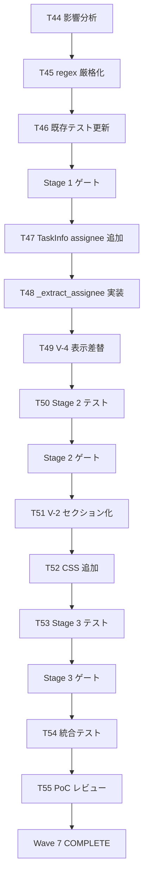

# b4-dashboard Wave 7 — tasks.md

- バージョン: 0.2.3
- 作成日: 2026-06-27
- 更新日: 2026-06-27（v0.2.3 = v0.2.2 + spec-critic 4 回目レビュー反映 / T56 追加 + Critical 3 + Warning 4 + Info 3 対処）
- ステータス: **Approved**（v0.2.3 PM 補追承認 2026-06-27 / spec-critic 4 回目盲点解消）
- 根拠文書:
  - `docs/specs/b4-dashboard/wave7/requirements.md` v0.2.1 Conditional Approved
  - `docs/specs/b4-dashboard/wave7/design.md` v0.2.1 Conditional Approved
- マイルストーン: B-5（Wave 7 / PoC 指摘パッケージ）
- 関連: `docs/artifacts/2026-06-27-magi-wave7-planning.md`（MAGI 合議 / Stage 構成根拠）

---

## §1 タスク分解方針

### 分割軸（SPIDR 適用）

- **S (Spike)**: 既存 V-2/V-4 ビューの実装読込 + 既存テスト影響分析（Stage 1 冒頭）
- **P (Paths)**: 正常系（厳格 regex マッチ + Assignee 抽出成功）/ 異常系（regex 不一致 / Assignee 未記入） / エッジ（メールアドレス @ 等）
- **I (Interfaces)**: TasksParser API（`parse()` の戻り値構造）/ DashboardBuilder API（ビュー生成メソッド）
- **D (Data)**: `TaskInfo.assignee` フィールド追加 / V-2 セクション分割
- **R (Rules)**: tasks.md フォーマット運用ルール（@<assignee> 記法）

### 粒度目安

- 1 タスク = 1 PR 想定（コミット粒度）
- 規模: S（〜30 行）/ M（〜100 行）/ L（〜200 行）
- L 超過想定タスクは分割を再検討

### 垂直分割の適用

- 水平（DB / parser / ビュー）ではなく **垂直**（FR-W7-1 → parser + テスト + ビュー期待値更新）で 1 Stage を貫通
- 各 Stage 末で **pytest 全件 PASS** + ship + push が可能な完結単位

---

## §2 タスク ID 採番基準

- 形式: `W7-B5-T<n>`（Wave 番号 7 / Milestone B-5 / Task 通番）
- Wave 6 の最終番号は T43 → Wave 7 は **T44 から開始**
- 検証タスクは `T-S<stage>-<n>` で別系列（例: `T-S1-1` = Stage 1 の検証 1）
- 短縮形（口語）: `T44` / `T-S1-1` 等

### TasksParser での扱い（#I-4 対応）

- `W7-B5-T<n>` 形式: 厳格 regex `(W\d+-[A-Z]\d+-T\d+|T\d+)` にマッチ → V-4 Task 一覧に表示される
- `T-S<stage>-<n>` 形式: 厳格 regex に **意図的にマッチしない**（先頭が `T-S` で 2 文字目が `-` のため `T\d+` パターン外） → V-4 には表示されず、本 tasks.md 内のチェックリスト管理に閉じる
- これは仕様であり、検証タスクが dashboard Task として誤って表示されないことを保証する

---

## §3 Stage 別タスク一覧

### Stage 1: TasksParser Task ID 抽出制約（FR-W7-1）

| Task ID | 内容 | 規模 | SPIDR 軸 | 担当層 |
|:-------|:-----|:----|:--------|:------|
| **W7-B5-T44** | 既存テスト構造変更の事前影響分析（impacted ファイル列挙 / 期待値更新リスト作成） | S | Spike | Sonnet (L2) |
| **W7-B5-T45** | TasksParser regex 厳格化（`^(W\d+-[A-Z]\d+-T\d+|T\d+):` 適用 + 単体テスト追加） | M | Interface + Paths | Sonnet (L2) |
| **W7-B5-T46** | 既存テスト期待値更新（`test_v4_view*.py` / `test_dashboard_integration*.py` / 誤抽出行削減反映 / pytest 事前確認追加）| M | Data | Sonnet (L2) |
| **W7-B5-T56** | TasksParser ディレクトリ走査再帰化（`specs_dir.glob("**/tasks.md")` + milestone 名を Task ID 逆引き / v0.2.3 補追 / spec-critic 4 回目 Critical 昇格対応）| M | Interface + Data | Sonnet (L2) |

#### Stage 1 検証タスク

- [ ] **T-S1-1**: pytest 全件 PASS（既存 + 新規 / NFR-W7-3）
- [ ] **T-S1-2**: 誤抽出行ゼロ化確認（AC-W7-1 / 全 Milestone の tasks.md で `W{n}-B{n}-T{n}` / `T{n}` のみ抽出）
- [ ] **T-S1-3**: L3 (Haiku) 採点 Green State（Critical 0 + Warning 0）
- [ ] **T-S1-4**: ディレクトリ再帰走査確認（T56 / `docs/specs/b4-dashboard/wave7/tasks.md` の Task ID 行が TasksParser に抽出されることを pytest で検証 / v0.2.3 追加）

#### Stage 1 ゲート条件

- AC-W7-1 達成
- T56 完了（T-S1-4 で Wave 7 tasks.md の §3.5 行が抽出されることを確認 / v0.2.3 追加）
- pytest 全件 PASS
- 既存テスト緩和は L1 事前承認済
- ship + push 完了

---

### Stage 2: Assignee タグ規約の実装（FR-W7-2 / FR-W7-3）

| Task ID | 内容 | 規模 | SPIDR 軸 | 担当層 |
|:-------|:-----|:----|:--------|:------|
| **W7-B5-T47** | `TaskInfo` dataclass に `assignee: str = "-"` フィールド追加 + 既存呼び出し全件互換確認 | S | Data | Sonnet (L2) |
| **W7-B5-T48** | TasksParser `_extract_assignee()` 実装（`\s+@([A-Za-z0-9_-]+)\s*$` regex / description クリーンアップ） | M | Interface + Paths | Sonnet (L2) |
| **W7-B5-T49** | V-4 ビューの Assignee 列を `TaskInfo.assignee` に差し替え + dashboard.html 再生成確認 | S | Interface | Sonnet (L2) |
| **W7-B5-T50** | Stage 2 自動テスト追加（`test_wave7_stage2_assignee.py` 新設 / 正常 / 異常 / エッジ計 ~8 件） | M | Paths | Sonnet (L2) |

#### Stage 2 検証タスク

- [ ] **T-S2-1**: pytest 全件 PASS（NFR-W7-3）
- [ ] **T-S2-2**: dashboard.html 上で `-` 以外の Assignee 値 ≥ 1 件表示確認（AC-W7-3）
- [ ] **T-S2-3**: `@` タグ未記入の既存 task 行が従来通り表示（AC-W7-8 / 後方互換）
- [ ] **T-S2-4**: L3 (Haiku) 採点 Green State

#### Stage 2 ゲート条件

- AC-W7-2 / AC-W7-3 / AC-W7-8 達成
- pytest 全件 PASS
- ship + push 完了

#### Stage 2 補助作業（tasks.md フォーマット運用）

Wave 7 以降に作成される **本ファイル含む** tasks.md には `@<assignee>` タグを SHOULD で記入する。
本 Wave 7 のタスク表に既に `担当層` 列を含めているが、tasks.md 内のチェックボックス行については
Stage 2 完了後に遡及記入する（MAY / 推奨）。

---

### Stage 3: 複数 Milestone 一覧化（FR-W7-4 / NFR-W7-1）

| Task ID | 内容 | 規模 | SPIDR 軸 | 担当層 |
|:-------|:-----|:----|:--------|:------|
| **W7-B5-T51** | DashboardBuilder.render_v2() を複数 Milestone セクション化（`.milestones-container` + `.milestone-card` HTML 構造 / `data-milestone` 属性付与 / **Milestone 名昇順ソート**: `sorted(self.data.milestones, key=lambda m: m.name)` 実装） | M | Interface + Data | Sonnet (L2) |
| **W7-B5-T52** | CSS 追加（`.milestones-container` / `.milestone-card` / `.milestone-card h3` / **追加前後の実測値報告必須**） | S | Rules | Sonnet (L2) |
| **W7-B5-T53** | Stage 3 自動テスト追加（`test_wave7_stage3_milestones.py` 新設 / 2 件以上の Milestone セクション存在 / `data-milestone` 属性確認 / **昇順ソート確認** / 計 ~10 件 / **テストフィクスチャはモック使用**: 実 SESSION_STATE.md に依存しない pytest fixture で複数 Milestone データを構築） + 既存 V-2 テスト期待値大幅更新（**L1 事前承認必須**） | L | Paths + Data | Sonnet (L2) |

#### Stage 3 検証タスク

- [ ] **T-S3-1**: pytest 全件 PASS（NFR-W7-3）
- [ ] **T-S3-2**: dashboard.html 上で 2 件以上の Milestone セクションが縦に並んで表示（AC-W7-4）
- [ ] **T-S3-3**: CSS 合計サイズ ≤ 10,240 bytes（AC-W7-5 / **超過時は design.md §8 縮退オプション適用**）
- [ ] **T-S3-4**: 手動確認 — dashboard.html を chrome-devtools-mcp 経由でロードし、**現在の SESSION_STATE.md に存在する Milestone 名昇順** で表示されることを確認（例: 現状実データなら `B-4` / `B-5` の 2 件 / 実機で 1 件のみの場合は T-S4-7 で SESSION_STATE.md に検証用 Task ID 行追加後に再確認）

> **Stage 3 ゲートの conditional pass 基準（v0.2.3 / spec-critic 4 回目 Critical 2 解消）**: 実 SESSION_STATE.md に Milestone が 1 件しか存在しない場合、Stage 3 ゲートは **Conditional Pass**（仕様としての V-2 複数 Milestone 表示構造は実装済 / AC-W7-4 の最終達成判定は T-S4-7 完了まで猶予）として通過させる。これは「仕様実装の正しさ」と「実データ表示」が分離可能であるための判断。
- [ ] **T-S3-5**: L3 (Haiku) 採点 Green State

#### Stage 3 ゲート条件

- AC-W7-4 / AC-W7-5 達成
- pytest 全件 PASS
- CSS 予算遵守（**design.md §8 事前評価 = 10,222 bytes 想定 / 実測値で確認**）
- 既存 V-2 テスト緩和は L1 事前承認済
- ship + push 完了

#### Stage 3 リスク管理

| リスク | 対応 |
|:------|:----|
| CSS 予算オーバー（残 18 bytes のみ） | T52 で実測 → 超過時は design.md §8 縮退オプション 3 件適用 → さらに無理なら Stage 内で意匠縮小判断（L1 承認） |
| V-2 既存テストの大幅破損 | T44 影響分析を Stage 1 で完了させ、Stage 3 着手前に期待値更新案を L1 が事前承認 |
| chrome-devtools-mcp `new_page` 直後の不安定動作 | Wave 6 Stage 2 観測 / `wait_for` 等の待機ステップを T-S3-4 で組み込む |

---

### Stage 4: 統合テスト + Lighthouse + PoC レビュー

| Task ID | 内容 | 規模 | SPIDR 軸 | 担当層 |
|:-------|:-----|:----|:--------|:------|
| **W7-B5-T54** | Stage 4 統合テスト新設（`test_wave7_stage4_integration.py` / 9 件想定: 静的 4 + MCP skip 5 / Wave 6 Stage 4 パターン踏襲） | M | Interface | Sonnet (L2) |
| **W7-B5-T55** | L1 Lighthouse 計測 + ユーザー PoC レビュー + Wave 7 final status: COMPLETE 判定 | M | — | L1 + human |

#### Stage 4 検証タスク

- [ ] **T-S4-1**: Lighthouse Accessibility ≥ 95（snapshot モード / AC-W7-6 / Wave 6 終端値 97 から退行ゼロ目標）
- [ ] **T-S4-2**: Lighthouse 全項目記録（Accessibility / Best Practices / SEO / Agentic Browsing）
- [ ] **T-S4-3**: pytest 全件 PASS（AC-W7-7）
- [ ] **T-S4-4**: CSS サイズ実測 ≤ 10,240 bytes（AC-W7-5 / Stage 3 で達成済の追認）
- [ ] **T-S4-5**: 統合テスト 9 件全 PASS or 明示 skip + reason 記録
- [ ] **T-S4-6**: L3 (Haiku) 採点 Green State
- [ ] **T-S4-7**: 手動確認 — dashboard.html を chrome-devtools-mcp 経由でロードし、複数 Milestone 表示 + Assignee 列の意味データ表示を視覚確認（スクショ記録）
- [ ] **T-S4-8**: ユーザー PoC レビュー — 起源 chip 3 件すべてが「解消」または「将来送り明示」（AC-W7-9）
- [ ] **T-S4-9**: Wave 7 final status: COMPLETE 宣言（SESSION_STATE.md 更新）

#### Stage 4 ゲート条件

- AC-W7-5〜9 達成
- 全自動テスト + 全手動確認 PASS
- ユーザー PoC レビュー Approved
- ship + push 完了
- retro 起動推奨

---

## §3.5 V-4 表示用チェックボックス行（Wave 7 パイロット運用 / v0.2.2 補追）

requirements.md §5 NFR-W7-5 / design.md §10.5 で確定したパイロット運用に従い、本 tasks.md の Stage 1〜4 実装タスク T44-T55 を新規格 Task ID 行で記述する。表形式（§3）と並存。

### Wave 7 実装タスク（V-4 表示対象）

- [x] W7-B5-T44: 既存テスト構造変更影響分析 @sonnet
- [x] W7-B5-T45: TasksParser regex 厳格化（regex + 単体テスト 4 件） @sonnet
- [x] W7-B5-T46: 既存テスト期待値更新 + fixture 統一 + L508 仕様調整 @sonnet
- [x] W7-B5-T47: TaskInfo.assignee フィールド追加 @sonnet
- [x] W7-B5-T48: TasksParser _extract_assignee() 実装 @sonnet
- [x] W7-B5-T49: V-4 Assignee 列差替 @sonnet
- [x] W7-B5-T50: Stage 2 自動テスト追加 @sonnet
- [ ] W7-B5-T51: V-2 セクション化（Milestone 名昇順ソート） @sonnet
- [ ] W7-B5-T52: CSS 追加（実測必須） @sonnet
- [ ] W7-B5-T53: Stage 3 自動テスト追加（モックフィクスチャ） @sonnet
- [ ] W7-B5-T54: Stage 4 統合テスト @sonnet
- [ ] W7-B5-T55: L1 Lighthouse 計測 + ユーザー PoC レビュー @human

### Wave 7 検証タスク（V-4 抽出対象外 / 太字記法維持）

検証タスク T-S1-1 〜 T-S4-9 は §3 内の太字記法（`- [ ] **T-S<stage>-<n>**: ...`）で記述済。これらは TasksParser の厳格 regex で抽出されないため、V-4 には表示されない（design.md §2 維持）。

### 補追注記

- 表形式（§3）の T44-T55 + T56 は計画ドキュメントとしての位置付け（人間可読 / WBS 100% Rule 適用先）
- 本 §3.5 のチェックボックス形式は V-4 dashboard 表示用（TasksParser 抽出対象）
- T44 / T45 が `[x]` 状態なのは Wave 7 Stage 1 着手時の MAGI 反映時点で完了済（2026-06-27）
- 完了状態の更新は本 §3.5 で実施（§3 の表は計画スナップショット）

### §3 表 と §3.5 チェックボックス行の同期ルール（v0.2.3 / spec-critic 4 回目 Warning 4 解消）

| 対象 | 更新タイミング | 更新者 |
|:-----|:------------|:------|
| §3 表（計画スナップショット） | 各 Stage 完了 retro 時 / バージョン bump 時 | L1 |
| §3.5 チェックボックス（V-4 表示用 / `[ ]` → `[x]`） | 各 Task 完了 commit 時 | L2（自己更新）or L1（委譲ガード） |
| §3.5 の `@<assignee>` タグ | 委譲時に L1 が記入 / 変更時のみ修正 | L1 |

L2 が Task 完了報告時、§3 表の「担当層」記述は **更新不要**（計画スナップショット維持）。§3.5 の `[ ]` → `[x]` 更新は L2 の責務。

### T55 `@human` 表記の補足（v0.2.3 / spec-critic 4 回目 Info 1 解消）

§3 表では「L1 + human」と記述されているが、§3.5 では `@human` のみ。これは TasksParser が `@<assignee>` 1 件のみを抽出するため、L1 関与は別途 §3 表で記録する仕様（補完関係 / 矛盾ではない）。

---

## §4 依存関係図



---

## §5 WBS 100% Rule — 要件⇔タスク対応表

### FR（機能要件）対応

| FR | 実装タスク | 検証タスク（T-S*） |
|:---|:---------|:-----------------|
| FR-W7-1 | T44, T45, T46 | T-S1-1, T-S1-2, T-S1-3 |
| FR-W7-2 | T47, T48, T50 | T-S2-1, T-S2-4 |
| FR-W7-3 | T47, T49, T50 | T-S2-1, T-S2-2, T-S2-4 |
| FR-W7-4 | T51, T52, T53 | T-S3-1, T-S3-2, T-S3-4, T-S3-5 |

### NFR（非機能要件）対応

| NFR | 実装タスク | 検証タスク（T-S*） |
|:----|:---------|:-----------------|
| NFR-W7-1（CSS 予算） | T52 | T-S3-3, T-S4-4 |
| NFR-W7-2（Lighthouse ≥ 95） | — | T-S4-1, T-S4-2 |
| NFR-W7-3（pytest 全件 PASS） | T46, T50, T53, T54 | T-S1-1, T-S2-1, T-S3-1, T-S4-3 |
| NFR-W7-4（後方互換） | T46, T47 | T-S2-3 |

### AC（受入条件）対応

| AC | 実装タスク | 検証タスク（T-S*） |
|:---|:---------|:-----------------|
| AC-W7-1 | T45 | T-S1-2 |
| AC-W7-2 | T48, T50 | T-S2-1 |
| AC-W7-3 | T49, T50 | T-S2-2 |
| AC-W7-4 | T51, T53 | T-S3-2, T-S3-4 |
| AC-W7-5 | T52 | T-S3-3, T-S4-4 |
| AC-W7-6 | — | T-S4-1 |
| AC-W7-7 | — | T-S4-3 |
| AC-W7-8 | T46, T47 | T-S2-3 |
| AC-W7-9 | — | T-S4-7, T-S4-8 |

### T-S* 検証タスク 21 件の WBS 充足確認（#W-4 対応）

| T-S* タスク | 担う要件 | カバー範囲 |
|:----------|:--------|:----------|
| T-S1-1 | NFR-W7-3 | Stage 1 pytest 全件 PASS |
| T-S1-2 | AC-W7-1 / FR-W7-1 | 誤抽出ゼロ化確認 |
| T-S1-3 | — | L3 採点 Green State（プロセスゲート） |
| T-S2-1 | NFR-W7-3 | Stage 2 pytest 全件 PASS |
| T-S2-2 | AC-W7-3 | V-4 意味値表示確認 |
| T-S2-3 | NFR-W7-4 / AC-W7-8 | 後方互換確認 |
| T-S2-4 | — | L3 採点 Green State（プロセスゲート） |
| T-S3-1 | NFR-W7-3 | Stage 3 pytest 全件 PASS |
| T-S3-2 | AC-W7-4 | 複数 Milestone セクション存在確認 |
| T-S3-3 | AC-W7-5 / NFR-W7-1 | CSS サイズ実測確認 |
| T-S3-4 | AC-W7-4 / FR-W7-4 | Milestone 順序手動確認 |
| T-S3-5 | — | L3 採点 Green State（プロセスゲート） |
| T-S4-1 | AC-W7-6 / NFR-W7-2 | Lighthouse Accessibility 計測 |
| T-S4-2 | NFR-W7-2 MAY 項目 | Lighthouse 全項目記録 |
| T-S4-3 | AC-W7-7 / NFR-W7-3 | pytest 全件最終確認 |
| T-S4-4 | AC-W7-5 / NFR-W7-1 | CSS サイズ最終確認 |
| T-S4-5 | — | 統合テスト全 PASS（プロセスゲート） |
| T-S4-6 | — | L3 採点 Green State（プロセスゲート） |
| T-S4-7 | AC-W7-9 | 手動確認スクショ記録 |
| T-S4-8 | AC-W7-9 | ユーザー PoC レビュー |
| T-S4-9 | — | Wave 7 final status 宣言（プロセスゲート） |

→ **全 21 件が要件対応またはプロセスゲートとして位置付け済 / 孤児なし**

### 既存要件（FR-1〜FR-11 / NFR-1〜NFR-6 / AC-1〜AC-8）対応

- 既存挙動維持（後方互換 NFR-W7-4 経由）
- Wave 6 終端時点の挙動を退行させない（pytest 全件 PASS で担保）

→ 100% Rule 達成（要件すべてにタスクが対応 / 孤児タスクなし）

---

## §6 各タスクの完了条件と検証方法（詳細）

### T44: 既存テスト構造変更影響分析

- 完了条件: impacted ファイル一覧 + 期待値更新箇所の暫定リスト作成
- **成果物パス（#W-3 対応）**: `docs/artifacts/wave7-stage1-impact-analysis.md` を新規作成（git 管理 / Stage 3 完了まで参照される）。L1 リレー検証時にも参照可能とする。
- 検証: Stage 1 内で T45/T46 が成果物パスを参照して進められること（成果物存在チェック + 内容妥当性 L1 確認）
- 規模: S（〜30 行のドキュメント）

### T45: TasksParser regex 厳格化

- 完了条件:
  - `TASK_ID_REGEX` 定数を厳格 regex に更新（design.md §6）
  - 単体テスト 4 ケース追加（正常 W{n}-B{n}-T{n} / 正常 T{n} / 異常 説明文 / 異常 不正形式）
- 検証: pytest で対応テストが全 PASS
- 規模: M（~80 行）

### T46: 既存テスト期待値更新（v0.2.3 改訂 / spec-critic 4 回目 Warning 3 解消）

- 完了条件:
  - **T46 着手前に pytest 全件実行 → `test_parse_real_specs_directory_returns_at_least_one_task` の PASS/FAIL を確認**（T56 完了後は PASS、未完了なら FAIL 想定）
  - T56 完了前: `test_parse_real_specs_directory_returns_at_least_one_task` に `pytest.skip("T56 ディレクトリ再帰走査完了まで保留")` を付与（書き換えではなく skip + reason 記録）
  - T56 完了後: 当該テストが PASS することを確認（skip 解除可）
  - `test_parse_checkbox_regex_matches_correct_pattern` (L275): fixture を `W1-B5-T1:` 等の正規形式に統一（L1 事前承認済 / T44 質問 1 対応）
  - `test_v4_view*.py` の影響テスト件数の期待値を実測値に合わせる
  - `test_dashboard_integration*.py` 同上
- 検証: pytest 全件 PASS
- 規模: M（〜100 行 / 複数ファイル変更）

### T56: TasksParser ディレクトリ走査再帰化（v0.2.3 追加 / spec-critic 4 回目 Critical 昇格対応）

- 完了条件:
  - `.claude/scripts/dashboard/parsers/tasks.py` の `_do_parse()` 走査ロジックを `specs_dir.glob("**/tasks.md")` 再帰走査に変更
  - `_extract_tasks()` で milestone_name を Task ID から逆引き（Task ID `W{n}-B{n}-T{n}` の `B{n}` 部分を `B-{n}` 形式に変換）
  - Task ID `T{n}` 単独形式の場合は milestone = ファイルパス最も近い親ディレクトリ名（fallback）
  - 既存 `docs/specs/b4-dashboard/tasks.md` / `goal-driven-orchestration/tasks.md` の走査挙動は維持（後方互換 / NFR-W7-4）
  - 単体テスト追加（`test_recursive_walk_includes_subdir_tasks` / `test_milestone_name_extracted_from_task_id` 等 ~3 件）
- 検証: pytest 全件 PASS + Wave 7 tasks.md §3.5 の Task ID 行が `data.tasks` に含まれること（`assert any(t.id == "W7-B5-T44" for t in tasks)` 等）
- 規模: M（〜80 行 / `_do_parse()` + `_extract_tasks()` + テスト追加）
- 根拠: spec-critic 4 回目「見えない前提」Critical 昇格指摘（design.md §6 「実装の追加要件」+ §13 v0.2.3 補追承認記録）

### T47: TaskInfo `assignee` フィールド追加

- 完了条件: dataclass にデフォルト値 `"-"` で追加 / 既存 TaskInfo 利用箇所すべて互換
- 検証: pytest 全件 PASS（既存テスト退行なし）
- 規模: S

### T48: `_extract_assignee()` 実装

- 完了条件: design.md §7 のコード例通り実装 / 単体テスト追加（正常マッチ / 未マッチ / 末尾空白 / 複数 @ で最後の 1 個のみ採用）
- 検証: pytest 対応テスト全 PASS
- 規模: M

### T49: V-4 Assignee 列差替

- 完了条件: `render_v4()` 内の cell 値を `TaskInfo.assignee` に変更 / dashboard.html 再生成して 1 件以上の意味値表示
- 検証: 目視 + dashboard.html grep
- 規模: S

### T50: Stage 2 自動テスト

- 完了条件: `test_wave7_stage2_assignee.py` 新設 / 正常 / 異常 / エッジ計 ~8 件
- 検証: pytest 全 PASS
- 規模: M

### T51: V-2 セクション化

- 完了条件:
  - design.md §8 の HTML 構造通り `.milestones-container` + `.milestone-card` を出力
  - `data-milestone` 属性付与
  - **Milestone 名昇順ソート実装**: `sorted(self.data.milestones, key=lambda m: m.name)` で並べる
- 検証: dashboard.html 上で全 `.milestone-card` が Milestone 名昇順で出現
- 規模: M（~80-100 行）

### T52: CSS 追加（実測必須）

- 完了条件:
  - design.md §8 の 3 ルール追加（合計 ~300 bytes 推定）
  - **追加前後の CSS 合計サイズを実測 → L1 報告**
  - 上限 10,240 bytes 内
- 検証: ファイルサイズ計測（`wc -c` 等）
- 規模: S

### T53: Stage 3 自動テスト

- 完了条件:
  - `test_wave7_stage3_milestones.py` 新設 / ~10 件
  - **テストフィクスチャはモック使用**: 実 SESSION_STATE.md（gitignore 対象 / 再現性なし）に依存せず、pytest fixture で `DashboardData` を構築（複数 `MilestoneInfo` を含むモックデータ）。テストの再現性を CI 環境含めて保証する
  - 昇順ソート確認テスト含む（T51 の実装が機能していること / 文字列辞書順を期待値とする）
  - 既存 V-2 テスト期待値の大幅更新（**L1 事前承認必須**）
- 検証: pytest 全件 PASS（モック環境）
- 規模: L（~150-200 行）

**フィクスチャ実装の具体例（#NW-1 残存対応）**:

```python
import pytest
from dashboard.models import DashboardData, MilestoneInfo, WaveInfo
from dashboard.builder import DashboardBuilder


@pytest.fixture
def multi_milestone_data():
    """複数 Milestone を含む DashboardData モック。"""
    return DashboardData(
        current_phase="PLANNING",
        milestones=[
            # 出現順 B-5 → B-4 を意図的に与え、render_v2 内のソートが
            # 機能していることを検証可能にする
            MilestoneInfo(name="B-5", current_step="UNKNOWN", status="in-progress"),
            MilestoneInfo(name="B-4", current_step="UNKNOWN", status="in-progress"),
        ],
        waves=[],
        tasks=[],
        # その他必須フィールドはダミー値で OK（V-2 レンダリングに使われない）
    )


def test_v2_renders_milestones_in_alphabetical_order(multi_milestone_data):
    """V-2 で Milestone が名前昇順（文字列辞書順）で並ぶこと。"""
    builder = DashboardBuilder(data=multi_milestone_data)
    html = builder._render_v2_milestones()
    # B-4 が B-5 より先に出現する
    assert html.index('data-milestone="B-4"') < html.index('data-milestone="B-5"')


def test_v2_renders_step_common_to_all_milestones(multi_milestone_data):
    """Step 列が全 Milestone で current_phase に統一されること。"""
    builder = DashboardBuilder(data=multi_milestone_data)
    html = builder._render_v2_milestones()
    # 各 milestone-card に PLANNING が含まれる
    assert html.count('PLANNING') >= 2
```

**呼び出し方式**: `DashboardBuilder(data=mock_data)._render_v2_milestones()` を直接呼ぶ（`build()` 全体を呼ばずに V-2 部分だけ検証）。
**必須フィールド**: `MilestoneInfo(name=..., current_step=..., status=...)` の 3 フィールドはダミー値で OK（`current_step` は DashboardBuilder 側で `self.data.current_phase` に上書きされるため）。

L2 はこの fixture を起点に bug-finding / 異常系テストを追加する。

### T54: Stage 4 統合テスト

- 完了条件: `test_wave7_stage4_integration.py` 新設 / 9 件想定（静的 4 + MCP skip 5）
- 検証: pytest 全 PASS or 明示 skip + reason
- 規模: M

### T55: L1 Lighthouse + PoC レビュー

- 完了条件:
  - L1 が chrome-devtools-mcp で Lighthouse 計測（snapshot モード）
  - ユーザー PoC レビュー実施 + Approved
  - SESSION_STATE.md に Wave 7 COMPLETE 記録
- 検証: スクショ + 結果記録
- 規模: M（人手・記録中心）

---

## §7 Stage 委譲時の必須プロセス

各 Stage を L2 (tdd-developer / Sonnet) に委譲する際、prompt 冒頭に以下を必ず挿入する:

```
## 委譲ガードレール（事前合意）

実装着手前に以下 4 点を必ず確認してください:

1. **Bash 制限前提**: 権限のない Bash コマンドは試行せず、L1 に依頼する
2. **緩和事前承認必須**: 既存テスト・規約からの緩和は実施前に L1 へ承認依頼
3. **JS 行数計測法明示**: 実装行 / コメント行 / 空行 / 合計 の 4 区分で計測
4. **既存テスト影響事前分析**: 改修対象の波及範囲を事前に列挙し、破損予測を共有

完了報告時は上記 4 点の遵守状況を明示してください。
```

根拠: [knowledge/l2-delegation-guardrails.md](../../../artifacts/knowledge/l2-delegation-guardrails.md)（Wave 6 Stage 3 で実証 / 報告乖離 50% → 5%）

---

## §8 改訂履歴

| バージョン | 日付 | 変更内容 |
|:----------|:-----|:--------|
| 0.1.0 | 2026-06-27 | 初版起稿 — Wave 7 requirements.md + design.md（共に v0.1.0 Approved）に基づくタスク分解 |
| 0.2.0 | 2026-06-27 | spec-critic 独立レビュー指摘の反映 — §2 T-S* TasksParser 非対象明記 (#I-4) / §5 WBS 表に検証タスク列追加 + T-S* 21 件充足確認 (#W-4) / §6 T44 成果物パス明記 (#W-3) / 3 文書セット PM 一括承認方針 (#C-4) |
| 0.2.0+1 | 2026-06-27 | spec-critic 再レビュー（v0.2.0 → B 評価）指摘のインライン補記 — T51 / T53 タスク表 + §6 詳細に Milestone 名昇順ソート実装 (#NW-2) / T53 テストフィクスチャをモック方式に明記 (#NW-1) / T-S3-4 B-3 表記修正（実 SESSION_STATE の Milestone 名昇順）(#NW-3) / §10 参照を v0.2.0 に更新 |
| **0.2.1** | 2026-06-27 | spec-critic 再々レビュー（v0.2.0+1 → B 維持）指摘の追加補記 + バージョン正式 bump — T53 §6 に pytest fixture + テスト例の具体コード追加（**#NW-1 完全解消**）/ ソート方式は design.md §3 A3-4 で文字列辞書順を確定（連動）/ §10 参照を v0.2.1 に更新 |
| **0.2.2** | 2026-06-27 | Wave 7 Stage 1 BUILDING 着手時の構造的乖離発覚に対する MAGI 合議結果反映 — §3.5（新規）V-4 表示用チェックボックス行追加（T44-T55 / @sonnet タグ付き）/ §9 に v0.2.2 PM 補追承認記録 / requirements.md NFR-W7-5 + design.md §6 補足 + §10.5 と連動 / 根拠議事録: `2026-06-27-magi-wave7-stage1-pivot.md` |
| **0.2.3** | 2026-06-27 | spec-critic 4 回目レビュー（v0.2.2 補追の独立レビュー）指摘の反映 — §3 Stage 1 表に T56 追加（ディレクトリ走査再帰化 / Critical 昇格対応）/ T-S1-4 検証タスク追加 / Stage 1 ゲート条件に T56 完了明示 / T-S3-4 conditional pass 基準明示（Critical 2 解消）/ §3.5 補追注記に §3/§3.5 同期ルール（Warning 4）+ T55 @human 表記補足（Info 1）/ §6 T46 を pytest 事前確認 + skip 方式に改訂（Warning 3 解消）/ §6 T56 詳細追加 / §9 v0.2.3 PM 補追承認記録 / requirements.md NFR-W7-5 MUST 昇格 + design.md §6 実装の追加要件 + §10.5 4 条件依存チェーン + §8 縮退オプション権限等級表と連動 |

---

## §9 PM 承認記録

### 2026-06-27: v0.2.2 PM 補追承認（Wave 7 Stage 1 MAGI Pivot 反映）

Wave 7 Stage 1 BUILDING 着手時に T45 実装後の pytest 検証で発覚した「design.md §6 新 regex 仕様と実 tasks.md 運用の構造的乖離」に対し、MAGI 合議（[2026-06-27-magi-wave7-stage1-pivot.md](../../../artifacts/2026-06-27-magi-wave7-stage1-pivot.md)）で確定した A 案（スコープ縮小）+ Wave 7 tasks.md パイロット運用方針を本書に補追。具体的な追加内容:

- §3.5（新規）V-4 表示用チェックボックス行（T44-T55 / @sonnet タグ付き）
- ステータスを v0.2.2 Approved（PM 補追承認）に更新

requirements.md / design.md にも v0.2.2 で連動補追。

### 2026-06-27: v0.2.3 PM 補追承認（spec-critic 4 回目レビュー反映）

v0.2.2 補追を spec-critic 4 回目に独立レビューさせた結果、Critical 3 件（うち 1 件は L1 実機確認で昇格）+ Warning 4 件 + Info 3 件の指摘を受領。本タスク文書への補追:

- §3 Stage 1 表に T56 新規追加（TasksParser ディレクトリ走査再帰化 / Critical 昇格対応）
- T-S1-4 検証タスク追加 + Stage 1 ゲート条件に T56 完了明示
- T-S3-4 に Stage 3 conditional pass 基準明示（Critical 2 解消）
- §3.5 補追注記に §3 / §3.5 同期ルール（Warning 4）+ T55 `@human` 表記補足（Info 1）
- §6 T46 を pytest 事前確認 + skip 方式に改訂（Warning 3 解消）
- §6 T56 詳細を新規追加（完了条件 / 検証 / 規模 M）
- ステータスを v0.2.3 Approved（PM 補追承認）に更新

requirements.md / design.md にも v0.2.3 で連動補追。詳細指摘マッピングは design.md §13 v0.2.3 補追承認記録参照。

### 2026-06-27: 3 文書セット v0.2.1 PM 最終承認

ユーザー（PM）が requirements.md v0.2.1 + design.md v0.2.1 + tasks.md v0.2.1 の 3 文書セットを一括承認。
BUILDING フェーズ遷移可。Stage 1（T44 影響分析）から着手。
L2 委譲時には [knowledge/l2-delegation-guardrails.md](../../../artifacts/knowledge/l2-delegation-guardrails.md) の 4 点を prompt 冒頭に挿入する。

### 2026-06-27: spec-critic 独立レビュー結果（v0.2.0 改訂 / 3 文書セット PM 最終承認待ち）

spec-critic から Critical 4 件 / Warning 6 件 / Info 4 件 / 総合 C 評価の指摘を受領。
本タスク文書への反映項目:

- #C-4（承認ステータス不整合）→ 3 文書セット PM 一括承認方針に統一。tasks.md は Draft のまま、requirements + design + tasks の v0.2.0 セットを PM に最終承認依頼
- #W-3（T44 成果物パス）→ §6 T44 に成果物パス（`docs/artifacts/wave7-stage1-impact-analysis.md`）明記
- #W-4（T-S* WBS 対応欄欠落）→ §5 WBS 表を「実装タスク / 検証タスク（T-S*）」列分割に変更 + T-S* 21 件の充足確認テーブル追加
- #I-2（[<box>] 表記）→ requirements.md AC-W7-2 で対応済（連動修正不要）
- #I-4（T-S* の TasksParser 非対象）→ §2 にタスク ID 体系の TasksParser 扱いを明記

requirements.md + design.md と本 tasks.md の v0.2.0 セットを PM 承認待ち。

### PM 最終承認待ち（3 文書セット）

承認時の確認項目:
- [ ] requirements.md v0.2.0 の FR/NFR/AC を承認
- [ ] design.md v0.2.0 の §6〜§9 設計を承認
- [ ] tasks.md v0.2.0 の T44〜T55 + T-S* タスク分解を承認
- [ ] 承認後 → BUILDING フェーズ遷移可

---

## §10 参照

- [Wave 7 requirements.md](requirements.md) v0.2.1 Conditional Approved
- [Wave 7 design.md](design.md) v0.2.1 Conditional Approved
- [MAGI 議事録 2026-06-27](../../../artifacts/2026-06-27-magi-wave7-planning.md)
- [retro Wave 6](../../../artifacts/retro-W6-B5-2026-06-27.md)
- [L2 委譲ガードレール](../../../artifacts/knowledge/l2-delegation-guardrails.md)
- [元 design.md §5 Assignee タグ規約](../design.md#assignee-タグ規約wave-7-追加--rfc-2119-should)
