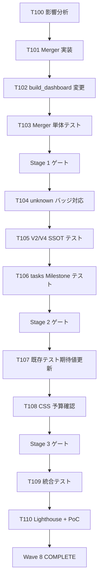

# b4-dashboard Wave 8 — tasks.md

- バージョン: 0.3.1
- 作成日: 2026-06-29
- 更新日: 2026-06-29（v0.3.1 = v0.3.0 + R4 軽微修正 / Warning 1 + Info 2 解消）
- ステータス: Draft（spec-critic R2 残存指摘全件解消済 / PM 承認待ち）
- 根拠文書:
  - `docs/specs/b4-dashboard/wave8/requirements.md` v0.2.3 Draft
  - `docs/specs/b4-dashboard/wave8/design.md` v0.2.3 Draft
- マイルストーン: B-5（Wave 8 / Milestone フィルタ仕様乖離解決 / chip task_68008f88 対応）
- 関連:
  - 起源 chip: `task_68008f88`（Milestone フィルタ仕様乖離）
  - 関連 retro: `docs/artifacts/retro-W7-B5-2026-06-28.md`（Wave 7 retro / 引き継ぎ事項）
  - MAGI 合議: `docs/artifacts/2026-06-28-magi-wave8-planning.md`（Wave 8 設計方針確定 / 案 5 採用）

---

## §1 タスク分解方針

### 分割軸（SPIDR 適用）

- **S (Spike)**: 既存 SessionStateParser + TasksParser の出力構造読込 + Merger 追加による既存テスト影響分析（Stage 1 冒頭）
- **P (Paths)**: 正常系（SessionState と tasks.md の両データソース統合 / Milestone 重複排除・昇順ソート）/ 異常系（SessionState 取得失敗 / tasks.md 走査失敗 / 片方のデータソース欠如）/ エッジ（両方空 / 大量 Milestone）
- **I (Interfaces)**: MilestoneProvider Protocol 定義 / MilestoneSourceMerger 実装 / build_dashboard.py のオーケストレータ変更 / DashboardBuilder への Merger 結果注入
- **D (Data)**: MilestoneInfo モデル拡張（status="unknown" 補完）/ DashboardData.milestones の Merger 確定済みリスト化 / "unknown" バッジ表示データ（CSS + _STATUS_LABELS）
- **R (Rules)**: パーサ独立性原則の維持（Merger は上位集約レイヤ） / 既存 4 パーサ無改変の厳格遵守 / Merger の read-only 集約専用設計

### 粒度目安

- 1 タスク = 1 PR 想定（コミット粒度）
- 規模: S（〜30 行）/ M（〜100 行）/ L（〜200 行）
- L 超過想定タスクは分割を再検討

### 垂直分割の適用

- 水平（データ層 / 集約層 / ビュー層）ではなく **垂直**（FR-W8-1/2/3 → Merger 実装 + テスト + Builder 確認）で全層を貫通
- 各 Stage 末で **pytest 全件 PASS** + ship + push が可能な完結単位

---

## §2 タスク ID 採番基準

- 形式: `W8-B5-T<n>`（Wave 番号 8 / Milestone B-5 / Task 通番）
- Wave 7 の最終番号は T56 → Wave 8 は **T100 から開始**（衝突回避）
- 検証タスクは `T-S<stage>-<n>` で別系列（例: `T-S1-1` = Stage 1 の検証 1）
- 短縮形（口語）: `T100` / `T-S1-1` 等

### TasksParser での扱い（Wave 7 §2 踏襲）

- `W8-B5-T<n>` 形式: 厳格 regex `(W\d+-[A-Z]\d+-T\d+|T\d+)` にマッチ → V-4 Task 一覧に表示される
- `T-S<stage>-<n>` 形式: 厳格 regex に **意図的にマッチしない**（先頭が `T-S` で 2 文字目が `-` のため `T\d+` パターン外） → V-4 には表示されず、本 tasks.md 内のチェックリスト管理に閉じる

---

## §3 Stage 別タスク一覧

### Stage 1: MilestoneSourceMerger 実装（FR-W8-1 / FR-W8-5）

| Task ID | 内容 | 規模 | SPIDR 軸 | 担当層 |
|:-------|:-----|:----|:--------|:------|
| **W8-B5-T100** | 既存テスト構造の事前影響分析（Merger 追加による破損予測 / test_build_dashboard.py 内の `data.milestones` 検証部を特定） | S | Spike | Sonnet (L2) |
| **W8-B5-T101** | `merger.py` 新規作成 + `MilestoneProvider` Protocol + `MilestoneSourceMerger` クラス実装（design.md §4 仕様通り / constructor 注入版） | M | Interface + Data | Sonnet (L2) |
| **W8-B5-T102** | `build_dashboard.py` オーケストレータ変更（パーサループ後に Merger を呼び出し / `data.milestones` 上書き） | S | Interface | Sonnet (L2) |
| **W8-B5-T103** | Stage 1 単体テスト新設（`test_wave8_merger.py` / 集合演算・重複排除・status 補完・エラー耐障害性 / ~10 件想定） | M | Paths | Sonnet (L2) |

#### Stage 1 検証タスク

- [ ] **T-S1-1**: pytest 全件 PASS（既存 + 新規 / NFR-W8-2）
- [ ] **T-S1-2**: MilestoneProvider Protocol 実装確認（型ヒント明示 / design.md §10 達成条件 確認）
- [ ] **T-S1-3**: Merger ロジック動作確認 + **NFR-W8-1 MUST 保証** (AC-W8-1 / 和集合・昇順ソート・status 補完の全シナリオ + T103 の `assert elapsed < 1.0` PASS 確認 = 30 件以上 Milestone で 1 秒以内)
- [ ] **T-S1-4**: L3 (Haiku) 採点 Green State（Critical 0 + Warning 0）

#### Stage 1 ゲート条件

- AC-W8-1 達成（Merger の集合演算動作）
- AC-W8-4 達成（既存 4 パーサ無改変確認）
- pytest 全件 PASS
- 既存テスト緩和は L1 事前承認済
- ship + push 完了

---

### Stage 2: Builder への Merger 結果注入（FR-W8-2 / FR-W8-3 / FR-W8-N2）

| Task ID | 内容 | 規模 | SPIDR 軸 | 担当層 |
|:-------|:-----|:----|:--------|:------|
| **W8-B5-T104** | `DashboardBuilder` に "unknown" status バッジ対応を追加（`_STATUS_LABELS["unknown"] = "不明"` + inline CSS `.badge[data-status="unknown"]`） | S | Data + Rules | Sonnet (L2) |
| **W8-B5-T105** | V-2 / V-4 データソース一致確認テスト新設（`test_wave8_v2_v4_ssot_alignment.py` / `data.milestones` が両ビューで統一されていることを検証） | M | Interface + Paths | Sonnet (L2) |
| **W8-B5-T106** | tasks.md 由来 Milestone 反映確認テスト新設（`test_wave8_tasks_milestone_integration.py` / フィクスチャ含む） | M | Data + Paths | Sonnet (L2) |

#### Stage 2 検証タスク

- [ ] **T-S2-1**: pytest 全件 PASS（既存 + 新規 / NFR-W8-2）
- [ ] **T-S2-2**: V-2 と V-4 フィルタの Milestone 集合が一致（AC-W8-2）
- [ ] **T-S2-3**: tasks.md 由来の Milestone が dashboard に表示（AC-W8-3 / 単体 + 統合両方確認）
- [ ] **T-S2-4**: "unknown" バッジ表示確認（AC-W8-N1 / CSS + `_STATUS_LABELS` 実装確認）
- [ ] **T-S2-5**: L3 (Haiku) 採点 Green State

#### Stage 2 ゲート条件

- AC-W8-2 / AC-W8-3 / AC-W8-N1 達成
- pytest 全件 PASS
- 既存テスト緩和は L1 事前承認済（W-W8-R2-2 対応）
- ship + push 完了

---

### Stage 3: 既存テスト期待値更新（NFR-W8-2）

| Task ID | 内容 | 規模 | SPIDR 軸 | 担当層 |
|:-------|:-----|:----|:--------|:------|
| **W8-B5-T107** | 既存テスト期待値の大幅更新（`test_build_dashboard.py` + V-2/V-4 関連テストで `data.milestones` 順序・内容を Merger 結果に対応 / L1 事前承認必須） | L | Data | Sonnet (L2) |
| **W8-B5-T108** | CSS 予算確認（Wave 8 実装による CSS 追加が Wave 7 終端値 10,400 bytes からどの程度増加するか実測 / NFR-W8-4 SHOULD 準拠） | S | Rules | Sonnet (L2) |

#### Stage 3 検証タスク

- [ ] **T-S3-1**: pytest 全件 PASS（期待値更新反映 / NFR-W8-2）
- [ ] **T-S3-2**: CSS 合計サイズ ≤ 16,384 bytes（NFR-W8-4 / AC-W8-5 のマイナス側確認）
- [ ] **T-S3-3**: L3 (Haiku) 採点 Green State

#### Stage 3 ゲート条件

- AC-W8-5 達成（CSS 予算維持）
- pytest 全件 PASS（既存 398 + Wave 8 新規分）
- 既存テスト緩和は L1 事前承認済（W-W8-R2-2 対応）
- ship + push 完了

#### Stage 3 リスク管理

| リスク | 対応 |
|:------|:----|
| 既存テスト 398 件の期待値大幅変更（T107 規模 L） | T100 影響分析を Stage 1 で完了させ、T107 着手前に L1 が期待値変更箇所の事前承認を完了する（W-W8-1 対応） |
| CSS 予算オーバー（Wave 7 終端値 10,400 bytes から増加分が大きい場合） | T108 で実測 → 上限 16,384 bytes を超過する場合は retro で予算改定議題として扱う |

---

### Stage 4: 統合テスト + Lighthouse + ユーザー確認

| Task ID | 内容 | 規模 | SPIDR 軸 | 担当層 |
|:-------|:-----|:----|:--------|:------|
| **W8-B5-T109** | Stage 4 統合テスト新設（`test_wave8_stage4_integration.py` / 9 件想定: 静的 5 + MCP skip 4 / Wave 7 Stage 4 パターン踏襲） | M | Interface | Sonnet (L2) |
| **W8-B5-T110** | L1 Lighthouse 計測 + エラー耐障害性確認 + ユーザー仕様確認 + Wave 8 final status: COMPLETE 判定 | M | — | L1 + human |

#### Stage 4 検証タスク

- [ ] **T-S4-1**: pytest 全件 PASS（AC-W8-5 / 統合テスト含む）
- [ ] **T-S4-2**: Lighthouse Accessibility ≥ 95（AC-W8-6 / Wave 7 終端値 97 から退行ゼロ目標）
- [ ] **T-S4-3**: エラー耐障害性確認（AC-W8-7 / parser ok=False ケースで Merger が継続動作）
- [ ] **T-S4-4**: 手動確認 — dashboard.html を chrome-devtools-mcp 経由でロードし、V-2 Milestone 一覧と V-4 フィルタ選択肢が完全に一致することを視覚確認
- [ ] **T-S4-5**: chip task_68008f88 解消確認（AC-W8-2 / 仕様乖離が正式に解決）
- [ ] **T-S4-6**: L3 (Haiku) 採点 Green State
- [ ] **T-S4-7**: Wave 8 final status: COMPLETE 宣言（SESSION_STATE.md 更新）

#### Stage 4 ゲート条件

- AC-W8-1〜7 + AC-W8-N1 達成
- 全自動テスト + 全手動確認 PASS
- 既存テスト緩和は L1 事前承認済（W-W8-R2-2 対応）
- ユーザー 仕様確認 Approved
- ship + push 完了
- retro 起動推奨

---

## §3.5 V-4 表示用チェックボックス行（Wave 8 パイロット運用 / Wave 7 踏襲）

requirements.md §5 / design.md §10 で確定した パイロット運用に従い、本 tasks.md の Stage 1〜4 実装タスク T100-T110 を新規格 Task ID 行で記述する。表形式（§3）と並存。

### Wave 8 実装タスク（V-4 表示対象）

- [ ] W8-B5-T100: 既存テスト影響分析 @sonnet
- [ ] W8-B5-T101: merger.py + MilestoneProvider + MilestoneSourceMerger 実装 @sonnet
- [ ] W8-B5-T102: build_dashboard.py Merger 呼び出し追加 @sonnet
- [ ] W8-B5-T103: Stage 1 単体テスト新設 @sonnet
- [ ] W8-B5-T104: DashboardBuilder "unknown" バッジ対応 @sonnet
- [ ] W8-B5-T105: V-2/V-4 SSOT 一致確認テスト @sonnet
- [ ] W8-B5-T106: tasks.md 由来 Milestone 反映テスト @sonnet
- [ ] W8-B5-T107: 既存テスト期待値更新 @sonnet
- [ ] W8-B5-T108: CSS 予算確認 @sonnet
- [ ] W8-B5-T109: Stage 4 統合テスト @sonnet
- [ ] W8-B5-T110: L1 Lighthouse + ユーザー確認 @human

### Wave 8 検証タスク（V-4 抽出対象外 / 太字記法維持）

検証タスク T-S1-1 〜 T-S4-7 は §3 内の太字記法（`- [ ] **T-S<stage>-<n>**: ...`）で記述済。これらは TasksParser の厳格 regex で抽出されないため、V-4 には表示されない（Wave 7 design.md §2 踏襲）。

### 補追注記（v0.2.0 / spec-critic R1 Warning 6 解消）

- 表形式（§3）の T100-T110 は計画ドキュメントとしての位置付け（人間可読 / WBS 100% Rule 適用先）
- 本 §3.5 のチェックボックス形式は V-4 dashboard 表示用（TasksParser 抽出対象）
- 完了状態の更新は本 §3.5 で実施（§3 の表は計画スナップショット）

#### §3 表 と §3.5 チェックボックス行の同期ルール

| 対象 | 更新タイミング | 更新者 |
|:-----|:------------|:------|
| §3 表（計画スナップショット） | **各 Stage 完了時**（Stage ゲート通過時 + Wave 完了 retro 時 両方）/ バージョン bump 時 | L1 |
| §3.5 チェックボックス（V-4 表示用 / `[ ]` → `[x]`） | 各 Task 完了 commit 時 | L2（自己更新）or L1（委譲ガード） |
| §3.5 の `@<assignee>` タグ | 委譲時に L1 が記入 / 変更時のみ修正 | L1 |

L2 が Task 完了報告時、§3 表の「担当層」記述は **更新不要**（計画スナップショット維持）。§3.5 の `[ ]` → `[x]` 更新は L2 の責務。

#### T110 `@human` 表記の補足

§3 表では「L1 + human」と記述されているが、§3.5 では `@human` のみ。これは TasksParser が `@<assignee>` 1 件のみを抽出するため、L1 関与は別途 §3 表で記録する仕様（補完関係 / 矛盾ではない）。

---

## §4 依存関係図



注記: T101 → T102/T103 → S1G の経路は T100 により既存テスト破損予測が前提となる（依存は implicit）

---

## §5 WBS 100% Rule — 要件⇔タスク対応表

### FR（機能要件）対応

| FR | 実装タスク | 検証タスク（T-S*） |
|:---|:---------|:-----------------|
| FR-W8-1（MilestoneSourceMerger） | T101, T103 | T-S1-1, T-S1-3 |
| FR-W8-2（V-2 SSOT） | T102, T104 | T-S2-2 |
| FR-W8-3（V-4 SSOT） | T102, T104 | T-S2-2 |
| FR-W8-4（既存パーサ無改変） | — | T-S1-2 |
| FR-W8-5（MilestoneProvider Protocol） | T101 | T-S1-2 |
| FR-W8-6（エラー耐障害性） | T101 | T-S4-3 |
| FR-W8-N2（"unknown" バッジ） | T104 | T-S2-4 |

注記 (W-W8-7 対応): FR-W8-2/3 の「SSOT 確定」は T102 のオーケストレータ変更により自動的に達成される（Merger が Session と tasks.md を統合し、その結果が V-2/V-4 に一律適用されるため）

### NFR（非機能要件）対応

| NFR | 実装タスク | 検証タスク（T-S*） |
|:----|:---------|:-----------------|
| NFR-W8-1（パフォーマンス） | T101 | T-S1-3（T103 で deterministic assert `time.perf_counter()` / 30 件以上 Milestone で 1.0 秒以内）+ T108（CSS 追加コスト実測） |
| NFR-W8-2（既存テスト 398 PASS） | T107 | T-S1-1, T-S2-1, T-S3-1, T-S4-1 |
| NFR-W8-3（Registry 昇格契約） | T101 | T-S1-2 |
| NFR-W8-4（CSS 予算） | T108 | T-S3-2 |
| NFR-W8-5（Lighthouse ≥ 95） | — | T-S4-2 |

### AC（受入条件）対応

| AC | 実装タスク | 検証タスク（T-S*） |
|:---|:---------|:-----------------|
| AC-W8-1 | T101 | T-S1-3 |
| AC-W8-2 | T102, T105 | T-S2-2, T-S4-4 |
| AC-W8-3 | T106 | T-S2-3 |
| AC-W8-4 | — | T-S1-2 |
| AC-W8-5 | T108 | T-S3-2, T-S4-1 |
| AC-W8-6 | — | T-S4-2 |
| AC-W8-7 | T101 | T-S4-3 |
| AC-W8-N1 | T104 | T-S2-4 |

### T-S* 検証タスク 18 件の WBS 充足確認

| T-S* タスク | 担う要件 | カバー範囲 |
|:----------|:--------|:----------|
| T-S1-1 | NFR-W8-2 | Stage 1 pytest 全件 PASS |
| T-S1-2 | FR-W8-4, FR-W8-5, AC-W8-4 | 既存パーサ無改変確認 + Protocol 実装確認 |
| T-S1-3 | FR-W8-1, AC-W8-1, NFR-W8-1 | Merger 動作確認（集合演算・重複排除・status 補完） + NFR-W8-1 MUST 保証 (T103 deterministic assert PASS) |
| T-S1-4 | — | L3 採点 Green State（プロセスゲート） |
| T-S2-1 | NFR-W8-2 | Stage 2 pytest 全件 PASS |
| T-S2-2 | FR-W8-2, FR-W8-3, AC-W8-2 | V-2 / V-4 SSOT 一致確認 |
| T-S2-3 | AC-W8-3 | tasks.md 由来 Milestone 反映確認 |
| T-S2-4 | FR-W8-N2, AC-W8-N1 | "unknown" バッジ表示確認 |
| T-S2-5 | — | L3 採点 Green State（プロセスゲート） |
| T-S3-1 | NFR-W8-2 | Stage 3 pytest 全件 PASS |
| T-S3-2 | NFR-W8-4, AC-W8-5 | CSS 予算確認 |
| T-S3-3 | — | L3 採点 Green State（プロセスゲート） |
| T-S4-1 | NFR-W8-2, AC-W8-5 | pytest 最終確認 + CSS 最終確認 |
| T-S4-2 | NFR-W8-5 | Lighthouse Accessibility 計測 |
| T-S4-3 | FR-W8-6, AC-W8-7 | エラー耐障害性確認 |
| T-S4-4 | AC-W8-2 | 手動確認（V-2 / V-4 SSOT 一致） |
| T-S4-5 | AC-W8-2 | chip task_68008f88 解消確認 |
| T-S4-6, T-S4-7 | — | 最終確認・ステータス更新（プロセスゲート） |

→ **全 18 件が要件対応またはプロセスゲートとして位置付け済 / Gap=0 / Orphan=0**

---

## §6 各タスクの完了条件と検証方法（詳細）

### T100: 既存テスト影響分析

- 完了条件: impacted ファイル一覧 + 期待値更新箇所の暫定リスト作成
- **成果物パス**: `docs/artifacts/wave8-stage1-impact-analysis.md` を新規作成（git 管理 / Stage 3 完了まで参照される）
- 検証: Stage 1 内で T101/T102/T103 が成果物パスを参照して進められること（成果物存在チェック + 内容妥当性 L1 確認）
- 規模: S（〜30 行のドキュメント）

### T101: merger.py + MilestoneProvider + MilestoneSourceMerger 実装

- 完了条件:
  - `dashboard/merger.py` ファイル新規作成
  - `MilestoneProvider` Protocol を design.md §10 仕様通り定義（`get_milestones() -> list[MilestoneInfo]` シグネチャ）
  - `MilestoneSourceMerger` クラス実装（constructor 注入版 / design.md §4 仕様通り）
  - `_merge()` 内部ロジック（集合演算・昇順ソート・status 補完）
  - `_make_milestone_from_name()` 補完メソッド（status="unknown"）
  - 循環インポート未発生確認（I-I-N4 / DQ-N1 対応）
- 検証: pytest 対応テスト全 PASS
- 規模: M（〜100 行 / design.md §4 コード例参照）

### T102: build_dashboard.py オーケストレータ変更

- 完了条件:
  - `build()` 関数内、パーサループ完了後に Merger 呼び出しを追加
  - `task_ms_names = list({t.milestone for t in data.tasks})` で milestone 集合を取得
  - `MilestoneSourceMerger(session_milestones=data.milestones, task_milestone_names=task_ms_names).get_milestones()` で統合実行
  - `data.milestones ← 統合済みリスト（上書き）`
  - 既存 Builder 呼び出し箇所は変更なし
- 検証: pytest オーケストレータテストで Merger が正しく呼ばれることを確認
- 規模: S（〜20 行の変更）

### T103: Stage 1 単体テスト新設

- 完了条件:
  - `test_wave8_merger.py` 新規ファイル作成
  - テストケース ~10 件:
    - 正常系: 両方にエントリ・重複あり / session のみ / tasks のみ / 両方空
    - 異常系: session=[] / tasks=[] / 片方が ok=False
    - status 補完: tasks 由来のみのエントリが status="unknown"
    - ソート: name 昇順確認
    - **NFR-W8-1 MUST 保証**: 30 件以上の Milestone 入力に対して `time.perf_counter()` で計測し、`assert elapsed < 1.0`（1 秒以内）を追加
  - フィクスチャ含む
- 検証: pytest 全 PASS（NFR-W8-1 deterministic assert 含む）
- 規模: M（〜120 行）

### T104: DashboardBuilder "unknown" バッジ対応

- 完了条件:
  - `builder.py` の `_STATUS_LABELS` 辞書に `"unknown": "不明"` を追加
  - `_render_style()` 等 inline CSS 生成箇所に `.badge[data-status="unknown"]` ルール追加
  - 配色: Radix Colors gray-9 相当（`#9ca3af` / requirements.md §3 FR-W8-N2 確定値）
  - 既存 4 値（`completed` / `in-progress` / `blocked` / `not-started`）の挙動・配色は無改変
- 検証: dashboard.html 上で "unknown" status Milestone にバッジが表示されることを確認
- 規模: S（〜30 行）

### T105: V-2/V-4 SSOT 一致確認テスト

- 完了条件:
  - `test_wave8_v2_v4_ssot_alignment.py` 新規作成
  - 統合テスト: build() 関数を呼び出し、V-2 と V-4 フィルタが同じ `data.milestones` 参照を使用していることを検証
  - ダッシュボード HTML 上で V-2 Milestone カード名と V-4 フィルタ選択肢が完全一致
  - テストケース ~5 件想定（単一 / 複数 / 空 / 重複排除確認 / 昇順ソート）
- 検証: pytest 全 PASS
- 規模: M（〜100 行）

### T106: tasks.md 由来 Milestone 反映テスト

- 完了条件:
  - `test_wave8_tasks_milestone_integration.py` 新規作成
  - フィクスチャ: SESSION_STATE.md minimal（B-5 のみ）+ tasks.md with B-4/B-5/B-6
  - テストケース ~6 件:
    - 単体テスト（Merger）: tasks 由来のみのエントリが status="unknown" で返される
    - 統合テスト（dashboard.html）: 生成 HTML に `<article class="milestone-card" data-milestone="B-4">` 存在確認 + V-4 フィルタに `<option value="B-4">` 存在確認 + "unknown" バッジ存在確認
  - 単体テストでの検証境界を明確化（T105 vs T106 の重複回避）
- 検証: pytest 全 PASS / grep パターン確認
- 規模: M（〜110 行 / フィクスチャ含む）

### T107: 既存テスト期待値更新

- 完了条件:
  - **T107 着手前に L1 が `test_build_dashboard.py` を Grep して `data.milestones` 検証部の影響件数を確定**（design.md §7 L1 検証チェックリスト参照）
  - **L1 事前承認必須**: Stage 2 ゲート通過後・T107 着手直前に、L1 が SESSION_STATE.md or PR コメントに「T107 承認済」と記録してから実装開始（W-W8-2 対応）
  - `test_build_dashboard.py` の期待値を Merger 結果に合わせて更新（Milestone 順序確認等）
  - V-2 / V-4 関連テストで `data.milestones` 内容・順序を Merger 結果に対応
  - `_STATUS_LABELS["unknown"]` 追加後の既存テスト期待値更新（I-W8-1 対応）
  - 既存 398 テストが全て PASS するよう調整
- 検証: pytest 全件 PASS
- 規模: L（~150 行 / 複数ファイル変更）

### T108: CSS 予算確認

- 完了条件:
  - Wave 7 終端時点の CSS 合計サイズ実測値確認（現在 10,400 bytes 記録）
  - Wave 8 実装後 CSS 合計サイズ実測
  - T104 "unknown" バッジ追加による増加分を計算
  - Wave 7 終端値からの増加分を記録 / NFR-W8-4 SHOULD 準拠確認（上限 16,384 bytes）
  - 実測値の計測方法: `len(css.encode("utf-8"))` で builder.py 内の `_render_style()` 戻り値を計測（I-W8-1 対応）
- 検証: 実測値が上限以下であることを確認
- 規模: S

### T109: Stage 4 統合テスト新設

- 完了条件:
  - `test_wave8_stage4_integration.py` 新規作成
  - テストケース ~9 件（静的 5 + MCP skip 4）:
    - **(1) Merger + Builder 統合**: SessionState + tasks.md 統合後の dashboard.html 生成成功確認
    - **(2) V-2 / V-4 SSOT 一致**: V-2 Milestone カード名と V-4 フィルタ選択肢の集合が完全一致
    - **(3) tasks.md Milestone 集合**: B-4/B-5/B-6 タスク由来 Milestone が HTML `<article>` 記述で全表示確認
    - **(4) CSS 予算最終確認**: 合計サイズ ≤ 16,384 bytes
    - **(5) 既存テスト 398 件退行ゼロ**: Wave 8 変更後も既存 test_build_dashboard.py が全 PASS
  - 静的テスト 5 件の具体的シナリオ列挙（W-W8-5 対応）
- 検証: pytest 全件 PASS or 明示的 skip + reason 記録
- 規模: M

### T110: L1 Lighthouse + ユーザー確認

- 完了条件:
  - L1 が chrome-devtools-mcp で Lighthouse 計測（snapshot モード）
  - Accessibility ≥ 95 確認（AC-W8-6）
  - エラー耐障害性確認（parser ok=False ケースで dashboard 継続生成）
  - dashboard.html 手動確認（V-2 Milestone と V-4 フィルタ完全一致）
  - chip task_68008f88 解消確認
  - **ユーザー承認取得**: PoC レビュー PR コメントで「Approved」を取得後、SESSION_STATE.md に Wave 8 COMPLETE 記録（W-W8-R2-1 対応）
- 検証: スクショ + 結果記録 + ユーザー承認
- 規模: M（人手・記録中心）
- 権限等級: PM級（L1 判断・承認含む）

---

## §7 Stage 委譲時の必須プロセス

各 Stage を L2 (tdd-developer / Sonnet) に委譲する際、prompt 冒頭に以下を必ず挿入する:

```
## 委譲ガードレール（事前合意）

実装着手前に以下 4 点を必ず確認してください:

1. **Bash 制限前提**: 権限のない Bash コマンドは試行せず、L1 に依頼する
2. **緩和事前承認必須**: 既存テスト・規約からの緩和は実施前に L1 へ承認依頼
3. **JS 行数計測法明示**: 実装行 / コメント行 / 空行 / 合計 の 4 区分で計測
4. **既存テスト影響事前分析**: 改修対象の波及範囲を事前に列挙し、破損予測を共有
5. **PM 級タスク事前承認確認**: T110（L1 + human）が PM 級であること、L1 事前確認を要すること
```

根拠: [knowledge/l2-delegation-guardrails.md](../../../artifacts/knowledge/l2-delegation-guardrails.md)（Wave 7 実証済）

---

## §8 権限等級分類

各タスク群の権限等級:

| タスク | 等級 | 理由 |
|:------|:-----|:-----|
| T100-T109（実装）| SE | `.claude/scripts/dashboard/` 内部実装 / テスト追加 / 既存コードの改変 |
| T103/T105/T106/T109（テスト新規作成） | SE | テスト追加は SE 級 |
| T107（既存テスト期待値更新） | SE | テスト期待値更新は SE 級（ただし L1 事前承認必須） |
| T108（CSS 計測）| SE | 実装の一部 |
| T110（L1 + ユーザー確認）| PM | L1 が Lighthouse 計測・ユーザー承認取得・Wave complete 判定を行う（設計・判断フェーズに属する） |

---

## §9 改訂履歴

| バージョン | 日付 | 変更内容 |
|:----------|:-----|:--------|
| 0.1.0 | 2026-06-29 | 初版起稿 — Wave 8 requirements.md v0.2.3 + design.md v0.2.3（両 Draft / spec-critic 待ち / PM 承認待ち）に基づくタスク分解 / T100-T110 / T-S1-1 〜 T-S4-7 / WBS 100% Rule Gap=0 / Orphan=0 達成 / §3.5 V-4 表示用チェックボックス行追加 / 採番衝突回避（T100 開始） |
| 0.2.0 | 2026-06-29 | spec-critic R1 指摘 14 件全件解消 (Critical 3 + Warning 7 + Info 4) / C-W8-1: T107-T110 の言語混在を全文日本語に統一 / C-W8-2: §7 委譲ガードレール triple backtick コードブロック化 / C-W8-3: NFR-W8-1 計測タスク（T103 implicit + T108 実測） / W-W8-1: T107 L1 事前承認条件明記 / W-W8-2: T107 承認トリガ基準明示 / W-W8-3: テスト責務分離（T106 検証境界明確化） / W-W8-4: Stage 3 リスク管理セクション追加 / W-W8-5: T109 静的 5 件シナリオ列挙 / W-W8-6: §3.5 補追注記（同期ルール表 + @human 補足） / W-W8-7: §5 FR-W8-2/3 帰責ロジック明示 / I-W8-1: T108 計測方法を len(s.encode("utf-8")) に統一 / I-W8-2: T110 @human 補足対応 / I-W8-3: 依存図注記追加 / I-W8-4: design.md §7 チェックリスト 5 項目対応記載 / §7 PM 級タスク事前承認確認項目を guard rail に追加 |
| **0.3.0** | 2026-06-29 | spec-critic R2 指摘 7 件全件解消 (Critical 1 + Warning 4 + Info 2) / **C-W8-R2-1**: T103 に NFR-W8-1 MUST 検証「30 件以上 Milestone で `time.perf_counter()` / `assert elapsed < 1.0`」追加 + §5 NFR-W8-1 行を「T103 deterministic assert + T-S1-3」に更新 / **W-W8-2**: T107「L1 承認記録タイミング」→ 「Stage 2 ゲート通過後・T107 着手直前に L1 が SESSION_STATE.md or PR コメントに記録」と明示 / **W-W8-5**: T109 静的 5 件シナリオを具体列挙「(1) Merger+Builder 統合生成成功 (2) V-2/V-4 Milestone 集合完全一致 (3) tasks.md 由来 Milestone HTML 表示 (4) CSS ≤ 16,384 bytes (5) 既存 398 テスト退行なし」/ **W-W8-R2-1**: T110「ユーザー承認取得」を明示 + 権限等級 PM 級追記 / **W-W8-R2-2**: Stage 2/3/4 ゲート条件に「既存テスト緩和は L1 事前承認済」を追記 / **I-W8-R2-1**: §3.5 同期ルール表「更新タイミング」を「Stage ゲート通過時 + Wave 完了 retro 時 両方」と明示 |
| **0.3.1** | 2026-06-29 | R3 評価 B → R4 軽微解消 (W-R3-1 / I-R3-1 / I-R3-2) / **W-R3-1**: §3 T-S1-3 行に「NFR-W8-1 MUST 保証」を明示追記 + §5 WBS 表 T-S1-3 行に「T103 deterministic assert PASS」を追記 / **I-R3-1**: §3 T-S1-3 括弧表記を統一（T103 の期待値「30 件以上 Milestone で 1.0 秒以内」を explicit 記載） / **I-R3-2**: NFR-W8-1 対応タスク一覧の曖昧性を排除（T103 のパフォーマンス検証責務を明確化） |

---

## §10 PM 承認記録

### 承認状況

- **ステータス**: Draft（spec-critic R2 レビュー待ち → PM 承認待ち）
- **3 文書セット一括承認予定**: requirements.md v0.2.3 + design.md v0.2.3 + tasks.md **v0.3.0** (R3 修正版 + R4 軽微解消)

---

## §11 参照

- [Wave 8 requirements.md](./requirements.md) v0.2.3 Draft
- [Wave 8 design.md](./design.md) v0.2.3 Draft
- [Wave 7 tasks.md](../wave7/tasks.md) v0.2.4 Approved（雛形）
- [Wave 7 retro](../../../artifacts/retro-W7-B5-2026-06-28.md)（引き継ぎ事項）
- [MAGI 議事録 Wave 8 Planning](../../../artifacts/2026-06-28-magi-wave8-planning.md)（設計方針確定）
- [L2 委譲ガードレール](../../../artifacts/knowledge/l2-delegation-guardrails.md)
- [planning-quality-guideline](../../../../.claude/rules/planning-quality-guideline.md)
- [terminology](../../../../.claude/rules/terminology.md)
- [permission-levels](../../../../.claude/rules/permission-levels.md)
