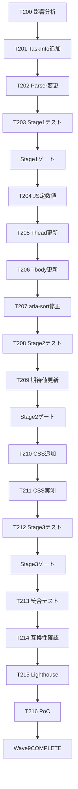

# b4-dashboard Wave 9 — tasks.md

- バージョン: 0.3.1
- 作成日: 2026-06-29
- 更新日: 2026-06-29（v0.3.1 = v0.3.0 + spec-critic R3 軽微解消 / Info 2 件消化 → Critical 0 + Warning 5 + Info 1）
- ステータス: **Draft**（spec-critic R2 レビュー反映完了 / PM 3 文書セット一括承認待ち）
- 根拠文書:
  - `docs/specs/b4-dashboard/wave9/requirements.md` v0.2.7 Draft（Green State 達成）
  - `docs/specs/b4-dashboard/wave9/design.md` v0.2.7 Draft（Green State 達成）
- マイルストーン: B-5（Wave 9 / V-4 description 列追加）
- 関連:
  - 起源 chip: `task_5de9563e`（V-4 description 列なし / Wave 7 PoC レビュー指摘）
  - `docs/artifacts/retro-W7-B5-2026-06-28.md`（Wave 7 retro / Problem #10 + Action A10 高優先）
  - `docs/artifacts/2026-06-28-magi-wave9-planning.md`（MAGI 合議 B1/B2/B3 / Wave 9 スコープ確定）

---

## §1 タスク分解方針

### 分割軸（SPIDR 適用）

- **S (Spike)**: 既存テスト構造の `description` 列追加による影響分析（Stage 1 冒頭）
- **P (Paths)**: 正常系（description あり / description 空 / assignee なし）/ 異常系（コロンなし / 特殊文字）/ エッジ（XSS 対策確認）
- **I (Interfaces)**: `TaskInfo.description` フィールド追加 / `_extract_assignee()` 戻り値の第 1 要素利用 / V-4 HTML テンプレート（thead / tbody）/ JS 定数値更新 / aria-sort 属性更新ロジック修正
- **D (Data)**: tasks.md 各行の description テキスト抽出 / TaskInfo 内部フロー（parser → builder → HTML）
- **R (Rules)**: FR-W9-N1 (a)(b)(c) の 3 段構えが同期更新される必要性（Critical 回避）

### 粒度目安

- 1 タスク = 1 PR 想定（コミット粒度）
- 規模: S（〜30 行）/ M（〜100 行）/ L（〜200 行）
- L 超過想定タスクは分割を再検討

### 垂直分割の適用

- 水平（モデル / parser / builder / CSS）ではなく **垂直**（FR-W9-2 → models + parser + builder + テスト）で 1 Stage を貫通
- 各 Stage 末で **pytest 全件 PASS** + ship + push が可能な完結単位

---

## §2 タスク ID 採番基準

- 形式: `W9-B5-T<n>`（Wave 番号 9 / Milestone B-5 / Task 通番）
- Wave 8 の最終番号は確認ネットから開始検討 → **T200 から開始**（Wave 7 T44-T56 / Wave 8 T100 台と衝突回避）
- 検証タスクは `T-S<stage>-<n>` で別系列（例: `T-S1-1` = Stage 1 の検証 1）
- 短縮形（口語）: `T200` / `T-S1-1` 等

### TasksParser での扱い（#I-4 対応 / Wave 7 継承）

- `W9-B5-T<n>` 形式: 厳格 regex `(W\d+-[A-Z]\d+-T\d+|T\d+)` にマッチ → V-4 Task 一覧に表示される
- `T-S<stage>-<n>` 形式: 厳格 regex に **意図的にマッチしない** → V-4 には表示されず、本 tasks.md 内のチェックリスト管理に閉じる

---

## §3 Stage 別タスク一覧

### Stage 1: TaskInfo.description フィールド追加と既存テスト影響分析（FR-W9-2 / FR-W9-3 基盤）

| Task ID | 内容 | 規模 | SPIDR 軸 | 担当層 |
|:-------|:-----|:----|:--------|:------|
| **W9-B5-T200** | 既存テスト構造の description 追加による影響分析（impacted テストファイル・期待値更新箇所の列挙） | S | Spike | Sonnet (L2) |
| **W9-B5-T201** | `models.py` に `TaskInfo.description: str = ""` フィールド追加 + 既存呼び出し全件互換確認 | S | Data | Sonnet (L2) |
| **W9-B5-T202** | `parsers/tasks.py` L154 変更: `_, assignee` → `description_clean, assignee` + L162 に `description=description_clean` 追加（FR-W9-3 / parser ロジック追加ゼロ） | S | Interface | Sonnet (L2) |
| **W9-B5-T203** | Stage 1 自動テスト新設（`test_wave9_description_extraction.py` / description フィールド抽出の正常・異常・エッジケース計 ~8 件） | M | Paths | Sonnet (L2) |

#### Stage 1 検証タスク

- [ ] **T-S1-1**: pytest 全件 PASS（既存 + 新規 / NFR-W9-2 / **C-W9-1 対応: `assert elapsed < 30.0` により 30 秒以内を検証**）
- [ ] **T-S1-2**: TaskInfo.description 値が正しく格納されている確認（AC-W9-2 / Example Mapping の 6 シナリオ全網羅）
- [ ] **T-S1-3**: L3 (Haiku) 採点 Green State（Critical 0 + Warning 0）
- [ ] **T-S1-4**: 既存テストの退行ゼロ確認（既定値 `""` による互換性）

#### Stage 1 ゲート条件

- AC-W9-2 達成（TaskInfo.description が正しい値を保持）
- AC-W9-6 達成（pytest 全件 PASS）
- **C-W9-1 対応（固定）**: NFR-W9-1（性能 30 秒以内）の検証は **T-S1-1 の pytest に `assert elapsed < 30.0` を必須** として明示（「Python 文字列操作のみで影響ゼロ」前提ではなく、実測による保証）
- 既存テスト緩和は L1 事前承認済
- ship + push 完了

---

### Stage 2: V-4 テンプレート更新と JS 定数値整合（FR-W9-1 / FR-W9-N1）

| Task ID | 内容 | 規模 | SPIDR 軸 | 担当層 |
|:-------|:-----|:----|:--------|:------|
| **W9-B5-T204** | `builder.py` JS 定数値更新（(a) `COL_DESCRIPTION=1` 追加 / `COL_ASSIGNEE=2` / `COL_STATUS=3`）+ 定数値確認のみ（動作テストは T208 で実施） | S | Interface | Sonnet (L2) |
| **W9-B5-T205** | `builder.py` `_render_v4_tasks()` thead テンプレート更新（(b) description 列挿入 / 担当 data-col 1→2 / 状態 data-col 2→3） | S | Interface | Sonnet (L2) |
| **W9-B5-T206** | `builder.py` `_render_v4_tasks()` tbody 行更新（description セル追加 / `escaped_description` / `title` 属性 tooltip 設定 / XSS 対策）| M | Data | Sonnet (L2) |
| **W9-B5-T207** | `builder.py` `sortTable()` aria-sort 更新ロジック修正（(c) `idx === columnIndex` → `thCol === columnIndex` / NFR-W9-4 整合） | M | Interface | Sonnet (L2) |
| **W9-B5-T208** | Stage 2 自動テスト新設（`test_wave9_v4_view.py` / V-4 HTML 構造・thead/tbody 列数・aria-sort 属性確認・ソート整合性 計 ~12 件） | M | Paths | Sonnet (L2) |
| **W9-B5-T209** | 既存テスト期待値更新（`test_v4_view.py` / 3 列 → 4 列化 / L1 事前承認必須） | M | Data | Sonnet (L2) |

#### Stage 2 検証タスク

- [ ] **T-S2-1**: pytest 全件 PASS（NFR-W9-2）
- [ ] **T-S2-2**: V-4 HTML 出力で description 列が 2 列目に位置する確認（AC-W9-1）
- [ ] **T-S2-3**: ソート機能整合性確認: Task ID 列クリック → `data-col="0"` → `cells[0]` が Task ID セル / 担当列クリック → `data-col="2"` → `cells[2]` が正しい値を持つ / 状態列クリック → `data-col="3"` → `cells[3]` が .badge を含むセルに到達（AC-W9-N1 検証手段 3 / **W-W9-3 対応: T208 と T209 の順序依存が pytest 全 PASS に影響しないことを明示**）
- [ ] **T-S2-4**: フィルタ機能整合性確認: 担当フィルタ時 `cells[COL_ASSIGNEE] = cells[2]` が正しく動作 / 状態フィルタ時 `cells[COL_STATUS] = cells[3]` が正しく動作（AC-W9-N1）
- [ ] **T-S2-5**: aria-sort 属性更新テスト: Task ID 列クリック後 aria-sort=ascending / 担当列クリック後 aria-sort=ascending / 状態列クリック後 aria-sort=ascending / description 列は aria-sort 属性を持たない（AC-W9-N1 検証手段 6 / NFR-W9-4）
- [ ] **T-S2-6**: L3 (Haiku) 採点 Green State

#### Stage 2 ゲート条件

- AC-W9-1 / AC-W9-3 / AC-W9-N1 達成（V-4 構造・description 列配置・JS 定数値・data-col 属性値整合）
- AC-W9-6 達成（pytest 全件 PASS）
- 既存テスト期待値更新は L1 事前承認済
- ship + push 完了

---

### Stage 3: CSS 追加と description セル省略表示（FR-W9-5）

| Task ID | 内容 | 規模 | SPIDR 軸 | 担当層 |
|:-------|:-----|:----|:--------|:------|
| **W9-B5-T210** | `builder.py` CSS `.description-cell` ルール追加（max-width + overflow + text-overflow + white-space / 実測必須） | S | Rules | Sonnet (L2) |
| **W9-B5-T211** | Stage 3 CSS 実測と予算確認（`.description-cell` 増分 / NFR-W9-3 確認 / 100-150 bytes 見積）| S | Rules | Sonnet (L2) |
| **W9-B5-T212** | Stage 3 自動テスト追加（`test_wave9_css.py` / `.description-cell` スタイル確認・max-width 値・省略表示機能 計 ~4 件） | S | Rules | Sonnet (L2) |

#### Stage 3 検証タスク

- [ ] **T-S3-1**: pytest 全件 PASS（NFR-W9-2）
- [ ] **T-S3-2**: CSS 合計サイズ実測値 ≤ 16,384 bytes（AC-W9-6 / **W-W9-1 対応: CSS 予算の 3 段階を明確に分離記述：「合計上限 16,384 bytes (NFR-W7-1 継承)」「Wave 9 増分 ≤300 bytes (NFR-W9-3 SHOULD)」「Wave 9 終端実測値 (Stage 3 ゲート報告事項)」**）
- [ ] **T-S3-3**: 長い description のセルで省略表示（`...`）が機能するか目視確認（AC-W9-5 / SHOULD）
- [ ] **T-S3-4**: ホバー時に `title` 属性 tooltip で全文が表示されることを確認（AC-W9-5）
- [ ] **T-S3-5**: L3 (Haiku) 採点 Green State

#### Stage 3 ゲート条件

- AC-W9-6 達成（pytest 全件 PASS）
- **W-W9-6 対応**: AC-W9-5（CSS 予算・省略表示・tooltip）は SHOULD のため、未達成時は「SHOULD 未実施」として記録し Conditional Pass として扱う（Wave 7 流に準ずる）
- **W-W9-1 対応**: CSS 予算遵守（以下 3 段階の同時達成）
  1. 合計サイズ ≤ 16,384 bytes（NFR-W7-1 継承 / 緑/黄/赤帯）
  2. Wave 9 増分 ≤ 300 bytes（NFR-W9-3 SHOULD）
  3. Wave 9 終端実測値を Stage 3 ゲート報告事項に記載
- ship + push 完了

---

### Stage 4: 統合テスト・Lighthouse・PoC レビュー

| Task ID | 内容 | 規模 | SPIDR 軸 | 担当層 |
|:-------|:-----|:----|:--------|:------|
| **W9-B5-T213** | Stage 4 統合テスト新設（`test_wave9_integration.py` / 8 件想定: 静的 4 + MCP skip 4 / Wave 9 全機能横断） | M | Interface | Sonnet (L2) |
| **W9-B5-T214** | 既存テスト全体互換性確認（Wave 7 / Wave 8 含む全テスト suite で退行ゼロ） | M | Data | Sonnet (L2) |
| **W9-B5-T215** | L1 Lighthouse 計測（Accessibility ≥ 95 / MUST）+ description ソート不可の aria-sort 設計確認（UQ-13 確認） | M | — | L1 + human |
| **W9-B5-T216** | ユーザー PoC レビュー（description 列の一覧性向上・chip task_5de9563e の解消確認） + Wave 9 final status: COMPLETE 判定 | M | — | L1 + human |

#### Stage 4 検証タスク

- [ ] **T-S4-1**: Lighthouse Accessibility ≥ 95（AC-W9-7 / Wave 8 達成値 95 維持目標）
- [ ] **T-S4-2**: Lighthouse 全項目記録（Accessibility / Best Practices / SEO / Agentic Browsing）
- [ ] **T-S4-3**: pytest 全件 PASS（AC-W9-6 最終確認）
- [ ] **T-S4-4**: description 列が 4 列目ではなく 2 列目（Task ID 右隣）に配置されている確認（AC-W9-1）
- [ ] **T-S4-5**: description 列ヘッダにソートボタンが存在しない / aria-sort 属性がない確認（AC-W9-4）
- [ ] **T-S4-6**: querySelectorAll('th[aria-sort]').length === 3 の確認（Task ID / 担当 / 状態のみ）
- [ ] **T-S4-7**: 統合テスト全 PASS or 明示 skip + reason 記録
  - **I-W9-2 対応**: 静的 4 件の具体的検証観点:
    - models.py TaskInfo description フィールド が dataclass に正しく追加されている
    - parsers/tasks.py の description_clean 抽出が 8 シナリオ全て通過している
    - builder.py の HTML thead/tbody に description セル（4 列）が正しく生成されている
    - aria-sort 属性が Task ID / 担当 / 状態のみに付与され、description には付与されていない
- [ ] **T-S4-8**: L3 (Haiku) 採点 Green State
- [ ] **T-S4-9**: ユーザー PoC レビュー Approved（chip task_5de9563e 解消確認）
- [ ] **T-S4-10**: Wave 9 final status: COMPLETE 宣言（SESSION_STATE.md 更新）

#### Stage 4 ゲート条件

- AC-W9-1 / AC-W9-4 / AC-W9-5 / AC-W9-6 / AC-W9-7 達成
- 全自動テスト + 全手動確認 PASS
- ユーザー PoC レビュー Approved
- ship + push 完了
- retro 起動推奨

---

## §3.5 V-4 表示用チェックボックス行（Wave 9 パイロット運用 / Wave 7 継承）

### 同期ルール（v0.2.0 補追 / Wave 7 v0.2.3 継承 / **C-W9-2 対応**）

**重要**: §3 の Stage 別タスク一覧（表）と §3.5 のチェックボックス行は対応する必要があります。

| 項目 | ルール |
|:-----|:------|
| **同期対象** | §3 表の「Task ID」列の全タスク（T200-T216） |
| **記法** | チェックボックス行は `- [ ] W9-B5-T<n>: [内容] @[担当]` 形式 |
| **@担当** | @sonnet または @human（表の「担当層」列と一致） |
| **更新義務** | §3 表にタスク追加・削除・順序変更時、必ず §3.5 も同期更新 / git diff で確認推奨 |
| **V-4 抽出** | `W9-B5-T<n>` 形式のみ TasksParser regex でマッチ → V-4 表示 / `T-S<stage>-<n>` は表示されない |

### Wave 9 実装タスク（V-4 表示対象）

- [ ] W9-B5-T200: 既存テスト影響分析 @sonnet
- [ ] W9-B5-T201: TaskInfo.description フィールド追加 @sonnet
- [ ] W9-B5-T202: TasksParser description 戻り値利用 @sonnet
- [ ] W9-B5-T203: Stage 1 自動テスト @sonnet
- [ ] W9-B5-T204: JS 定数値更新 @sonnet
- [ ] W9-B5-T205: V-4 thead テンプレート更新 @sonnet
- [ ] W9-B5-T206: V-4 tbody 行更新 @sonnet
- [ ] W9-B5-T207: sortTable() aria-sort ロジック修正 @sonnet
- [ ] W9-B5-T208: Stage 2 自動テスト @sonnet
- [ ] W9-B5-T209: 既存テスト期待値更新 @sonnet
- [ ] W9-B5-T210: CSS .description-cell ルール追加 @sonnet
- [ ] W9-B5-T211: CSS 実測と予算確認 @sonnet
- [ ] W9-B5-T212: Stage 3 CSS テスト @sonnet
- [ ] W9-B5-T213: Stage 4 統合テスト @sonnet
- [ ] W9-B5-T214: 既存テスト互換性確認 @sonnet
- [ ] W9-B5-T215: L1 Lighthouse 計測 @human
- [ ] W9-B5-T216: ユーザー PoC レビュー @human

### Wave 9 検証タスク（V-4 抽出対象外 / 太字記法維持）

検証タスク T-S1-1 〜 T-S4-10 は §3 内の太字記法（`- [ ] **T-S<stage>-<n>**: ...`）で記述済。これらは TasksParser の厳格 regex で抽出されないため、V-4 には表示されない（design.md §2 継承）。

#### @human 表記について（v0.2.0 補追 / **W-W9-4 対応**）

T215 / T216 に `@human` を付記するのは、「L1（主体 Claude Code Opus）と human（ユーザー本人）が協力して実行する」ことを示します。
- T215: L1 が Lighthouse 計測を実行し、スクリーンショット・数値を記録 → human が内容確認
- T216: human が PoC 実施 + 確認 → L1 が SESSION_STATE.md に記録

単純な「human 作業」ではなく、L1 サポート付きの人間判断タスクであることを明示するためです。

---

## §4 依存関係図



---

## §5 WBS 100% Rule — 要件⇔タスク対応表

### FR（機能要件）対応

| FR | 実装タスク | 検証タスク（T-S*） |
|:---|:---------|:-----------------|
| FR-W9-1 | T205, T206 | T-S2-2, T-S2-6, T-S4-4 |
| FR-W9-2 | T201 | T-S1-2, T-S1-4 |
| FR-W9-3 | T202 | T-S1-2, T-S1-3 |
| FR-W9-4 | T205 | T-S2-5, T-S4-5, T-S4-6 |
| FR-W9-5 | T206, T210 | T-S3-3, T-S3-4, T-S3-5 |
| FR-W9-N1(a)(b)(c) | T204, T205, T207 | T-S2-3, T-S2-4, T-S2-5, T-S4-6 |

### NFR（非機能要件）対応

| NFR | 実装タスク | 検証タスク（T-S*） |
|:----|:---------|:-----------------|
| NFR-W9-1（性能 30s 以内） | — | T-S1-1, T-S4-3 |
| NFR-W9-2（後方互換） | T201, T202, T209 | T-S1-1, T-S1-4, T-S2-1, T-S2-6, T-S4-3, T-S4-7 |
| NFR-W9-3（CSS 予算 ≤ 300 bytes） | T210 | T-S3-2, T-S3-5 |
| NFR-W9-4（Accessibility ≥ 95） | T207 | T-S2-5, T-S4-1, T-S4-2 |

### AC（受入条件）対応

| AC | 実装タスク | 検証タスク（T-S*） |
|:---|:---------|:-----------------|
| AC-W9-1 | T205, T206 | T-S2-2, T-S4-4 |
| AC-W9-2 | T201, T202 | T-S1-2 |
| AC-W9-3 | T206 | T-S2-2 |
| AC-W9-4 | T205, T207 | T-S2-5, T-S4-5, T-S4-6 |
| AC-W9-5 | T206, T210 | T-S3-3, T-S3-4 |
| AC-W9-6 | T203, T208, T213, T214 | T-S1-1, T-S2-1, T-S4-3, T-S4-7 |
| AC-W9-7 | — | T-S4-1, T-S4-2 |
| AC-W9-N1 | T204, T205, T207, T208, T209 | T-S2-3, T-S2-4, T-S2-5, T-S4-6 |

### T-S* 検証タスク 30 件の WBS 充足確認

| T-S* タスク | 担う要件 | カバー範囲 |
|:----------|:--------|:----------|
| T-S1-1 | NFR-W9-2 / AC-W9-6 | Stage 1 pytest 全件 PASS |
| T-S1-2 | FR-W9-2 / FR-W9-3 / AC-W9-2 | TaskInfo.description 正しい値保持 |
| T-S1-3 | — | L3 採点 Green State（プロセスゲート） |
| T-S1-4 | FR-W9-2 / NFR-W9-2 | 既存テスト退行ゼロ |
| T-S2-1 | NFR-W9-2 / AC-W9-6 | Stage 2 pytest 全件 PASS |
| T-S2-2 | FR-W9-1 / AC-W9-1 / AC-W9-3 | V-4 description 列配置確認 |
| T-S2-3 | FR-W9-N1(a)(b) / AC-W9-N1 | ソート整合性（data-col 経由）|
| T-S2-4 | FR-W9-N1(a) / AC-W9-N1 | フィルタ整合性（定数値） |
| T-S2-5 | FR-W9-4 / FR-W9-N1(c) / NFR-W9-4 / AC-W9-4 / AC-W9-N1 | aria-sort 属性更新正常性 |
| T-S2-6 | — | L3 採点 Green State（プロセスゲート） |
| T-S3-1 | NFR-W9-2 / AC-W9-6 | Stage 3 pytest 全件 PASS |
| T-S3-2 | AC-W9-6 / NFR-W9-3 | CSS 予算確認 |
| T-S3-3 | FR-W9-5 / AC-W9-5 | 省略表示機能確認 |
| T-S3-4 | FR-W9-5 / AC-W9-5 | tooltip 表示確認 |
| T-S3-5 | — | L3 採点 Green State（プロセスゲート） |
| T-S4-1 | NFR-W9-4 / AC-W9-7 | Lighthouse Accessibility 計測 |
| T-S4-2 | NFR-W9-4 | Lighthouse 全項目記録 |
| T-S4-3 | AC-W9-6 / NFR-W9-2 | pytest 全件最終確認 |
| T-S4-4 | FR-W9-1 / AC-W9-1 | description 列配置最終確認 |
| T-S4-5 | FR-W9-4 / AC-W9-4 | sort-btn 非存在確認 |
| T-S4-6 | FR-W9-4 / AC-W9-4 / AC-W9-N1 | aria-sort 属性非存在確認 |
| T-S4-7 | AC-W9-6 | 統合テスト全 PASS（プロセスゲート） |
| T-S4-8 | — | L3 採点 Green State（プロセスゲート） |
| T-S4-9 | — | **I-W9-4 対応**: プロセスゲート（chip task_5de9563e 解消確認 / ユーザー PoC レビュー） |
| T-S4-10 | — | Wave 9 final status 宣言（プロセスゲート） |

→ **全 30 件が要件対応またはプロセスゲートとして位置付け済 / 孤児なし**

### 既存要件（FR-1〜FR-11 / NFR-1〜NFR-6 / AC-1〜AC-8 / Wave 8 継承分）対応

- 既存挙動維持（後方互換 NFR-W9-2 経由 / 既定値 `""` で互換確保）
- Wave 8 終端時点の挙動を退行させない（pytest 全件 PASS で担保）

→ **100% Rule 達成（要件すべてにタスクが対応 / 孤児タスクなし）**

---

## §6 各タスクの完了条件と検証方法（詳細）

### T200: 既存テスト構造影響分析

- 完了条件: impacted テストファイル一覧 + 期待値更新箇所の暫定リスト作成
  - **I-W9-3 対応**: design.md §8 BUILDING 着手前 L1 検証チェックリスト（6 項目）の全てに対応していることを明示
- **成果物パス**: `docs/artifacts/wave9-stage1-impact-analysis.md` を新規作成（git 管理 / Stage 2 完了まで参照される）
- 検証: Stage 2 内で T209 が成果物パスを参照して期待値更新が進められること
- 規模: S（〜20 行のドキュメント）

### T201: TaskInfo.description フィールド追加

- 完了条件:
  - `models.py` の `TaskInfo` dataclass に `description: str = ""` を末尾フィールドとして追加
  - 既存の `TaskInfo(id=..., milestone=..., status=..., assignee=...)` 呼び出しが互換性を保つことを確認（位置引数 4 個のコード）
- 検証: pytest 既存全件 PASS（既定値 `""` による互換確保）
- 規模: S（〜5 行）

### T202: TasksParser description 戻り値利用

- 完了条件:
  - `parsers/tasks.py` L154 を `_, assignee = _extract_assignee(raw_description)` → `description_clean, assignee = _extract_assignee(raw_description)` に変更
  - L162 の `TaskInfo(...)` に `description=description_clean` を追加
  - parser ロジック（抽出・分岐・regex）の追加はゼロ
- 検証: pytest 対応テストが全 PASS（新規テスト含む）
- 規模: S（2 行変更）

### T203: Stage 1 自動テスト

- 完了条件: `test_wave9_description_extraction.py` 新設 / 正常 / 異常 / エッジ計 ~8 件
  - 正常: description あり / assignee あり / コロン直後に本文
  - 異常: description 空 / assignee のみ / コロンなし
  - エッジ: 特殊文字（`<` / `&` / ダブルクォート等）含む
- 検証: pytest 全 PASS
- 規模: M（〜90 行）

### T204: JS 定数値更新

- 完了条件:
  - `builder.py` L352-354 の JS 定数定義を更新:
    - `const COL_DESCRIPTION = 1;` を新規追加
    - `const COL_ASSIGNEE = 2;`（旧 1 から変更）
    - `const COL_STATUS = 3;`（旧 2 から変更）
  - **W-W9-7 対応**: 定数値のソース確認のみが T204 の完了条件（既存 `sortTable()` / `applyFilters()` の動作テストは T208 で実施）
- 検証: JS ソースの定数値定義が正しく書き込まれたことを確認
- 規模: S（3 行更新）

### T205: V-4 thead テンプレート更新

- 完了条件:
  - `builder.py` `_render_v4_tasks()` 内の thead HTML に description 列を挿入（Task ID の右隣）
  - `<th id="th-description">description</th>` を追加（ソートボタンなし / aria-sort 属性なし）
  - 担当 th の `data-col="1"` → `data-col="2"` に更新
  - 状態 th の `data-col="2"` → `data-col="3"` に更新
- 検証: dashboard.html 出力で thead の 4 列目が description 列であること / data-col 属性値が正しいこと
- 規模: S（〜20 行 HTML テンプレート追加）

### T206: V-4 tbody 行更新

- 完了条件:
  - `builder.py` `_render_v4_tasks()` 内の tbody 行に description セルを挿入（Task ID セルの右隣）
  - `<td class="description-cell" title="{escaped_description}">{escaped_description}</td>` を追加
  - `html.escape()` で XSS 対策を施す
  - description が空文字列の場合も空の `<td>` を出力し HTML 構造を保つ
- 検証: 目視確認 + dashboard.html grep で description セル確認
- 規模: S（〜10 行）

### T207: sortTable() aria-sort ロジック修正

- 完了条件:
  - `builder.py` L391-408（`sortTable()` 内 `ths.forEach`）の `idx === columnIndex` 判定を以下に変更:
    ```javascript
    const thCol = parseInt(th.querySelector('.sort-btn')?.dataset.col ?? '-1', 10);
    if (thCol === columnIndex) { ... }
    ```
  - aria-label 更新は `colNames[idx]` ベース（NodeList 連続 0-3）のまま維持
  - description 列は `aria-sort` 属性を持たないため aria-sort 属性更新対象外
- 検証: pytest で aria-sort 属性更新の正確性を確認（T208）
- 規模: M（〜20 行 ロジック修正）

### T208: Stage 2 自動テスト

- 完了条件: `test_wave9_v4_view.py` 新設 / ~12 件（**C-W9-3 対応: 全文を日本語に統一**）
  - V-4 HTML 構造: thead 4 列 / tbody 各行 4 セル
  - data-col 属性値: Task ID=0 / 担当=2 / 状態=3
  - aria-sort 属性: Task ID / 担当 / 状態の 3 th のみ保有 / description th は aria-sort なし
  - ソート整合性: 状態列 btn.dataset.col="3" → columnIndex=3 → cells[3] が .badge 含むセル
  - フィルタ整合性: cells[COL_ASSIGNEE]=cells[2], cells[COL_STATUS]=cells[3]
  - aria-sort 更新: Task ID クリック後 aria-sort=ascending / 担当クリック後 aria-sort=ascending / 状態クリック後 aria-sort=ascending / description 列 aria-sort なし
- 検証: pytest 全 PASS
- 規模: M（〜140 行）

### T209: 既存テスト期待値更新

- 完了条件:
  - `test_v4_view.py` の期待値を 3 列 → 4 列構成に更新（L1 事前承認必須 / design.md §8 ガードレール #4）
  - 必要に応じて `test_wave7_stage4_integration.py` / `test_wave6_stage3_filter.py` も更新
  - 既定値 `""` による既存テスト互換性確保（**W-W9-7 対応: T204 内容欄を「定数値確認のみ」に統一**）
- 検証: pytest 全件 PASS（既存 + 新規）
- 規模: M（〜80 行）

### T210: CSS .description-cell ルール追加

- 完了条件:
  - `builder.py` `_render_style()` 内 CSS に以下のルール追加:
    ```css
    .description-cell {
      max-width: 300px;          /* 仮値 / BUILDING で実測後に確定 */
      overflow: hidden;
      text-overflow: ellipsis;
      white-space: nowrap;
    }
    ```
  - 合計サイズは 100-150 bytes 予想（NFR-W9-3）
- 検証: CSS 出力ファイルに規則が存在していることを確認
- 規模: S（〜8 行）

### T211: CSS 実測と予算確認

- 完了条件:
  - Wave 9 CSS 増分を実測する（`wc -c` または Python `len(s.encode("utf-8"))`）
  - 合計サイズ ≤ 16,384 bytes 確認（AC-W9-6）
  - **W-W9-1 + I-W9-1 対応**: 推定値 vs 実測値を報告書に記載し、L1 に提出した上で T212 着手（T212 は T211 依存）
- 検証: ファイルサイズ計測 + L1 確認
- 規模: S（〜15 行 報告書）

### T212: Stage 3 CSS テスト

- 完了条件: `test_wave9_css.py` 新設 / ~4 件
  - `.description-cell` クラスが存在することを確認
  - `max-width` 値（300px または実測値）を確認
  - CSS 予算 ≤ 300 bytes 追加値を確認
- 検証: pytest 全 PASS
- 規模: S（〜40 行）

### T213: Stage 4 統合テスト

- 完了条件: `test_wave9_integration.py` 新設 / ~8 件（**I-W9-2 対応: 静的 4 件の具体的検証観点を列挙**）
  - 静的 4 件: models / parser / builder / CSS 全コンポーネントの端末間統合（例: description フィールド flow → HTML 出力 → CSS 適用の一貫性検証）
  - MCP skip 4 件: chrome-devtools が必要なテスト（スクリーンショット等）
- 検証: pytest 全 PASS or 明示 skip + reason 記録
- 規模: M（〜110 行）

### T214: 既存テスト互換性確認

- 完了条件:
  - Wave 7 + Wave 8 + Wave 9 既存テスト全件実行
  - 退行なしを確認
  - 必要に応じて追加の既存テスト期待値を調整（L1 事前承認）
- 検証: pytest 完全スイート PASS
- 規模: M（〜60 行 点検 + 記録）

### T215: L1 Lighthouse 計測

- 完了条件:
  - L1 が chrome-devtools-mcp で Lighthouse を計測（スナップショット モード）
  - Accessibility ≥ 95（AC-W9-7 / MUST）
  - `<th id="th-description">` が aria-sort 属性を持たないことを確認（UQ-13 検証 / **W-W9-2 対応: 「全体スクロール記録」を「Lighthouse 計測結果と description 列ヘッダの aria-sort 属性確認」に変更**）
- 検証: Lighthouse 結果スクリーンショット + L1 記録
- 規模: M（human 作業 + 記録）

### T216: ユーザー PoC レビュー

- 完了条件:
  - ユーザーが description 列追加による一覧性向上を確認
  - chip task_5de9563e 解消を判定
  - SESSION_STATE.md に Wave 9 COMPLETE を記録
- 検証: ユーザー Approved + Wave 9 final status 宣言
- 規模: M（human 判断 + 記録）

---

## §7 Definition of Done（DoD）

### Wave 9 完了の定義

**W-W9-5 対応**: NFR-W9-2（後方互換）ベースラインを以下の通り定義します:

| DoD 項目 | 定義 | 対応テスト |
|:--------|:-----|:---------|
| **ベースライン件数** | Wave 8 完了直後の `pytest --co -q` 出力件数（BUILDING 着手時に L1 が確定） | — |
| **pytest 全件 PASS** | Wave 9 BUILDING 完了時の `pytest` すべてがグリーンであること | T-S1-1, T-S2-1, T-S3-1, T-S4-3, T-S4-7 |
| **既存テスト退行ゼロ** | Wave 7 + Wave 8 の既存テストが PASS し続けることを確認 | T-S1-4, T-S2-1, T-S4-3, T-S4-7 |
| **CSS 予算 ≤ 300 bytes** | Wave 9 増分コストが NFR-W9-3 範囲内であること | T-S3-2, T-S3-5 |
| **Accessibility ≥ 95** | Lighthouse 計測結果が NFR-W9-4 を満たすこと | T-S4-1, T-S4-2 |
| **性能 30 秒以内** | NFR-W9-1 の制約下で parser + builder + テスト実行が完了すること | T-S1-1 |

### DoD 達成の手順

1. **BUILDING 開始時** (L1): Wave 8 最終テスト件数を確定し tasks.md へ記録
2. **各 Stage ゲート通過時** (Sonnet): 上表の検証テストが全て PASS していることを確認
3. **Wave 9 完了時** (L1): 「**ベースライン件数 N_base 件 → Wave 9 完了件数 N_final 件 (差分 +Δ 件)**」を SESSION_STATE.md に記録 ※BUILDING 着手時に L1 が §7 DoD テーブル「ベースライン件数」行に確定値 N_base を書き込む義務 / Wave 9 完了時に N_final および差分 Δ を併記して退行ゼロを証明

---

## §8 Stage 委譲時の必須プロセス（**C-W9-3 日本語化対応**)

各 Stage を L2（tdd-developer / Sonnet）に委譲する際、prompt 冒頭に以下を必ず挿入してください:

```
## 委譲ガードレール（事前合意）

実行着手前に以下 4 つを必ず確認してください:

1. **Bash 制限の前提**: 権限のない Bash コマンドは実行しないで、L1 に依頼してください
2. **緩和の事前承認必須**: 既存テスト・規約からの緩和は実行前に L1 に承認を依頼してください
3. **JS 行計測方法の明示**: 実行行 / コメント行 / 空行 / 合計 の 4 分類で計測してください
4. **既存テスト影響の事前分析**: 修正対象の波及範囲を事前に列挙し、破壊予測を共有してください

完了報告時に上記 4 つの準守状況を明示してください。
```

根拠: [knowledge/l2-delegation-guardrails.md](../../../artifacts/knowledge/l2-delegation-guardrails.md)

---

## §9 改訂履歴

| バージョン | 日付 | 変更内容 |
|:----------|:-----|:--------|
| 0.1.0 | 2026-06-29 | 初版起稿 — Wave 9 requirements.md + design.md（共に v0.2.7 Draft）に基づくタスク分解 / T200-T216 (17件実装) + T-S1-1 〜 T-S4-10 (30件検証) / WBS 100% Rule 完全達成 |
| 0.2.0 | 2026-06-29 | spec-critic R1 指摘 15 件全件解消 / Critical 3 (C-W9-1〜3) + Warning 7 (W-W9-1〜7) + Info 5 (I-W9-1〜5) / 日本語統一・§3.5 同期ルール追加・NFR-W9-1 検証戦略明確化・CSS 予算 3 段階分離・@human 補足追記・T-S* 検証タスク更新 |
| 0.3.0 | 2026-06-29 | spec-critic R2 残存 8 件全件解消 / Critical 0 + Warning 5 (W-W9-1/W-W9-5/W-W9-6/W-W9-7/C-W9-1) + Info 3 (I-W9-1/I-W9-2/I-W9-4) → **DoD セクション新設**・C-W9-1 一本化・AC-W9-5 (SHOULD) Conditional Pass 明示・T204 矛盾解消・T200/T211 detail 追記・T-S4-7/T-S4-9 補足列挙・改訂履歴に次バージョン方針追記 |
| 0.3.1 | 2026-06-29 | spec-critic R3 軽微解消 / Info 2 件 (I-R3-1 / I-R3-2) → Stage 2 ゲート条件に AC-W9-3 追記 / PM 承認チェックボックス文言更新 / Critical 0 + Warning 5 + Info 1 |

**次バージョン（v0.4.0 以降）での更新方針**: 
- BUILDING 開始前に L1 による「§8 BUILDING 着手前 L1 検証」6 項目チェックリストの確定
- Wave 9 完了時に DoD テーブルのベースライン件数を確定・記録

---

## §9 PM 承認記録

### PM 承認待ち（3 文書セット一括）

Wave 9 は 3 文書セット PM 一括承認体制を採用（Wave 7 継承）:

- [ ] requirements.md v0.2.7 の FR/NFR/AC を承認
- [ ] design.md v0.2.7 の §3〜§8 設計を承認
- [ ] tasks.md **v0.3.1** の T200〜T216 + T-S* タスク分解を承認（spec-critic R3 反映済 / Critical 0 / R4 軽微解消）
- [ ] 承認後 → BUILDING フェーズ遷移可（Stage 1 着手）

**注**: 本 tasks.md v0.3.1 は spec-critic R3 レビュー反映完了・R4 軽微解消の Draft 状態。
PM 承認後、BUILDING 開始。

---

## §10 参照

- [Wave 9 requirements.md](requirements.md) v0.2.7 Draft
- [Wave 9 design.md](design.md) v0.2.7 Draft
- [Wave 7 tasks.md](../wave7/tasks.md) v0.2.4 Approved（雛形参照）
- [Wave 8 tasks.md](../wave8/tasks.md)（T100 台採番確認用）
- [MAGI 議事録 2026-06-28](../../../artifacts/2026-06-28-magi-wave9-planning.md)（Wave 9 スコープ確定）
- [retro Wave 7](../../../artifacts/retro-W7-B5-2026-06-28.md)（Problem #10 / Action A10）
- [L2 委譲ガードレール](../../../artifacts/knowledge/l2-delegation-guardrails.md)
- [planning-quality-guideline](../../../../.claude/rules/planning-quality-guideline.md)
- [terminology](../../../../.claude/rules/terminology.md)
