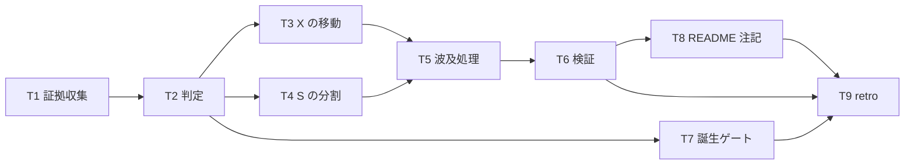

# Milestone D-1: 配布境界の決定 — タスク定義

**版**: v0.1（2026-07-27）
**状態**: **draft / 承認待ち**
**親**: [requirements.md](requirements.md) v2.0 / [design.md](design.md) v0.2

---

## §0 全体像

| Wave | 目的 | 担当 | 中断可否 |
|:--|:--|:--|:--|
| **W1** | 判定する | T1 = L1 / **T2 = ユーザー本人のみ** | **T2 は中断不可**（基準が揺れる） |
| **W2** | 反映する | L1 / L2 | 可 |
| **W3** | 締める | L1 / ユーザー | 可 |

---

## §1 Wave 1: 判定

### W1-D1-T1: 証拠表の作成

**担当**: L1（**NFR-2 の「結論を出さない情報提示」の範囲を厳守**）

R1 の 15 ファイルから、配布列に該当する記述を**機械的に抽出**して表にする。

**抽出対象**（design §4 手順 1）:

| # | パターン | 例 |
|:-:|:--|:--|
| 1 | 絶対パス | `D:/work7` / `D:\work7` / `C:\Users\` |
| 2 | 外部リポジトリ名 | `Fable-Alembic` / `etc-to-alembic` |
| 3 | 個人の予算・単価の数値 | `$10-40` / `weekly cap 20%` / `$12.66` |
| 4 | 個人名・アカウント名 | `sougetuOte` / `metral` |
| 5 | 他プロジェクト名 | `Mossarium` / `Kage-Shiki` / `etm-diary` |

**完了条件**:
- `docs/artifacts/d-1-evidence-<date>.md` に「ファイル名 / パターン種別 / 行番号 / 該当行の引用」の表が出力されている
- 15 ファイル**全件**が表に現れる（該当ゼロのファイルも「該当なし」の行を持つ）
- **P / X / S の下書き・推奨・優先度が 1 つも書かれていない**（NFR-2）

**検証方法**: `grep -c "^| " docs/artifacts/d-1-evidence-<date>.md` で行数を確認し、15 ファイル分の被覆を目視で照合する

**やらないこと**: 判定・推奨・「これは私物っぽい」等の示唆

---

### W1-D1-T2: 判定（P / X / S の付与）

**担当**: **ユーザー本人のみ**（NFR-2 MUST / L1・L2・L3 は関与しない）

T1 の証拠表を見て、15 ファイルそれぞれに **P（製品）/ X（私物）/ S（要分割）** を付ける。

**判定の問い**（handoff §6 経路 2 の配布列 / 1 ファイル 1-2 分）:

> **この条項は私の環境・予算・他プロジェクト・個人名を参照するか**

**完了条件**:
- 15 件全件に P / X / S が付いている（未判定ゼロ = 成功基準 1）
- 判定結果が `docs/artifacts/d-1-evidence-<date>.md` に追記されている
- **1 セッションで完了している**（design §4 / 中断すると基準が揺れる）

**L1 の役割**: 証拠表の提示と、判定結果の記録のみ。**問われない限り意見を述べない**

> **判定が全件 P だった場合**: D-1 は「配布境界を確認し、私物は無かった」という結論で完了する。これは失敗ではない。**T3-T5 は no-op となり、T6 以降のみ実施する**

---

## §2 Wave 2: 反映

### W2-D1-T3: X の移動

**担当**: L2（L1 が検収）
**前提**: T2 で X が 1 件以上

- `docs/private/` を新設する
- X 判定のファイルを `.claude/rules/` から `docs/private/` へ **`git mv`** で移動する（履歴を保つ）

**完了条件**: X 全件が移動済み / `.claude/rules/` に X が残っていない
**検証方法**: `ls docs/private/` と `ls .claude/rules/` の差分照合

---

### W2-D1-T4: S の分割

**担当**: L1（**PM 級**: `.claude/rules/` の編集）
**前提**: T2 で S が 1 件以上

- S 判定のファイルから**私的部分のみ**を抜く
- 抜いた内容は `docs/private/` の **1 ファイルに集約**する（散らさない）
- 残りは `.claude/rules/` に据え置く

**完了条件**:
- S 全件から私的部分が抜かれている
- 抜いた内容が `docs/private/` の 1 ファイルに集約されている
- **抜いたのが「誰のものか」であって「要るか」ではない**ことを、各件 1 行で記録している（design §4 の軸の表 / **手 4 との分離の証跡**）

**検証方法**: `pytest .claude/tests/rules/test_clause_gate_ledger.py`（§A が整合すること）

**やらないこと**: **「この記述は要るか」を問い始めること**。問い始めたら手を止めて報告する（design §10）

---

### W2-D1-T5: 波及処理

**担当**: L1
**前提**: T3 または T4 が実施された

design §5 が列挙した 4 か所を**同一の波で**更新する。

| # | 対象 | 内容 |
|:-:|:--|:--|
| 1 | `docs/artifacts/clause-gate-ledger.md` §A | R1 集合の変化を反映 |
| 2 | `.claude/tests/rules/test_clause_gate_ledger.py` | 必要なら（台帳と実測が一致すれば変更不要） |
| 3 | `.claude/hooks/pre-tool-use.py` | `_OUTBOUND_WRITE_BAN_ROOTS` の SSOT が移動した場合の注記更新 |
| 4 | `.claude/tests/hooks/test_outbound_write_ban.py` | `test_banned_root_matches_rule_document` の参照先更新 |

**完了条件**: 4 か所すべてが判定結果と整合している
**検証方法**: `pytest .claude/tests/` 全系統が緑（漏れは §A 不一致として自動検出される）

---

### W2-D1-T6: 検証

**担当**: L3（事実突合）→ L1 が受領

| # | 検証 | コマンド | 期待 |
|:-:|:--|:--|:--|
| 1 | self-hosting（成功基準 4） | `bash .claude/scripts/py_invoke.sh -m pytest .claude/tests/ -o addopts=""` | 全件緑（現在 793 passed + 14 skipped） |
| 2 | §A（成功基準 5） | `pytest .claude/tests/rules/test_clause_gate_ledger.py` | 緑 / **カウントが 80 を超えていない** |
| 3 | リンク切れ | 本 Milestone の全成果物 | 0 件 |
| 4 | ロードされないこと | `docs/private/` に `paths:` なし `.md` を置いても新規セッションで注入されないこと | **新規セッションで目視確認**（design §1 の裏取りの実地確認） |

**完了条件**: 4 項目すべて期待どおり

---

## §3 Wave 3: 締め

### W3-D1-T7: 誕生ゲートに配布列の 1 問を追加

**担当**: L1（**PM 級**相当 / `.claude/skills/clause-gate/`）

design §6 のとおり、判定順序で **R1 に決まった場合のみ** 1 問を足す。

> 「この条項は私の環境・予算・他プロジェクト・個人名を参照するか」→ Yes なら `docs/private/`

**完了条件**: `clause-gate/SKILL.md` に 1 問が追加されている / **新規ファイル・新規テストを作っていない**
**やらないこと**: 定期実行の契機を作ること（FR-5 / 時計を持たせない）

---

### W3-D1-T8: README に 1 行の注記

**担当**: L2
**前提**: T3 または T4 で `docs/private/` が生まれた

`README.md` §使い方 に、`docs/private/` が開発者個人の統治記録であり**削除して構わない**ことを 1 行で書く。

**完了条件**: 3 経路（"Use this template" / clone / ZIP）のいずれで入手した人にも読める位置にある
**やらないこと**: **配布手順そのものの改訂**（design §7 で後続に送った / 1 行の注記のみ）

---

### W3-D1-T9: retro

**担当**: L1 + ユーザー

**必須の議題**（成功基準 6）:

1. **WC-11 防御の成否** —— 「次も同じやり方でやろう」と言える状態になっていないか。**なっていたら防御は失敗**
2. **WC-10 の点検** —— マニフェスト・検査群・分類学が生えていないか
3. **手 4 との分離** —— T4 で「要るか」を問い始めた瞬間が無かったか
4. D-1 の残余（hooks / skills / agents の未判定、無条件検査を置けないこと）を後続へ引き継ぐ

**完了条件**: `docs/artifacts/retro-D1-<date>.md` が存在し、上記 4 点に回答がある

---

## §4 トレーサビリティ（WBS 100% Rule）

### 要件 → タスク

| 要件 | 充足するタスク |
|:--|:--|
| FR-1（配布列を流用 / 新軸なし） | T1（抽出パターン）/ T2（判定の問い） |
| FR-2（既存の配置・機構を再利用 / 検査群を作らない） | T3・T4（配置のみ）/ T7（既存ゲートに 1 問） |
| FR-3（パッケージング境界として表現 / 分割しない） | T3（`docs/private/` = 境界） |
| FR-4（対象は R1 15 件） | T1（15 件全件）/ T2（15 件全件） |
| FR-5（単発の記録 / 定期再判定を条文化しない） | T2（記録は evidence 1 ファイル）/ T7（時計を持たせない） |
| FR-6（除外後も self-hosting 成立） | T6 検証 1 |
| NFR-1（§A を増やさない） | T6 検証 2 |
| NFR-2（判定者はユーザー / 事前採点禁止） | T1 の「やらないこと」/ T2 の担当指定 |
| NFR-3（検査機構を新設しない） | T7 の「やらないこと」 |

### 成功基準 → タスク

| 成功基準 | 達成するタスク |
|:-:|:--|
| 1（15 件全件判定） | T2 |
| 2（判定に従って配布物を作れる） | T3・T4（配置完了 = 配布物の定義） |
| 3（無条件検査 or 置かない根拠） | **design §5 で達成済**（「置かない」の根拠を記録済） |
| 4（self-hosting 健全） | T6 検証 1 |
| 5（§A ≤ 80） | T6 検証 2 |
| 6（retro で WC-11 確認） | T9 |

### 未カバーの要件: **なし**

---

## §5 Done の定義（Milestone D-1）

1. T1-T9 がすべて完了している（T3・T4 は判定結果により no-op でよい）
2. `pytest .claude/tests/` 全系統が緑
3. §A カウントが 80 以下
4. `docs/artifacts/retro-D1-<date>.md` が存在し §3 T9 の 4 議題に回答がある
5. **`CHANGELOG.md` に D-1 の結果が記録されている**（何が私物と判定され、何が残ったか）

---

## §6 参照

- [requirements.md](requirements.md) v2.0 / [design.md](design.md) v0.2
- [d-1-rationale-2026-07-27.md](../../artifacts/d-1-rationale-2026-07-27.md)
- [clause-gate-ledger.md](../../artifacts/clause-gate-ledger.md) §A（T5 の更新対象）
- [lam-reconstruction-handoff-2026-07-27.md](../../artifacts/lam-reconstruction-handoff-2026-07-27.md) §6（経路 2 の配布列 = T2 の問い）/ §7（WC 索引 = T9 の議題）
