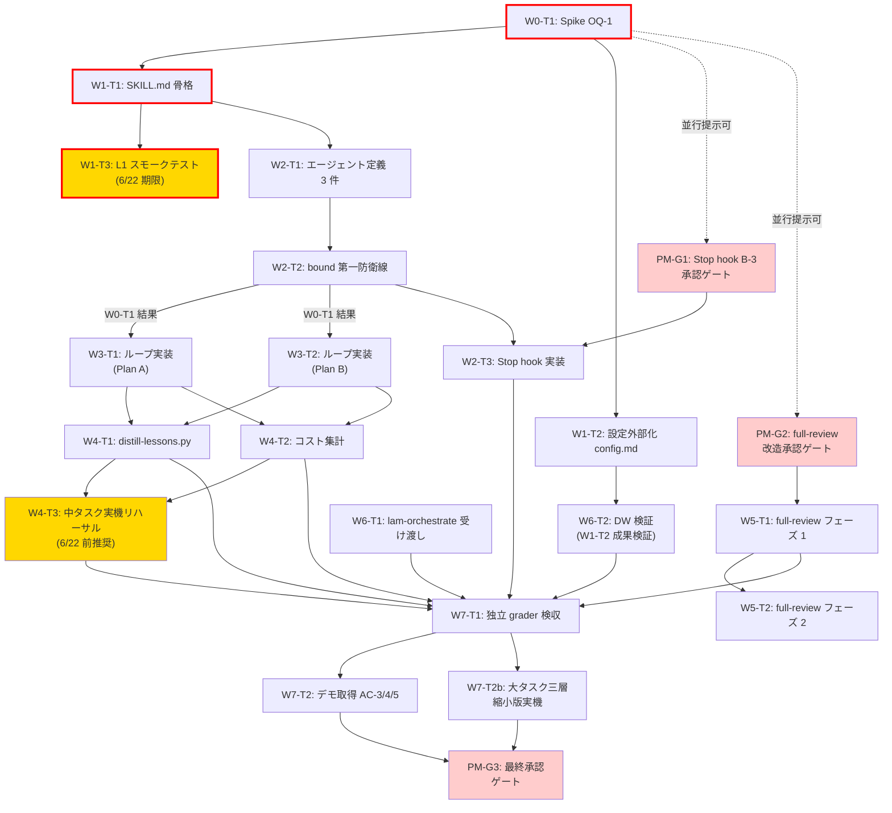

# タスク定義: ゴール駆動オーケストレーション・スキル（B-3）

- バージョン: 1.4.5
- 作成日: 2026-06-11
- 改訂日: 2026-06-18（W5-T1 / W5-T2 / W7-T1 / W7-T2 完了チェック記入。参照: 5a7f856 / ccbf6ea / ed75140 + 3380d74 / W7-T2-acceptance-evidence.md）
- 改訂履歴: 2026-06-18 v1.4.5（W5-T1 / W5-T2 / W7-T1 / W7-T2 完了チェック記入。根拠: 5a7f856（W5-T1）/ ccbf6ea（W5-T2）/ ed75140 + 3380d74（W7-T1 / rubric + grader 25/25 Pass）/ 新規 docs/artifacts/goal-driven-demo/W7-T2-acceptance-evidence.md（W7-T2 / AC-3/4/5/11 全 Pass））/ 2026-06-17 v1.4.4（W4-T3 中タスク実機リハーサル 7 項目完了チェック記入。参照: rehearsal-results.md / retro-w4-t3.md）/ 2026-06-17 v1.4.3（W6-T1 / W6-T2 完了チェック記入。参照: handoff-format.md (FR-10 / AC-15), W6-T2-dw-exclusion-report.md (FR-8 / AC-10)）/ 2026-06-16 v1.4.2（W4-T2 完了チェック記入（Phase 1+2/3/4 完了・pytest 348 passed・design v0.3.3 同期））/ 2026-06-13 v1.4.1（W4-T1 完了チェック・フロー[7]→[8] 誤記修正。PM 承認済み）/ 2026-06-13 v1.4.0（W4-T3 / W7-T2b 起票・W4-T2 実測正規化追記。PM 承認済み）/ 2026-06-13 v1.3.0（PM-G1 承認記録・W2-T1 スモーク行修正（DW プローブ撤回））/ 2026-06-12 v1.2.0（W0 結果反映: W0-T2 起票・W2-T1 検証手段追記・DW 置き換え見送り記録・Plan B 確定反映。PM 承認済み）/ 2026-06-12 v1.1.0（design v0.3.0 / requirements v1.2.0 整合対応）
- ステータス: Draft（PM 承認待ち）
- 参照要件: `requirements.md` v1.2.0
- 参照設計: `design.md` v0.3.3
- 参照分析: `research/full-review-analysis.md`

---

## 1. Wave 構成概要

| Wave | 内容 | タスク数 | 備考 |
|------|------|---------|------|
| W0 | Spike: OQ-1 実測検証 + DW 置き換え検討 | 2 | **完了（2026-06-12）**: Plan B 確定・DW 置き換え見送り |
| W1 | 骨格・設定ファイル群 + 6/22 スモークテスト | 4 | 設計の確定形。S/PM 混在。W1-T3 は 6/22 期限対象 |
| W2 | エージェント定義 + bound 実装 | 3 | SE 級・グローバル bound 第一防衛線 |
| W3 | 実行ループ（OQ-1 結果次第） | 2 | Plan A または Plan B を実装（定義 2 / 実施 1） |
| W4 | メモリ蒸留 + コスト集計 + 中タスク実機リハーサル | 3 | distill-lessons.py / cost-log / W4-T3 は 6/22 前推奨 |
| W5 | full-review 連携（PM-G2 承認後） | 2 | PM ゲート通過後のみ着手可 |
| W6 | lam-orchestrate 接続 + DW 検証タスク | 2 | SE 級 |
| W7 | 独立 grader 検収 + デモ取得（中・大）+ 最終承認 | 4 | NFR-8 / PM-G3 / W7-T2b（大タスク三層縮小実機）新規 |

**総タスク数（定義）**: 22（PM ゲート 3 件を含む。2026-06-13 v1.4.0 で W4-T3 / W7-T2b 追加）  
**総タスク数（実施）**: 21（W3 は W3-T2 のみ実施・Plan B 確定 2026-06-12）  
**6/22 期限対象**: W0-T1 → W1-T1 → W1-T3（最小経路 3 タスク）。詳細は §3-C を参照。

---

## 2. 依存関係図と 6/22 クリティカルパス

**6/22 クリティカルパス**: W0-T1 → W1-T1 → W1-T3（3 タスク）。この経路完了により、
L1 モデルでの最小 1 周の実機テストが無償期間内に完了する。

---

## 3. スコープ外リスト（future-candidates）

以下は本マイルストーン（B-3）の**対象外**とする。

| 項目 | 理由 | 記録先 |
|------|------|--------|
| full-review フェーズ 3（invocation_id 分離・並列対応） | M〜L 規模。並列実行需要は B-3 実運用後に判断 | `research/full-review-analysis.md §4.3` |
| Dynamic Workflows を用いた「特大」タスクルート | FR-8 / Non-Goals §3。PM の明示承認ゲート必須 | `requirements.md §3` |
| CMA（Claude Managed Agents）移植 | Non-Goals §3 | `requirements.md §3` |
| OTEL によるエージェント別トークン計測 | `design.md §14` 未確認（要裏取り） | `design.md §18 D4` 周辺に追記 |
| **lam-orchestrate 側の小改修**（①PLANNING 純化: 設計審議・MAGI・rubric 素案生成への特化、②W6-T1 で定義する handoff 形式での出力対応） | lam-orchestrate は既存スキルであり変更には別途仕様起票が必要（requirements 起草時の PM 確認事項 #2）。**W6-T1（handoff-format.md）完了時に改修範囲を評価し、小規模なら B-3 末尾に追加、大きければ B-4 候補として起票する** | 本表 + `requirements.md` FR-10 |

| **Plan B ループの DW 置き換え** | FR-4（budget のプログラム設定不可・時間 bound 計測不可・状態ファイル連携不可で第二防衛線が盲目化）/ NFR-1（`agent()` が usage 非返却）が DW 上に不成立のため見送り（2026-06-12 MAGI 審議・W0-T2）。再審議条件（budget 設定手段・usage 返却の解消）を満たした場合に B-4 以降で requirements 改訂として再審議 | `research/dw-replacement-analysis.md §3` |

**注記**: **Plan B 確定（2026-06-12 W0-T1 実測）**。W1-T1/W3 の規模が M→M+ に増える可能性がある
（自前ループの実装コスト増）。

---

## 4. タスク詳細

---

### W0-T1: OQ-1 実測検証 — /goal のサブエージェント内動作確認

**概要**: `/goal` がサブエージェント（L3 相当）内で機能するかを実測し、Plan A / Plan B を確定する。
この結果が W3（実行ループ）の実装方式を決定する分岐点。

**等級**: SE 級（検証タスク・設計文書の更新）

**期限注記**: 6/22 以前に実施すること（L1 モデルでの実機確認を含む）

**対応要件**: OQ-1 / AC-12 / NFR-2 / design §8 検証タスク

**手順**:
1. L3 相当の minimalist エージェント定義を `.claude/agents/` に一時作成（tools: Bash, Read のみ）
2. そのエージェント内から `/goal <条件> or stop after 5 turns` を発行
3. Haiku evaluator が発火するかログで確認（発火 → Plan A 確定、不発 → Plan B 確定）
4. 同時に `/goal` 条件文でのトークン閾値書式（`stop if total_tokens > N`）の有効性も確認（design §18 D1 検証タスク）
5. 結果を `research/oq1-goal-subagent-test.md` に記録
6. `design.md §8` の Plan A / Plan B 確定注記を更新（SE 級更新）

**完了条件**:
- [ ] `research/oq1-goal-subagent-test.md` が作成され、Plan A / Plan B の判定が記録されている
- [ ] `design.md §8` に「確定: Plan A」または「確定: Plan B」の注記が追記されている（`docs/specs/` 配下のため **PM級**・PM 承認ゲートを経ること。design §8 手順5）
- [ ] Plan B 確定時は `/goal` を使用しない根拠（検証結果）が `design.md §8` と `research/oq1-goal-subagent-test.md` に記録されている（NFR-2 MUST）
- [ ] `design.md §18 D1` のステータスが「解決済み」に更新されている
- [ ] AC-12 の要件（「設計文書に記載されている」）を満たしている

**依存**: なし（最先行タスク）

**推定規模**: S（2〜3 時間）

**ステータス: 完了（2026-06-12）。Plan B 確定。** 成果物: `research/oq1-goal-subagent-test.md` / design v0.3.1 反映済み

---

### W0-T2: Plan B 自前ループの DW 置き換え検討（PM 指示・完了）

**概要**: W0-T1 報告時の PM 指示により、Plan B（SKILL.md 自前制御ループ）を Dynamic Workflows に
置き換える案を検討した。最小 DW プローブ実測 + プラットフォーム仕様精査 + MAGI 審議で評価。

**ステータス: 完了（2026-06-12）。結論: Plan B 維持・DW 置き換え見送り（§3 スコープ外リスト参照）**

**等級**: SE 級（検討タスク・research 文書の追加）

**対応要件**: NFR-2 / FR-8 / FR-4 / NFR-1（DW 適合性評価）/ OQ-4（関連）

**成果物**:
- `research/dw-replacement-analysis.md`（事実シート・MAGI 議事録・B-4 再審議条件）
- `research/oq1-goal-subagent-test.md` §4 F-1 改訂（DW は呼び出し時レジストリ解決・Agent ツールはセッション開始時スナップショット）

**完了条件**:
- [x] 見送り理由が planning-quality-guideline §7（二段構え・段階2）の記録要件に従い記録されている
- [x] B-4 再審議条件（budget のプログラム設定手段・`agent()` の usage 返却）が記録されている

**依存**: W0-T1

**推定規模**: S（実績 約 2 時間）

---

### W1-T1: SKILL.md 骨格実装

**概要**: `.claude/skills/goal-driven/SKILL.md` を新規作成する。
フロー [1]〜[9] の骨格、三段階ルート分岐、bound 設定の指示、DW 禁止宣言を含む。
W0-T1 の結果（Plan A/B）を反映した内側ループ呼び出し方式を記述する。

**等級**: SE 級（`.claude/rules/` ではなく `.claude/skills/` への新規追加）

**期限注記**: 6/22 以前に着手推奨（L1 モデル動作確認を含むため）

**対応要件**: FR-1 / FR-3 / FR-4 / FR-6 / FR-8 / AC-1 / AC-2 / AC-4 / AC-7 / AC-10 / NFR-4

**完了条件**:
- [ ] `.claude/skills/goal-driven/SKILL.md` が存在する
- [ ] フロー [1]〜[9] の各ステップが SKILL.md 内に記述されている
- [ ] 三段階ルート（小/中/大）の判定条件（FR-6 の rubric 項目数 ≤3 AND 未解決質問 0 AND 工程数 ≤2）が明記されている
- [ ] `/goal` 使用箇所の条件文テンプレートに `or stop after N turns` の打ち切り句が含まれている（AC-7）
- [ ] DW 禁止宣言（design §12 のテキスト）が SKILL.md 冒頭の注意事項セクションに含まれている（AC-10）
- [ ] `rubric.md` 起動時の再読み込み指示が含まれている（design §6 P-4 対応）
- [ ] スキル起動時に `autonomous-state.json` と `lam-loop-state.json` の存在を確認し、存在すれば起動を拒否する排他ガードが実装されている（前提3）
- [ ] 排他ガードの動作テスト（`.claude/hooks/tests/` に追加）がパスする
- [ ] pytest による SKILL.md の存在確認テストがパスする
- [ ] 小タスクルートの `.claude/rubric-tmp.md` をタスク終了時（合格・エスカレーション問わず）にスキルスクリプトが削除する処理が実装されている（design §6 MUST）
- [ ] 残留リカバリ: スキル起動時に `gd-session-state.json` が `status: "running"` のまま残留している場合、自動削除せず PM に提示して明示承認後に削除する処理が実装されている（design §10 フェイルセーフ）

**依存**: W0-T1（Plan A/B 確定後）

**推定規模**: M（3〜4 時間）

---

### W1-T2: 設定外部化 config.md + gd-session-state.json 初期値定義

**概要**: `docs/specs/goal-driven-orchestration/config.md` を新規作成する。
bound 初期値・nest_depth_limit・effort 設定・DW 無効化設定を文書化する。
`gd-session-state.json` のスキーマ（design §10）を確定させる。

**等級**: PM 級（`docs/specs/` 配下のドキュメント追加。本 tasks.md の PM 承認に包含。
内容は運用ガイドだが、パスベース分類に従い PM 級とする。I3 対応）

**対応要件**: FR-4 / FR-8 / NFR-5 / AC-10 / AC-13 / design §9.2 / design §10

**完了条件**:
- [ ] `docs/specs/goal-driven-orchestration/config.md` が存在する
- [ ] bound 初期値表（小:50k/3600s、中:150k/3600s、大:400k/7200s）が記載されている
- [ ] `disableWorkflows: true` 推奨設定が記載されている（AC-10）
- [ ] `nest_depth_limit` の外部化方法が記載されている（NFR-5）
- [ ] `gd-session-state.json` の完全スキーマが記載されている（design §10 のフィールド全件）
- [ ] `get_project_root()` によるパス解決の指針が記載されている（P-3 対応）
- [ ] `gd-session-state.json` スキーマに `max_loop_count` フィールド（初期値 3・NFR-5 外部化対象）が含まれている（design §10）
- [ ] `config.md` に Settings > Usage でのハードキャップ確認（requirements §0 MUST）の運用前提が記載されている（design §12）

**依存**: なし（W0-T1 と並列実行可）

**推定規模**: S（1〜2 時間）

---

### W1-T3: L1 スモークテスト（6/22 期限）

**概要**: スタブ L3/grader を使い、L1=最上位モデルでフロー [1]→[2]→[4]→[5] の最小 1 周を実機で実行し、
L1 の消費トークンを記録する。6/22 無償期間終了前に L1 モデルでの実機動作を確認する最小単位のテスト。

**等級**: SE 級（L1 実機確認・期限付きタスク）

**期限**: **2026-06-22 必須**（無償期間終了前）

**対応要件**: AC-3（最小フロー一巡）/ AC-11（L1 トークン記録の実機確認）/ NFR-1

**完了条件**:
- [ ] スタブ L3 エージェント（Bash + Read のみ・固定回答）と スタブ grader（常に合格を返す）を 1 セッション限定で作成
- [ ] L1=最上位モデル（設定値）で `/goal-driven` スキルを起動し、フロー [1]→[2]→[4]→[5] を実機実行
  - [1] 難易度判定（スタブのため「小タスク」固定）
  - [2] rubric.md 生成
  - [4] L3 スタブ実行（固定成功応答）
  - [5] grader スタブで合否判定（常に合格）
- [ ] 実行ログが `docs/artifacts/goal-driven-demo/smoke-test-YYYYMMDD.log` に保存される
- [ ] `gd-session-state.json` に L1 の消費トークンが記録されている（`l1_tokens` フィールド）
- [ ] 消費トークン値がログに明示されている
- [ ] **注記**: 本テストは W7-T2（完全フロー一巡 [1]〜[9] デモ）とは別物。最小一周の実機確認に留まる
- [ ] テスト実施日時と消費トークン値を README に記載（6/22 期限確認用）

**依存**: W0-T1（Plan A/B 確定後）+ W1-T1（SKILL.md 骨格完成後）のみ。
**Stop hook 改修（PM-G1 / W2-T3）を経由しない**。bound 第一防衛線はスキル内スクリプトで機能するため hook 不要。

**推定規模**: M（1.5〜2.5 時間・待ち含む）

---

### PM-G1: lam-stop-hook.py B-3 節追加の PM 承認ゲート

**概要**: `lam-stop-hook.py` への B-3 節追加（design §10 のコード）を PM に提示し、承認を得る。
この承認なしに W2-T3 に着手してはならない（design §18 PM 確認事項 1）。

**等級**: PM 級（着手前承認必須）

**対応要件**: NFR-7 / design §10 / design §18 D4

**提示内容**:
- design §10 の B-3 節コード全文
- 既存 Stop hook ロジック（AUTONOMOUS / lam-loop 節）との競合排除条件
- `autonomous-state.json` / `lam-loop-state.json` 非存在チェックの設計
- 既存テスト（`.claude/hooks/tests/test_stop_hook_autonomous.py` 等）への影響評価

**完了条件**:
- [x] PM が「承認」と回答している
- [x] 承認範囲（B-3 節のコード・競合排除条件）が明記されている

**2026-06-13 PM 承認済み**。承認範囲: design §10 の B-3 節コード全文・競合排除条件（autonomous-state.json / lam-loop-state.json 非存在時のみ B-3 節を評価）

**依存**: W1-T1 着手後（提示資料が整ってから）

**推定規模**: S（提示 + 承認待ち）

---

### W2-T1: エージェント定義 3 件の実装

**概要**: design §11 の 3 エージェント定義ファイルを `.claude/agents/` に新規作成する。
- `goal-driven-l2-foreman.md`
- `goal-driven-l3-executor.md`（Task ツール除外 FR-7）
- `goal-driven-grader.md`（Task ツール除外 FR-7）

**等級**: SE 級（design 全体の PM 承認に含まれる）

**対応要件**: FR-2 / FR-7 / AC-5 / AC-6 / NFR-3 / NFR-5 / design §11

**完了条件**:
- [ ] 3 ファイルがすべて `.claude/agents/` に存在する
- [ ] `goal-driven-l3-executor.md` の `tools` フィールドに `Agent` が含まれていない（AC-6）
- [ ] `goal-driven-grader.md` の `tools` フィールドに `Agent` が含まれていない（AC-6）
- [ ] `goal-driven-grader.md` の `model` が `haiku` になっている
- [ ] grader の出力スキーマ（design §11 の JSON）がエージェント本文に記載されている（NFR-3）
- [ ] `.claude/logs/gd/` ディレクトリへのログ保存指示が grader 本文に含まれている（NFR-3）
- [ ] `nest_depth_limit` の外部化参照方法が各エージェントで一致している（NFR-5）
- [ ] pytest でファイル存在・tools フィールド検証のテストがパスする
- [ ] `goal-driven-l3-executor.md` のフロントマターに `effort: default` が含まれている（design §11 / §12 FR-8 対応）
- [ ] `goal-driven-grader.md` の定義に判定不能時の扱い（rubric 記述不足の場合 `overall: "fail"` とせず `escalate: true` + `escalate_reason` を設定）が記述されている（design §11）
- [x] スモークテスト: **DW プローブによる同一セッション内確認は撤回**（DW のエージェントレジストリも初回 Workflow 実行時スナップショットでキャッシュされるため、途中作成定義の同一セッション内テスト手段にならないことが判明。`research/dw-replacement-analysis.md` 参照）。代替手段は**静的 pytest + 新セッションでの起動確認**とし、W2-T1 ではこの代替手段で完了条件を充足済み

**依存**: W1-T1（SKILL.md 骨格確定後）

**推定規模**: M（2〜3 時間）

---

### W2-T2: bound スクリプト第一防衛線実装

**概要**: SKILL.md のスクリプト部として、spawn-time enforcement を実装する。
`gd-session-state.json` の読み書き・残予算チェック・エスカレーション経路を実装。
`distill-lessons.py` 向けのメモリ蒸留 hook 点も含む。

**等級**: SE 級

**対応要件**: FR-4 / AC-8 / AC-9 / design §10（第一防衛線）

**完了条件**:
- [ ] `gd-session-state.json` の読み書きスクリプトが SKILL.md または `.claude/scripts/gd-state.py` に実装されている
- [ ] 各 Agent 呼び出し後に `tokens_used` を累積する処理が実装されている
- [ ] **次の spawn 前に残予算チェック**が実装されている（spawn-time enforcement）
- [ ] bound 超過時に `status: "escalated"` をセットし、エスカレーション報告を出力する処理が実装されている
- [ ] グローバル bound テスト（AC-8）: `total_tokens` を閾値超の値に設定した状態ファイルを用意し、spawn-time チェック関数がエスカレーション経路に到達することを pytest で確認（Plan A/B 共通）
- [ ] エスカレーション E2E テスト（AC-9）: 常に fail を返す grader スタブ + `loop_count=max_loop_count`（`max_loop_count` フィールドの値に到達した状態）の状態ファイルで、エスカレーション報告が出力されることを pytest で確認（骨格レベル・Plan A/B 共通に成立）
- [ ] `get_project_root()` を用いたパス解決が実装されている（P-3 対応）
- [ ] 並列起動チェック: L2 が複数の l3-executor を並列起動する経路で、各サブ予算の合計が残予算以下であることを spawn 前に確認し、確認できない場合は順次起動に退避する処理が実装されている（design §10 MUST）

**依存**: W0-T1（テスト構造の前提確認）+ W2-T1（エージェント定義確定後）

**推定規模**: M（3〜4 時間）

---

### W2-T3: Stop hook B-3 節実装（PM 承認後）

**概要**: PM-G1 承認後、`lam-stop-hook.py` の `main()` に B-3 節を追加する。
design §10 のコードをそのまま実装し、競合排除条件（他 state ファイルの存在チェック）を含める。

**等級**: PM 級の判断を受けた SE 級実装（承認済みのため実装自体は SE 報告）

**対応要件**: FR-4 / AC-8 / design §10（第二防衛線）

**完了条件**:
- [ ] `lam-stop-hook.py` の `main()` に B-3 節が追加されている
- [ ] `autonomous-state.json` / `lam-loop-state.json` 非存在時のみ B-3 節を評価するガードが実装されている
- [ ] bound 超過時に `exit 0` + `additionalContext` 方式でエスカレーション通知が実装されている（C-1 修正）
- [ ] `block` が使用されていない（C-1 設計要件）
- [ ] 既存テスト（`test_stop_hook_autonomous.py` 等）がすべてパスする（リグレッションなし）
- [ ] B-3 節の動作テストが `.claude/hooks/tests/` に追加されている

**依存**: PM-G1 承認 + W2-T2 完了

**推定規模**: M（2〜3 時間）

---

### W3-T1: 実行ループ実装（Plan A: /goal 使用）

**適用条件**: W0-T1 で Plan A（/goal がサブエージェント内で機能する）と確定した場合のみ実施。
**→ 不実施確定（2026-06-12: Plan B 確定。design v0.3.1 §8）**

**概要**: SKILL.md スクリプトから `/goal` を使った L3 実行ループを実装する。
条件文テンプレート・打ち切り句・構造化報告（FR-3）の出力を含む。

**等級**: SE 級

**対応要件**: FR-1 / FR-2 / FR-3 / FR-4 / NFR-2 / AC-5 / AC-7 / design §8 Plan A

**完了条件**:
- [ ] SKILL.md の中タスク・大タスク経路で `/goal` を使った L3 ループが実装されている
- [ ] 条件文テンプレートに `or stop after N turns` が含まれている（AC-7）
- [ ] L3 が構造化報告 JSON（design §7 スキーマ）を出力する
- [ ] grader が別 Agent 呼び出しとして起動され、L3 コンテキストと分離されている（AC-5）
- [ ] 小タスクルートでは SKILL.md スクリプトが grader を起動する（OQ-5 解決・design §9.1）
- [ ] **Plan A 固有検証**: `/goal` 内で Haiku evaluator が実際に発火し、条件文を評価していることを実機ログで確認（AC-8 Plan A 経路）
- [ ] pytest: Plan A ループの単体テスト（モック grader 使用）がパスする
- [ ] grader がエラーまたは不正 JSON を返した場合に 1 回のみ再試行し、再試行も失敗した場合はエスカレーションする処理が実装されている（design §8 MUST）。grader 失敗を合格として扱う経路が存在しない（MUST NOT）
- [ ] 小タスクルートでは L1 最終検収（LLM 呼び出し）をスキップし、grader 合格をもって完了とする処理が実装されている（design §9.1 MUST）

**依存**: W0-T1（Plan A 確定）+ W2-T2 完了

**推定規模**: M（3〜4 時間）

---

### W3-T2: 実行ループ実装（Plan B: 自前ループ）

**適用条件**: W0-T1 で Plan B（/goal がサブエージェント内で機能しない）と確定した場合のみ実施。
**→ 実施確定（2026-06-12: Plan B 確定。design v0.3.1 §8）**

**概要**: SKILL.md スクリプトが制御ループを担う方式を実装する（design §8 Plan B）。
`while bound.remaining > 0` ループ + Agent(l3-executor) + Agent(grader) の直列構成。

**等級**: SE 級

**対応要件**: FR-1 / FR-2 / FR-3 / FR-4 / NFR-6 / AC-5 / design §8 Plan B / design §11b

**完了条件**:
- [x] SKILL.md スクリプトに Plan B 制御ループが実装されている（`.claude/scripts/gd_loop.py` + SKILL.md フロー[4] 参照）
- [x] l3-executor と grader がそれぞれ独立した Agent 呼び出しで起動される（AC-5・DI 設計で分離）
- [x] grader 判定 JSON を受け取り、合格/不合格/エスカレーションに分岐する
- [x] ネスト失敗フォールバック（design §11b: 三層→二層退避）のエラー検知が実装されている
- [x] `gd-session-state.json` の `fallback: "two_layer"` セットが実装されている
- [x] pytest: Plan B ループの単体テスト（モック grader 使用）がパスする（`test_gd_loop.py` 41 件・全体 334 passed）
- [x] grader がエラーまたは不正 JSON を返した場合に 1 回のみ再試行し、再試行も失敗した場合はエスカレーションする処理が実装されている（design §8 MUST）。grader 失敗を合格として扱う経路が存在しない（MUST NOT・独立突合で全経路確認済み）
- [x] Plan B 採用理由（`/goal` を使用しない根拠)が `design.md §8` と `research/oq1-goal-subagent-test.md` に記録されている（NFR-2 MUST・確認済み）

**2026-06-13 完了**（PM 承認済みチェック記入。実装: Sonnet / 独立突合: Haiku 全 PASS）

**依存**: W0-T1（Plan B 確定）+ W2-T2 完了

**推定規模**: M（3〜4 時間）

---

### W4-T1: distill-lessons.py 実装（メモリ蒸留 FR-5）

**概要**: `.claude/scripts/distill-lessons.py` を新規作成する。
タスク終了後に fail→pass の修正パターンを抽出し、`lessons.md` へ追記する。

**等級**: SE 級

**対応要件**: FR-5 / AC-2（FR-5 の具現化）/ design §13

**完了条件**:
- [x] `.claude/scripts/distill-lessons.py` が存在する
- [x] 検証済みの教訓は `.claude/agent-memory/goal-driven-l3-executor/lessons.md` にのみ書き込む
- [x] 未検証の推測は「未検証」タグ付きで同ファイルに追記する（MUST）
- [x] `docs/artifacts/knowledge/` への書き込みコードが存在しない（W-5 制約 / design §13）
- [x] `lessons.md` エントリ形式が design §13 のスキーマに準拠している
- [x] **SKILL.md フロー[8] からの distill-lessons.py 呼び出し配線が記載されており、テストで検証されている**（前提4。v1.4.1: 旧記載「フロー[7]」は誤記。SKILL.md 実体のメモリ蒸留はフロー[8]・PM 承認のうえ修正）
- [x] pytest: 蒸留結果の書き込み先・フォーマット検証テストがパスする
- [x] 小タスクルートでは `distill-lessons.py` の入力が grader 判定 JSON のみとなる処理が実装されている（design §9.1: L1 最終検収をスキップするため）

**2026-06-13 完了**（PM 承認済みチェック記入。実装: Sonnet tdd-developer・テスト 21 件 / 独立突合: Haiku 全 9 項目 PASS / 全体 330 passed）

**依存**: W3-T1 または W3-T2 完了

**推定規模**: S〜M（2〜3 時間）

---

### W4-T2: コスト集計実装（NFR-1）

**概要**: `gd-session-state.json` の `cost_log` フィールドへの層別トークン累積と、
タスク完了時のコストサマリ出力を実装する。

**等級**: SE 級

**対応要件**: NFR-1 / AC-11 / design §14

**完了条件**:
- [x] Agent ツール結果の `subagent_tokens` を読み取り、層別（L1/L2/L3/grader）に累積する処理が実装されている
- [x] タスク完了時に design §14 のコストサマリ形式で出力される（AC-11）
- [x] **`l1_ratio = l1_tokens / total_tokens` が計算・出力されている**（分母は `gd-session-state.json` トップレベルの `total_tokens`。design §14 正規フィールド定義。参考記録・20% 以下は初期目標値・SHOULD であり、未達でもタスク完了）
- [x] 各 Agent 呼び出し後に `gd-session-state.json` トップレベルの `total_tokens` が更新される（bound 判定の正規フィールド。`cost_log` は層別内訳のみ保持し合計値を重複保持しない。design §14）
- [x] `subagent_tokens` 取得失敗時の推定値フォールバックが実装されている（P-2 対応）
- [x] **bound 判定（トップレベル `total_tokens` 累積）の正規ソースが、報告 JSON の `tokens_used`（L3 自己申告）ではなく Agent ツール結果の実測 `subagent_tokens` に変更されている**（2026-06-13 PM 指示。W1-T3 実機で自己申告 100 に対し実測 26,305 という大幅乖離を観測したため。実測取得失敗時のみ P-2 フォールバックとして自己申告値を採用する）
- [x] 報告 JSON の `tokens_used`（自己申告）は `cost_log` に参考値として併記され、実測との乖離率が ±20% を超えた場合に警告ログを出力する
- [x] 上記の実測正規化に伴う `design.md §10/§14` および SKILL.md フロー[4] の記述同期が行われている（design 変更は PM 級・本改訂の PM 承認 2026-06-13 を根拠として SE 実装後に差分報告）
- [x] pytest: コスト集計ロジックの単体テストがパスする

**2026-06-16 完了**（Phase 1+2: gd_state.py / gd_loop.py 実装・pytest 348 passed / Phase 3: design v0.3.3 / SKILL.md 同期更新 / Phase 4: Explore 独立突合 22 項目 All Pass）

**依存**: W3-T1 または W3-T2 完了

**推定規模**: S〜M（2〜3 時間。実測正規化の追加により増）

---

### W4-T3: 中タスク実機リハーサル（W7-T2 前倒し検証・6/22 前推奨）

**概要**: 実物の `goal-driven-l3-executor` / `goal-driven-grader`（スタブではない）を使用し、
中タスク経路（L1 → l3-executor 二層）でフロー [1]〜[9] を実機 1 周する（W5 full-review 連携は対象外）。
W7-T2 の前倒しリハーサルとして、実ループの問題を検収（W7-T1）前に洗い出す。
あわせて W1-T3 実機で観測した tokens_used 自己申告と実測の乖離問題（W4-T2 実測正規化）の実機検証を行う。

**等級**: SE 級

**期限注記**: **2026-06-22 以前推奨**（無償期間内に L1 実測を取得。OQ-3 の L1 モデル選定の判断材料を兼ねる）

**起票根拠**: 2026-06-13 W1-T3 実機結果報告での提案を PM が承認。
(a) W7-T2 が最終盤すぎ、実物エージェントでの初実機が検収後になる手戻りリスク、
(b) bound 初期値（中: 150k/3600s）が未校正、(c) tokens_used 乖離の実測検証必要性、の 3 点。

**対応要件**: AC-3（部分）/ AC-4（中タスク分岐）/ AC-11 / NFR-1 / FR-4（bound 実測校正）

**完了条件**:
- [x] 中タスク経路（L1 → l3-executor 二層）でフロー [1]〜[9] が実機完走する（W5 連携を除く実装済み範囲）
- [x] 報告 JSON の `tokens_used`（自己申告）と Agent 結果の `subagent_tokens`（実測）の乖離が計測・記録されている（W4-T2 実測正規化の実機検証）
- [x] bound 初期値（中: 150k/3600s）の妥当性が実測データで評価され、`config.md` 再校正の要否が判断されている（要校正の場合は PM へ改訂提案を提示）
- [x] コストサマリ・`l1_ratio` が実機出力されている（W4-T2 実装の実機検証）
- [x] 実行ログが `docs/artifacts/goal-driven-demo/` に保存されている
- [x] `l1_tokens` が記録されている（W1-T3 と同一の運用: PM が使用量表示から読み取り）
- [x] 発見された問題が記録され、W7-T1 検収前に解消方針が確定している

**依存**: W4-T1 + W4-T2 完了

**推定規模**: M（2〜3 時間・実行待ち含む）

**2026-06-17 完了**（L1 検収承認・grader 4/4 Pass（gd-20260617-001 / route=medium / 1 ループ完了））
- **完了日**: 2026-06-17
- **参照**: docs/artifacts/goal-driven-demo/W4-T3-rehearsal-results.md / docs/artifacts/retro-w4-t3.md
- **採点結果**: L1 検収承認・grader 4/4 Pass（gd-20260617-001 / route=medium / 1 ループ完了）
- **運用注記（#4 / #6）**: l1_ratio=0 は本体トークン未計上の設計通り。l1_tokens の単独計測は次回リハーサル直前スナップショット運用（retro アクション A6）で対応

---

### PM-G2: full-review 改造着手承認ゲート

**概要**: `research/full-review-analysis.md`（Draft 済み）を PM に提示し、改造着手の承認を得る。
この承認なしに W5-T1/T2 に着手してはならない（FR-9 MUST NOT）。

**等級**: PM 級（着手前承認必須）

**対応要件**: FR-9 / AC-14 / design §15

**提示内容**（`research/full-review-analysis.md` §7 承認依頼事項）:
1. 改造 (a) の段階的実施方針（フェーズ 1 先行 vs フェーズ 2〜3 一括）
2. 改造 (b) の G6 実装有無（Stage 5 組み込み vs grader 完全委譲）
3. `lam-stop-hook.py` A-3 変更の別途承認要否
4. **後方互換性**: lam-loop-state.json への `rubric_path` フィールド追加が既存フィールドの削除・型変更を含まず、
   後方互換をフィールド追加のみで維持すること（full-review-analysis §2.2 互換性影響）

**完了条件**:
- [ ] `research/full-review-analysis.md` が PM に提示されている
- [ ] PM が 4 件の判断事項それぞれに回答している（AC-14）
- [ ] 着手承認範囲（フェーズ 1 のみ / フェーズ 2 まで）が確定している
- [ ] 後方互換性維持方針が確認されている

**依存**: W4-T1/T2 完了前後でも着手可（full-review 分析は独立）

**推定規模**: S（提示 + 承認待ち）

---

### W5-T1: full-review フェーズ 1 先行実装（rubric 受け口）

**適用条件**: PM-G2 承認後のみ。承認範囲がフェーズ 1 以上の場合に実施。

**概要**: `research/full-review-analysis.md §4.3 フェーズ 1` の最小変更を実装する。
B-1（`rubric_path` 引数追加）+ B-2（Stage 0 読み込み）+ B-4（Stage 2 プロンプト注入）のみ。
G6 チェックは実装しない（rubric 照合は grader 側に委譲）。

**等級**: SE 級（PM-G2 承認済みを前提）

**対応要件**: FR-9 / AC-14 / design §15 暫定 IF / full-review-analysis §4.3 フェーズ 1

**完了条件**:
- [x] `full-review` SKILL.md のフロントマターに `rubric_path` 引数が追加されている
- [x] Stage 0 で `rubric_path` を読み込み、状態ファイル（`lam-loop-state.json`）に格納する処理が追加されている
- [x] Stage 2 Agent プロンプトに rubric 要約が注入される処理が追加されている（B-4）
- [x] `rubric_path` を省略した場合、従来と同一の動作になる（後方互換維持）
- [x] 複数行 `python3 -c` は使用していない（full-review-analysis §5.2 非推奨）
- [x] 既存の full-review テスト群がすべてパスする（リグレッションなし）

**2026-06-17 完了**（フェーズ 1 実装完了 B-1/B-2/B-4・Haiku 独立突合 7/7 Pass。コミット: 5a7f856）

**依存**: PM-G2 承認

**推定規模**: S（1〜2 時間）

---

### W5-T2: full-review フェーズ 2 実装（直列サブエージェント対応）

**適用条件**: PM-G2 承認範囲がフェーズ 2 以上の場合のみ実施。

**概要**: `full-review-analysis §4.3 フェーズ 2` を実装する。
A-1（`invocation_id` なし最小変更）+ A-4（`auto_approve` 引数）+ A-5（PM 級構造化報告変換）+ A-7（フロントマター更新）のみ。
状態ファイル競合は発生しないため並列実行は不可だが、直列呼び出しに対応する。

**等級**: SE 級（PM-G2 承認済みを前提。A-3 は不要 → 状態ファイル分離なし）

**対応要件**: FR-9 / AC-14 / design §15 / full-review-analysis §4.3 フェーズ 2

**完了条件**:
- [x] `auto_approve` 引数が追加され、デフォルト `false` で従来通り人間問い合わせが継続する
- [x] `subagent_mode=true` 時に Stage 3 の対話をスキップし構造化報告に変換する
- [x] PM 級 Issue が `subagent_mode=true` 時に構造化レポートとして返される（A-5）
- [x] フロントマターの `argument-hint` が更新されている（A-7）
- [x] 既存の全テストがパスする（リグレッションなし）
- [x] `run_phase0()` への `project_root` 渡しが全箇所で実施されている（A-6、R-3 防止）

**2026-06-17 完了**（フェーズ 2 実装完了 auto_approve / A-6 / A-7 / A-4 / A-5 / 直列警告・pytest 913 passed・Haiku 独立突合 8/8 Pass。コミット: ccbf6ea）

**依存**: W5-T1 完了

**推定規模**: M（3〜4 時間）

---

### W6-T1: lam-orchestrate 受け渡し形式定義（FR-10）

**概要**: `design.md §16` の受け渡し形式を `docs/specs/goal-driven-orchestration/handoff-format.md` として文書化する。
`rubric-draft.md` スキーマを lam-orchestrate の doc-writer が準拠すべき形式として定義する。

**等級**: PM 級（`docs/specs/` 配下のドキュメント追加。本 tasks.md の PM 承認に包含。I3 対応）

**対応要件**: FR-10 / AC-15 / design §16

**完了条件**:
- [x] `docs/specs/goal-driven-orchestration/handoff-format.md` が存在する
- [x] `docs/tasks/<task-slug>/` に配置すべきファイル一覧（design.md、rubric-draft.md、task-list.md）が定義されている
- [x] `rubric-draft.md` のスキーマが design §16 の形式に準拠している
- [x] goal-driven スキル フロー[2] での `rubric-draft.md` 処理方法（有無に応じた分岐）が記載されている
- [x] AC-15 の要件（「受け渡し形式が定義されている」）を満たしている

**2026-06-17 完了**（独立採点 Pass。成果物: `docs/specs/goal-driven-orchestration/handoff-format.md`（FR-10 / AC-15））

**依存**: W4-T1/T2 と並列実行可

**推定規模**: S（1〜2 時間）

---

### W6-T2: Dynamic Workflows 排除検証（FR-8）

**概要**: W1-T2 で記述された DW 無効化設定が design §12 の 3 段構え要件
（§1 冒頭禁止宣言、§2 設定値文書化、§3 effort 明記）をすべて満たしていることを
**検証するタスク**として再定義（W1-T2 への依存・報告タスク）。

**等級**: SE 級（検証・確認のみ。W1-T2 の成果物を検証）

**対応要件**: FR-8 / AC-10 / design §12（要件充足確認）

**完了条件**:
- [x] W1-T2 の `config.md` に `disableWorkflows: true` および `CLAUDE_CODE_DISABLE_WORKFLOWS=1` が記載されている
- [x] W1-T1 の SKILL.md 冒頭の注意事項に DW 禁止宣言が含まれている
- [x] W2-T1 の l3-executor フロントマターに `effort: default` が明記されている
- [x] design §12 の 3 段構え（§1冒頭 / §2設定 / §3effort）がすべて存在確認される
- [x] AC-10（「DW がデフォルト経路で起動しないことが確認できる」）の確認チェックリスト表を提示

**2026-06-17 完了**（独立採点 Pass。成果物: `docs/artifacts/goal-driven-demo/W6-T2-dw-exclusion-report.md`（FR-8 / AC-10））

**依存**: W1-T2 完了（記述確認のため並列実行不可）

**推定規模**: S（0.5〜1 時間。検証・確認のみ）

---

### W7-T1: 独立 grader 検収（NFR-8）

**概要**: 実装完了した全成果物に対して、`goal-driven-grader`（または `quality-auditor`）を
独立コンテキストで起動し、AC-1〜AC-15（個別行）と FR-1〜FR-10（個別行）を rubric として照合する。
design §20 の検収手順に従う。

**等級**: SE 級（実施自体）

**対応要件**: NFR-8 / AC-1〜AC-15 / FR-1〜FR-10 / design §20

**実施手順**:
1. `docs/tasks/goal-driven/rubric-acceptance.md` を配置。rubric は以下の行数を含む:
   - AC-1〜AC-15 の 15 行（各 AC を 1 行ずつ個別チェック項目として列挙）
   - FR-1〜FR-10 の 10 行（各 FR を 1 行ずつ個別チェック項目として列挙）
   - AC-13 の検証方法: 「design.md §3 の比較表存在 + 選定理由記載を機械的確認」
   - AC-2（FR-1〜10 具現化）: 「FR-1〜10 各々の合否行に展開」として扱う
2. `goal-driven-grader` を別コンテキストで起動し、rubric 照合を実行
3. grader が出力する合否 JSON（AC/FR 各行の合否と理由）を確認
4. W7-T3 PM-G3 へ検収結果を提示

**完了条件**:
- [x] `docs/tasks/goal-driven/rubric-acceptance.md` が存在し、AC-1〜15 と FR-1〜10 の 25 行を個別チェック項目として列挙している
- [x] grader による照合結果 JSON が `.claude/logs/gd/` に保存されている
- [x] Critical 判定の項目がゼロである
- [x] AC-1〜AC-15、FR-1〜FR-10 の全項目（25 行）に合否理由が記録されている
- [x] AC-13 の「実装方式比較検討記載」がチェックされている（検証方法: design.md §3 確認）

**2026-06-17 完了**（rubric-acceptance.md v1.0.0 作成・goal-driven-grader 独立採点 25/25 Pass・Critical=0。コミット: ed75140（rubric 起草）/ 3380d74（grader JSON 保存））

**依存**: W2〜W6 の全タスク完了

**推定規模**: M（2〜3 時間）

---

### W7-T2: デモ取得（AC-3 / AC-4）

**概要**: サンプルタスク（中タスク経路）でフロー [1]〜[9] を一巡させ、
デモログを `docs/artifacts/goal-driven-demo/` に保存する。

**等級**: SE 級

**対応要件**: AC-3 / AC-4 / AC-5 / AC-11 / NFR-1

**完了条件**:
- [x] `docs/artifacts/goal-driven-demo/` に実行ログが保存されている
- [x] ログ内にフロー [1]〜[9] の各ステップの実行記録が含まれている
- [x] 三段階ルート判定（小/中/大の分岐）がログで確認できる（AC-4）
- [x] grader が作業者と別コンテキストで動作していることがログで確認できる（AC-5）
- [x] **コストサマリ（モデル別・層別）がログに出力され、L1 消費比率が計測・記録されている**（参考記録・初期目標値）（AC-11 / NFR-1）

**2026-06-18 完了**（acceptance-evidence.md 作成・AC-3/4/5/11 全 Pass・Haiku 整合性 Critical=0。成果物: docs/artifacts/goal-driven-demo/W7-T2-acceptance-evidence.md）

**依存**: W7-T1 完了（検収合格後）

**推定規模**: M（2〜3 時間、実行待ち含む）

---

### W7-T2b: 大タスク（三層）経路の縮小版実機テスト

**概要**: l2-foreman 経由の三層構成（L1 → l2-foreman → l3-executor）で縮小タスク
（工程数 3 程度・各工程は軽量）を実機実行する。W7-T2（中タスク完全一巡）では検証されない
三層経路の実機 gap を埋める。三層分配・並列予算チェック・§11b 三層→二層フォールバックが対象。

**等級**: SE 級（実施自体。ただし消費が大きいため、**実施直前に消費見込みを PM へ提示**してから着手する）

**起票根拠**: 2026-06-13 PM 承認。三層経路（l2-foreman 分配・並列予算・§11b フォールバック）は
pytest（モック）でしか検証されておらず、実機テストが計画上存在しなかった gap への対応。

**対応要件**: AC-4（大タスク分岐）/ NFR-6（フォールバック）/ FR-4（並列予算チェック）/ design §11b

**完了条件**:
- [ ] 大タスクルート判定（工程数 ≥ 3 または並列分解必要）がログで確認できる
- [ ] l2-foreman → l3-executor の工程分配が実機で動作する
- [ ] 並列予算チェック（design §10: サブ予算合計 ≤ 残予算、不成立時は順次起動に退避）の実行記録が確認できる
- [ ] §11b 三層→二層フォールバックの実機確認（ネスト失敗の人工誘発が困難な場合は pytest 結果での代替を許容し、その判断理由を記録する）
- [ ] 実行ログ・コストサマリ（層別: L1/L2/L3/grader）が `docs/artifacts/goal-driven-demo/` に保存されている
- [ ] 大タスク bound 初期値（400k/7200s）の妥当性が実測データで評価されている

**依存**: W7-T1 完了（W7-T2 と同時期に実施可・並列可）

**推定規模**: M（2〜3 時間）

---

### W7-T3: PM-G3 最終承認ゲート

**概要**: W7-T1 の検収結果を PM に提示し、最終合格を判定してもらう。

**等級**: PM 級（最終判定・承認）

**対応要件**: NFR-8 / design §20

**完了条件**:
- [ ] W7-T1 の検収結果（grader 合否 JSON）が PM に提示されている
- [ ] PM が Critical / Warning / Info の項目数を確認している
- [ ] Critical = 0 かつ Warning = 0 で最終合格と判定されている
- [ ] PM が「承認」と回答している

**依存**: W7-T1 完了

**推定規模**: S（判定・承認のみ）

---

## 5. WBS 100% トレーサビリティ表

### FR/NFR → タスク ID（Gap チェック）

| 要件 ID | 内容（要約） | 対応タスク |
|--------|------------|----------|
| FR-1 | rubric ファースト | W1-T1 / W3-T1 / W3-T2 |
| FR-2 | 独立 grader | W2-T1 / W3-T1 / W3-T2 |
| FR-3 | 構造化報告 | W1-T1 / W3-T1 / W3-T2 |
| FR-4 | bound（多層対応） | W1-T1 / W2-T2 / W2-T3 |
| FR-5 | メモリ蒸留 | W4-T1 |
| FR-6 | 三段階ルート | W1-T1 / W3-T1 / W3-T2 |
| FR-7 | 最小権限（Task ツール除外） | W2-T1 |
| FR-8 | Dynamic Workflows 除外 | W1-T1 / W6-T2 |
| FR-9 | full-review 連携 | PM-G2 / W5-T1 / W5-T2 |
| FR-10 | lam-orchestrate 接続 | W6-T1 |
| NFR-1 | コスト可観測性 | W4-T2 / W4-T3 / W7-T2 |
| NFR-2 | /goal 優先 | W0-T1 / W3-T1 |
| NFR-3 | grader ログ保持 | W2-T1 |
| NFR-4 | LAM フェーズ整合 | W1-T1 |
| NFR-5 | ネスト深さ外部化 | W1-T2 / W2-T1 |
| NFR-6 | フォールバック | W3-T2（Plan B 選択時）/ W7-T2b（実機検証）|
| NFR-7 | 既存競合時の先行提示 | PM-G1 / PM-G2 |
| NFR-8 | 成果物独立 grader 検収 | W7-T1 |

**Gap 確認**: FR-1〜FR-10 / NFR-1〜NFR-8 すべてに対応タスクあり。Gap なし。

**design v0.3.0 追加 MUST の対応確認**:

| design v0.3.0 追加 MUST | 対応タスク |
|------------------------|-----------|
| grader 失敗ハンドリング（§8） | W3-T1・W3-T2 |
| 小タスクルート L1 検収スキップ（§9.1） | W3-T1・W4-T1 |
| max_loop_count フィールド（§10） | W1-T2・W2-T2 |
| 残留リカバリ PM 提示（§10） | W1-T1 |
| 並列予算合計チェック（§10） | W2-T2 |
| rubric-tmp.md スクリプト削除（§6） | W1-T1 |
| config.md ハードキャップ前提（§12） | W1-T2 |
| l3-executor effort: default（§11） | W2-T1・W6-T2 |
| grader 判定不能時 escalate（§11） | W2-T1 |
| total_tokens トップレベル正規化（§14） | W4-T2 |
| NFR-2 Plan B 採用理由記録（§8） | W0-T1・W3-T2 |
| design §8 更新の PM 承認ゲート（§8） | W0-T1 |

### タスク → FR/NFR（Orphan チェック）

| タスク ID | 対応 FR/NFR |
|----------|-----------|
| W0-T1 | OQ-1 / AC-12 / NFR-2 |
| W0-T2 | NFR-2 / FR-8 / FR-4 / NFR-1（DW 適合性評価・見送り記録） |
| W1-T1 | FR-1 / FR-3 / FR-4 / FR-6 / FR-8 / NFR-4 |
| W1-T2 | FR-4 / FR-8 / NFR-5 |
| W1-T3 | AC-3（6/22 実機テスト・フロー最小一巡） |
| PM-G1 | NFR-7 / FR-4（Stop hook） |
| W2-T1 | FR-2 / FR-7 / NFR-3 / NFR-5 |
| W2-T2 | FR-4 / AC-8 / AC-9 |
| W2-T3 | FR-4 / AC-8 |
| W3-T1 | FR-1 / FR-2 / FR-3 / FR-4 / NFR-2 / AC-8（Plan A 固有） |
| W3-T2 | FR-1 / FR-2 / FR-3 / FR-4 / NFR-6 |
| W4-T1 | FR-5 |
| W4-T2 | NFR-1 / AC-11 |
| W4-T3 | AC-3（部分）/ AC-4（中タスク分岐）/ AC-11 / NFR-1 / FR-4（bound 実測校正） |
| PM-G2 | NFR-7 / FR-9 |
| W5-T1 | FR-9 |
| W5-T2 | FR-9 |
| W6-T1 | FR-10 |
| W6-T2 | FR-8（検証タスク） |
| W7-T1 | NFR-8 / AC-1 / AC-2 / FR-1〜10（検収） |
| W7-T2 | AC-3 / AC-4 / AC-5 / AC-11 / NFR-1 |
| W7-T2b | AC-4（大タスク分岐）/ NFR-6 / FR-4（並列予算） |
| W7-T3（PM-G3） | NFR-8（最終承認） |

**Orphan 確認**: 全タスク（22 定義）が FR/NFR/AC にトレース可能。Orphan なし。

### AC → 検証タスク

| AC | 内容（要約） | 検証タスク |
|----|------------|----------|
| AC-1 | SKILL.md が存在する | W1-T1（テスト）/ W7-T1（個別行チェック）|
| AC-2 | FR-1〜FR-10 すべて具現化 | W7-T1（FR 各々の個別行に展開）|
| AC-3 | デモログ取得（フロー最小一巡） | W1-T3（6/22 実機）+ W7-T2（完全一巡） |
| AC-4 | 三段階ルート判定確認 | W4-T3（中分岐）/ W7-T2 / W7-T2b（大分岐） |
| AC-5 | grader 別コンテキスト確認 | W3-T1/T2（テスト）/ W7-T2 |
| AC-6 | L3/grader に Task ツールなし | W2-T1（テスト）/ W7-T1（個別行チェック） |
| AC-7 | /goal 打ち切り句確認 | W1-T1（テスト）/ W7-T1（個別行チェック） |
| AC-8 | グローバル bound テスト | W2-T2（Plan A/B 共通 pytest）/ W3-T1（Plan A 固有ログ確認） |
| AC-9 | エスカレーション E2E テスト | W2-T2（骨格レベル pytest） |
| AC-10 | DW 非起動確認 | W1-T1 / W6-T2（検証タスク） |
| AC-11 | コストサマリ出力確認 | W4-T2（実装・テスト）/ W4-T3（実機リハーサル）/ W7-T2（デモ確認）/ W1-T3（6/22 実機確認） |
| AC-12 | OQ-1 結果設計文書記載 | W0-T1（research/oq1-goal-subagent-test.md + design.md 更新） |
| AC-13 | 実装方式比較検討記載 | W7-T1（「design.md §3 の比較表存在 + 選定理由確認」として個別行） |
| AC-14 | full-review 分析 PM 承認 | PM-G2 |
| AC-15 | 受け渡し形式定義 | W6-T1 |

---

## 6. PM ゲート一覧

| ゲート ID | 内容 | 依存タスク | 並行提示 | 判断者 |
|----------|------|---------|---------|-------|
| PM-G1 | lam-stop-hook.py B-3 節追加の承認 | **なし**（W0 と並行提示可） | PM-G2 と並行可 | PM |
| PM-G2 | full-review 改造（フェーズ 1/2）着手承認 | なし（独立） | PM-G1 と並行可 | PM |
| PM-G3 | W7-T1 検収結果の最終合格判定 | W7-T1 完了 | - | PM |

**注記**: PM-G1 と PM-G2 は同一セッション内で並行提示可（依存関係がなく、いずれも
W0 後の早期段階で提示可能）。

---

*tasks.md ここまで。バージョン 1.4.5 / 2026-06-18 / doc-writer サブエージェント（W5-T1 / W5-T2 / W7-T1 / W7-T2 完了チェック記入）*
