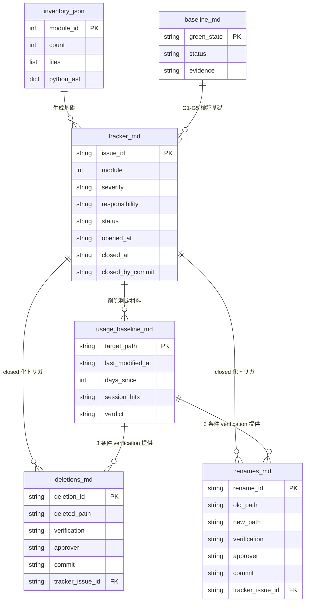

# R-1 Milestone Design: 大規模レビュー & リファクタリング

## メタ情報

| 項目 | 内容 |
|:-----|:-----|
| Milestone | R-1 |
| ステータス | **Approved** (2026-07-05 / spec-critic + HGA #6 Fable 統合) |
| 作成日 | 2026-07-05 |
| SSOT | 本ファイル |
| requirements | [requirements.md](./requirements.md) (Approved 2026-07-05) |
| 関連記録 | `docs/artifacts/2026-07-05-magi-r1-planning.md` (MAGI + gabriel + HGA #5 統合) |

---

## 1. 概要

### 1.1 Problem Statement

B-5 Milestone を通じて積み上げた資産 (dashboard / MAGI v2 / HGA / TDD 内省 v2 / 3.5 層委譲 / AutoMode 等) は個別には機能しているが、**11 モジュール横断の凝集度 / 結合度 / 仕様ドリフト / 規律相互矛盾** は独立に検証されていない。requirements.md で確定した hybrid スコープ (widescan 監査 + layered 実装) + moderate 破壊的変更 + 5 Wave 固定 を実現するための具体設計を本 design.md で確定する。

### 1.2 Non-Goals

- Wave 数を 5 から変更する (FR-8 準拠 / 変更は Milestone 再計画)
- 新機能開発 (R-1 は refactor 専用)
- 後方互換破壊 (gabriel 6 フィールド JSON 契約等の I/O 変更禁止)
- worktree / branch モード (`A2 in-place` 準拠 / master 直改修)
- plugin 由来リソースの改変

### 1.3 Alternatives Considered

**Wave 分割の代替案** (却下):

- **A1 = 3 Wave 案** (監査 / 実装 / 検証): Stage 数が Wave あたり 10+ になり、Stage 末 ship 頻度が下がる → 却下
- **A2 = 8 Wave 案** (各モジュール × 監査/実装): Wave 数固定 FR-8 と矛盾 → 却下
- **B = worktree 領域別並列** (dashboard / rules / hooks 独立): LAM 環境 (Windows + Git Bash) で worktree 未実証 → 却下 (A2 in-place 採用の根拠と整合)

**inventory 再生成手法の代替案**:

- **Glob-only**: 各モジュールを `Glob` パターンで走査 → Python スクリプト不要 / 簡素 / **採用候補 A**
- **Python + AST**: import グラフ解析込みで一括生成 → R-G8 循環依存検出と同居可 / **採用候補 B**
- **手動 + 目視**: 記憶ベースの drift 検出のため却下 (Fable が実測)

**採用**: **B (Python + AST)** — R-G8 と共通のスクリプトで inventory + 循環依存の両方を一発生成 → 保守性 + 速度で最適 (§4 詳細)

### 1.4 Success Criteria

requirements.md §5 (Definition of Done) 準拠。特に:

- MUST: G1-G5 維持 / R-G6-G8 達成 / 5 Wave 完了 / retro 実施
- 観測: HGA #5-#7 実施率 / gabriel 発火統計

---

## 2. Wave 分割設計 (5 Wave × 各 Stage)

各 Wave は Wave 7/8 パターン踏襲 (Stage 分割 + 検証タスク + ゲート条件 + ship + push)。

### 2.0 W-R2 ∥ W-R3 の並列可否と W-R5 gabriel verdict 分岐 (HGA #6 Crux 2-b/2-c 追加)

**W-R2 と W-R3 の並列** (HGA #6 Crux 2-b): 触るファイルは分離するが、以下 3 点で衝突するため **逐次を既定**:
1. tracker は単一ファイル SSOT で両 Wave が status 列を書く → in-place master 直コミットで対応関係が崩れる
2. W-R3 は PM 級ダイアログ頻発 Wave で人間承認レーンがボトルネック → 並列化利得が承認待ちで消える
3. 並列 Wave は互いの Green State 判定 baseline を汚す

**例外**: W-R3 S1 の重複ペア検査 (§9 read-only) は W-R2 実装中に L1 が先行実施可 (上記 3 衝突のいずれにも触れない)。

**W-R5 gabriel verdict 分岐** (HGA #6 Crux 2-c): W-R5 S3 の gabriel が verdict=refuted (severity=critical) を返した場合の処理:
- **α (採用)**: 該当 issue を tracker に新規起票 → R-G6 (tracker 全閉塞) 経由で自然に COMPLETE を block
- 既存の R-G6 機構に載せるだけで新規機構が不要 / 「gabriel は Milestone クローズ判定を block しない」という requirements §5 併記警告 (メタ観測) とは対象が異なる (こちらは検証実体) ため矛盾しない

### 2.0.1 Wave 内 MAGI + gabriel 発火タイミング (spec-critic 見えない前提 対応)

requirements.md FR-7 の適用条件 (判断ポイント 2+ / 影響レイヤー 3+ / 選択肢 3+) を満たす **Wave 内判断** で MAGI + gabriel を発火する。R-1 期の典型的発火点:

| Wave / Stage | 判断ポイント | MAGI + gabriel 発火 |
|:-------------|:-------------|:-------------------:|
| W-R1 S5 | NFR-3 Critical 件数閾値の確定 (10 継続 / 見直し / 別ロジック) | ○ (選択肢 3+) |
| W-R2 S1-S4 | refactor 方針選定 (module 1 の builder.py 分割案 / 統合案) | 判断ポイントごとに ○ |
| W-R3 S2 | docs/internal/ SSOT 統合方針 (統合 / 分離維持 / 部分統合) | ○ |
| W-R3 S3 | .claude/rules/ 相互矛盾解消方針 (rule 単位) | ○ |
| W-R4 S1 | FR-F4 データソース確定 (git log / session log / hybrid / 他) | ○ |
| W-R4 S2-S3 | 削除対象確定 (agent/skill/hook 個別 / batch) | 判断が複数選択肢に分岐する場合 ○ |
| W-R5 S4 | Milestone COMPLETE 判定 (成果評価 / retro 議題化) | ○ |

**W-R1 S1-S4 / W-R2 実装 Stage / W-R5 S1-S3 は原則発火しない** (機械判定 or 検証タスクのみで判断分岐なし)。

### 2.0.2 3.5 層委譲モデルの Stage 分担 (spec-critic 見えない前提 対応 / `CLAUDE.md` §作業体制準拠)

| Stage 種別 | 担当層 | 根拠 |
|:----------|:------|:-----|
| 判断・査定 (MAGI / gabriel / HGA / retro 判定) | L1 (Opus) | 3.5 層委譲モデル §L1 統括 |
| 実装 (TDD 新規コード / refactor) | L2 (Sonnet) | Wave 6-8 で確立したパターン |
| 事実突合 (rubric 採点 / 実装結果検証) | L3 (Haiku) | 3.5 層委譲モデル §L3 採点 |
| L1 直の例外 | 1-3 操作の小規模 Edit / 単発 git 操作 | CLAUDE.md §担当層の判断基準 |

**R-1 期の Wave 別担当**:

- **W-R1**: L1 直 (Sonnet 委譲不要 / 監査は判断そのもの)
- **W-R2 実装 Stage (S1-S4)**: L2 Sonnet (tdd-developer subagent / `disallowedTools: [Agent]` + Executor boilerplate 適用 / `hga-summoning.md` §Sonnet L2 委譲時の追加防御 準拠)
- **W-R3 実装 Stage (S2-S4)**: L1 直 (規律 SSOT 変更は判断そのもの / prose の refactor は L1 判断が主 / 大量の drift 修正が必要な場合は Sonnet 委譲考慮)
- **W-R4 実装 Stage (S2-S4)**: 削除実施は L1 (PM 級判断) / agent-memory 更新は L2 Sonnet 委譲可 (機械的作業)
- **W-R5**: L1 直

### 2.0.3 Stage 内複数 commit の扱い (spec-critic 見えない前提 対応)

Stage 内で複数 commit が必要な場合の運用:

- 各中間 commit は **PG 級** (フォーマット修正・部分実装等 / 破壊的ではない)
- 中間 commit の commit message には `[WIP]` prefix を付与し、closed issue IDs は列挙しない (未確定のため)
- **Stage 末 ship** は「Stage の完了ゲート充足を確認した最終 commit + push」を指し、この commit のみ `closed issue IDs` を列挙 + push 実施
- 中間 commit の push はスキップ可 (Stage 末で一括 push)

**注意**: `git commit` は `security-commands.md` § ask 対象。中間 commit も含めて 1 Stage あたり 3-5 回程度の ask ダイアログを想定。UX 保護のため、Stage 冒頭で中間 commit 予定回数を事前宣言することを推奨。

### 2.1 W-R1: 監査 (Read-Only / FR-1 準拠)

**入力**: R-1 requirements.md Approved / 11 モジュール分類 / MAGI + gabriel + HGA #5 統合結論
**出力**: `docs/artifacts/r-1-audit-tracker.md` (問題リスト tracker) + `docs/artifacts/r-1-green-state-baseline-2026-07-*.md` (Green State 実装確認記録) + `docs/artifacts/r-1-inventory-*.json` (HGA #6 Crux 5-3 対応 / 日付ハードコード解消)

| Stage | 内容 | 入出力 | 完了ゲート |
|:-----:|:-----|:-------|:----------|
| S1 | FR-F0 G1-G5 実装確認 + FR-F1 inventory 再生成 (Python + AST スクリプト作成 + verify_reference_resolution.py 同時作成 / HGA #6 Crux 5-2 前倒し) + **rule-001 R-1 節拡張の適用** (HGA #6 Crux 4-c 前倒し / tracker 生成直後で保険発動) | in: 11 モジュール一覧 / out: inventory.json + baseline.md + verify_reference_resolution.py + rule-001.md 差分 | inventory 実測完了 + G1-G5 状態明文化 + verify script 存在 + rule-001 拡張適用済 (PM 級承認取得) |
| S2 | 循環依存グラフ生成 (§6 詳細) + widescan 監査 module 1-4 (dashboard 系 + tests) | in: inventory.json / out: tracker.md 骨組み + module 1-4 issues | pydeps 相当ツールで循環グラフ生成完了 / module 1-4 セクション完備 |
| S3 | widescan 監査 module 5-8 (hooks + agents + rules + internal) | in: tracker.md / out: 追記 | module 5-8 セクション完備 |
| S4 | widescan 監査 module 9-11 (specs + adr + ルート統治文書) + ヒートマップ生成 | in: tracker.md / out: 追記 + ヒートマップ | 11 モジュール全カバー / ヒートマップ完備 |
| S5 | **HGA #6 消化** (7/7 前必須 / 監査結果妥当性検証 or rubric 事前検証) + Critical 件数閾値確定 | in: tracker.md / out: hga-summon-log.md 追記 + tracker 閾値注記 | HGA #6 発火完了 (hga-summon-log 追記済) + Fable 応答の tracker 反映件数 >= 1 (spec-critic Warning W3 対応: 「反映済」を「1 件以上の tracker 差分 commit」で機械判定) + NFR-3 閾値確定 |

**Stage 末 smoke test**: `python -m pytest .claude/tests/dashboard/test_session_state_parser.py` (rule-001.md 発動)

**Wave 完了ゲート (Green State)**:
- G1-G5 維持
- 11 モジュール全て issue 起票済 (責務タグ + 重要度 + 帰責先 完備)
- ヒートマップ 33 セル (11 × 3) 完備
- HGA #6 消化済 (fallback level 明記)

### 2.2 W-R2: dashboard 領域 refactor (FR-3 in-place / A1 tracker 連動 / TDD Red-Green-Refactor 準拠 spec-critic Warning W2)

**TDD Red-Green-Refactor 単位**: 各 Stage 内で 1 Critical issue = 1 Red-Green-Refactor サイクル。既存 424 テストは維持しつつ、refactor 前に **新規テスト (Red)** で期待動作を先に固定 → refactor 実施 (Green) → 認知複雑度・重複コード観測値記録 (Refactor)。既存テストが十分な場合は Red スキップ可 (Green のみ) だが、その判断を tracker issue のコメント欄に明記する。

**入力**: W-R1 tracker.md (module 1 + module 2 + module 4 の Critical/Warning issues)
**出力**: dashboard/ + scripts/ (dashboard 外) の refactor + tracker status 更新

| Stage | 内容 | 入出力 | 完了ゲート |
|:-----:|:-----|:-------|:----------|
| S1 | module 1 (dashboard/) の Critical 全消化 | in: tracker Critical / out: 実装差分 + tracker status 更新 | module 1 Critical = 0 / 424 テスト維持 |
| S2 | module 2 (scripts/ 外) の Critical 全消化 | in: tracker Critical / out: 実装差分 | module 2 Critical = 0 / smoke test PASS |
| S3 | module 4 (tests/) のテスト分割 / fixture 重複除去 (Warning) | in: tracker Warning / out: テスト構造 refactor | 487 PASS + 14 SKIP 維持 |
| S4 | module 1/2/4 の Warning 全消化 + 認知複雑度・重複コード観測値記録 | in: tracker Warning / out: 実装差分 + observations.md | module 1/2/4 Warning = 0 / observations 完備 |

**Wave 完了ゲート**:
- module 1/2/4 の Critical = 0 かつ Warning = 0
- 487 PASS + 14 SKIP 維持
- 各 Stage 末で ship (commit message に `closed issue IDs` 列挙 / FR-1 準拠)

### 2.3 W-R3: 規律 SSOT 統合 (FR-F3 prose smoke test / HGA #7 発火)

**入力**: W-R1 tracker (module 7 rules + module 8 internal + module 9 specs + module 10 adr + module 11 ルート統治文書 の issues)
**出力**: 規律 SSOT の相互矛盾解消 + 重複ペア検査結果

| Stage | 内容 | 入出力 | 完了ゲート |
|:-----:|:-----|:-------|:----------|
| S1 | **HGA #7 消化** (7/8 以降 / 規律 SSOT 統合の設計軸確定) + 規範文の重複ペア検査 (§9 詳細) | in: tracker + Fable brief / out: hga-summon-log.md 追記 + 重複ペアリスト | HGA #7 発火完了 (hga-summon-log 追記済) + Fable 応答の tracker/design 差分反映 >= 1 件 (spec-critic Warning W3) + 重複ペアリスト完了 (docs/artifacts/r-1-duplicate-pair-audit-*.md 存在) |
| S2 | module 8 (docs/internal/ 憲法 SSOT) の drift 解消 + Q3 β (docs/internal/ 権限等級 SE 級維持 vs PM 昇格) の最終判断 | in: 重複ペアリスト / out: internal 修正差分 | R-G7 W-R3 用 grep 全 PASS |
| S3 | module 7 (`.claude/rules/`) の相互矛盾解消 + rule-001 vs rule-002 の FR-F5 選択実装 | in: 重複ペアリスト / out: rules 修正差分 | R-G7 W-R3 用 grep 全 PASS |
| S4 | module 9 (`docs/specs/`) + module 10 (`docs/adr/`) + module 11 (`CLAUDE.md` + `CHEATSHEET.md`) の一貫性修正 | in: 重複ペアリスト / out: specs/adr/root docs 修正差分 | R-G7 W-R3 用 grep 全 PASS |

**Stage 末 smoke test (prose 資産)**: `.claude/scripts/verify_reference_resolution.py --wave w-r3` (§5 詳細 / R-G7 層 1 grep) + 層 3 unittest

**Wave 完了ゲート**:
- module 7/8/9/10/11 の Critical + Warning = 0
- R-G7 W-R3 用 grep = 0 drift
- HGA #7 消化済 (fallback 記録)

### 2.4 W-R4: hooks / agents 整理 (FR-4 削除 + FR-F2 改名 + agent-memory / TDD 非対称 spec-critic Warning W2)

**TDD Red-Green-Refactor の適用**: W-R4 は prose 資産中心 (agents/skills/hooks は Python + Markdown 混在) のため:
- **削除・改名**: TDD 対象外 (回帰網なし / R-G7 参照解決チェックで代替)
- **agent-memory 更新パス作成**: TDD 対象 (Python スクリプト作成のため / Red-Green-Refactor 適用)
- **hook 重複統合 (S3)**: TDD 対象 (既存 hook テストが存在すれば Red → 統合実装 → Green → Refactor)

**入力**: W-R1 tracker (module 3 skills + module 5 hooks/settings + module 6 agents の issues) + FR-F4 データソース確定結果
**出力**: 削除 / 改名 / agent-memory 更新

| Stage | 内容 | 入出力 | 完了ゲート |
|:-----:|:-----|:-------|:----------|
| S1 | **FR-F4 データソース確定** (§7 詳細 / git log ベース or 代替) + 90 日未使用判定実施 | in: tracker + git log / out: `docs/artifacts/r-1-usage-baseline-*.md` | データソース確定 (成否) / 3 条件 AND 判定完了 |
| S2 | module 6 (agents) 削除 / 改名実施 (PM 級承認要 / 3 条件 AND 済) + agent-memory 対応エントリー無効化 | in: usage-baseline / out: agent 削除 + `r-1-deletions.md` + `r-1-renames.md` + agent-memory 更新 | 削除履歴 + 改名履歴 記録完了 / tracker 該当 issue closed |
| S3 | module 3 (skills / tier=utility のみ削除対象) + module 5 (hooks + settings 重複統合) の同様処理 | in: usage-baseline / out: skills/hooks 削除 + 履歴 | tier=orchestrator 保護維持 / 履歴記録完了 |
| S4 | module 3/5/6 の Warning 全消化 + R-G7 W-R4 用 grep 全 PASS + rule-001 拡張 or rule-002 新設 実施 | in: tracker / out: 実装差分 | R-G7 W-R4 grep = 0 drift / FR-F5 反映済 |

**Stage 末 smoke test (prose 資産 + hook 実行)**: `.claude/scripts/verify_reference_resolution.py --wave w-r4` + `pytest .claude/tests/hooks/`

**Wave 完了ゲート**:
- module 3/5/6 の Critical + Warning = 0
- R-G7 W-R4 用 grep = 0 drift
- 削除/改名履歴完備 / agent-memory 整合

**FR-F4 データソース確定失敗時の分岐**:
- S1 で確定失敗 → S2/S3 の削除タスクを **全て `deferred` に降格** (deferred_reason = `FR-F4 data source undetermined`)
- W-R4 は S3 の agent-memory 更新 + S4 の Warning 消化のみで完了

### 2.5 W-R5: 最終監査 (gabriel + code-review ultra / HGA 召喚なし)

**入力**: W-R1 tracker (全 Wave の消化結果) + W-R2/R3/R4 の実装結果
**出力**: 最終監査レポート + retro + Milestone COMPLETE 判定

| Stage | 内容 | 入出力 | 完了ゲート |
|:-----:|:-----|:-------|:----------|
| S1 | tracker 全閉塞確認 (R-G6) + wip 残存ゼロ確認 | in: tracker / out: 検証レポート | R-G6 達成 / wip = 0 |
| S2 | R-G7 全 grep 通し + R-G8 循環依存再計測 | in: reference resolution script + pydeps / out: 検証レポート | R-G7 全 PASS / R-G8 = 0 or scope 緩和記録 |
| S3 | gabriel adversarial verify (R-1 全体結論) + 独立セッションでの `/code-review ultra` (別セッション実行 / L1 温存) | in: 検証レポート + tracker / out: gabriel probe JSON + code-review 結果 | gabriel 発火完了 + verdict 分岐処理済 (下記 HGA #6 Crux 2-c) / code-review 完了 |
| S4 | R-1 Milestone retro + Milestone COMPLETE 判定 + SESSION_STATE.md 更新 + **rule-001 R-1 節削除** (§8.2 準拠 / spec-critic Warning W7 / HGA #6 Crux 4-c 順序固定) | in: 全 Wave 成果 / out: `docs/artifacts/retro-R1-*-2026-*.md` + rule-001.md 差分 | retro 完成 → COMPLETE 判定承認 → **その後最終操作として** rule-001 R-1 節削除 (順序固定 / 判定が覆った場合の保険を最後まで残す) |

**Wave 完了ゲート = R-1 Milestone COMPLETE**:
- G1-G5 全 Wave 維持
- R-G6/G7/G8 全達成
- 全 5 Wave 完了
- retro 実施済

---

## 3. データフロー

### 3.0 データフロー全体図 (spec-critic Warning W1 対応)



**キー紐付け**:
- `deletions_md.tracker_issue_id` → `tracker_md.issue_id` (削除 = tracker closed 化と同時記録)
- `renames_md.tracker_issue_id` → `tracker_md.issue_id` (改名も同様)
- `usage_baseline_md.target_path` → `inventory_json.files` (削除候補は inventory 由来)

**HGA #6 Crux 2-a 対応: tracker に evidence pointer 列を追加**:

W-R1 監査で起票する tracker の各 issue には以下の evidence pointer を必須付与 (W-R1 完了ゲートに追加):

| 列 | 意味 |
|:---|:-----|
| `evidence_file` | 問題の該当ファイル (絶対パス or repo-relative) |
| `evidence_line` | 該当行番号 (可能なら) |
| `evidence_summary` | 根拠 1 文 (「この関数の cognitive complexity は 22」等 / L2 が再調査不要となる程度) |

W-R1 完了ゲートに追加: 「全 Critical/Warning issue が evidence pointer 3 列を持つ」。Info は evidence 任意 (件数集計のみのため)。

### 3.1 tracker.md

**単一 SSOT**: `docs/artifacts/r-1-audit-tracker.md`

- W-R1 で全 issue 起票 (status = open)
- W-R2/R3/R4 で消化 (status = wip → closed / commit message に `closed issue IDs` 列挙)
- W-R5 で全閉塞確認 (R-G6)
- 破損時: git log 履歴から復元 (requirements.md §4.1 手順)

**モジュール別問題数ヒートマップ** (§4.1 tracker 冒頭):

```
| モジュール         | Critical | Warning | Info |
|:-------------------|:--------:|:-------:|:----:|
| 1. dashboard/      |    N     |    N    |  N   |
| 2. scripts/ (外)   |    N     |    N    |  N   |
| ... (11 行)        |    -     |    -    |  -   |
| 合計               |    N     |    N    |  N   |
```

### 3.2 deletions.md / renames.md

**削除履歴**: `docs/artifacts/r-1-deletions.md`
**改名履歴**: `docs/artifacts/r-1-renames.md` (FR-F2 準拠 / 削除と別ファイル)

**deletions.md スキーマ** (requirements.md §4.2 準拠):

| id | deleted_path | 3 条件 verification | approver | date | commit | tracker_issue_id | REVERTED |
|:---|:-------------|:--------------------|:---------|:-----|:-------|:-----------------|:---------|
| D-001 | .claude/agents/xxx.md | grep 0 / import 0 / 91 days | user | 2026-07-10 | def5678 | R1-042 | - |

- `REVERTED` 列は §11.3 rollback 時のみ埋める (revert commit SHA 記載 / 通常時は `-`)

**renames.md スキーマ** (spec-critic Warning W1 対応 / 新規定義):

| id | old_path | new_path | 3 条件 verification | approver | date | commit | tracker_issue_id | REVERTED |
|:---|:---------|:---------|:--------------------|:---------|:-----|:-------|:-----------------|:---------|
| R-001 | .claude/agents/old-name.md | .claude/agents/new-name.md | grep 0 / import 0 / 91 days | user | 2026-07-11 | ghi9012 | R1-055 | - |

### 3.3 inventory + green-state-baseline

**Inventory**: `docs/artifacts/r-1-inventory-2026-07-06.json` (W-R1 S1 生成 / 実測値)
**Baseline**: `docs/artifacts/r-1-green-state-baseline-2026-07-06.md` (W-R1 S1 生成 / FR-F0 G1-G5 実装確認)

### 3.4 usage-baseline (W-R4)

**Usage baseline**: `docs/artifacts/r-1-usage-baseline-2026-07-*.md` (W-R4 S1 生成 / FR-F4 判定データソース + 90 日未使用判定結果)

**スキーマ** (spec-critic Warning W1 対応 / 新規定義):

| target_path | last_modified_at | days_since | session_hits (直近 90 日) | session_hits_status | verdict |
|:-----------|:-----------------|:-----------|:-------------------------|:-------------------|:--------|
| .claude/agents/xxx.md | 2026-04-01 | 95 | 0 | ok (直近 90 日のセッション数 >= 30) | delete_candidate |
| .claude/agents/yyy.md | 2026-06-30 | 5 | - | - | keep_recent_modified |
| .claude/agents/zzz.md | 2026-04-01 | 95 | 0 | **low_confidence** (直近 90 日のセッション数 < 30) | **hold_low_confidence** |

- `session_hits_status = low_confidence`: 直近 90 日で該当 agent が session log から hit 0 だが、全体のセッション数が少なく (< 30) 偽陰性リスクが高い (spec-critic Warning W6 対応)
- `verdict = hold_low_confidence` の場合、削除対象外として tracker に別 issue 起票 (「Fall back for W-R4 low_confidence usage baseline」)

---

## 4. W-R1 Inventory 再生成手順 (§11-1 確定)

### 4.1 採用スクリプト設計

**方針**: Python + AST + Glob の組み合わせ (§1.3 採用 B)

**スクリプト**: `.claude/scripts/r1_inventory.py` (W-R1 S1 で新規作成)

```python
# 疑似コード (実装は W-R1 S1 で確定)
import ast, glob, json

MODULES = {
    1: ".claude/scripts/dashboard/**/*.py",
    2: ".claude/scripts/*.py",  # dashboard/ 除外
    3: ".claude/skills/**/SKILL.md",
    4: ".claude/tests/**/*.py",
    5: [".claude/hooks/**/*.py", ".claude/settings*.json"],
    6: ".claude/agents/*.md",
    7: [".claude/rules/*.md", ".claude/rules/**/*.md"],
    8: "docs/internal/*.md",
    9: "docs/specs/**/*.md",
    10: "docs/adr/*.md",
    11: ["CLAUDE.md", "CHEATSHEET.md"],
}

inventory = {}
for module_id, pattern in MODULES.items():
    patterns = pattern if isinstance(pattern, list) else [pattern]
    files = sorted(set(f for p in patterns for f in glob.glob(p, recursive=True)))
    inventory[module_id] = {
        "count": len(files),
        "files": files,
        "python_ast": {f: parse_ast(f) for f in files if f.endswith(".py")},
    }

json.dump(inventory, open("docs/artifacts/r-1-inventory-2026-07-06.json", "w"), indent=2)
```

### 4.2 循環依存グラフ生成 (R-G8 用 / §6 と共通)

W-R1 S2 で `pydeps` (§6 で選定) を使用して import グラフ生成 → 循環依存を検出 → tracker に起票。

---

## 5. R-G7 grep パターン設計 (§11-6 / FR-F3 詳細)

### 5.1 W-R3 用パターン (rules 相互参照 / spec-critic Warning W4 対応)

対象: `.claude/rules/*.md` 内の rule 相互参照 + `docs/internal/*.md` 内の spec 参照

```bash
# 【非推奨 / レガシー参考】以下 bash grep は概要示唆用。実運用は下記 verify_reference_resolution.py を使うこと
# パターン 1: rules 内で他 rules.md をパス指定参照 (数字含む rule-NNN + 大文字 + 内部ドット対応 / auto-generated サブディレクトリ対応)
grep -rE '\.claude/rules/(auto-generated/)?[A-Za-z0-9._-]+\.md' .claude/rules/ docs/internal/

# パターン 2: rules 内で "rule-XXX" 名前参照
grep -rE 'rule-[0-9]{3}' .claude/rules/

# パターン 3: internal 内で spec 参照 (dir 形式 + フラット .md 形式両対応)
grep -rE 'docs/(specs|adr)/[A-Za-z0-9_-]+(\.[A-Za-z0-9_-]+)*(/[A-Za-z0-9._-]+\.md)?' docs/internal/
```

**パターン抜け穴の是正 (W4)**: 元パターン `[a-z-]+\.md` は数字を含むファイル名 (`rule-001.md` 等) と auto-generated サブディレクトリを捕捉できなかった。上記は数字も含めた文字クラスに拡張し、`auto-generated/` を optional prefix として明示。

**HGA #6 Crux 1-d 追加是正**:
- **bare-name 参照** (`` `phase-rules.md` `` 等の prefix なし参照) が実測で複数存在するが上記パターンは補足できない
- ~~**ADR flat 直参照** (`docs/adr/0005-*.md` 等) はパターン 3 の末尾 `/` 必須のため補足できない~~ — **HGA #9 refute 対応 (2026-07-06 / R1-006 修正後)**: パターン 3 の末尾は optional (`(?:/([A-Za-z0-9._-]+\.md)?)?`) であり ADR フラット直参照は現行実装 (`verify_reference_resolution.py` L50-52) で補足済。旧記述は R1-006 修正前の欠陥に基づく誤りであった (`test_reference_resolution.py::test_w_r3_pat_spec_ref_matches_dir_and_file` で恒久検証)
- **層 1 の設計を反転**: 「bash grep 単独」ではなく **「Python 側で正規表現 + 存在検査を一体実装」** に寄せる (Windows/Git Bash のクォート地獄回避 + キャプチャグループ抽出 + 存在検査を 1 スクリプトで完結)
- 具体的な Python 実装は W-R3 S1 で `.claude/scripts/verify_reference_resolution.py` として作成 (§5.3 unittest と同ファイル群 / W-R1 S1 の inventory と同居可)

**R1-006 修正反映 (2026-07-06 / HGA #9 refute #2 対応)**:
- 上記 bash grep は「概要示唆」用途に留める (Windows/Git Bash のクォート地獄で層 1 として不安定 / bash 文字クラス表記と Python re の同一性を保証できない)
- **正規の R-G7 gate 実行手段は Python 実装** (`python .claude/scripts/verify_reference_resolution.py --wave w-r3 --exit-nonzero-on-drift`)
- 文字クラスの正本は Python 実装側 (パターン 1 group 1 と パターン 3 group 3 は `[A-Za-z0-9._-]+`、パターン 3 slug は `[A-Za-z0-9_-]+(?:\.[A-Za-z0-9_-]+)*` の非対称設計 / 末尾ドット quirk による Windows platform 依存を回避)

各出力パスを `os.path.exists()` で存在検査 → 実在しない = drift → tracker 起票。

### 5.2 W-R4 用パターン (skills + agents frontmatter / spec-critic Warning W4 対応)

対象: `.claude/skills/**/SKILL.md` frontmatter + `.claude/agents/*.md` frontmatter

```bash
# パターン 1: skills frontmatter tools 参照 (subagent_type)
grep -rE 'subagent_type[":=\s]+["\047]?[a-z0-9-]+' .claude/skills/

# パターン 2: skills / agents frontmatter で他 agent 名参照 (複数記法対応)
grep -rE 'Agent\(([a-z0-9-]+)\)|subagent_type[":=\s]+["\047]?[a-z0-9-]+' .claude/skills/ .claude/agents/

# パターン 3: verdict フィールド名整合 (gabriel 契約 6 フィールド)
grep -rE '(verdict|severity|affected_atoms|reasoning|recommended_action|confidence)' .claude/agents/gabriel.md .claude/skills/magi/SKILL.md .claude/scripts/magi_dispatch.py
```

**パターン抜け穴の是正 (W4)**: 元パターン `Agent\(([a-z-]+)\)` は関数呼び出し記法のみを想定していたが、実際の subagent 起動は複数記法がある:
- `subagent_type="xxx"` (キーワード引数)
- `subagent_type: "xxx"` (YAML frontmatter)
- `subagent_type=xxx` (等号記法)

上記の `subagent_type[":=\s]+["\047]?[a-z0-9-]+` はこの 3 記法を統一的に捕捉。`\047` はシングルクォート。層 3 unittest (§5.3) で追加補完。

各出力を実在 agent と照合 → 実在しない agent = drift。

### 5.3 層 3 unittest (パターン列挙 / HGA #6 Crux 5-2 対応)

`.claude/tests/rules/test_reference_resolution.py` と `.claude/scripts/verify_reference_resolution.py` (**両方 W-R1 S1 で新規作成 / inventory と同時 / HGA #6 Crux 5-2 の宙浮き是正**) — 変数展開・間接参照など grep で捕捉困難なパターンを逐条列挙で検査:

```python
# 例
def test_agent_references_in_hga_summoning_rule():
    with open(".claude/rules/hga-summoning.md") as f:
        content = f.read()
    # hga-summoning.md 内で言及される agent 名が実在するか
    referenced_agents = re.findall(r'\bsubagent_type["\s:=]+([a-z-]+)', content)
    for agent in referenced_agents:
        assert (Path(".claude/agents") / f"{agent}.md").exists(), \
            f"{agent} referenced in hga-summoning.md but does not exist"
```

---

## 6. R-G8 循環依存検出ツール選定 (§11-8 確定 / spec-critic Warning W5 対応 / HGA #6 Crux 1-a 主従反転)

**選定**: **自作 Python `ast.parse()` + 自前 DFS 循環検出 (主経路)** / pydeps は不採用

**HGA #6 実測に基づく反転根拠**:
- 現環境で `pydeps` / `networkx` / graphviz `dot` の 3 つ全てが未インストール
- `.claude/scripts/__init__.py` および `.claude/hooks/__init__.py` が **不在** (パッケージでない / dashboard/ のみパッケージ)
- pydeps はパッケージ単位の解析器であり、R-G8 対象の大半 (loose scripts) と解析モデルが不整合
- 循環検出は数十ノード規模のため自前 DFS で十分 (networkx 不要)

**対象範囲の明確化 (W5)**:
- **R-G8 検査対象**: `.claude/scripts/dashboard/**/*.py` + `.claude/scripts/*.py` (dashboard 内外の全 Python)
- **R-G8 検査対象**: `.claude/hooks/**/*.py` (hook スクリプト)
- **R-G8 検査対象外**: `.claude/tests/**/*.py` (test 内の循環は問題化しない / test fixture 循環は Warning 級で観測記録のみ)

module 4 (tests) 内の循環は R-G8 スコープ外 (Milestone COMPLETE を block しない)。ただし W-R1 S2 で観測値として記録し、W-R2 S3 (tests refactor) で対応可能性を tracker に起票。

**根拠 (更新)**:
- 自作 AST は W-R1 S1 の inventory スクリプトと完全同居 (同じ Python ファイル探索を共有)
- Windows + Git Bash 環境で外部バイナリ依存 (graphviz) を回避
- pydeps 経路は「対象がパッケージ化されている」前提だが R-G8 対象は大半が loose scripts
- 循環検出アルゴリズムは DFS + 訪問済スタック管理で数十行 (`networkx.simple_cycles` 相当を自作)

**採用手順**: `.claude/scripts/r1_inventory.py` (W-R1 S1) 内で:
1. Python ファイル一覧を Glob で取得 (§4.1 MODULES dict の module 1/2/5)
2. 各ファイルを `ast.parse()` → `import` / `ImportFrom` ノード抽出 → モジュール名解決
3. 有向グラフ (dict[str, set[str]]) 構築
4. DFS で循環検出 → tracker に R-G8 issue 起票

**pydeps 復活の条件**: BUILDING で「自作 DFS で見落としが判明」 or 「グラフ可視化が必要」となった場合のみ pydeps 導入検討 (現時点では不要)。

---

## 7. FR-F4 削除判定データソース (§11-4 確定)

### 7.1 採用方針 (HGA #6 Crux 1-b/1-c 実測反映)

**主データソース**: `git log --all --format='%aI %H' -- <file>` の**最終 touch commit の日付** (filter なし)

**変更点** (HGA #6 実測): 旧設計の `--diff-filter=M` を削除。理由は追加のみのファイル (add-only) で空を返し、「git log 破損」と「単に修正されていない」の区別が付かないため。filter なしで最終 touch を取れば追加も修正も統一的に扱える。

**改名追跡**: 過去の改名歴のみ `--follow` で補完 (R-1 期内の改名は renames.md が正)。

**判定窓の非対称性を明記**:
- **git log**: 全期間 (制限なし)
- **session log**: 直近 **30 日窓** (HGA #6 実測 / cleanupPeriodDays 既定 30)
- この非対称は Claude Code CLI の保持窓の実態に沿った不可避の縮退

**「更新なし = 未使用」の代用関係の限界** (HGA #6 Crux 1-c):
- 安定稼働している agent/skill/hook ほど編集不要で「30 日以上更新なし」条件を容易に満たしてしまう
- 結果として **判定の全重量が session log 30 日窓 に落ちる**
- 3 条件 AND の第 3 条件は実質「session log 単独判定」に縮退している自覚を持って運用
- **最終防衛線は PM 級承認 (人間判断)**。データソースは補助情報

### 7.2 補助データソース (HGA #6 Crux 5-1 反映 / リソース種別別)

**リソース種別別の使用検出パターン**:

| リソース種別 | 使用検出パターン | パターン確定タイミング |
|:-----------|:---------------|:----------------------|
| **agents** (`.claude/agents/*.md`) | jsonl 内で `subagent_type=<agent_name>` を grep | W-R4 S1 直ちに |
| **skills** (`.claude/skills/**/SKILL.md`) | jsonl 内で Skill 起動記録の該当 skill 名を grep (フィールド名は W-R4 S1 で実 jsonl 1 本開いて確定 / **要検証の仮定**) | W-R4 S1 で実 jsonl 検査 |
| **hooks** (`.claude/hooks/*.py`) | `.claude/settings*.json` の hook 配線に登録されているか + PostToolUse log 等で実行痕跡確認 | W-R4 S1 |

**重要**: 旧設計の「skills も subagent_type で grep」は **HGA #6 Crux 5-1 で否定** (Skill tool 経由起動は subagent_type に現れない)。この誤設計のまま実装すると module 3 の全 skills が「hit 0」を返して偽陽性削除の直行便になる。

### 7.3 判定フロー (spec-critic Warning W6 + HGA #6 Crux 1-b/1-c/5-1 対応)

```
削除候補: リソース X (agent / skill / hook のいずれか)

1. grep 参照ゼロ (repo 全体) ?
   No  → 削除対象外
   Yes → 2 へ

2. import 参照ゼロ (Python) ?
   No  → 削除対象外
   Yes → 3 へ

3. git log 最終 touch commit の日付が 90 日以上前 ?
   (filter なし / 全期間対象)
   No  → 削除対象外 (最近触られている)
   Yes → 4 へ

4. リソース種別別パターンで直近 30 日窓の session log 内に起動記録あり ?
   (agents: subagent_type=X / skills: Skill 起動記録 / hooks: settings 配線 + 実行痕跡)
   Yes → 削除対象外 (最近使われている)
   No  → 5 へ

5. session log 直近 30 日の全セッション数 >= 30 ?
   No  → **削除保留** (verdict=hold_low_confidence / 偽陰性リスク大 / usage-baseline に low_confidence 記録)
   Yes → 削除対象 (3 条件 AND 全達成)
```

**判定窓の変更** (HGA #6 Crux 1-b): Step 3 は git log 全期間 / Step 4-5 は session log 30 日窓 (実運用保持窓)。**「90 日窓」の呼称は旧要件由来だが実質 30 日窓で運用**。

**リソース種別分岐** (HGA #6 Crux 5-1): Step 4 のパターンはリソース種別により異なる。skills を subagent_type で判定すると全 skills が偽陽性化するため、種別別パターンを W-R4 S1 で確定。

**低信頼度の判定基準**: 直近 30 日のセッション数 < 30 は「使用実績が少ないため 0 hit は偽陰性の可能性」と判定。30 は仮閾値 (BUILDING で調整可 / SE 級)。

### 7.4 データソース確定失敗の判定

以下いずれかに該当した場合、FR-F4 データソースは「確定失敗」とし、W-R4 削除タスクを deferred 降格 (requirements.md FR-4 fallback 準拠):

- git log が壊れている / rebase で履歴が消失した agent がある
- session log が過去 90 日以内にアクセスできない (`.claude/projects/` が新規セッション初期化により消失した等)
- 3-4 の判定で「無視できない偽陽性率」(推定 20% 超) がある

---

## 8. FR-F5 rule-001 拡張 vs rule-002 新設 (§11-5 確定)

### 8.1 選定: **rule-001 拡張** (単一ルール継続)

**根拠**:
- rule-001 は SESSION_STATE.md fallback 保守 → tracker は R-1 期のみの一時的 artifact
- 独立 rule 化すると R-1 完了後に rule-002 が「使われないルール」として残る (棚卸し対象)
- rule-001 に「R-1 期のみ追加項目」として `docs/artifacts/r-1-audit-tracker.md` を含める → R-1 完了時に該当行を削除 (PM 級承認要)

### 8.2 rule-001 拡張差分 (W-R1 S1 で適用 / HGA #6 Crux 4-c 前倒し)

**旧設計**: W-R4 S4 で適用 → **HGA #6 Crux 4-c で指摘: 拡張の価値は W-R1-W-R3 期にある。W-R4 S4 適用は用済み時点**。tracker は W-R1 S1 で生成されるため、セッション断絶リスクが最も高い W-R1-W-R3 期 (Milestone の大半) に tracker 復旧チェックリストが存在しない **timing bug**。

**是正**: W-R1 S1 (tracker 生成直後) に前倒し。PM ダイアログ 1 回増だが「保険が保険として機能する期間を買う」対価として妥当。W-R5 S4 での「R-1 節削除」は最終操作として順序固定。

```diff
 ## 適用範囲

 - 対象ファイル: `SESSION_STATE.md`（gitignore 対象・ローカル限定)
 - 対象操作: `Edit` / `Write`
 - 適用者: L1 / L2 (Sonnet 委譲経路含む)

+### R-1 期のみの追加項目 (2026-07-05〜R-1 完了)

+- セッション断絶時の復旧チェックリストに以下を追加:
+  - `docs/artifacts/r-1-audit-tracker.md` の存在確認 (破損時は requirements.md §4.1 手順で git log から復元)
+  - `.claude/gabriel-metrics.log` の JSONL 整合性確認 (retry_count 連番の欠損確認)
+- R-1 Milestone COMPLETE 後に本節を削除 (PM 級承認要)
```

---

## 9. 規範文の重複ペア検査手法 (§11-3 確定)

### 9.1 検査対象の定義

「重複ペア」= 同一命題を 2 箇所以上で述べている文書のペア。特に:

- `.claude/rules/decision-making.md` が「SSOT: 06_DECISION_MAKING.md、本ファイルは実行時要約」を宣言 → decision-making.md × 06_DECISION_MAKING.md = 意図された重複ペア
- 同様に他の rules/*.md が SSOT 親を宣言している場合、親との差分検査必須

### 9.2 検査手順 (W-R3 S1)

**Step 1**: `.claude/rules/*.md` の冒頭 30 行から「SSOT」「実行時要約」「元は」等の宣言文を grep で抽出

```bash
grep -lE '(SSOT.*docs/internal|実行時要約|要約版|元.*は)' .claude/rules/*.md
```

**Step 2**: ヒットした rules について、宣言された親 SSOT (`docs/internal/*.md`) を特定 → 内容差分を diff で確認

```bash
# 例: decision-making.md × 06_DECISION_MAKING.md
diff <(grep -oE '^###?\s.*' .claude/rules/decision-making.md) \
     <(grep -oE '^###?\s.*' docs/internal/06_DECISION_MAKING.md)
```

**Step 3**: 差分に「親側にあるが要約側にない」重要項目 (M 命題以上) がある場合、要約側の更新 or 明示的省略記述追加。

### 9.3 検査結果の記録

`docs/artifacts/r-1-duplicate-pair-audit-2026-07-*.md` に検査対象 rules × 親 SSOT の pair 一覧 + 差分要約 + 対応方針 (更新 / 省略明記 / 統合) を記録。

---

## 10. HGA #6 / #7 発火の具体的手順

### 10.0 HGA スケジュール変更履歴 (2026-07-05)

- **元計画** (requirements.md FR-6): #5 = R-1 スコープ crux (2026-07-05 消化済) / #6 = W-R1 監査結果検証 (7/7 前) / #7 = W-R3 SSOT 統合 (7/8 以降)
- **現行** (design.md HGA #6 追加により変更): #5 = 済 / **#6 = design.md adversarial review** (2026-07-05 消化済) / **#7 = W-R1 監査結果検証** (7/7 前) / **#8 = W-R3 SSOT 統合** (7/8 以降)
- **requirements.md FR-6 SHOULD 逸脱記録**: HGA 4 回目 (計 4 召喚) は FR-6 で明記された 3 回構成からの逸脱だが、SHOULD であるため requirements.md §5 の「SHOULD 逸脱は retro 集計対象、COMPLETE 阻害要因ではない」原則に沿う。requirements 本文改訂は不要 (retro で議題化)
- **design 承認後の Fable 再確認は原則不要** (HGA #6 Crux 3-c 明文化): design.md 変更が生じた場合は spec-critic / gabriel で対応。envelope 漏出防止のため

### 10.1 HGA #7 (旧 #6 / W-R1 S5 / 7/7 前必須)

**発火条件** (第一候補):
- W-R1 S1-S4 完了 (tracker 完成 + ヒートマップ完備)
- 対象: 「監査結果の妥当性検証」 (Fable に tracker 全体を渡し「見落とし / 誤分類 / 統合すべきペア」を crux 出力)

**発火条件** (fallback / スライド):
- W-R1 S4 が 7/7 までに完了しない見込み判明
- 対象: 「W-R1 監査 rubric / チェックリスト事前検証」 (Fable に requirements.md + 未完成 tracker 骨組みを渡し「監査 rubric の抜け / 責務タグ体系の妥当性」を crux 出力)

**発火手順**:
1. Fable brief 起草 (計画書 §3.2 + hga-summoning.md §召喚手順 準拠 / 索引 push + currency push + hedge 指示)
2. `Agent` tool with `model=fable` + `subagent_type=general-purpose` で発火
3. 応答を anchor `docs/artifacts/2026-07-*-fable-hga-7.md` に統合
4. hga-summon-log.md に記録

### 10.2 HGA #8 (旧 #7 / W-R3 S1 / 7/8 以降 / 従量)

**発火条件**:
- W-R3 S1 開始時 (規律 SSOT 統合の設計軸確定)
- 対象: 「規範文の重複ペア検査結果を踏まえた統合方針の crux」 (Fable に §9 検査結果 + 対応方針 3 案を渡し crux 分岐)

**envelope**: $2-3 圏想定 (#4 型パターン準拠 / 索引 push + 事実収集 L1 完了)

**発火手順**: #7 と同じ (anchor `docs/artifacts/2026-07-*-fable-hga-8.md`)

### 10.3 HGA #6 期限内消化失敗時の 3 段 fallback (requirements.md FR-6 準拠)

Level 1 → Level 2 → Level 3 の段階的 fallback を design 上で明示:

**Level 1 (7/7 中の部分検証 / spec-critic Warning W8 対応 で下限閾値明記)**:
- W-R1 S4 完了までのモジュール分のみで tracker を Fable に渡す
- **下限閾値**: **11 モジュール中 6 モジュール以上完了** (半数超) が Level 1 発火の下限。6 モジュール未満なら Level 2 に直接移行 (部分検証の crux 品質が担保できないため)
- Fable brief に「部分検証であること + 完了済モジュール一覧 + 残 module のスキップ理由」を明示 → 応答は既存 module のみに対する妥当性判定に限定

**Level 2 (#7 統合召喚)**:
- 7/8 以降 (従量) に #6 + #7 を統合 (Fable brief 1 本で「監査事後検証 + SSOT 統合設計軸」の両方を crux 化)
- envelope 想定: $4-6 (通常の #7 $2-3 + #6 相当 $2-3)

**Level 3 (A2/HGA スケジュール再 MAGI)**:
- MAGI 4 Atom retry_count=0 リセット許可 (通常は 1 上限だが Milestone 継続可否判定のため例外)
- 再 MAGI 結論次第で R-1 継続 or Milestone 保留判断

### 10.4 HGA envelope 合算監視 (spec-critic Critical C3 対応)

requirements.md NFR-5「実 $ envelope 月 $10-40」の担保のため、R-1 期の HGA 召喚累計を各召喚直後にチェック:

**チェック手順**:
1. 召喚実施直後に `hga-summon-log.md` の R-1 期エントリー (#5 以降) の実測コストを合算
2. 合算値が **月 $10 到達で warning 記録** / **月 $40 到達で追加召喚 blocker**
3. 実測コスト未確定 (jsonl 直読み待ち) の召喚は想定額 (log 記載) で暫定合算

**R-1 期の想定合算 (現時点予測 / HGA #6 追加後の 4 召喚構成)**:

| 召喚 | 想定額 | 実測 |
|:----|:------:|:----:|
| #5 (2026-07-05 / R-1 スコープ crux) | $2-5 | 未確定 (次日 jsonl 直読み) |
| **#6 (2026-07-05 / design.md adversarial review / 本追加)** | **$2-5** | **未確定 (次日 jsonl 直読み)** |
| #7 (旧 #6 / 7/7 前必須 / W-R1 監査結果検証 or rubric 事前検証) | $2-4 | - |
| #8 (旧 #7 / W-R3 / SSOT 統合 / Level 2 発火時は $4-6 統合) | $2-3 (通常) / $4-6 (Level 2) | - |
| 合計 (通常経路) | **$8-17** | - |
| 合計 (Level 2 fallback 経路) | **$10-20** | - |
| 合計 (Level 3 fallback 経路 / +再 MAGI 追加召喚 $3-5) | **$13-25** | - |

いずれの経路でも月次上限 $40 に大きな余裕を残す。ただし想定額の実測乖離が判明した時点で本表を更新する。

**7/7 期限との関係** (HGA #6 Crux 3-b): W-R1 は 5 Stage あるため 7/7 までに S1-S4 を完了できない場合 #7 は従量域に落ちるが、従量でも $2-4 で envelope 内。「7/7 死守のために W-R1 監査品質を削る逆転」は避けよ。§10.3 Level 1 (6 モジュール下限) が既にこの吸収機構として設計されている。

**Level 3 fallback 発火時の追加コスト見積り**:
- 再 MAGI 結論に基づく追加 HGA 召喚 (最悪 1 回) → $3-5 加算
- 3 段 fallback を全経路辿った場合の最悪合算 → **$11-20** (依然月次上限内)

**合算監視の担当**: 各召喚実施者 (L1) が hga-summon-log.md 追記時に必ず合算値を再計算 → 上限接近時は次召喚の要否を再判断。W-R5 retro での月次集計は事後確認 (blocker ではない)。

---

## 11. 削除フロー (A3 × A1 tracker 連動 / MAGI 統合結論 準拠)

### 11.1 削除実施手順 (W-R4 各 Stage)

```
1. 削除候補特定 (grep 参照ゼロ)
2. import 参照ゼロ確認
3. FR-F4 データソースで 90 日未使用判定
4. 3 条件 AND 達成確認 → PM 級承認要求 (事前宣言)
5. ユーザー承認取得
6. 削除実施:
   a. `git rm <path>`
   b. deletions.md に 1 行追記 (id / deleted_path / 3 条件 verification / approver / date / commit / tracker_issue_id)
   c. tracker の該当 issue を closed に更新 (closed_by_commit = 削除 commit SHA)
   d. agent 削除の場合、agent-memory の対応エントリーを無効化 or 削除
7. Stage 末 ship (commit message に closed issue IDs 列挙)
```

### 11.2 改名実施手順 (FR-F2 準拠 / 削除と同様)

削除手順の 6-a を以下に置換 + renames.md に記録:

```
6-a-rename. `git mv <old_path> <new_path>` + import 参照更新
6-b-rename. renames.md に 1 行追記 (id / old_path / new_path / verification / approver / date / commit / tracker_issue_id)
```

### 11.3 削除・改名の rollback 手順 (spec-critic Critical C1 対応)

削除 / 改名 commit が push 後に誤りと判明した場合の復旧経路:

**発動条件** (いずれか):
- 削除 push 後の CI / smoke test で「実は参照が残っていた」判明
- 削除された agent-memory 依存 (改名時の追従漏れ) が別 Stage で顕在化
- ユーザーが削除 / 改名の妥当性を撤回

**復旧手順 (PM 級承認要 / 削除実施と同等の承認等級)**:

```
1. 誤削除 / 誤改名 commit の SHA を deletions.md / renames.md から特定
2. PM 級承認要求 (事前宣言 / revert commit 案の SHA と対象 path を明示)
3. ユーザー承認取得
4. rollback 実施:
   a. `git revert <commit>` で削除 / 改名を打ち消し (新規 commit として)
   b. deletions.md / renames.md に「REVERTED」列を追加し、当該行に revert commit SHA を記載 (行削除ではない / 履歴保持)
   c. tracker の該当 issue を `closed` → `open` に再オープン (reopened_at 列追加)
   d. agent 削除の場合、agent-memory の対応エントリーを復元 (git log から git checkout で復元)
5. rollback commit を Stage 末 ship (commit message に「REVERT: closed issue IDs …」列挙)
6. SESSION_STATE.md に rollback 実施を記録
```

**revert commit の承認等級**: **PM 級**。「削除を打ち消す」も blast radius は削除同等 (状態変更の逆方向) のため、削除実施と同じ承認等級を要求する。SE 級の緊急対応にしない (整合性確保のため)。

**agent-memory 復元手順**:

```bash
# agent-memory ディレクトリの直近生存 commit を特定
git log --all --oneline -- .claude/agent-memory/<agent-name>/

# 該当ディレクトリを復元
git checkout <commit>~1 -- .claude/agent-memory/<agent-name>/
```

**復旧失敗時のエスカレーション**: `git revert` が conflict を起こす場合 (削除後に該当 path で新規追加や改変が発生した場合)、L1 が手動解消 → 解消不能なら R-1 Milestone の A2 (in-place) 前提を再 MAGI 合議で見直し (retry_count=0 リセット許容)。

---

## 12. 依存関係

**外部ツール依存**:
- `pydeps` (§6 / R-G8 循環依存検出)
- Python 3.10+ (AST parse 用)
- `networkx` (循環検出用 / pydeps に同梱 or 別途)

**内部依存**:
- rule-001.md (rule-002 新設ではなく拡張採用 / W-R4 S4 で改訂)
- gabriel Wave C v0.4.0 (probe 6 フィールド JSON 契約)
- HGA #5-#7 (Fable スポット召喚 / 7/7 期限)

---

## 13. リスクと緩和策

| リスク | 影響 | 緩和策 |
|:------|:-----|:-------|
| pydeps が Windows で動作不可 | R-G8 検出不能 | Python AST + networkx 自作 fallback (§6) |
| FR-F4 データソース確定失敗 | W-R4 削除タスク全 deferred | W-R4 は非削除タスクで完了 (S3 agent-memory / S4 Warning 消化) |
| HGA #6 7/7 期限内消化失敗 | HGA schedule 破綻 | 3 段 fallback (§10.3) |
| gabriel 3 連続 refute | MAGI 判断停滞 | requirements.md FR-7 自動人間エスカレーション |
| W-R1 で issue 数 100+ 件 → 認知過負荷 | Wave 進行阻害 | NFR-3 実測後閾値見直し + ヒートマップ |
| Wave 内 scope creep | Wave 数固定違反 | FR-8 tracker deferred 分離 + 昇格 1 本 |
| tracker ファイル破損 | 進捗喪失 | requirements.md §4.1 git log 復元手順 |

---

## 14. 権限等級 (Stage 単位 / spec-critic Critical C2 対応)

各 Wave × Stage 単位の変更対象と等級 (requirements.md §7 のファイル単位表記と整合):

| Wave / Stage | 主対象 | 等級 | 事前宣言 |
|:-------------|:-------|:---:|:-------:|
| W-R1 S1 | inventory 生成 + G1-G5 baseline 記録 | SE 級 | 不要 |
| W-R1 S2 | 循環依存グラフ生成 + tracker 起票 (module 1-4) | SE 級 | 不要 |
| W-R1 S3 | tracker 起票 (module 5-8) | SE 級 | 不要 |
| W-R1 S4 | tracker 起票 (module 9-11) + ヒートマップ | SE 級 | 不要 |
| W-R1 S5 | HGA #6 消化 + tracker 閾値注記 | SE 級 | 不要 (HGA 発火自体は SE) |
| W-R2 S1-S4 | dashboard/scripts/tests refactor | SE 級 | 不要 |
| W-R3 S1 | HGA #7 + 重複ペア検査 (docs/artifacts/) | SE 級 | 不要 |
| W-R3 S2 | `docs/internal/` 修正 | SE 級 (**注記** / requirements §7 Q3 β) | 不要 |
| W-R3 S3 | `.claude/rules/` 修正 | **PM 級** | **要** |
| W-R3 S4 | `docs/specs/` + `docs/adr/` + ルート統治文書 | **PM 級** | **要** |
| W-R4 S1 | FR-F4 データソース確定 (非破壊調査) | SE 級 | 不要 |
| W-R4 S2 | agents 削除 / 改名実施 | **PM 級** | **要** (削除ごと) |
| W-R4 S3 | skills / hooks 削除実施 | **PM 級** | **要** (削除ごと) |
| W-R4 S4 | agent-memory 更新パス + Warning 消化 (**rule-001 拡張は W-R1 S1 に前倒し済 / spec-critic Critical 3**) | SE 級 (Warning 消化) + agent-memory はコード追加 | 不要 |
| W-R1 S1 (T6) | **rule-001 R-1 節拡張 (HGA #6 Crux 4-c 前倒し)** | **PM 級** (rules/auto-generated/) | **要** (Stage S1 冒頭で一括宣言 / spec-critic Warning 4) |
| W-R5 S1 | tracker 全閉塞確認 (read-only) | PG 級 | 不要 |
| W-R5 S2 | R-G7/G8 検証 (read-only) | PG 級 | 不要 |
| W-R5 S3 | gabriel + `/code-review ultra` | SE 級 | 不要 |
| W-R5 S4 | retro + Milestone COMPLETE 判定 | SE 級 (retro) + **PM 級** (判定) | 判定時要 |

**削除 / 改名の PM 級事前宣言運用** (W-R4 S2/S3 / HGA #6 Crux 4-a 明確化): 削除実施の実体は **Bash `git rm` = ask 対象** (PM 級 hook は Edit/Write のパス判定のため git rm には作用しない)。同一 Stage 内で承認済削除リストを 1 回の複数パス指定 `git rm <path1> <path2> ...` に束ねれば ask は Stage あたり 1 回。宣言リストと実行リストの文字単位一致を deletions.md 追記時に L3 Haiku で突合 (適所)。

**W-R3 S2 の docs/internal/ 権限等級** (HGA #6 Crux 4-b 修正):
- **平時**: requirements.md Q3 β 準拠で SE 級維持
- **W-R3 S2 の間のみ**: **自主的 PM 運用** (`core-identity.md` §PM 級編集の事前宣言義務 パターン適用)。W-R3 S2 は Hierarchy of Truth 第 2 位の憲法 8 文書を書き換える Stage であり、SE 級で流すのは「監査対象の drift を監査作業自身が利用する」自己矛盾。**Stage 冒頭に 8 ファイルの編集計画を 1 回宣言 + 一括承認**を取る (実質 PM ダイアログ 1 回 / hook 変更ゼロ)
- **permission-levels.md 改訂の是非**: W-R3 S3 (`.claude/rules/` 修正) の議題として維持

---

## 15. 未決定事項 (tasks.md で確定)

- [ ] 各 Stage の具体的なテスト起票 (どのテストを先に書くか / §2.2 / §2.4 のサイクル方針は確定 / 個別テストは tasks.md)
- [ ] HGA #6 の第一候補 vs スライド判断の分岐日時 (7/6 中 or 7/7 朝?)
- [ ] W-R2 S1-S4 の具体的 refactor 対象 (W-R1 tracker 完成後に確定)
- [ ] **W-R3/R4 の同時進行可否** (spec-critic 見えない前提 対応): 触るファイル完全分離が **理論上は成立するが実運用では困難**:
  - W-R3 は `.claude/rules/` を修正
  - W-R4 S4 も `.claude/rules/rule-001.md` を修正 (rule-001 拡張)
  - **判定**: W-R3 完全終了 → W-R4 開始 の逐次進行を **既定** とする (並列不可)。並列可否を tasks.md で最終判断だが、現時点では逐次推奨。

---

## 16. 変更履歴

| 日付 | 変更者 | 内容 |
|:-----|:-------|:-----|
| 2026-07-05 | L1 (Opus 4.7) | 初版起草 (requirements.md Approved + §11 未決定 8 項目確定) |
| 2026-07-05 | L1 (Opus 4.7) | spec-critic 独立レビュー Critical 3 + Warning 8 + 見えない前提 4 反映 (§11.3 rollback / §14 Stage 単位権限等級 / §10.4 envelope 合算 / §3.0 ER 図 / §3.2 renames スキーマ / §3.4 usage-baseline スキーマ / §7.3 低信頼度分岐 / §5 grep 抜け穴修正 / §6 対象範囲明示 / W-R1 S5 / W-R3 S1 反映済ゲート機械判定化 / W-R5 S4 rule-001 削除紐付け / §2.0 MAGI+gabriel 発火 / §2.0.1 委譲層分担 / §2.0.2 中間 commit 扱い / §15 W-R3/W-R4 逐次進行) |
| 2026-07-05 | L1 (Opus 4.7) | HGA #6 Fable adversarial review 反映 Design SE 15 件: §6 pydeps → 自作 AST 反転 (Crux 1-a) / §7.1-7.3 保持窓 30 日 + git log filter 除去 + リソース種別別 (Crux 1-b/1-c/5-1) / §5 grep bare-name + ADR flat + Python 一体実装 (Crux 1-d) / §3.0 tracker evidence pointer (Crux 2-a) / §2.0 W-R2∥W-R3 逐次 + W-R5 verdict α (Crux 2-b/2-c) / §10.0 リナンバー + §10.4 4 召喚合算 (Crux 3-a/3-b) / §10.0 Fable 再確認不要明記 (Crux 3-c) / §14 束ね削除 + W-R3 S2 自主 PM (Crux 4-a/4-b) / §8.2 rule-001 W-R1 S1 前倒し + W-R5 S4 順序固定 (Crux 4-c) / verify_reference_resolution.py W-R1 S1 配置 (Crux 5-2) / inventory 日付緩め (Crux 5-3) |

---

## 17. 参照

- [requirements.md](./requirements.md) (Approved)
- MAGI 記録: `docs/artifacts/2026-07-05-magi-r1-planning.md`
- HGA 記録: `docs/artifacts/hga-summon-log.md`
- gabriel メトリクス環境: `docs/artifacts/gabriel-metrics-environment-2026-07-05.md`
- Green State: `docs/specs/green-state-definition.md`
- MAGI 規律: `.claude/rules/decision-making.md`
- HGA 規律: `.claude/rules/hga-summoning.md`
- 品質基準: `.claude/rules/code-quality-guideline.md`
- 権限等級: `.claude/rules/permission-levels.md`
- rule-001: `.claude/rules/auto-generated/rule-001.md`
