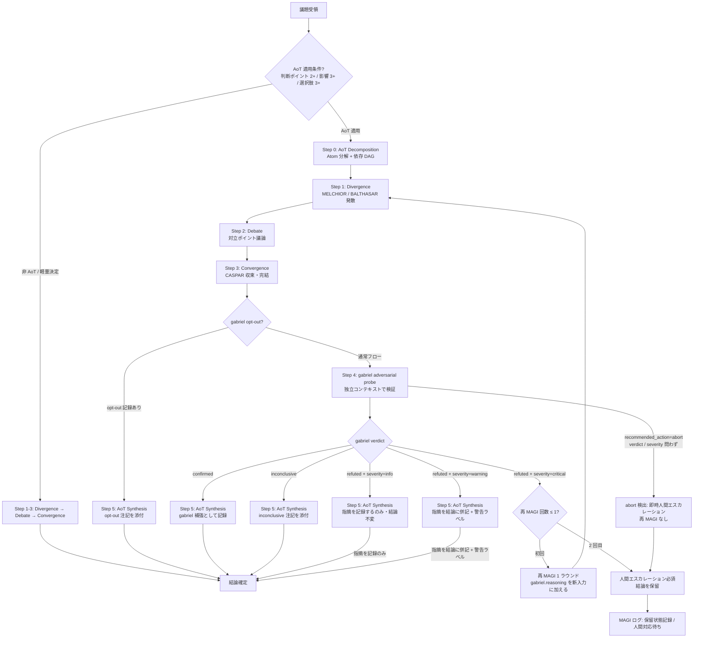

# 設計書: MAGI v2 — gabriel Adversarial Verifier Integration

- バージョン: 0.4.0
- 作成日: 2026-06-29
- ステータス: Draft（PM 承認待ち）
- 根拠文書: `docs/specs/magi-v2-gabriel/requirements.md` v0.4.0
- 参照文書:
  - `docs/adr/0007-magi-v2-gabriel-integration.md`（意思決定根拠 / 採用・却下選択肢）
  - `docs/adr/0005-thin-harness-autonomous-governance.md`（Reflection 追補 / gabriel 設計根拠の発端）
  - `docs/adr/0006-loop-engineering-vocabulary-and-lam-alignment.md`（Loop Eng verifier ↔ gabriel 対応）
  - `docs/internal/06_DECISION_MAKING.md`（MAGI System SSOT / 現行 5 ステップ構造）
  - `.claude/skills/magi/SKILL.md`（現行 MAGI スキル / WARNING ラベル付き Reflection）
  - `docs/specs/v5-fat-reduction/future-candidates.md` FC-1（gabriel 統合 PM 決定）
- 起草者: design-architect subagent

> 本書は「どう実現するか（How）」を定義する。「何を（What）」は requirements.md v0.3.0、
> 採用決定の根拠は ADR-0007 を参照（重複させない）。

---

## §1 概要 / 設計目標

### 設計目標

| 目標 | 設計アプローチ |
|:-----|:------------|
| Reflection 変更率 0% の解消 | 独立 subagent（gabriel）を Convergence 後に挿入し、外部視点からの adversarial probe を実施する |
| CASPAR の純調停者化 | Step 3 Convergence で CASPAR が完結し、検証責務を持たない構造にする |
| AoT フレームワークの非改変 | gabriel probe は AoT 結果を入力として受け取るのみで、AoT 自体には手を加えない |
| コスト管理 | AoT 適用時のみ gabriel を自動起動し、軽量決定では gabriel をスキップする |

### 設計の非目標

requirements.md §2 Non-Goals に加えて、設計レベルで扱わない領域:

- gabriel 統合後の MAGI SKILL.md / `06_DECISION_MAKING.md` / `decision-making.md` の実際の改訂（BUILDING フェーズ）
- ADR-0006 Glossary への gabriel 追記（BUILDING フェーズ）
- POO（骨子 ⑥）との統合設計（POO v2 以降の別 ADR）
- `gabriel.md` の SKILL.md フロントマター書式の詳細（upstream-first 原則に従い BUILDING フェーズで公式ドキュメントを確認してから確定）

---

## §2 アーキテクチャ

### gabriel subagent 構造

gabriel は `.claude/agents/gabriel.md` として実装する独立 subagent である。
既存の spec-critic / goal-driven-grader と同形式を採用する。

```
.claude/agents/
  ├── spec-critic.md          (既存 / 参考形式)
  ├── goal-driven-grader.md   (既存 / 参考形式)
  └── gabriel.md              (新規 / 本 Wave でスペック定義 / BUILDING で実装)
```

### MAGI 全体フロー図（v2）



---

## §3 gabriel 出力契約（JSON スキーマ完全定義）

### スキーマ定義

```json
{
  "$schema": "http://json-schema.org/draft-07/schema#",
  "title": "GabrielOutput",
  "type": "object",
  "required": ["verdict", "severity", "affected_atoms", "reasoning", "recommended_action", "confidence"],
  "additionalProperties": false,
  "properties": {
    "verdict": {
      "type": "string",
      "enum": ["confirmed", "refuted", "inconclusive"],
      "description": "MAGI 合議結論に対する gabriel の総合判定"
    },
    "severity": {
      "type": "string",
      "enum": ["critical", "warning", "info"],
      "description": "検出された問題の深刻度。verdict=confirmed/inconclusive の場合は info を設定する"
    },
    "affected_atoms": {
      "type": "array",
      "items": { "type": "string" },
      "description": "問題が検出された AoT Atom の識別子リスト（例: ['A1', 'A3']）。verdict=refuted 時は必須（空配列禁止）"
    },
    "reasoning": {
      "type": "string",
      "minLength": 200,
      "maxLength": 1000,
      "description": "判定理由の詳細（仕様参照 / ロジック指摘 / リスク特定を含む自由テキスト）"
    },
    "recommended_action": {
      "type": "string",
      "enum": ["proceed", "re-magi", "abort"],
      "description": "MAGI フローへの推奨アクション"
    },
    "confidence": {
      "type": "number",
      "minimum": 0.0,
      "maximum": 1.0,
      "description": "gabriel 自身の判定確信度（0.3 未満の場合は verdict=inconclusive とする）。LLM 出力では 0.05 刻みを推奨するが、検証は number 型 / 0.0–1.0 範囲のみ"
    }
  }
}
```

### フィールド取りうる値と制約のまとめ

| フィールド | 型 | 取りうる値 | 制約 |
|:----------|:---|:----------|:-----|
| `verdict` | string | `confirmed` / `refuted` / `inconclusive` | 他フィールドとの連動制約あり（confidence < 0.3 → inconclusive 必須 / affected_atoms=[] → refuted 禁止 / 詳細は本テーブルの該当フィールド行参照）|
| `severity` | string | `critical` / `warning` / `info` | `verdict=confirmed` または `inconclusive` 時は `info` を設定 |
| `affected_atoms` | string[] | Atom 識別子の配列 | `verdict=refuted` の場合は空配列禁止（FR-W-C-6）|
| `reasoning` | string | 自由テキスト 200〜1000 字 | 具体的根拠必須 / 「判定できない」のみ禁止（FR-W-C-2）|
| `recommended_action` | string | `proceed` / `re-magi` / `abort` | `severity=critical` の場合は `re-magi` または `abort`（`proceed` 禁止）|
| `confidence` | number | 0.0〜1.0 | 0.3 未満の場合は `verdict=inconclusive`（FR-W-C-6）/ 0.05 刻み推奨（検証は範囲のみ）|

### recommended_action の意味

| 値 | 意味 | gabriel が返すタイミング |
|:---|:-----|:----------------------|
| `proceed` | そのまま結論確定 | `verdict=confirmed` / `verdict=inconclusive` / `verdict=refuted & severity=info/warning` |
| `re-magi` | 再 MAGI 1 ラウンドを実施 | `verdict=refuted & severity=critical`（初回のみ）|
| `abort` | 結論保留・人間エスカレーション（即時） | gabriel が「MAGI フローを直ちに止めて人間判断必須」と判定した場合に **verdict / severity 問わず独立して返す値**。`re-magi` とは独立した経路となり、再 MAGI を経由せず即時人間エスカレーションを行う |

---

## §4 MAGI 統合フロー（詳細）

> 本セクションの Step 0〜5 解説は **AoT 適用 MAGI** を前提とする。非 AoT MAGI（軽量モード）のステップ呼称体系は §4.1 を参照。

### Step 0〜3（変更なし）

既存の AoT Decomposition → Divergence → Debate → Convergence は変更しない。
CASPAR は Step 3 Convergence で結論を完結させ、gabriel への引き渡しを行う。
CASPAR は gabriel の結果を受けて再処理を行わない（純調停者化）。

### Step 4: gabriel adversarial probe（新設）

**入力**: MAGI 合議の AoT Synthesis 用原材料（Atom 別結論 + 統合結論の草稿 / requirements FR-W-C-1 における「AoT Synthesis 結論全体」と同義）

**gabriel のプローブ観点（rubric）**:

1. **論理的一貫性**: 各 Atom の結論に矛盾がないか
2. **仕様整合**: CASPAR の結論が既存仕様（`docs/specs/` / `docs/internal/`）と矛盾しないか
3. **リスク見落とし**: MELCHIOR / BALTHASAR が検討していない重大なリスクが存在しないか
4. **前提検証**: AoT Decomposition で設定した Atom の依存関係が結論に反映されているか
5. **境界条件**: 結論が適用できないエッジケース（スコープ外・例外）が未記録ではないか

**出力**: FR-W-C-2 定義の JSON（gabriel_output）

### Step 5: AoT Synthesis（gabriel 結果を反映）

```markdown
### AoT Synthesis

**統合結論**: [CASPAR の結論を記述]

**gabriel probe 結果**:
- verdict: [confirmed / refuted / inconclusive]
- severity: [critical / warning / info]
- confidence: [0.0–1.0]
- affected_atoms: [Atom 識別子リスト]
- reasoning: [gabriel の判定理由]
- recommended_action: [proceed / re-magi / abort]

**最終結論**:
[gabriel 結果を反映した後の最終結論。warning/info の場合は CASPAR 結論に指摘を併記]

**Action Items**:
1. [アクション1]
```

### §4.1 非 AoT MAGI のステップ呼称

AoT 適用条件を満たさない軽量 MAGI（「軽量モード」）では、以下のステップ体系を継続する:
- Step 0（AoT Decomposition）: 存在しない
- Step 1（Divergence）: 旧体系のまま継続
- Step 2（Debate）: 旧体系のまま継続
- Step 3（Convergence）: CASPAR 結論で完結（直接結論確定）
- Step 4（gabriel probe）: 存在しない（FR-W-C-3 MUST NOT 制約）
- Step 5（AoT Synthesis）: 存在しない

MAGI ログ記録時は「MAGI 軽量モード」と明示し、Step 番号体系の混乱を避ける。

### opt-out 記録形式

AoT 適用 MAGI で gabriel をスキップする場合は、以下の形式で記録する。

```markdown
### gabriel opt-out

- 理由: [opt-out の理由を 1 文以上記述]
- opt-out 宣言者: [ユーザー / L1 統括 / 自律ループ実行者]
- 記録日時: YYYY-MM-DD
```

---

## §5 失敗時挙動の詳細

### severity=critical の詳細フロー

> **注記**: `recommended_action=abort` の場合は本フローに入らず、abort 経路（§3 recommended_action テーブル参照）が優先される。本フローは `verdict=refuted & severity=critical かつ recommended_action=re-magi` の場合のみ適用される。

```
[gabriel verdict=refuted & severity=critical]
        |
        | re-magi カウンター ≤ 1?
        |--- Yes (初回) --->
        |     gabriel.reasoning を Divergence Step の追加入力として渡す
        |     「gabriel probe の指摘: [reasoning]」を MELCHIOR / BALTHASAR に提示
        |     Divergence → Debate → Convergence → gabriel probe (2 回目)
        |           |
        |           | gabriel verdict = refuted & severity = critical (2 回目)?
        |           |--- Yes ---> 人間エスカレーション必須（abort）
        |           |              「再 MAGI 後も critical refute。人間判断必須。」
        |           |              MAGI 結論を「保留」として記録
        |           |--- No  ---> 通常の verdict 処理に従う
        |
        |--- No (2 回目) ---> 人間エスカレーション必須（abort）
```

### 各 verdict パターンの出力テンプレート

> **§5 テンプレート共通注記**: 本セクションの各テンプレートはログ表示形式の例である。JSON 出力時は §3 の required フィールド全 6 件（verdict / severity / affected_atoms / reasoning / recommended_action / confidence）を必ず出力する。テンプレートでフィールドが省略されている場合は、ログ表示で代表フィールドのみを示している意図である。

**confirmed**:
```markdown
### gabriel probe

- verdict: confirmed
- confidence: X.XX
- reasoning: [gabriel の判定理由]
- 処理: MAGI 結論を確定（gabriel 補強として記録）
```

**refuted + severity=critical**:
```markdown
### gabriel probe

- verdict: refuted
- severity: critical
- affected_atoms: [A1, A2]
- reasoning: [gabriel の判定理由]
- 処理: MAGI 結論を破棄し、再 MAGI 1 ラウンドを指示する（初回のみ / 上限 1 回）

> [CRITICAL by gabriel]: [reasoning の要約]
> MAGI 結論を破棄します。gabriel.reasoning を新入力として再 MAGI を実施してください。
```

**refuted + severity=warning**:
```markdown
### gabriel probe

- verdict: refuted
- severity: warning
- affected_atoms: [A1, A2]
- reasoning: [gabriel の判定理由]
- 処理: 以下の指摘を MAGI 結論に併記して進む

> [WARNING by gabriel]: [reasoning の要約]
> 最終判断はユーザー（L1 統括）に委ねます。
```

**inconclusive**:
```markdown
### gabriel probe

- verdict: inconclusive
- confidence: X.XX
- reasoning: [gabriel の判定理由]
- 処理: MAGI 結論を確定（inconclusive 注記を添付）

> [NOTE]: gabriel は確信をもって判定できませんでした（confidence=X.XX）。
> 結論は CASPAR の判断を維持します。
```

**refuted + severity=info**:
```markdown
### gabriel probe

- verdict: refuted
- severity: info
- affected_atoms: [A1]
- reasoning: [gabriel の判定理由]
- 処理: 以下の指摘を記録するのみ。MAGI 結論は変更しない

> [INFO by gabriel]: [reasoning の要約]
> 指摘を記録するのみ、結論は変更されない。
```

**abort（verdict / severity 問わず）**:
```markdown
### gabriel probe

- verdict: [任意]
- severity: [任意]
- recommended_action: abort
- reasoning: [abort 判定理由 / 「なぜ直ちに人間判断が必須か」を明記]
- 処理: MAGI 結論を保留し、人間エスカレーションを直ちに行う（再 MAGI なし）

> [ABORT by gabriel]: 即時人間判断必須。
> MAGI 結論を「保留」として記録し、人間（L1 統括）の対応を待ちます。
```

**timeout（> 60 秒 / NFR-W-C-1）**:
```markdown
### gabriel probe

- verdict: inconclusive
- (timeout 注記)
- 処理: タイムアウトにより inconclusive として扱う。MAGI 結論を確定（inconclusive 注記を添付）

> [NOTE]: gabriel がタイムアウト（> 60 秒）しました。inconclusive として処理します。
> 結論は CASPAR の判断を維持します。再 MAGI は実施しません。
```

**format_error（NFR-W-C-2 / 必須フィールド欠損 / 型不一致）**:
```markdown
### gabriel probe

- verdict: inconclusive
- (format_error 注記)
- 処理: フォーマット不備により inconclusive として扱う。MAGI 結論を確定（inconclusive 注記を添付）

> [NOTE]: gabriel の出力にフォーマット不備（必須フィールド欠損 / 型不一致）が検出されました。
> inconclusive として処理します。結論は CASPAR の判断を維持します。再 MAGI は実施しません。
```

### 追加 severity パターン（テーブル）

| 条件 | 挙動 |
|:-----|:-----|
| タイムアウト（> 60 秒 / NFR-W-C-1） | `verdict=inconclusive` として扱い、MAGI ログに timeout 注記を記録。再 MAGI は実施しない |
| `recommended_action=abort`（verdict / severity 問わず） | MAGI 結論を保留し、人間エスカレーションを直ちに行う。再 MAGI は実施しない |
| フォーマット不備（NFR-W-C-2 / 必須フィールド欠損 / 型不一致） | `verdict=inconclusive` として扱い、MAGI ログに `format_error` 注記を記録。再 MAGI は実施しない |

---

## §6 トリガー条件

### AoT 適用判定（自動起動条件）

gabriel は以下の条件が **すべて** 満たされる場合に自動起動する。

| 条件 | 判定方法 |
|:-----|:--------|
| AoT Decomposition（Step 0）が実施された | Atom テーブルが MAGI ログに存在する |
| AoT 適用条件を満たしている | 判断ポイント 2+ / 影響レイヤー 3+ / 選択肢 3+ のいずれかに該当する |

### opt-out 条件

以下の条件を **すべて** 明示した場合に gabriel のスキップを認める。

1. opt-out 理由を MAGI ログに 1 文以上記録すること
2. ユーザー（L1 統括）がスキップを明示すること（自律ループ実行者の opt-out 宣言は却下される / §6.1 参照）

理由なしのスキップは禁止（FR-W-C-4 MUST NOT）。

### opt-out の典型的な正当理由

- 時間的緊急性（「締め切り前の軽微な仕様確認」等）
- gabriel 判定に必要な情報が揮発的で正確な判定が期待できない場合
- ユーザーがリスクを承知の上で速度優先を選択する場合

### §6.1 opt-out 宣言者の権限境界

opt-out を宣言できる主体は以下のとおり制限される:

| 主体 | opt-out 権限 | 根拠 |
|:-----|:-----------|:-----|
| ユーザー（L1 統括） | 許容 | 最終承認権者として bypass 可 |
| 自律ループ実行者（AUTONOMOUS フェーズ） | **不許容** | ADR-0005 FR-9.1（自律エンジンは自身の統治への書込権限を持たない）の趣旨に従い、自律ループは gabriel を bypass してはならない |
| 自動化スクリプト・hooks | 不許容 | 統治機構の自動 bypass は禁止 |

AUTONOMOUS フェーズで実行される MAGI 合議は、AoT 適用条件を満たす限り gabriel probe を必須とする。自律ループ実行者が gabriel をスキップしようとする宣言は無効として扱い、MAGI ログに「opt-out 試行 / 却下」として記録する。

---

## §7 既存資産との関係

### 影響範囲表（BUILDING フェーズで改訂予定）

| 資産 | 本 Wave での扱い | BUILDING での改訂内容 |
|:-----|:--------------|:--------------------|
| `.claude/skills/magi/SKILL.md` | 参照のみ（WARNING ラベル付き Reflection が現存）| Step 4 Reflection 廃止 + gabriel probe 手順追記 |
| `docs/internal/06_DECISION_MAKING.md` | 参照のみ（Section 6 Reflection が現存）| Section 6 Reflection → gabriel probe の記述更新 |
| `.claude/rules/decision-making.md` | 参照のみ | Step 4 Reflection → gabriel probe への記述更新 |
| `docs/adr/0006-loop-engineering-vocabulary-and-lam-alignment.md` | 参照のみ（Glossary に「Reflection を gabriel に統合予定」と記述済み）| Glossary に gabriel 追加 |
| `.claude/agents/gabriel.md` | 本 Wave でスペック定義（ファイルは BUILDING で新規作成）| 新規作成 |
| `.claude/agents/spec-critic.md` | 参照のみ（形式の参考）| 変更なし |
| `.claude/agents/goal-driven-grader.md` | 参照のみ（形式の参考）| 変更なし |

### 既存 AoT の扱い

AoT フレームワーク（`docs/internal/06_DECISION_MAKING.md` Section 5）は変更しない。
gabriel は AoT Synthesis の結論を入力として受け取る位置に挿入されるのみで、
AoT Decomposition の構造・適用条件・Atom 定義には手を加えない。

---

## §8 検討した選択肢（Alternatives Considered）

> 注記: 却下案 1〜4 の記述は ADR-0007 §検討した選択肢 から抜粋している（SSOT は ADR-0007 / 設計書側は要約）。詳細根拠は ADR-0007 を参照。

### 採用案: 案 5 — `.claude/agents/gabriel.md` 独立 subagent として Convergence 後に挿入

採用理由: ADR-0007 §検討した選択肢 参照。独立 subagent 形式により真の文脈独立性を確保し、
ADR-0005 追補の知見（独立文脈が有効）を構造として実現できる。

### 却下案 1: Dynamic Workflows 別セッション adversarial 検証

ADR-0005 追補での実証はあるが、$100 Max での token 消費（約 7 倍）が常時利用を妨げる。
ADR-0005 RQ-5 の core 見送り方針と整合し、却下。

### 却下案 2: 同一セッション内 別 system prompt シミュレーション

Convergence 後の結論が既にコンテキストに存在するため、gabriel シミュレーションがその結論に
引きずられ独立性が失われる。現行 Reflection と同一の「同一文脈再処理」問題を再現するに過ぎない。

### 却下案 3: 全 MAGI 適用で常時 gabriel 起動

AoT 不要の軽量決定にも Sonnet 起動コストが発生し過剰投資となる。
複雑決定に限定した安全網として費用対効果を最大化するために AoT 条件付き起動が適切。

### 却下案 4: Reflection 二段構え温存（既存 Reflection + gabriel 追加）

変更率 0% の実機データが「無効な安全網」を証明している。
残すことで機能している誤った印象を与え、認知負荷が高まる。
ADR-0005 追補の知見「同一文脈再処理は無効」から、Reflection の温存は設計根拠に反する。

---

## §9 検証（AC マトリクス）

requirements.md §5 の AC マトリクスを引き継ぐ。
設計書レベルでの追加確認事項を以下に記す。

### §9.1 AC-W-C-1〜11 の design セクション対応表

| AC-ID | 内容 | 対応 design セクション |
|:------|:-----|:--------------------|
| AC-W-C-1 | `.claude/agents/gabriel.md` 存在 | §1 (gabriel subagent 定義 / BUILDING で実装) |
| AC-W-C-2 | gabriel.md model フィールド = Sonnet | §1 (フロントマター仕様 / BUILDING で実装) |
| AC-W-C-3 | 6 フィールド JSON 出力 | §3 (JSON schema 完全定義) |
| AC-W-C-4 | AoT 適用 / 非適用のトリガー制御 | §6 (トリガー条件) + §4 (フロー統合) |
| AC-W-C-5 | severity=critical → 再 MAGI 1 ラウンド | §5 (失敗時挙動詳細) |
| AC-W-C-6 | severity=warning → 結論併記 | §5 (失敗時挙動詳細) |
| AC-W-C-7 | 再 MAGI 上限 1 回 | §5 (失敗時挙動詳細) + §2 mermaid |
| AC-W-C-8 | confidence<0.3 → confirmed/refuted 禁止 | §3 (制約テーブル) |
| AC-W-C-9 | affected_atoms=[] → refuted 禁止 | §3 (制約テーブル) |
| AC-W-C-10 | MAGI ログに verdict/severity/confidence 記録 | §5 (各 verdict パターンテンプレート / ログ表示形式) + §6 (opt-out 記録形式) |
| AC-W-C-11 | AoT Decomp 廃止または無効化されない | §4 (AoT 温存方針) + §7 (既存資産との関係) |

Gap: なし（AC-W-C-1〜11 のすべてに対応 design セクションが存在する）
Orphan: なし（すべての design セクションが AC にトレースできる）

### 設計 AC（design 固有）

| D-AC | 対応 AC | 確認内容 |
|:-----|:-------|:--------|
| D-AC-1 | AC-W-C-3 | JSON スキーマが `additionalProperties: false` を定義しており、未定義フィールドが出力されないことをスキーマ検証で確認 |
| D-AC-2 | AC-W-C-5 | フロー図（§2）の `refuted + critical` 分岐が `abort` 出力に至ることをロジックトレースで確認 |
| D-AC-3 | AC-W-C-7 | 再 MAGI カウンターが 2 に達した場合に `abort` が返ることをフロー図（§4）で確認 |
| D-AC-4 | AC-W-C-4 | 非 AoT MAGI（軽量決定）での gabriel スキップが §6 の条件で正しく制御されることを確認 |

### Gap 分析

Gap 分析の詳細は §9.1 を参照。

---

## §10 OQ → DQ 移行表 / Design Questions

### OQ から DQ に転化した質問

| OQ-ID | DQ-ID | 設計での解決状況 |
|:------|:------|:--------------|
| OQ-W-C-4 | DQ-W-C-1 | §3（JSON スキーマ）+ §4（rubric 5 観点）で解決済み |
| OQ-W-C-5 | DQ-W-C-2 | §4（opt-out 記録形式）+ §6（opt-out 条件）で解決済み |

### 未解決 Design Questions（BUILDING へ引き継ぎ）

| DQ-ID | 問い | 引き継ぎ先 |
|:------|:-----|:---------|
| DQ-W-C-3 | `.claude/agents/gabriel.md` のフロントマター書式（`model` フィールド等）は公式仕様と一致しているか | BUILDING Wave: upstream-first 原則に従い公式ドキュメントを確認してから実装 |
| DQ-W-C-4 | gabriel 実行時の subagent コンテキスト分離度を実機で確認する方法 | BUILDING Wave: 実機テスト（OQ-W-C-1 対応）|
| DQ-W-C-5 | 再 MAGI 時の gabriel.reasoning をどの形式で Divergence ステップに渡すか（プロンプト形式）| BUILDING Wave: SKILL.md 実装時に確定 |

### OQ 継続（BUILDING で対応しない OQ）

| OQ-ID | 状態 | 将来対応 |
|:------|:-----|:--------|
| OQ-W-C-1 | BUILDING 実機テストで解消予定 | BUILDING Wave |
| OQ-W-C-2 | BUILDING 後 retro で評価 | BUILDING 後 retro |
| OQ-W-C-3 | 将来 Wave の future-candidates として記録 | 将来 Wave |

---

## §11 改訂履歴

| バージョン | 日付 | 変更者 | 変更内容 |
|:----------|:-----|:------|:--------|
| 0.1.0 | 2026-06-29 | design-architect | 初版起草（Wave C / 骨子 ② PLANNING） |
| 0.2.0 | 2026-06-29 | design-architect | R1 指摘 9 件反映（W-D-R1-1: mermaid abort パス終端ノード T 追加 / W-D-R1-2: §4.1 軽量モードステップ体系明示 / W-D-R1-3: §9.1 AC 対応表追加 / W-D-R1-4: §6.1 opt-out 権限境界 ADR-0005 FR-9.1 整合 / I-D-R1-1: verdict 行連動制約注記 / I-D-R1-2: confirmed テンプレ注記 / I-D-R1-3: タイムアウト行追加 / I-D-R1-4: §8 SSOT 重複注記 / I-D-R1-5: confidence multipleOf 削除）|
| 0.3.0 | 2026-06-29 | design-architect | R2 指摘 7 件反映（C-D-R2-1: §3 abort 独立分岐 verdict/severity 問わず独立経路に修正 / §2 mermaid abort 独立分岐 AB ノード追加 / §5 abort テンプレ新設 + abort/format_error 行追加 / W-D-R2-1: §3 proceed に inconclusive 追加 / W-D-R2-2: §5 refuted+severity=info テンプレ追加 / W-D-R2-3: §9.1 AC-W-C-10 参照先修正 / I-D-R2-1: §4 冒頭 AoT 適用前提宣言 / I-D-R2-2: §4 Step 4 入力定義草稿用語整合 / I-D-R2-3: §2 mermaid O/P ノードラベル Step 5 経由明記）|
| 0.4.0 | 2026-06-29 | design-architect | R3 指摘 3 件反映（W-D-R3-1: §5 severity=critical フロー冒頭に abort 優先順序注記追加 / I-D-R3-1: §5 テンプレート共通注記をセクション冒頭に集約・confirmed テンプレ後の重複注記削除 / I-D-R3-2: §9 末尾 Gap 分析記述削除・§9.1 への参照リンクに統一）|
