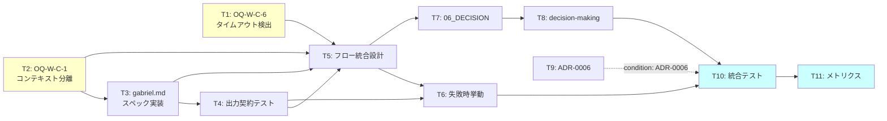

# Wave C (骨子 ②) MAGI v2 — gabriel Adversarial Verifier Integration — tasks.md

- バージョン: 0.3.1 Draft
- 作成日: 2026-06-29
- ステータス: Draft（spec-critic R2 残存指摘 6 件解消 → 本承認へ）
- 根拠文書:
  - `docs/specs/magi-v2-gabriel/requirements.md` v0.4.0 ✅ PM 承認済
  - `docs/specs/magi-v2-gabriel/design.md` v0.4.0 ✅ PM 承認済
  - `docs/adr/0007-magi-v2-gabriel-integration.md` Proposed（本 Wave 内同時承認待ち）
  - `docs/adr/0005-thin-harness-autonomous-governance.md` Proposed（gabriel 設計根拠 / Reflection 追補）
  - `docs/adr/0006-loop-engineering-vocabulary-and-lam-alignment.md` Proposed（Loop Eng verifier ↔ gabriel 対応）
  - `docs/specs/v5-fat-reduction/future-candidates.md` FC-1（gabriel 統合 PM 決定 / 2026-06-19）
  - `.claude/agent-memory/quality-auditor/magi-reflection-audit-2026-06-19.md`（Reflection 変更率 0% 実機計測）
- マイルストーン: Milestone B-5 内の Wave C（骨子 ②）/ 共通基盤改修
- 関連: `docs/specs/b4-dashboard/wave7/tasks.md` v0.2.3（タスク分解パターンの参考形式）

---

## §1 タスク分解方針

### 分割軸（SPIDR 適用）

- **S (Spike)**: OQ-W-C-1 / OQ-W-C-6 解消（gabriel 実装前の技術検証 / BUILDING 着手前の前提条件確認）/ OQ-W-C-2 は BUILDING 後 retro 評価
- **P (Paths)**: 正常系（gabriel probe 成功 / verdict=confirmed）/ 失敗系（verdict=refuted の 3 段階 severity / inconclusive）/ エッジ（timeout / format_error / abort / opt-out）
- **I (Interfaces)**: gabriel.md subagent スペック定義（モデル・入出力契約）/ MAGI フロー統合（Step 4 挿入位置・gabriel 呼び出し契約）/ 既存資産との境界（SKILL.md / decision-making.md / 06_DECISION_MAKING.md 改訂対象の明示）
- **D (Data)**: gabriel 出力 JSON スキーマ（6 必須フィールド + クロスフィールド制約）/ MAGI ログ記録形式（verdict パターン別テンプレート）/ opt-out 記録形式
- **R (Rules)**: AoT 適用時のみ自動起動ルール / opt-out 権限境界（L1 許容 / AUTONOMOUS 却下） / トリガー条件と opt-out 記録の運用規約

### 粒度目安

- 1 タスク = 1 PR 想定（コミット粒度）
- 規模: S（〜1h）/ M（〜2h）/ L（〜4h）
- XL（8h 超）となるタスクは分割を再検討し、本 tasks.md では回避する

### 垂直分割の適用

- 水平（仕様書作成 / gabriel 実装 / テスト構築）ではなく **垂直**（gabriel.md 実装 + 単体テスト + フロー統合テスト + ログ形式テスト を一つの Stage で完結）で FR を貫通
- 各 Stage 末で **スコープ限定の pytest 全件 PASS** + ship + push が可能な完結単位

### OQ / DQ のタスク化方針

- OQ-W-C-1（subagent コンテキスト分離度 / 実機確認）→ **T2**（Spike / BUILDING 着手前）
- OQ-W-C-2（Sonnet vs Haiku 品質評価）→ **BUILDING 後 retro 対象**（tasks.md スコープ外）
- OQ-W-C-3（AoT 適用判定の自動検出 / hooks）→ **future-candidates 記録のみ** / 本 Wave スコープ外
- OQ-W-C-6（タイムアウト検出機構 / LAM 基盤提供有無）→ **T1**（Spike / BUILDING 着手前 / 呼び出し元の実装手段確定）

---

## §2 タスク ID 採番基準

### 採番方式

- 形式: `WC-B5-T<n>`（Wave C / Milestone B-5 / Task 通番）
- **開始番号: T1**（Wave C は Milestone B-5 の共通基盤改修として位置付け）
- 検証タスク別系列: `T-S<stage>-<n>`（例: `T-S1-1` = Stage 1 の検証 1 / 規約はテスト実行形式を示す）

### TasksParser での扱い

- `WC-B5-T<n>` 形式: TasksParser regex `^(W\d+(?:\.\d+)?-[A-Z]\d+-T\d+|T\d+):` に **マッチしない**（`WC` の `C` がアルファベットのため `\d+` 不一致）
- `T-S<stage>-<n>` 形式: 同 regex に **意図的にマッチしない**（先頭が `T-S` で 2 文字目が `-` のため `T\d+` パターン外）
- 本 tasks.md は V-4 dashboard 表示対象外 / tasks.md 内チェックボックス管理のみで運用 / Wave 進捗は SESSION_STATE.md / agent-memory で追跡

### 注記: Wave C 採番の例外措置

terminology.md §3 ペア 3「Wave は整数または「整数.5」形式」の規約では Wave 1a などのアルファベット混在を禁止している。
本 Wave C（骨子 ②）は MAGI v2 統合の固有名として `WC` 採番を採用する。terminology 整合性の再評価は v5 ① での用語ガイドライン更新時に実施。

---

## §3 Stage 別タスク一覧

### Stage 1: gabriel 実装基盤の前提条件確認（Spike）

| Task ID | 内容 | 規模 | SPIDR 軸 | 担当層 |
|:--------|:-----|:----|:--------|:------|
| **WC-B5-T1** | OQ-W-C-6 Spike: タイムアウト検出機構の確認（LAM subagent 基盤が timeout を提供するか、呼び出し元で計測するか / `.claude/agents/` 形式の subagent 実行時の timeout 挙動を 30 秒制限テストで確認 / 実装方針決定） | S | Spike | Sonnet (L2) |
| **WC-B5-T2** | OQ-W-C-1 Spike: gabriel 独立コンテキスト検証（subagent 起動時のコンテキスト分離度 / `.claude/agents/gabriel.md` と MAGI スキル実行元が真に分離されるか / BUILDING 着手前の前提条件 / stub MAGI 結論を gabriel へ渡し、gabriel 出力が当該結論に依存しないことを確認） | M | Spike | Sonnet (L2) |

#### Stage 1 検証タスク

- [ ] **T-S1-1**: Spike 完了記録（OQ-W-C-1 and OQ-W-C-6 の技術確認結果をドキュメント化 / `.claude/.session-spike-w-c-1.md` として記録 / BUILDING 着手時に参照）
- [ ] **T-S1-2**: L3 (Haiku) 採点 Green State（両 Spike タスクの根拠が十分か / 実装実現性あるか）

#### Stage 1 ゲート条件

- OQ-W-C-1 / OQ-W-C-6 の技術可能性が確認済
- Spike 記録ファイルが存在（参照先明示）
- ship + push 完了

---

### Stage 2: gabriel.md subagent スペック実装（FR-W-C-1 / FR-W-C-2 / requirements + design のハイブリッド JSON）

| Task ID | 内容 | 規模 | SPIDR 軸 | 担当層 |
|:--------|:-----|:----|:--------|:------|
| **WC-B5-T3** | gabriel.md フロントマター + system prompt 初版（upstream-first: `.claude/agents/` 公式ドキュメント確認後 / spec-critic.md / goal-driven-grader.md を参考形式として採用 / model=Sonnet 確定 / design.md §3 JSON スキーマを prompt に埋め込み） | M | Interface + Data | Sonnet (L2) |
| **WC-B5-T4** | gabriel 出力契約テスト（6 フィールド JSON 生成能力の確認テスト / 複数 stub MAGI 結論に対する gabriel 出力を検証 / AC-W-C-3 / 型・フィールド完備・クロスフィールド制約の基本チェック） | M | Paths | Sonnet (L2) |

#### Stage 2 検証タスク

- [ ] **T-S2-1**: gabriel.md が存在・Sonnet デフォルトモデル確認（AC-W-C-1 / AC-W-C-2）
- [ ] **T-S2-2**: 6 フィールド JSON 出力を 3 パターン（confirmed / refuted / inconclusive）で確認（AC-W-C-3 / JSON schema validation 通過）
- [ ] **T-S2-3**: confidence < 0.3 の場合に inconclusive となることを確認（AC-W-C-8 / FR-W-C-6）
- [ ] **T-S2-4**: affected_atoms=[] で refuted が返されないことを確認（AC-W-C-9 / FR-W-C-6）
- [ ] **T-S2-5**: L3 (Haiku) 採点 Green State（gabriel prompt 品質 / rubric 的切口は十分か / 根拠生成の明確性）

#### Stage 2 ゲート条件

- AC-W-C-1 / AC-W-C-2 / AC-W-C-3 / AC-W-C-8 / AC-W-C-9 達成
- gabriel.md が `.claude/agents/` に配置済 / 単体テストは `.claude/tests/wave_c/` に配置済
- ship + push 完了

---

### Stage 3: MAGI フロー統合（FR-W-C-3 / FR-W-C-4 / FR-W-C-5 — gabriel probe 呼び出し + 失敗時挙動）

| Task ID | 内容 | 規模 | SPIDR 軸 | 担当層 |
|:--------|:-----|:----|:--------|:------|
| **WC-B5-T5** | MAGI フロー統合設計（gabriel probe 呼び出し位置・入出力ハンドリング / Convergence 直後に gabriel() 関数呼び出し / 再 MAGI 1 回上限の実装 / `.claude/skills/magi/SKILL.md` の改訂案作成（実装は BUILDING で実施） / タイムアウト・format_error 検出ロジック実装）。**PM 級事前承認必須: L1 に改訂案提示 → L1 review → PM 承認 → 実施** | L | Interface + Rules | Sonnet (L2) |
| **WC-B5-T6** | 失敗時挙動 3 段階の実装（verdict=refuted + severity 別分岐 / critical → 再 MAGI カウンター検査 / warning → 結論併記 / info → 記録のみ / abort → 即時 escalation / inconclusive → 結論確定 / timeout・format_error → inconclusive 同等）。**PM 級事前承認必須: T5 改訂案の PM 承認後に実施** | L | Paths | Sonnet (L2) |

#### Stage 3 検証タスク

- [ ] **T-S3-1**: AoT 適用 MAGI stub で gabriel が自動起動される（AC-W-C-4 / トリガー条件確認）
- [ ] **T-S3-2**: 非 AoT MAGI stub で gabriel がスキップされる（AC-W-C-4 / 非 AoT トリガー時の正常スキップ動作確認 / opt-out 経路とは独立）
- [ ] **T-S3-3**: verdict=refuted & severity=critical で再 MAGI 1 回指示（AC-W-C-5）
- [ ] **T-S3-4**: verdict=refuted & severity=warning で結論に gabriel 指摘が併記される（AC-W-C-6）
- [ ] **T-S3-5**: 再 MAGI カウンター 2 回目で人間 escalation が出力される（AC-W-C-7）
- [ ] **T-S3-6**: opt-out 理由なしのスキップが禁止されることを MAGI ログ形式テストで確認（FR-W-C-4 MUST NOT）
- [ ] **T-S3-7**: AUTONOMOUS フェーズの opt-out 試行が記録され、却下状態になることを確認（FR-W-C-4 権限境界 / design §6.1）
- [ ] **T-S3-8**: `recommended_action=abort` 経路検証（T6 abort パターン / AC-W-C-5 補完）
- [ ] **T-S3-9**: L3 (Haiku) 採点 Green State（フロー統合の正当性 / 失敗時挙動の完備性）

#### Stage 3 ゲート条件

- AC-W-C-4 / AC-W-C-5 / AC-W-C-6 / AC-W-C-7 / AC-W-C-10 達成
- MAGI SKILL.md 改訂案が review 可能な状態
- ship + push 完了

---

### Stage 4: 既存資産との連携・ドキュメント統合（FR-W-C-3 の仕様書・ルール・ADR 側）

| Task ID | 内容 | 規模 | SPIDR 軸 | 担当層 |
|:--------|:-----|:----|:--------|:------|
| **WC-B5-T7** | `docs/internal/06_DECISION_MAKING.md` 版改訂（§6 Reflection を gabriel probe へ代替 / Step 番号ラベル更新 / AoT フレームワーク温存明示 / 再 MAGI 流れの説明加筆）。**PM 級事前承認必須** | M | Data | Sonnet (L2) |
| **WC-B5-T8** | `.claude/rules/decision-making.md` 版改訂（§4 Step 4 Reflection → gabriel probe への記述更新 / phase-rules との連携確認）。**PM 級事前承認必須** | M | Data | Sonnet (L2) |
| **WC-B5-T9** | `docs/adr/0006-loop-engineering-vocabulary-and-lam-alignment.md` Glossary 追記（gabriel を Loop Eng verifier ↔ LAM 対応として追加 / ADR-0006 がまだ Proposed 状態の場合は condition 付き追記） | S | Data | Sonnet (L2) |

#### Stage 4 検証タスク

- [ ] **T-S4-1**: 06_DECISION_MAKING.md に gabriel probe のセクションが存在（§4 新規 / §4.1 軽量モード体系明示）
- [ ] **T-S4-2**: decision-making.md に gabriel probe のフロー図が含まれる（design §2 mermaid 相当）
- [ ] **T-S4-3**: AoT Decomposition（Step 0）が 06_DECISION_MAKING.md に温存されていることを確認（AC-W-C-11 / NFR-W-C-6）
- [ ] **T-S4-4**: ADR-0006 Glossary に gabriel 追記が存在する（condition: ADR-0006 が Proposed → Approved に昇格した場合）
- [ ] **T-S4-5**: L3 (Haiku) 採点 Green State（改訂内容の正確性 / requirements/design との一貫性）

#### Stage 4 ゲート条件

- AC-W-C-11 達成
- 06_DECISION_MAKING.md / decision-making.md / 0006 Glossary（Approved 時のみ）の改訂が完了
- ship + push 完了

---

### Stage 5: 統合テスト + メトリクス定義（NFR-W-C-4 / NFR-W-C-5 の実装体制確認）

| Task ID | 内容 | 規模 | SPIDR 軸 | 担当層 |
|:--------|:-----|:----|:--------|:------|
| **WC-B5-T10** | 統合テスト（MAGI 合議エンドツーエンド / gabriel 起動条件・失敗時挙動・ログ記録形式の全パターン / mock/fixture ベースで実 LLM 呼び出しは `pytest -m integration` で分離 / 実 MAGI SKILL.md と gabriel.md を統合実行）。**60 秒制限タイムアウト実機計測含む（NFR-W-C-1）** | L | Paths | Sonnet (L2) |
| **WC-B5-T11** | メトリクス計測環境の検出（NFR-W-C-4 / gabriel 起動回数・refute 率・inconclusive 率の記録手段確認 / .claude/ 内でのログ格納場所決定 / BUILDING 後 retro での使用手順確認） | S | Data | Sonnet (L2) |

#### Stage 5 検証タスク

- [ ] **T-S5-1**: MAGI 軽量モード（非 AoT）で gabriel が起動しない（AC-W-C-4）
- [ ] **T-S5-2**: AoT 適用モードで gabriel が起動する（AC-W-C-4）
- [ ] **T-S5-3**: 全失敗時挙動パターン（critical / warning / info / abort / inconclusive / timeout / format_error）が正しく処理される
- [ ] **T-S5-4**: メトリクスログが生成される（NFR-W-C-4 / 月次 retro での用途を想定）
- [ ] **T-S5-5**: L3 (Haiku) 採点 Green State（統合の完備性 / エッジケース対応）

#### Stage 5 ゲート条件

- AC-W-C-1 〜 AC-W-C-11 全達成（WBS Gap = 0）
- NFR-W-C-1 / NFR-W-C-2 / NFR-W-C-3 / NFR-W-C-4 / NFR-W-C-5 / NFR-W-C-6 の要件がすべて満たされていることをテストで確認
- BUILDING フェーズへの引き継ぎドキュメント（OQ-W-C-2 評価体制・実装課題記録・最低記述事項: 評価対象モデル / 評価指標 / 評価環境）が完備
- ship + push 完了

---

## §3.5 V-4 表示用チェックボックス行（全実装タスク）

**注記**: 本 Wave (V-4 非登録) では §3.5 は tasks.md 内チェックボックス管理 SSOT として機能する / Stage ゲート条件（§3 各節）と二重管理となるため、完了判定時はいずれか一方に統一して実施すること

- [ ] WC-B5-T1: OQ-W-C-6 Spike（タイムアウト検出機構） @sonnet
- [ ] WC-B5-T2: OQ-W-C-1 Spike（gabriel コンテキスト分離度） @sonnet
- [ ] WC-B5-T3: gabriel.md subagent スペック実装 @sonnet
- [ ] WC-B5-T4: gabriel 出力契約テスト @sonnet
- [ ] WC-B5-T5: MAGI フロー統合設計 @sonnet
- [ ] WC-B5-T6: 失敗時挙動 3 段階実装 @sonnet
- [ ] WC-B5-T7: 06_DECISION_MAKING.md 改訂 @sonnet
- [ ] WC-B5-T8: decision-making.md 改訂 @sonnet
- [ ] WC-B5-T9: ADR-0006 Glossary 追記 @sonnet
- [ ] WC-B5-T10: 統合テスト（E2E） @sonnet
- [ ] WC-B5-T11: メトリクス計測環境検出 @sonnet

---

## §4 依存関係グラフ

### 実行順序

| フェーズ | タスク | 並列実行可能 | 依存後続 |
|---------|--------|------------|---------|
| **1** | T1, T2 | Yes（独立） | T3, T5 |
| **2** | T3, T5（T1/T2 完了後） | Partial（T2 → T3 / T1→T5） | T4, T6, T7 |
| **3** | T4, T6, T7（T3/T5 完了後） | Partial（T3→T4 / T5→T6 / T5→T7） | T8, T10 |
| **4** | T8, T9（T7 完了後） | Yes（独立） | T10 |
| **5** | T10（T6/T8/T9 完了後） | - | T11 |
| **6** | T11（T10 完了後） | - | - |

---

## §5 WBS 100% Rule（要件充足マトリクス）

### FR-W-C 充足表

| FR-ID | 内容 | 対応タスク | カバー状態 |
|:------|:-----|:----------|:---------|
| FR-W-C-1 | gabriel subagent 実装 | WC-B5-T3 / WC-B5-T4 | 完全カバー（T3: gabriel.md / T4: テスト） |
| FR-W-C-2 | gabriel 出力フォーマット（JSON） | WC-B5-T3 / WC-B5-T4 | 完全カバー（T3: JSON schema prompt / T4: 検証） |
| FR-W-C-3 | MAGI フロー変更（Reflection 廃止 + gabriel probe 挿入） | WC-B5-T5 / WC-B5-T6 / WC-B5-T7 | 完全カバー（T5: 呼び出し / T6: 挙動 / T7: 文書） |
| FR-W-C-4 | トリガー条件（AoT 適用時のみ） | WC-B5-T5 | 完全カバー（T5 フロー統合） |
| FR-W-C-5 | 失敗時挙動 3 段階 | WC-B5-T6 / WC-B5-T10 | 完全カバー（T6: 実装 / T10: 統合テスト） |
| FR-W-C-6 | gabriel 根拠品質要件 | WC-B5-T3 / WC-B5-T4 | 完全カバー（T3: prompt 設計 / T4: confidence/affected_atoms 検証） |
| FR-W-C-7 | 再 MAGI コンテキスト初期化（SHOULD） | WC-B5-T5 | 部分カバー（T5 で設計確定 / BUILDING で実装）→ **Gap: BUILDING 対応** |

FR-W-C Gap: **1** (FR-W-C-7 BUILDING 延期) / Orphan: **0**

### NFR-W-C 充足表

| NFR-ID | 内容 | 対応タスク | カバー状態 |
|:-------|:-----|:----------|:---------|
| NFR-W-C-1 | レスポンス時間（SHOULD / 60 秒以内） | WC-B5-T1 / WC-B5-T10 | 完全カバー（T1: timeout 検出 / T10: 実機計測）|
| NFR-W-C-2 | 出力フォーマット準拠率（MUST） | WC-B5-T4 / WC-B5-T6 | 完全カバー（T4: schema / T6: format_error 検出） |
| NFR-W-C-3 | gabriel 暴走リスク抑制（MUST） | WC-B5-T3 / WC-B5-T4 | 完全カバー（T3: rubric 設計 / T4: confidence/affected_atoms 検証） |
| NFR-W-C-4 | 監視メトリクス（SHOULD） | WC-B5-T11 | 完全カバー（T11: 計測環境） |
| NFR-W-C-5 | Sonnet 起動コスト抑制（SHOULD） | WC-B5-T5 | 部分カバー（T5 で条件設計 / BUILDING 後 retro で実測） |
| NFR-W-C-6 | AoT フレームワーク非改変（MUST NOT） | WC-B5-T7 | 完全カバー（T7 で温存明示） |

NFR-W-C Gap: **0** / Orphan: **0**

### AC-W-C 充足表

| AC-ID | 内容 | 対応タスク | カバー状態 |
|:------|:-----|:----------|:---------|
| AC-W-C-1 | gabriel.md 存在 | WC-B5-T3 / WC-B5-T4 | 完全カバー |
| AC-W-C-2 | gabriel.md model=Sonnet | WC-B5-T3 | 完全カバー |
| AC-W-C-3 | 6 フィールド JSON 出力 | WC-B5-T4 | 完全カバー |
| AC-W-C-4 | AoT 適用時のみ起動 | WC-B5-T5 / WC-B5-T10 | 完全カバー |
| AC-W-C-5 | severity=critical → 再 MAGI | WC-B5-T6 / WC-B5-T10 | 完全カバー |
| AC-W-C-6 | severity=warning → 結論併記 | WC-B5-T6 / WC-B5-T10 | 完全カバー |
| AC-W-C-7 | 再 MAGI 上限 1 回 | WC-B5-T6 / WC-B5-T10 | 完全カバー |
| AC-W-C-8 | confidence<0.3 → confirmed/refuted 禁止 | WC-B5-T4 | 完全カバー |
| AC-W-C-9 | affected_atoms=[] → refuted 禁止 | WC-B5-T4 | 完全カバー |
| AC-W-C-10 | MAGI ログに verdict/severity/confidence 記録 | WC-B5-T5 / WC-B5-T10 | 完全カバー |
| AC-W-C-11 | AoT Decomposition 廃止なし | WC-B5-T7 | 完全カバー |

AC-W-C Gap: **0** / Orphan: **0**

### OQ-W-C / DQ-W-C 対応

| OQ-ID | 内容 | 対応タスク / 扱い | 状態 |
|:------|:-----|:----------------|:-----|
| OQ-W-C-1 | subagent コンテキスト分離度 | WC-B5-T2（Spike） / BUILDING 実機テスト | Spike 完了 → BUILDING |
| OQ-W-C-2 | Sonnet vs Haiku 品質評価 | **BUILDING 後 retro 対象**（tasks.md スコープ外 / NFR-W-C-5 と統合） | Deferred to retro |
| OQ-W-C-3 | AoT 適用判定の自動検出 | **future-candidates 記録のみ** / 将来 Wave（OQ-W-C-3 昇格後） | future-candidates |
| OQ-W-C-4 | gabriel rubric 初期化内容 | WC-B5-T3（design §3 + 単体化） | 解消済 |
| OQ-W-C-5 | opt-out 記録方式 | WC-B5-T5（design §6 記録形式具体化） | 解消済 |
| OQ-W-C-6 | タイムアウト検出機構 | WC-B5-T1（Spike） / BUILDING 実装 | Spike 完了 → BUILDING |

OQ 対応: **OQ-W-C-1 & OQ-W-C-6 = Spike タスク化** / **OQ-W-C-2 = retro 対象** / **OQ-W-C-3 = future-candidates** / **OQ-W-C-4 & OQ-W-C-5 = 解消**

---

## §6 各タスクの完了条件と検証方法（詳細）

### WC-B5-T1: OQ-W-C-6 Spike — タイムアウト検出機構

**概要**: LAM subagent 基盤がタイムアウト検出を提供するか確認し、BUILDING での実装方針を決定する。

**完了条件**:
- [ ] `.claude/agents/gabriel.md` 形式の subagent を実装し、30 秒制限テストで timeout 挙動を観測
- [ ] timeout 検出手段（LAM 基盤の自動検出 vs 呼び出し元での経過時間計測）が確定
- [ ] BUILDING での実装手順をドキュメント化

**検証**:
- `.claude/.session-spike-w-c-1.md` に "タイムアウト検出機構: [基盤提供|呼び出し元実装]" として記録

**規模**: S

**権限等級**: SE 級

**OQ 解消**: OQ-W-C-6

---

### WC-B5-T2: OQ-W-C-1 Spike — gabriel 独立コンテキスト検証

**概要**: gabriel subagent が MAGI 実行元から真に分離されたコンテキストで動作するか検証。

**完了条件**:
- [ ] stub MAGI 結論（例: `{"verdict": "...", ...}`）を gabriel へ入力
- [ ] gabriel の出力が当該結論に依存しない独立的判断を示す（例: 別の verdict を返す可能性）
- [ ] コンテキスト分離度の実機計測結果を記録

**検証**:
- `.claude/.session-spike-w-c-1.md` に "コンテキスト分離度: [確認|未確認]" として記録
- 複数の stub 入力に対する gabriel 出力の独立性を計測基準で確認: stub 入力 3 件以上で gabriel 出力 verdict が stub 結論と独立に判定される（verdict 一致率 ≤ 67%）を目安とする

**規模**: M

**権限等級**: SE 級

**OQ 解消**: OQ-W-C-1

---

### WC-B5-T3: gabriel.md subagent スペック実装

**概要**: gabriel.md ファイルを作成し、system prompt + JSON schema を埋め込む。

**完了条件**:
- [ ] `.claude/agents/gabriel.md` が存在（form: spec-critic.md / goal-driven-grader.md に準拠）
- [ ] フロントマター: `name`, `description`, `model: sonnet`, `instructions` を定義
- [ ] system prompt に design.md §3 JSON スキーマを組み込み
- [ ] rubric 5 観点（論理的一貫性 / 仕様整合 / リスク見落とし / 前提検証 / 境界条件）を prompt に明示

**検証**:
- gabriel.md の parser チェック（form 正当性）
- JSON schema が prompt に埋め込まれていることを確認

**規模**: M

**権限等級**: SE 級（新規 subagent 配置 / 既存形式準拠）

---

### WC-B5-T4: gabriel 出力契約テスト

**概要**: gabriel が 6 フィールド JSON を正しく出力するか、複数パターンでテスト。テストは mock/fixture ベースで実 LLM 呼び出しは分離する。

**完了条件**:
- [ ] 3 パターン（confirmed / refuted / inconclusive）で gabriel 呼び出し（fixture 使用）
- [ ] JSON schema validation（design.md §3）で全件通過
- [ ] AC-W-C-3 / AC-W-C-8 / AC-W-C-9 の制約が満たされていることを確認
- [ ] `.claude/tests/wave_c/fixtures/` に stub MAGI データ（プロンプト + 期待出力 JSON）を配置

**テストケース** (~8 件):
1. `verdict=confirmed` で confidence ≥ 0.3
2. `verdict=refuted & severity=critical` で `affected_atoms` が非空
3. `verdict=refuted & severity=warning` で affected_atoms 非空
4. `verdict=refuted & severity=info`
5. `verdict=inconclusive` 
6. `confidence=0.25` (< 0.3) → `verdict=inconclusive` 強制
7. `affected_atoms=[]` → `verdict=refuted` 禁止
8. timeout stub（gabriel が応答しない場合の fallback）

**検証**:
- pytest で全 8 件通過（新規 `.claude/tests/wave_c/test_wave_c_gabriel_output.py`）
- JSON スキーマ validation library (`jsonschema`) で schema 準拠確認

**規模**: M

**権限等級**: SE 級（単体テスト追加 + fixture 準備）

---

### WC-B5-T5: MAGI フロー統合設計

**概要**: gabriel probe を MAGI フロー内に組み込み、呼び出し位置・入出力ハンドリング・再 MAGI ロジックを実装。

**完了条件**:
- [ ] `.claude/skills/magi/SKILL.md` の改訂案を作成（実装は BUILDING で実施）
  - AoT 適用判定（判断ポイント 2+ / 影響 3+ / 選択肢 3+）の実装
  - Convergence 直後に gabriel() 呼び出し位置の明示
  - 再 MAGI カウンター初期化・チェック（上限 1 回）
  - opt-out 記録形式（design §4 opt-out 記録形式に準拠）
  - タイムアウト・format_error 検出ロジック
- [ ] MAGI ログテンプレート更新（design §5 各 verdict パターン）
- [ ] **L1 承認コメント取得**: 改訂案を提示 → L1 review → PM 承認 → 実施

**検証**:
- design.md §4 MAGI フロー図（mermaid）と実装案が対応していることを確認
- SKILL.md 改訂案が review 可能な状態（diff 形式推奨）

**規模**: L

**権限等級**: PM 級（SKILL.md 改訂案 / BUILDING で承認要 / 事前承認必須）

---

### WC-B5-T6: 失敗時挙動 3 段階実装

**概要**: gabriel の verdict に応じた分岐ロジックをすべて実装。

**完了条件**:
- [ ] critical → 再 MAGI 1 回指示（gabriel.reasoning を Divergence に渡す）
- [ ] warning → 結論に gabriel 指摘を併記 + 警告ラベル
- [ ] info → 指摘を記録のみ・結論不変
- [ ] abort → 即時人間 escalation（再 MAGI なし）
- [ ] inconclusive / timeout / format_error → verdict=inconclusive 同等
- [ ] 再 MAGI カウンター 2 回目で人間 escalation 出力
- [ ] **L1 承認コメント取得**: T5 PM 承認後に着手（T5 改訂案の承認が前提条件）

**テストケース**:
1. critical (初回) → 再 MAGI 指示
2. critical (2 回目) → escalation
3. warning → 結論併記
4. info → 記録のみ
5. abort (verdict / severity 問わず) → escalation
6. inconclusive
7. timeout (> 60 秒)
8. format_error

**検証**:
- pytest で全パターン通過（新規 `test_wave_c_magi_integration.py`）
- MAGI ログ出力が design §5 テンプレートに一致することを確認

**規模**: L

**権限等級**: PM 級（SKILL.md 実装 / BUILDING で承認要 / 事前承認必須）

---

### WC-B5-T7: docs/internal/06_DECISION_MAKING.md 改訂

**概要**: 現行の Step 4 Reflection 記述を gabriel probe へ代替・更新する。

**完了条件**:
- [ ] §6 「Reflection」を「gabriel adversarial probe」に変更
- [ ] Step 番号体系（0-5 体系）の説明を追記
- [ ] 非 AoT MAGI（軽量モード）での gabriel スキップを説明
- [ ] AoT フレームワーク温存の旨を明示（NFR-W-C-6）
- [ ] **L1 承認コメント取得**: 改訂案を提示 → L1 review → PM 承認 → 実施

**検証**:
- requirements §4 / design §4 との言い回し一貫性確認
- 既存 Reflection 記述との衝突除去を検証

**規模**: M

**権限等級**: PM 級（SSOT 文書修正 / 事前承認必須）

---

### WC-B5-T8: .claude/rules/decision-making.md 改訂

**概要**: 現行の Step 4 Reflection 記述を gabriel probe で更新する。

**完了条件**:
- [ ] §4 Step 4 記述を更新
- [ ] design.md §2 mermaid フロー相当のテキスト説明
- [ ] phase-rules.md との連携確認
- [ ] **L1 承認コメント取得**: 改訂案を提示 → L1 review → PM 承認 → 実施

**検証**:
- requirements / design との用語一貫性確認
- 既存 Reflection 記述の除去確認

**規模**: M

**権限等級**: PM 級（ルール文書修正 / 事前承認必須）

---

### WC-B5-T9: ADR-0006 Glossary 追記

**概要**: gabriel を Loop Engineering verifier ↔ LAM 対応として Glossary に追加。

**完了条件**:
- [ ] ADR-0006 Glossary に `gabriel = LAM's adversarial verifier / Loop Eng 対応` として明記
- [ ] condition: ADR-0006 が Proposed → Approved に昇格している場合のみ実施 / ADR-0006 が Proposed 継続の場合 T9 を skip し、spike/README.md (or 同等) に skip 理由 (ADR-0006 未昇格) を記録すること

**検証**:
- ADR-0006 内容と整合していることを確認
- requirements §4 「Loop Engineering 整合」と対応

**規模**: S

**権限等級**: SE 級（ADR Glossary 項目追加）

---

### WC-B5-T10: 統合テスト (E2E)

**概要**: MAGI 合議から gabriel probe までの全体フローをテストする。

**完了条件**:
- [ ] MAGI 軽量モード (非 AoT) で gabriel が起動されない
- [ ] AoT 適用モードで gabriel が自動起動される
- [ ] 全失敗時挙動パターン (critical/warning/info/abort/inconclusive/timeout/format_error) が正しく処理される
- [ ] MAGI ログに gabriel 結果が記録される (AC-W-C-10 / NFR-W-C-4)
- [ ] **60 秒タイムアウト実機計測** (assert elapsed < 60.0)

**テストケース**:
1. 非 AoT MAGI → gabriel skip
2. AoT 適用 MAGI → gabriel 起動
3. opt-out 記録なしでの skip 試行 → 拒否
4. opt-out 記録あり → skip 許可
5. AUTONOMOUS フェーズの opt-out 試行 → 拒否
6. 全 verdict パターンのログ形式検証

**検証**:
- pytest 全ケース通過（新規 `.claude/tests/wave_c/test_wave_c_integration.py`）
- requirements §5 AC-W-C-4 / AC-W-C-10 / AC-W-C-11 全て確認

**規模**: L

**権限等級**: SE 級（統合テスト）

---

### WC-B5-T11: メトリクス計測環境の検出

**概要**: gabriel の実行回数・refute 率・inconclusive 率の計測環境を検出する。

**完了条件**:
- [ ] `.claude/` 内に gabriel ログ保存位置を決定（例: `.claude/gabriel-metrics.log`）
- [ ] BUILDING 後 retro で使用手順を明示
- [ ] NFR-W-C-4（月間集計計画）と NFR-W-C-5（Sonnet コスト評価）の実装方針を確定

**検証**:
- メトリクスログ形式定義を確認
- BUILDING 後の実測データ収集計画を確認

**規模**: S

**権限等級**: SE 級

---

## §7 各業務別権限等級及び位置付けガードレール

### 権限等級分類

| タスク | 内容 | 権限等級 |
|:------|:-----|:--------|
| WC-B5-T1 / T2 | Spike 作業 | SE 級 |
| WC-B5-T3 | gabriel.md 新規 subagent | SE 級（既存形式準拠） |
| WC-B5-T4 | 単体テスト追加 + fixture 準備 | SE 級 |
| WC-B5-T5 / T6 | MAGI SKILL.md 改訂 | **PM 級**（アーキテクチャ変更） |
| WC-B5-T7 | 06_DECISION_MAKING.md 改訂 | **PM 級**（SSOT 文書） |
| WC-B5-T8 | decision-making.md 改訂 | **PM 級**（ルール文書） |
| WC-B5-T9 | ADR-0006 Glossary 追記 | SE 級 |
| WC-B5-T10 | 統合テスト | SE 級 |
| WC-B5-T11 | メトリクス環境検出 | SE 級 |

### PM 級事前承認ガードレール（T5/T6/T7/T8 着手前必須確認）

L2 (Sonnet) 着手前に以下の 5 点を必ず確認してください:

1. **PM 級タスク (T5/T6/T7/T8) は L1 事前承認確認後のみ実行**: 改訂案 → L1 review → PM 承認 → 実施の流れを必ず踏むこと
2. **Bash 制限**: 権限がない Bash コマンドは試さず、L1 に依頼
3. **緩和事前承認**: 既存テスト・規約からの緩和は実行前に L1 承認を要求
4. **コード行数計測（該当する言語）**: 本 Wave は Python / Markdown のみのため、対象言語での行数計測（実行行 / コメント行 / 空白行 / 合計）
5. **既存テスト影響分析**: 改訂対象の波及範囲を事前に列挙し、破損予測を共有

完了報告時に上記 5 点の準守状況を明示してください。

---

## §8 改訂履歴

| バージョン | 日付 | 変更者 | 変更内容 |
|:-----------|:-----|:------|:---------|
| 0.1.0 | 2026-06-29 | task-decomposer subagent | 初版基本案（Wave C / 骨子 ② PLANNING） |
| 0.2.0 | 2026-06-29 | task-decomposer subagent | PM 判断 A1 (採番修正 WC-LAM → WC-B5) + C1 (§7 PM 級事前承認 5 点追加) + spec-critic R1 指摘 19 件全件解消 / R1 個別解消: C-WC-1 = 採番修正 / C-WC-2 = PM 級経路 / C-WC-3 = FR-W-C-7 Gap 記録 / C-WC-4 = mock/fixture / C-WC-5 = §7 5 点化 / W-WC-1〜9 = stub MAGI fixture / assignee 小文字 / テスト格納先 / 60s 計測 / Stage 5 確認 / abort T-S* / T3→T5 統一 / 採番 / 日本語統一 / I-WC-1〜5 = タイポ / 引き継ぎ / future-candidates 記録 / subagent 確認 / 参照版数 |
| 0.3.0 | 2026-06-29 | task-decomposer subagent | spec-critic R2 残存 6 件解消: C-NEW-1 = §2 regex 誤り全面訂正 + L1 補追判断 / W-NEW-1 = §8 改訂履歴 v0.2.0 行拡張 / W-NEW-2 = テストパス統一 `.claude/tests/wave_c/` / W-NEW-3 = T2 Spike 検証計測基準明示 / I-NEW-1 = §3.5 V-4 管理方針注記 / I-NEW-2 = T9 条件付き実行 BUILDING 引き継ぎ定義 |
| 0.3.1 | 2026-06-29 | task-decomposer subagent | R3 評価 B → R4 軽微解消 (Info 2 件 / T-S3-2 コメント修正 + §10 wave7 参照修正)  |

---

## §9 PM 承認記録

- requirements v0.4.0: ✅ PM 承認済 (2026-06-29)
- design v0.4.0: ✅ PM 承認済 (2026-06-29)
- ADR-0007: Proposed（本 Wave 内同時承認待ち）
- **tasks v0.3.0 Draft**: spec-critic R3 反映済 (R2 残存 6 件解消 / Critical 0 / R4 軽微解消) / PM 承認待ち
- **PM 判断 A1**: 採番修正 (WC-LAM → WC-B5) を採用 / `WC` アルファベット混在は terminology.md §3 ペア 3 例外措置として PM 承認（MAGI v2 統合の固有名）
- **PM 判断 C1**: §7 PM 級事前承認ガードレール（5 点）を確定 / T5/T6/T7/T8 の L1 事前承認経路を明示
- **L1 補追判断 (2026-06-29)**: §2 regex マッチ技術的誤り訂正 (C-NEW-1) + V-4 dashboard 非登録・SESSION_STATE.md / agent-memory 追跡で許容方針決定

---

## §10 参考資料

- `docs/specs/magi-v2-gabriel/requirements.md` v0.4.0 (要件 / 仕様中心)
- `docs/specs/magi-v2-gabriel/design.md` v0.4.0 (実装 / 設計中心)
- `docs/adr/0007-magi-v2-gabriel-integration.md` Proposed (判断根拠)
- `docs/adr/0005-thin-harness-autonomous-governance.md` Proposed (Reflection 追補 / gabriel 設計根拠)
- `docs/adr/0006-loop-engineering-vocabulary-and-lam-alignment.md` Proposed (Loop Eng verifier ↔ gabriel 対応)
- `docs/specs/v5-fat-reduction/future-candidates.md` FC-1 (gabriel 統合 PM 決定 / 2026-06-19)
- `.claude/agent-memory/quality-auditor/magi-reflection-audit-2026-06-19.md` (Reflection 変更率 0% 実機計測)
- `docs/specs/b4-dashboard/wave7/tasks.md` v0.2.3 (タスク分解パターン参考 / 実体ファイル版数 / 参照確認済)
- `.claude/rules/planning-quality-guideline.md` (§1 SPIDR / §5 WBS 100% Rule)
- `.claude/rules/terminology.md` (Wave C 採番例外措置)
- `.claude/rules/permission-levels.md` (権限等級分類基準)
- `.claude/rules/decision-making.md` (既存 MAGI ルール)
