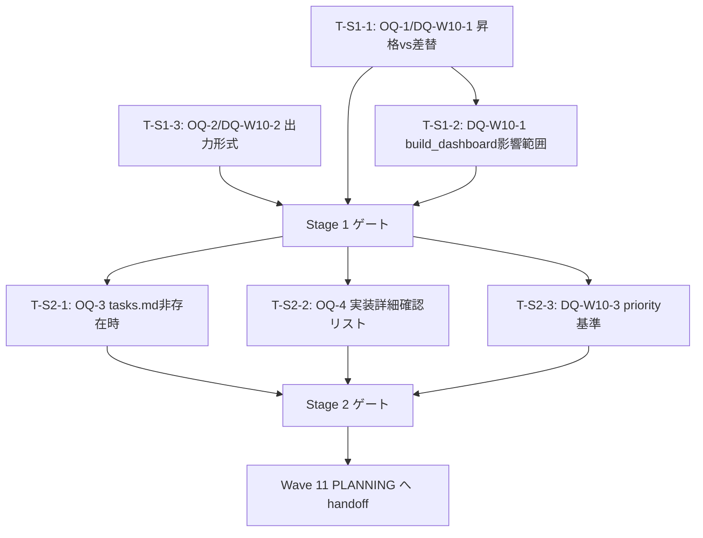

# Project Overview Orchestrator Wave 10 (Spike Wave) — tasks.md

**本ドキュメントの位置付け**: Spike 管理文書。POO 実装 tasks.md は Wave 11 PLANNING で別起草。

- バージョン: 0.3.0 Draft
- 作成日: 2026-06-29（v0.2.0: 2026-06-29 R2 修正）
- ステータス: **Draft**（spec-critic R2 レビュー待ち）
- 根拠文書:
  - `docs/specs/project-overview-orchestrator/requirements.md` v0.5.0（PM 承認済）
  - `docs/specs/project-overview-orchestrator/design.md` v0.3.0（PM 承認済）
  - `docs/specs/project-overview-orchestrator/spike/README.md` v0.4.0（PM 承認済）
- マイルストーン: **B-5 Wave 10** (Spike Wave / 実装は Wave 11 PLANNING で別 tasks 起票)
- 関連: `docs/adr/0006-loop-engineering-vocabulary-and-lam-alignment.md`（Stage 3 位置付け）

---

## §1 タスク分解方針

**本 Wave (Spike Wave) の位置付け**: OQ-1〜4 / DQ-W10-1〜3 の仕様検証タスク群。実装タスク 0 件。Wave 11 BUILDING の前提条件を整備する。

### 分割軸（SPIDR 適用）

- **S (Spike)**: Wave 10 内の残存 OQ-1〜4 / DQ-W10-1〜3 の早期解消 Spike タスク群（Stage 1-2）。仕様検証の記録のみ / 実装ファイル commit 不可。
- **P (Paths)**: 正常系（全データソース利用可 / Phase known）/ エラー系（データソース欠失 / Phase unknown）。本 Wave では S 軸のみ実装 / P/I/D/R は Wave 11 BUILDING で実施。
- **I (Interfaces)**: MilestoneRegistry read-only API シグネチャ / POO の推奨出力 API 契約 / 既存スキル起動 API 契約の確定
- **D (Data)**: MilestoneInfo データ構造 / 推奨優先順位基準の具体化 / SESSION_STATE.md / tasks.md / current-phase.md パーサ仕様の細部確定
- **R (Rules)**: Phase フィルタリングルール / graceful degradation ルール / スキル推奨根拠の記述規約

### 粒度目安

- 1 タスク = 1 PR 想定（コミット粒度）
- 規模: S（〜30 行）/ M（〜100 行）/ L（〜200 行）
- L 超過想定タスクは分割を再検討

### 垂直分割の適用

- 水平（SSOT 層 / 推奨ロジック層）ではなく **垂直**（FR-W10-1 → MilestoneRegistry 読み込み + 4 次元出力）で各 Stage を貫通
- 各 Stage 末で **pytest 全件 PASS** + ship + push が可能な完結単位

### 残存 OQ / DQ の Spike タスク化方針

以下の OQ / DQ はスペックの確定に必須であり、Wave 11 PLANNING 着手前に Spike として解消する。Spike は「仕様検証」のみであり、実装コミットは Wave 11 BUILDING で実施する。

- **OQ-1 / DQ-W10-1**: `MilestoneRegistry` 昇格 vs 差し替え / 配置モジュール決定 → Spike T-S1-1 / T-S1-2
- **OQ-2 / DQ-W10-2**: POO 出力形式（Markdown vs JSON）の確定 → Spike T-S1-3
- **OQ-3**: `tasks.md` 未確定 Milestone の現在地特定方法 → Spike T-S2-1
- **OQ-4 / DQ-W10-3**: FR-W10-3「呼び出し前提条件」の実装レベル詳細 + タイブレーク優先基準 → Spike T-S2-2 / T-S2-3
- **DQ-W10-4**: `get_current()` / `list_waves()` 等の追加 API シグネチャ（Wave 11 design で確定）→ 本 Wave では touch しない

---

## §2 タスク ID 採番基準

- 形式: `W10-B5-T<n>`（Wave 番号 10 / Milestone B-5 / Task 通番）
- **開始番号: T1**（POO は B-5 Milestone の Wave 10 Spike タスク群として採番）
- 検証タスク別系列: `T-S<stage>-<n>` で別系列（例: `T-S1-1`）
- 短縮形（口語）: `T1` / `T-S1-1` 等

### TasksParser での扱い

- `W10-B5-T<n>` 形式: 厳格 regex `^(W\d+(?:\.\d+)?-[A-Z]\d+-T\d+|T\d+)` にマッチ
  - 第 1 OR 節 `W\d+(?:\.\d+)?-[A-Z]\d+-T\d+` 肯定（例: `W10-B5-T1`）→ v-4 Task 一覧に表示される
  - 第 2 OR 節 `T\d+` 肯定（例: `T1`）→ v-4 Task 一覧に表示される
- `T-S<stage>-<n>` 形式: 厳格 regex に **意図的にマッチしない**
  - 第 1 OR 節 `W\d+(?:\.\d+)?-[A-Z]\d+-T\d+` 非マッチ（`T-S` は `[A-Z]\d+` パターン外）
  - 第 2 OR 節 `T\d+` 非マッチ（`T-S` の接頭辞があり数字のみパターン外）
  - → v-4 には表示されず、本 tasks.md 内のチェックリスト管理に閉じる
- 実装タスク 0 件のため v-4 dashboard では Wave 10 の Task 行は表示されない（Wave 11 で実装 tasks が起票され次第表示）

---

## §3 Stage 別タスク一覧

### Stage 1: Spike — OQ-1 / DQ-W10-1 / OQ-2 / DQ-W10-2 の仕様検証（PLANNING 準備）

| Task ID | 内容 | 規模 | SPIDR 軸 | 担当層 |
|:-------|:-----|:----|:--------|:------|
| **T-S1-1** | OQ-1 / DQ-W10-1 検証: `MilestoneRegistry` の昇格 vs 差し替え経路の実現可能性評価 + 配置モジュール決定（Wave 8 `MilestoneSourceMerger` との循環インポート有無 Grep 実測） | M | Spike | Sonnet (L2) |
| **T-S1-2** | OQ-1 / DQ-W10-1 補助: b4-dashboard `build_dashboard.py` への影響範囲 Grep 実測（`MilestoneSourceMerger` 参照箇所行数）+ Wave 11 tasks.md 起票時の事前評価データ記録 | M | Spike | Sonnet (L2) |
| **T-S1-3** | OQ-2 / DQ-W10-2 検証: POO の出力形式確定（Markdown テキスト vs JSON 構造化 / design.md D-3 の「推奨出力フォーマット例」採用可否評価） | S | Spike | Sonnet (L2) |

#### Stage 1 ゲート条件

- [ ] OQ-1 / DQ-W10-1 の昇格 vs 差し替え判定が確定
- [ ] DQ-W10-1 の配置モジュール（`.claude/scripts/dashboard/` vs 新規モジュール）が判定可能な情報が spike/README.md §5 R1 に記録済（T-S1-1 / T-S1-2 成果物）
- [ ] OQ-2 / DQ-W10-2 の出力形式決定根拠が spike/README.md に記録済（T-S1-3 成果物）
- [ ] spike/README.md §6 の「Wave 11 tasks.md 起票トリガー」が埋まっている
- [ ] **Wave 11 tasks.md 起票可判定**: spike/README.md §6 起票トリガー全条件（各 Spike 結果記録 + L1 確認 + Wave 10 COMPLETE 宣言）充足

---

### Stage 2: Spike — OQ-3 / OQ-4 / DQ-W10-3 / DQ-W10-4 の論理的条件確定

| Task ID | 内容 | 規模 | SPIDR 軸 | 担当層 |
|:-------|:-----|:----|:--------|:------|
| **T-S2-1** | OQ-3 検証: `tasks.md` が存在しない Milestone（PLANNING Step で tasks 未確定）の現在地特定方法を requirements.md FR-W10-1 AC-W10-2「Wave/Task=unknown で出力継続」に基づき確定。SESSION_STATE.md のみで Milestone / Step 特定可否の限界を書面記録 | M | Spike | Sonnet (L2) |
| **T-S2-2** | OQ-4 / DQ-W10-3 の前半: FR-W10-3「呼び出し前提条件」の**論理的条件**は確定済み（requirements.md §11 R4-W1 / R4-W2 で記録済）。Wave 11 PLANNING で確定する**実装レベルの詳細**（Step 判定の参照ファイル経路 / SESSION_STATE.md のキー名・正規表現）の確認項目リストを design.md §4 D-2 に基づき作成 | S | Spike | Sonnet (L2) |
| **T-S2-3** | OQ-4 / DQ-W10-3 の後半: 推奨 priority 決定アルゴリズムの detail 化（design.md D-3「各次元が unknown ではないスキルを優先」の タイブレーク判定基準を列挙）。Wave 11 BUILDING TDD Red で確定する項目の pre-checklist を準備 | S | Spike | Sonnet (L2) |

#### Stage 2 ゲート条件

- [ ] OQ-3 の「tasks.md 非存在時の処理」が requirements.md AC-W10-2 ルールに基づき文書化済（T-S2-1 成果物）
- [ ] OQ-4 実装レベル詳細の確認項目リストが Wave 11 PLANNING への handoff として用意済（T-S2-2 成果物）。Wave 11 design.md で作成すべき項目を pre-list 化
- [ ] DQ-W10-3 priority タイブレーク判定基準が列挙済（T-S2-3 成果物）
- [ ] **Wave 11 PLANNING 着手条件**: tasks.md v0.2.x PM 承認 + spike/README.md §6 起票トリガー全条件充足 + L1 による Wave 10 COMPLETE 宣言

---

## §3.5 V-4 表示用チェックボックス行と進捗管理

Wave 10 は **requirements + spike のみ**（design.md / tasks.md は Wave 11 PLANNING で起草 / requirements.md §9 A4 参照）のため、実装タスク（T1-T??）は存在しない。

本 Wave (Spike Wave) では V-4 dashboard の「Task 進捗表」は空行（Task 0 件）となる。これは仕様通りであり、エラーではない。

- Spike 検証タスク（T-S1-1 / T-S1-2 / T-S1-3 / T-S2-1 / T-S2-2 / T-S2-3）は本 §3 内に Stage 別テーブル形式で記載済み
- 各タスク進捗管理は本 §3 §6 のチェックボックス（§3 ゲート条件・§6 完了条件）により実施
- V-4 Task 表は Wave 11 で実装 tasks が起票された際に初めて行が表示される（Wave 10 期間中は 0 行のまま正常）

---

## §4 依存関係図



---

## §5 WBS 100% Rule — 仕様⇔タスク対応表

### FR（機能要件）対応

| FR | Spike タスク | 確定状況 |
|:---|:-----------|:--------|
| FR-W10-1（現在地特定・4 次元） | T-S2-1（OQ-3）/ T-S2-2（OQ-4 前半）| requirements.md §9 P3 で 4 次元フォーマット確定済 / OQ-3 の tasks.md 非存在時のルール確定は T-S2-1 で実施 |
| FR-W10-2（次着手推奨） | T-S2-3（DQ-W10-3）| 推奨ロジックは design.md D-3 で確定 / priority タイブレーク基準は T-S2-3 で pre-list |
| FR-W10-3（起動 API 契約） | T-S2-2（OQ-4）| 論理的条件は requirements.md §11 R4-W1 で確定済 / 実装詳細は T-S2-2 の確認項目リストで Wave 11 繰越 |
| FR-W10-4（MilestoneRegistry read-only API） | T-S1-1 / T-S1-2（OQ-1 / DQ-W10-1）| API シグネチャ案は design.md D-1 で確定 / 昇格 vs 差し替え選択は T-S1-1 で確定 / 配置モジュール決定は T-S1-2 で記録 |
| FR-W10-5（Phase 規律統合） | T-S2-2 / T-S2-3（OQ-4 実装詳細）| 論理的条件は requirements.md §9 R4-I1〜R4-I4 で 3 箇条（a)(b)(c)）に明確化済 / 実装詳細は Wave 11 design で確定 |
| FR-W10-6（b4-dashboard SSOT 共有） | T-S1-2（DQ-W10-1 影響範囲）| MilestoneRegistry SSOT 化は design.md D-1 で確定 / b4-dashboard 変更量は T-S1-2 で実測 |

### NFR（非機能要件）対応

| NFR | Spike タスク | 確定状況 |
|:----|:-----------|:--------|
| NFR-W10-1（30 秒以内） | —（Wave 10 では仕様確定のみ）| requirements.md §4 パフォーマンス基準確定 / 実測は Wave 11 BUILDING で実施（spike/README.md V-3 参照）|
| NFR-W10-2（既存スキル Signature 維持） | —（Wave 10 では仕様確定のみ）| cross-spec 整合確認は requirements.md §11 完了済 / 内部改修は MUST NOT |
| NFR-W10-3（標準ライブラリ依存） | —（Wave 10 では仕様確定のみ）| requirements.md §4 MUST + MAY（例外条件付き）として確定 / 実装測定は Wave 11 BUILDING で実施 |
| NFR-W10-4（単独実行可能 / graceful degradation） | T-S2-1（OQ-3）| design.md D-6 で詳細仕様確定 / 各次元の独立した欠損挙動は T-S2-1 で再確認 |
| NFR-W10-5（read-only 保証） | —（Wave 10 では仕様確定のみ）| design.md D-6 で MUST NOT write 確定 / テスト検証は Wave 11 BUILDING で実施（AC-W10-6）|
| NFR-W10-6（推奨件数上限） | T-S2-3（DQ-W10-3）| Hick's Law 上限 3 件は requirements.md §4 で確定 / priority 決定基準は T-S2-3 で pre-list |

### AC（受入条件）対応

| AC | Spike タスク | 確定状況 |
|:---|:-----------|:--------|
| AC-W10-1（4 次元形式 + Phase=unknown 注記） | T-S2-1 / T-S2-2| requirements.md v0.5.0 最終修正（R5-W1）で 4 次元フォーマット + 別行注記が MUST 確定 / 実装は Wave 11 BUILDING で TDD |
| AC-W10-2（データソース欠如継続） | T-S2-1| requirements.md v0.5.0 R2 修正で tasks.md 非存在 Milestone の扱いを明記 / graceful degradation は T-S2-1 で実装前検証 + 実装は Wave 11 BUILDING |
| AC-W10-3（推奨最大 3 件 + 根拠参照） | T-S2-3| design.md D-3 の推奨出力フォーマット例で確定 / priority 決定基準詳細は T-S2-3（wave10-dq3-priority-tiebreaker-prelist.md）で pre-list / 実装は Wave 11 BUILDING |
| AC-W10-4（Phase=BUILDING 時の推奨フィルタ） | T-S2-2| design.md D-3 の Phase フィルタ表で確定 / 実装レベル詳細は T-S2-2（wave10-oq4-impl-checklist.md）で確認項目リスト化 / 実装は Wave 11 BUILDING |
| AC-W10-5（MilestoneRegistry.get_milestones() 実装） | T-S1-1 / T-S1-2| design.md D-1 / spike/README.md V-1 で API シグネチャ案確定 / Wave 10 内では配置・リスク評価が Spike 成果物（AC-W10-5 spec）/ 実機実装・検証は Wave 11 BUILDING |
| AC-W10-6（MilestoneRegistry read-only 保証） | T-S1-1 / T-S1-2| design.md D-1・D-6 で read-only API 確定 / 影響範囲評価（T-S1-2）が Wave 10 Spike 成果物 / 実装検証は Wave 11 BUILDING |
| AC-W10-7（b4-dashboard pytest 全件 PASS） | T-S1-2| T-S1-2 で変更量事前評価 / 実装・検証は Wave 11 BUILDING での前提条件（AC-W10-7）|
| AC-W10-8（POO 実行 30 秒以内） | —（Wave 11 実測）| requirements.md §4 NFR-W10-1 で基準確定 / 実測は Wave 11 BUILDING |
| AC-W10-9（FR-W10-3 起動 API 契約 spec 記述） | T-S2-2| requirements.md §7 AC-W10-9 / design.md D-4 で cross-spec 整合確認済 / 実装レベル詳細確認項目リスト（wave10-oq4-impl-checklist.md）は T-S2-2 で作成 / 実装は Wave 11 BUILDING |

### OQ / DQ Spike タスク化の確認（WBS 完全性チェック）

| OQ / DQ | Spike タスク ID | 確定タイミング | 確定先 |
|:--------|:------------|:--------------|:------|
| **OQ-1** | T-S1-1 / T-S1-2 | Wave 10 Spike 実施 | spike/README.md §5 R1 / §6 / L1 配置モジュール最終確定 |
| **OQ-2** | T-S1-3 | Wave 10 Spike 実施 | `docs/artifacts/wave10-oq2-output-format-decision.md` / spike/README.md §6 サマリー |
| **OQ-3** | T-S2-1 | Wave 10 Spike 実施 + 実装前検証 | 本 tasks.md / spike/README.md §5 graceful degradation 検証結果 / requirements.md AC-W10-2 |
| **OQ-4** | T-S2-2 / T-S2-3 | Wave 10 Spike 準備（Wave 11 PLANNING / BUILDING で確定）| `docs/artifacts/wave10-oq4-impl-checklist.md` + `docs/artifacts/wave10-dq3-priority-tiebreaker-prelist.md` / Wave 11 design.md / Wave 11 BUILDING tasks.md AC チェックリスト |
| **DQ-W10-1** | T-S1-1 / T-S1-2 | Wave 10 Spike 実施 | spike/README.md §5 R1（循環インポートリスク評価） / §6（配置モジュール確定）|
| **DQ-W10-2** | T-S1-3 | Wave 10 Spike 実施 | `docs/artifacts/wave10-oq2-output-format-decision.md` / spike/README.md §6 サマリー |
| **DQ-W10-3** | T-S2-3 | Wave 10 Spike 準備（Wave 11 BUILDING で確定）| `docs/artifacts/wave10-dq3-priority-tiebreaker-prelist.md` / Wave 11 BUILDING TDD Red でテスト駆動確定 |
| **DQ-W10-4** | —（本 Wave 非対象）| Wave 11 PLANNING / design.md | 追加 API シグネチャの使用場面確定後に定義 |

→ **OQ-1〜4 / DQ-W10-1〜3 は全て Spike タスク化済 / DQ-W10-4 は本 Wave 非対象（Out-of-scope）**

→ **Gap = 0 / Orphan = 0**

---

## §6 各タスクの完了条件と検証方法（詳細）

### T-S1-1: OQ-1 / DQ-W10-1 検証 — MilestoneRegistry 昇格 vs 差し替え経路の実現可能性

**目的**: `MilestoneRegistry` の配置モジュール決定に必要な情報を収集し、Wave 11 design.md での決定根拠を準備する。

**完了条件**:
- Wave 8 の `MilestoneSourceMerger` 実装を読み込み、以下を確認:
  - `MilestoneProvider` Protocol の実装状態
  - 「昇格（Registry が Merger を内包）」での循環インポート可能性
  - 「差し替え（Registry が Merger を置換）」の影響範囲
  - 現状想定パス: `.claude/scripts/dashboard/merger.py` → `.claude/scripts/dashboard/registry.py` → POO モジュール（実装着手前に L1 が最終確定）
- spike/README.md §5 R1「循環インポート」のリスク評価を update：
  - ファイルパス・判定根拠を記録
  - 循環リスク有無を結論として明示
- 「配置モジュール候補」を確定可能な情報として記録（選択肢：①`.claude/scripts/dashboard/`・②新規共通モジュール・③その他）
- L1 確認: 実装着手前に T-S1-1 / T-S1-2 成果物を L1 にレビュー依頼し、配置モジュール最終確定

**検証方法**:
- Read / Grep ツールで既存コード確認
- spike/README.md §6 の表に記録更新
- 波及影響が判明した場合は design.md §1 「設計課題」への入力として記録

**規模**: M（コード読込 + 評価記述）

**OQ / DQ 解消対象**: OQ-1 / DQ-W10-1

---

### T-S1-2: OQ-1 / DQ-W10-1 補助 — b4-dashboard への影響範囲 Grep 実測

**目的**: `MilestoneRegistry` 導入時に b4-dashboard `build_dashboard.py` が受ける影響を事前計測し、Wave 11 tasks.md 起票時の工数見積もり根拠を準備する。

**完了条件**:
- `build_dashboard.py` を Grep で検索：
  - `MilestoneSourceMerger` の import 箇所数
  - 呼び出し箇所数
  - type hint に `MilestoneSourceMerger` が出現する行数
- `builder.py` / `parser.py` 等の関連ファイルも同様に Grep
- 実測値を spike/README.md §6「b4-dashboard 側の変更量（行数）」に記録
- 「変更量 10 行以下」vs「10-50 行」vs「50 行超」の 3 カテゴリで評価

**検証方法**:
- Grep ツール / 手動 Read で確認
- 結果を spike/README.md に反映 → design.md 作成時のインプット

**規模**: M（複数ファイル Grep + 評価）

**OQ / DQ 解消対象**: OQ-1 / DQ-W10-1

---

### T-S1-3: OQ-2 / DQ-W10-2 検証 — POO 出力形式（Markdown vs JSON）の確定

**目的**: design.md D-3 の「推奨出力フォーマット例」が仕様として十分か、または JSON 等の構造化形式を併行すべきかを判定し、Wave 11 design / tasks.md での実装方針を決定する。

**完了条件**:
- design.md D-3「推奨出力フォーマット例」を再読込
- ユーザー（L1）が当該出力を dashboard に統合するシナリオを想定し、以下を実装レベルで検証:
  - Markdown テキスト形式でユーザー意思決定に必要な情報が不足していないか
  - JSON 構造化が必須か、または「オプション出力」の価値はあるか
  - requirements.md 「推奨理由の説明は SHOULD」に基づき、テキスト出力で十分か
- 決定理由を簡潔に記録（「Markdown テキスト採用 / 理由: 〜」など 1-2 文）
- 成果物配置先を単一に確定: **別ファイル `docs/artifacts/wave10-oq2-output-format-decision.md`** に記録（詳細な検証過程・代替案検討含む）
- spike/README.md §6 に**サマリー（1 行結論）** を反映

**検証方法**:
- design.md D-3 の例示を複数 scenario で試評
- L1 との対話（必要に応じて / タイミング: 出力形式決定の終盤に L1 review 実施）

**規模**: S（仕様検証 + 記録）

**OQ / DQ 解消対象**: OQ-2 / DQ-W10-2

---

### T-S2-1: OQ-3 検証 — tasks.md 非存在 Milestone の graceful degradation 確認

**目的**: PLANNING Step で tasks.md がまだ起票されていない Milestone が存在した場合、POO が Wave / Task 次元を `unknown` として出力することの妥当性を、実装レベルで検証する。

**完了条件**:
- requirements.md FR-W10-1 / AC-W10-2「`tasks.md` が存在しない Milestone は Wave / Task 次元を `unknown` として出力を継続しなければならない（MUST）」を再読込確認
- design.md D-2 / D-6 の graceful degradation 表を確認：
  - 「tasks.md（対象 Milestone）」行の 5 種欠損ケース（tasks.md 不在・tasks.md パースエラー・tasks.md 形式異常・フィールド不在・値域外）すべてが Wave 10 Spike で検証 **または** Wave 11 引き継ぎとして文書化
- SESSION_STATE.md のみで Milestone / Step を特定できるが、Wave 情報は tasks.md に依存する構造が妥当か の判断を記録
- **論理的検証**: requirements.md AC-W10-2 に記載された graceful degradation 5 種ケース（tasks.md 不在 / パースエラー / 形式異常 / フィールド不在 / 値域外）すべてについて spec 文言の整合を確認。design.md D-6 の仕様記述と Wave 11 BUILDING テスト計画の関連付けを SESSION_STATE.md / design.md の文言突合で実施（spike/README.md §5 に記録）
- OQ-3 の回答案を「requirements.md AC-W10-2 により spec 確定済 / 実装検証は Wave 11 BUILDING」として確定

**検証方法**:
- requirements.md / design.md の仕様文言の整合確認
- 既存 SESSION_STATE.md 構造の読込（cf. Wave 7 tasks.md / retro 等）
- 実装着手前に「サンプル Milestone (tasks.md 未作成)」を作成し、POO 出力をテスト（テスト結果を spike/README.md に記録）

**規模**: M（仕様確認 + 実装前検証 + 記録）

**OQ / DQ 解消対象**: OQ-3

---

### T-S2-2: OQ-4 前半 / Wave 11 PLANNING への確認項目リスト作成

**目的**: requirements.md §9 R4-W1 / R4-W2 で確定した FR-W10-3「呼び出し前提条件は POO 推奨フィルタリングとしての**論理的条件**」の実装レベル詳細（具体的なファイル経路・キー名・正規表現）を、Wave 11 PLANNING で design.md を起草する際に確認すべき項目として pre-list 化する。

**完了条件**:
- FR-W10-3 表の 4 スキル（`/autonomous` / `/goal-driven` / `/lam-orchestrate` / `/full-review`）各々について、以下を確認項目として記録:
  - **Step 判定の参照ファイル**: SESSION_STATE.md のどのフィールド / どの正規表現で「PLANNING」「BUILDING」「AUDITING」を判定するか
  - **unknown 条件の閾値**: フィールド不在 / パースエラー / 値域外 のいずれを unknown に分類するか
  - **各スキルの前提条件確認手順**: 例：「BUILDING Phase の判定 → spec ファイル確認 → AC フィールド確認」の具体的な順序
- requirements.md §11 「cross-spec 整合確認（a-design3 R3 による）」の記録を整理し、Wave 11 design.md 起草時に確認すべき項目として列挙
- 成果物配置先を単一に確定: **別ファイル `docs/artifacts/wave10-oq4-impl-checklist.md`** に確認項目リストを記録（Wave 11 PLANNING design.md への手引き）
- 本 tasks.md には「確認項目リスト作成済 / 詳細は wave10-oq4-impl-checklist.md を参照」とサマリー記載
- **Wave 11 再確認メカニズム明示**: 確認項目リストと Wave 11 BUILDING tasks.md の AC チェックボックスをリンク（実装 TDD Red で各 AC をリスト項目と対応付け）
- 「本 Spike では論理的条件まで確定 / 実装詳細は Wave 11 PLANNING design.md で確定 / テスト検証は Wave 11 BUILDING」として明記

**検証方法**:
- requirements.md §9 / §11 再読込
- design.md §4 D-4 cross-spec 整合の記録確認
- 確認項目リストを `docs/artifacts/wave10-oq4-impl-checklist.md` に記録

**規模**: S（確認項目リスト作成）

**OQ / DQ 解消対象**: OQ-4（実装レベル詳細の pre-list / Wave 11 再確認メカニズム含む）

---

### T-S2-3: DQ-W10-3 検証 — 推奨 priority 決定アルゴリズムのタイブレーク基準 pre-list

**目的**: design.md D-3「推奨選定の優先順位基準」で定義された「現在地の各次元（Step / Wave / Task）が `unknown` ではないスキルを優先」の具体的なタイブレーク判定基準（同一 unknown 数の複数スキル間での優先順位）を Wave 11 BUILDING TDD Red ステップで確定すべき項目として pre-list 化する。

**完了条件**:
- design.md D-3 §推奨選定の優先順位基準「ステップ 2」を詳細化：
  - **Step != unknown ⋀ Wave != unknown**: priority 最高（複数該当時のタイブレーク基準は？）
  - **Step != unknown ⋀ Wave = unknown**: priority 中
  - **全て unknown**: priority 最低
  - Task 次元を組み込む場合のルール（Wave 7 tasks.md §3 Table "注記" 参照：「Task 次元はタイブレーク対象として DQ-W10-3 に委ねる」）の適用判定
- 複数スキルが同一 priority に属する場合の「次の判定基準」を候補として記録：
  - 推奨根拠の有無（FR / AC / retro アクション等が存在するか）
  - スキル呼び出し順序（`/autonomous` > `/goal-driven` > `/lam-orchestrate` > `/full-review`）
  - アルファベット順等
  - **Wave 11 再確認メカニズム明示**: 複数基準が並立する場合の優先順位確定タイミングと確認方法（Wave 11 BUILDING TDD Red でテストケース駆動で決定）
- 成果物配置先を単一に確定: **別ファイル `docs/artifacts/wave10-dq3-priority-tiebreaker-prelist.md`** に候補基準リストを記録（Wave 11 BUILDING の参考情報）
- 本 tasks.md には「タイブレーク基準 pre-list 作成済 / 詳細は wave10-dq3-priority-tiebreaker-prelist.md を参照」とサマリー記載
- 「DQ-W10-3 pre-list / Wave 11 BUILDING TDD Red で実装と共に確定」として明記

**検証方法**:
- design.md D-3 の内容再読込
- Wave 7 tasks.md §3 の priority タイブレーク記述参照（参考）
- 候補基準をリストアップし、各候補の実装可能性を評価

**規模**: S（候補基準リスト作成 + 評価）

**OQ / DQ 解消対象**: DQ-W10-3（priority タイブレーク基準の pre-list / Wave 11 再確認メカニズム含む）

---

## §7 Stage 委譲・PM 級事前承認の必須プロセス

### 委譲前の PM 級事前承認（ガードレール 5 点目）

Wave 10 Spike を L2 (tdd-developer / Sonnet) に委譲する前に、以下を L1 に報告し承認を得ること:

- **編集対象ファイル**: 本 tasks.md + spike/README.md + 成果物配置先（`docs/artifacts/wave10-*.md`）
- **想定編集回数**: Edit 5-8 回 + 成果物ファイル 2-3 件 Write
- **編集内容要約**: Spike 結果記録 + 仕様検証 + 成果物 pre-list 作成

PM 承認後に L2 委譲開始。

### 委譲ガードレール（事前合意）

Wave 10 Spike を L2 (tdd-developer / Sonnet) に委譲する際、prompt 冒頭に以下を必ず挿入する:

```
## 委譲ガードレール（事前合意）

実装着手前に以下 4 点を必ず確認してください:

1. **Bash 制限前提**: 権限のない Bash コマンドは試行せず、L1 に依頼する
2. **緩和事前承認必須**: 既存テスト・規約からの緩和は実施前に L1 へ承認依頼
3. **JS 行数計測法明示**: 実装行 / コメント行 / 空行 / 合計 の 4 区分で計測
4. **既存テスト影響事前分析**: 改修対象の波及範囲を事前に列挙し、破損予測を共有

完了報告時は上記 4 点の遵守状況を明示してください。

## Wave 10 Spike 特別指示

本タスク群は「仕様検証」のみであり、実装ファイル（`src/` / `.claude/scripts/` 等）への commit は禁止。
成果物は spike/README.md §5・§6 への記録更新、または本 tasks.md 内の補記。
```

根拠: [knowledge/l2-delegation-guardrails.md](../../../artifacts/knowledge/l2-delegation-guardrails.md)（Wave 6 Stage 3 で実証 / 報告乖離 50% → 5%）

---

## §8 改訂履歴

| バージョン | 日付 | 変更内容 |
|:----------|:-----|:--------|
| 0.1.0 | 2026-06-29 | 初版起稿。requirements.md v0.5.0 + design.md v0.3.0 + spike/README.md v0.4.0（全 PM 承認済）に基づく Wave 10 Spike タスク分解 |
| 0.2.0 | 2026-06-29 | PM 判断 A1 (採番修正: W10-LAM → W10-B5) + B3 (Spike Wave 明示) + spec-critic R1 指摘 12 件全件解消（Critical 3 / Warning 6 / Info 3）。§1 Spike Wave 位置付け強調 / §2 採番・TasksParser regex 修正 / §6 各タスク詳細の実装前検証・成果物配置・L1 確認手順の具体化 / WBS 表の確定タイミング明確化 / §7 PM 級事前承認ガードレール追加 |
| 0.3.0 | 2026-06-29 | spec-critic R2 残存 4 件全件解消（Critical 1 / Warning 2 / Info 1）。§2 TasksParser regex 双方向説明追加（OR 節 2 つの肯定・否定を明示） / §3.5 V-4 表示対象セクション充実化（Task 0 件が正常であることを明示） / §6 T-S2-1 完了条件を「実機検証」から「論理的検証（SESSION_STATE.md・design.md 文言突合）」に修正 / タイポ全 5 箇所 preist → prelist 置換（§6 T-S2-3・§5 WBS OQ/DQ 表 2 箇所・§5 AC 表 1 箇所・reference 1 箇所） |

---

## §9 PM 承認記録

- **requirements.md v0.5.0**: PM 承認済（2026-06-29 最終確定）
- **design.md v0.3.0**: PM 承認済（2026-06-29 最終確定）
- **spike/README.md v0.4.0**: PM 承認済（2026-06-29 最終確定）
- **tasks.md v0.1.0**: spec-critic R1 レビュー実施
- **tasks.md v0.2.0**: PM 判断 A1 (採番修正 W10-LAM → W10-B5 / TasksParser regex 適合確認済)・B3 (Spike Wave 明示完了) + spec-critic R1 指摘 12 件全件解消→ spec-critic R2 レビュー待ち

### Wave 11 PLANNING 着手条件

- [ ] tasks.md v0.2.x PM 承認済
- [ ] spike/README.md §6 起票トリガー全条件充足（各 Spike 結果記録 + L1 確認済）
- [ ] L1 による Wave 10 COMPLETE 宣言

---

## §10 参照

- `docs/specs/project-overview-orchestrator/requirements.md` v0.5.0（FR-W10-1〜6 / NFR-W10-1〜6 / AC-W10-1〜9 / OQ-1〜4）
- `docs/specs/project-overview-orchestrator/design.md` v0.3.0（D-1〜D-6 設計詳細 / DQ-W10-1〜4）
- `docs/specs/project-overview-orchestrator/spike/README.md` v0.4.0（V-1〜V-3 仕様検証 / Wave 11 引き渡し情報）
- `docs/specs/b4-dashboard/wave7/tasks.md` v0.2.3（雛形・構造参考）
- `docs/adr/0006-loop-engineering-vocabulary-and-lam-alignment.md`（Stage 3 位置付け / Glossary）
- `.claude/rules/planning-quality-guideline.md`（SPIDR / WBS 100% Rule / RFC 2119）
- `.claude/rules/terminology.md`（Milestone / Step / Wave / Task / Phase 用語ガイドライン）
- `.claude/rules/permission-levels.md`（PG/SE/PM 等級分類）
- `docs/artifacts/knowledge/l2-delegation-guardrails.md`（委譲ガードレール根拠）
