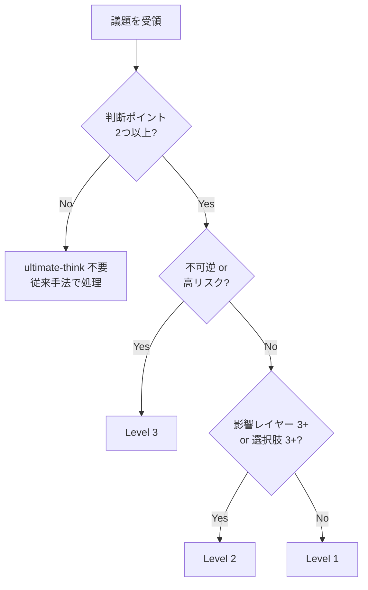
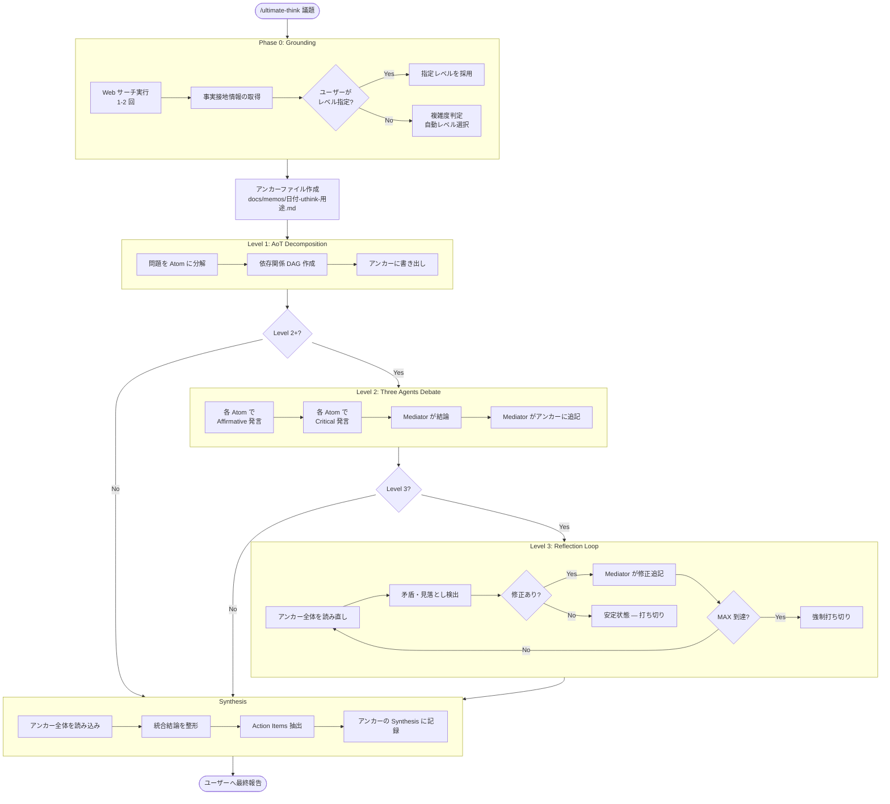

# 機能仕様書: ultimate-think

## メタ情報

| 項目 | 内容 |
|------|------|
| ステータス | Draft |
| 作成日 | 2026-02-19 |
| 更新日 | 2026-02-19 |
| 関連メモ | [調査・評価レポート](../memos/2026-02-19-uitimate-think.md) |
| 関連 SSOT | [06_DECISION_MAKING.md](../internal/06_DECISION_MAKING.md) |

---

## 1. 概要

### 1.1 目的

AoT（Atom of Thought）、Three Agents Model、Reflection を統合した思考スキル `ultimate-think` を提供する。
複雑かつ大量の指示に対し、推論ミス・論理的矛盾・見落としに起因するハルシネーションを多層防御で抑制し、高品質な回答を得る。

### 1.2 ユーザーストーリー

```
As a LAM ユーザー,
I want 複雑な意思決定を構造化された多段階思考プロセスで処理したい,
So that ハルシネーションを抑制し、根拠のある高品質な結論を得られる.
```

### 1.3 スコープ

**含む:**
- Phase 0: Web サーチによる事実接地 + 複雑度判定
- Level 1-3 の適応的深度制御
- アンカーファイルによる思考の永続化と漂流防止
- Single-Writer/Multi-Reader アクセス制御
- 無限ループ防止（diff ベース安定性検知）
- 全フェーズ（PLANNING / BUILDING / AUDITING）で全レベル利用可能

**含まない:**
- Level 4: Deterministic Verification（形式検証 — 将来拡張）
- 外部ソルバ（Python, Lean4 等）との統合
- スキル内部での自動的な Three Agents SSOT の変更

---

## 2. 機能要求

### FR-001: Phase 0 — Grounding + 複雑度判定
- **説明**: 思考開始前に Web サーチで事実接地を行い、知識ギャップを解消する。その後、問題の複雑度を判定し実行レベルを自動選択する。
- **優先度**: Must
- **受け入れ条件**:
  - [ ] Web サーチが 1-2 回実行され、関連情報が取得される
  - [ ] Web サーチ失敗時は警告メッセージを出し、Grounding なしで続行する
  - [ ] 複雑度判定基準に基づきレベル（1/2/3）が自動選択される
  - [ ] 判断ポイントが 2 つ未満の場合、「ultimate-think は不要と判断します。従来手法で回答します。」と通知し、通常の軽量回答を返す
  - [ ] ユーザーが明示的にレベルを指定した場合、自動判定を上書きする（FR-007）

#### Web サーチクエリ生成

議題から重要キーワードを抽出し、1-2 回の Web サーチを実行する。
検索結果の網羅性・正確性は完璧を求めない。「何も調べずに回答するより精度が高い」水準で十分とする。
サーチが失敗（タイムアウト・結果ゼロ）した場合は、警告を出して Grounding なしで続行する。

#### 複雑度判定基準

既存の AoT 適用条件（`06_DECISION_MAKING.md` Section 5.3）を拡張する:

| レベル | 条件（いずれか該当） |
|:---|:---|
| **Level 1** | 判断ポイントが 2 つ以上、**かつ** 影響範囲が単一ドメイン |
| **Level 2** | 影響レイヤー/モジュールが 3 つ以上、**または** 有効な選択肢が 3 つ以上 |
| **Level 3** | 不可逆な決定を含む、**または** 複数ドメインに跨る高リスク判断 |

**判定フロー**:



---

### FR-002: Level 1 — AoT Decomposition
- **説明**: 問題を独立した Atom に分解し、アンカーファイルに書き出す。各 Atom は `06_DECISION_MAKING.md` Section 5.1 の Atom 定義（自己完結性・インターフェース契約・エラー隔離）を満たすこと。
- **優先度**: Must
- **受け入れ条件**:
  - [ ] 問題が Atom テーブル + 依存関係 DAG に分解される
  - [ ] アンカーファイルが `docs/memos/` に作成される（FR-005 準拠）
  - [ ] 各 Atom が個別に処理され、Synthesis でまとめられる

---

### FR-003: Level 2 — Three Agents Debate
- **説明**: Level 1 の Atom 分解に加え、各 Atom について Affirmative / Critical / Mediator の 3 Agents 議論を実施する。議論プロトコルは `06_DECISION_MAKING.md` Section 1-3 に従う。Mediator のみがアンカーファイルに結論を追記する。
- **優先度**: Must
- **受け入れ条件**:
  - [ ] 各 Atom について 3 Agents Debate が実施される
  - [ ] Mediator の結論のみがアンカーファイルに追記される（Single-Writer）
  - [ ] 各 Atom の議論結果が独立している（エラー隔離）

---

### FR-004: Level 3 — Reflection Loop
- **説明**: Level 2 完了後、アンカーファイル全体を読み直し、矛盾・見落とし・論理的飛躍を検出する。Mediator が修正をアンカーに追記し、差分がなくなった時点で打ち切る。
- **優先度**: Should
- **受け入れ条件**:
  - [ ] アンカー全体を対象とした矛盾・見落とし検出が実行される
  - [ ] Mediator のみが修正を追記する
  - [ ] 安定性検知（FR-006）により打ち切られる

---

### FR-005: アンカーファイル管理
- **説明**: 思考プロセスの中間成果物をアンカーファイルとして `docs/memos/` に保存する。Blackboard Architecture に基づき、Single-Writer/Multi-Reader のアクセス制御を適用する。
- **優先度**: Must
- **受け入れ条件**:
  - [ ] アンカーファイルが命名規則に従い作成される
  - [ ] 書き込みは Mediator のみ（Single-Writer）
  - [ ] 他 Agent は読み取り専用（Multi-Reader）
  - [ ] ユーザーが途中でアンカーを確認できる

#### アンカーファイルフォーマット

**保存先**: `docs/memos/`
**命名規則**: `YYYY-MM-DD-uthink-{用途}.md`
**例**: `2026-02-19-uthink-api-design.md`
**重複時**: 同名ファイルが存在する場合は `v2`, `v3` のナンバリングを付与（例: `2026-02-19-uthink-api-design-v2.md`）
**クリーンアップ**: 思考過程の記録として恒久保存する。スキルによる自動削除は禁止。

```markdown
# ultimate-think Anchor: {用途}

**議題**: {元の議題}
**レベル**: {1/2/3}
**開始**: {タイムスタンプ}

---

## Phase 0: Grounding

**Web サーチ結果**:
- {検索結果のサマリ 1}
- {検索結果のサマリ 2}

**複雑度判定**: Level {N} — {判定理由}

---

## AoT Decomposition

| Atom | 判断内容 | 依存 |
|:---|:---|:---|
| A1 | {判断 1} | なし |
| A2 | {判断 2} | A1 |

---

## Atom A1: {判断内容}

### Three Agents Debate（Level 2+）

**[Mediator 結論]**:
- {結論}
- **Action**: {アクション}

---

## Reflection（Level 3）

### Iteration {N}

**検出事項**:
- {矛盾/見落とし}

**修正**:
- {Mediator による修正内容}

---

## Synthesis

**統合結論**:
- {最終結論}

**Action Items**:
1. {アクション 1}
2. {アクション 2}
```

#### Single-Writer/Multi-Reader アクセス制御

| 操作 | Mediator | Affirmative | Critical | サブエージェント |
|:---|:---:|:---:|:---:|:---:|
| アンカー作成 | W | - | - | - |
| アンカー追記 | W | - | - | - |
| アンカー読取 | R | R | R | R |
| アンカー削除 | - | - | - | - |

- **W**: 書き込み可、**R**: 読み取り専用、**-**: 操作不可
- アンカーの削除はユーザーのみ可能（スキルによる自動削除は禁止）

---

### FR-006: 無限ループ防止
- **説明**: Reflection Loop の無限実行を防止するため、チェックポイント diff 検知と最大反復回数制限を設ける。
- **優先度**: Must
- **受け入れ条件**:
  - [ ] 各 Reflection イテレーション後にアンカーの diff を検知する
  - [ ] diff がない（安定状態）場合、ループを打ち切る
  - [ ] 最大反復回数（2 回固定）を超えた場合、強制打ち切りする
  - [ ] 打ち切り理由がアンカーの Synthesis セクションに記録される

#### 安定性検知アルゴリズム

```
MAX_ITERATIONS = 2  # 固定値。引数による変更不可。

for iteration in 1..MAX_ITERATIONS:
    checkpoint_before = read(anchor_file)
    execute_reflection(anchor_file)
    checkpoint_after = read(anchor_file)

    if checkpoint_before == checkpoint_after:
        # 安定状態に到達 — 打ち切り
        record_termination_reason("stable")
        break

if iteration == MAX_ITERATIONS:
    record_termination_reason("max_iterations_reached")
```

| パラメータ | 値 | 説明 |
|:---|:---|:---|
| `MAX_ITERATIONS` | 2（固定） | Reflection の最大反復回数。引数による変更不可。 |

---

### FR-007: ユーザーによるレベル明示指定
- **説明**: ユーザーがスキル呼び出し時にレベルを明示的に指定できる。指定された場合、Phase 0 の自動判定を上書きする。
- **優先度**: Should
- **受け入れ条件**:
  - [ ] `--level=N` 引数でレベルを指定できる
  - [ ] 指定されたレベルで実行される（自動判定をスキップ）
  - [ ] 不正な値（1-3 以外）の場合、エラーメッセージを表示する

---

### FR-008: Synthesis
- **説明**: アンカーファイルの内容を最終成果物（統合結論 + Action Items）に整形する。
- **優先度**: Must
- **受け入れ条件**:
  - [ ] 全 Atom の結論が統合される
  - [ ] Action Items が抽出・整理される
  - [ ] 結果がアンカーの Synthesis セクションに記録される
  - [ ] ユーザーへの最終報告がアンカーの Synthesis に基づいて行われる

---

## 3. 非機能要求

### NFR-001: コンテキスト消費の最小化
- **説明**: スキルプロンプトのコンテキスト消費を最小化する。SSOT（`06_DECISION_MAKING.md`）を参照する方式とし、スキル内にルールを重複記載しない。
- **優先度**: Must
- **指標**: スキルプロンプト本体が 200 行以内

### NFR-002: Sonnet サブエージェント対応
- **説明**: Level 1-2 の処理は Sonnet モデルのサブエージェントで実行可能とする。委任は **Task ツール経由** で行う（コンテキスト隔離・エラー隔離のため）。Level 3 の Reflection は Opus（メインオーケストレーター）が担当する。
- **優先度**: Should
- **指標**: Level 1-2 の各 Atom 処理をサブエージェントに委任しても結果品質が低下しない

---

## 4. 技術仕様

### 4.1 実行フロー図



### 4.2 レイヤー構成

```
ultimate-think Skill（.claude/skills/ultimate-think/SKILL.md）
│
│  ※ スキルはラッパー。AoT / Three Agents のルール SSOT は
│     docs/internal/06_DECISION_MAKING.md に維持。
│
├── Phase 0: Grounding
│   ├── WebSearch ツールで事実接地
│   └── 複雑度判定 → レベル選択
│
├── Level 1: AoT Decomposition
│   ├── Atom 分解（06_DECISION_MAKING.md Section 5 準拠）
│   └── アンカーファイル作成・書き出し
│
├── Level 2: Three Agents Debate
│   ├── 各 Atom で Divergence → Debate → Convergence
│   │   （06_DECISION_MAKING.md Section 1-3 準拠）
│   └── Mediator のみアンカーに追記
│
├── Level 3: Reflection Loop
│   ├── アンカー全体の矛盾・見落とし検出
│   ├── Mediator が修正追記
│   └── 安定性検知 or MAX_ITERATIONS で打ち切り
│
└── Synthesis
    └── アンカーを最終成果物に整形
```

---

## 5. スキル定義（SKILL.md の設計）

### 5.1 呼び出し方法

```bash
# 基本
/ultimate-think {議題}

# レベル明示指定
/ultimate-think --level=2 {議題}
```

### 5.2 引数

| 引数 | 説明 | デフォルト |
|:---|:---|:---|
| `--level=N` | 実行レベル（1/2/3） | 自動判定 |

### 5.3 SSOT との関係

| 項目 | SSOT の所在 | スキルでの扱い |
|:---|:---|:---|
| Atom の定義 | `06_DECISION_MAKING.md` Section 5.1 | 参照のみ（重複記載しない） |
| AoT 適用条件 | `06_DECISION_MAKING.md` Section 5.3 | Phase 0 で拡張利用 |
| Three Agents プロトコル | `06_DECISION_MAKING.md` Section 1-3 | 参照のみ（重複記載しない） |
| 出力フォーマット | `06_DECISION_MAKING.md` Section 5.5 | Reflection + Synthesis セクションを拡張 |

スキルプロンプト内では SSOT のセクション番号を参照し、ルール本文を転記しない。
これにより NFR-001（コンテキスト消費最小化）を達成する。

### 5.4 Skill ファイル配置（予定）

```
.claude/
└── skills/
    └── ultimate-think/
        └── SKILL.md    # スキル本体
```

---

## 6. 制約事項

- `docs/internal/06_DECISION_MAKING.md` が AoT + Three Agents の SSOT であり、スキルはそのラッパーに徹する
- アンカーファイルは `docs/memos/` に保存する（他ディレクトリへの保存は禁止）
- Level 4（Deterministic Verification）は本仕様のスコープ外（将来拡張）
- サブエージェントからのサブエージェント起動は不可（Claude Code の制約）
- Reflection Loop の MAX_ITERATIONS は 2 回固定（引数による変更不可）
- 全フェーズ（PLANNING / BUILDING / AUDITING）で利用可能。フェーズによるレベル制限なし

---

## 7. 依存関係

| 依存先 | 種別 | 説明 |
|:---|:---|:---|
| `docs/internal/06_DECISION_MAKING.md` | SSOT | AoT + Three Agents のルール定義 |
| WebSearch ツール | ツール | Phase 0 の事実接地に使用 |
| Read / Write ツール | ツール | アンカーファイルの読み書き |
| `docs/memos/` ディレクトリ | ファイルシステム | アンカーファイルの保存先 |
| Claude Code Skills API | プラットフォーム | スキルの実行基盤 |

---

## 8. テスト観点

### 8.1 レベル別実行パス

- [ ] Level 1 のみで完結する問題が正しく処理される
- [ ] Level 2 で 3 Agents Debate が各 Atom に対し実行される
- [ ] Level 3 で Reflection Loop が実行され、安定状態で打ち切られる
- [ ] ユーザー指定レベルが自動判定を正しく上書きする

### 8.2 無限ループ防止

- [ ] diff なし（安定状態）で Reflection が打ち切られる
- [ ] MAX_ITERATIONS（2 回）到達で強制打ち切りされる
- [ ] 打ち切り理由がアンカーに記録される

### 8.3 アンカーファイル

- [ ] 命名規則に従ったファイルが `docs/memos/` に作成される
- [ ] Mediator のみが書き込みを行っている（Single-Writer）
- [ ] Affirmative / Critical は読み取りのみ（Multi-Reader）
- [ ] ユーザーが途中でアンカーの内容を確認できる

### 8.4 Phase 0

- [ ] Web サーチが実行され、事実接地情報が取得される
- [ ] Web サーチ失敗時に警告メッセージが表示され、Grounding なしで続行される
- [ ] 複雑度判定が適切なレベルを返す
- [ ] ultimate-think 不要な単純問題で軽量回答に切り替わる

### 8.5 SSOT 整合性

- [ ] スキルが `06_DECISION_MAKING.md` のルールと矛盾しない
- [ ] AoT の Atom 定義（自己完結性・インターフェース契約・エラー隔離）が守られている
- [ ] Three Agents の議論プロトコル（Divergence → Debate → Convergence）が守られている

---

## 9. 未決定事項

なし（全項目が 2026-02-19 のレビューで解決済み）。

### 解決済み事項

| 項目 | 決定内容 | 反映先 |
|:---|:---|:---|
| サブエージェント委任方式 | Task ツール経由（コンテキスト隔離のため） | NFR-002 |
| Web サーチクエリ生成 | 重要キーワード抽出。完璧は求めない | FR-001 |
| アンカーファイルクリーンアップ | 恒久保存。重複時は v2 ナンバリング | FR-005 |
| MAX_ITERATIONS 引数化 | しない。2 回固定 | FR-006 |
| フェーズ制限 | 全フェーズで全レベル利用可能 | Section 6 |
| Phase 0 サーチ失敗時 | 警告して Grounding なしで続行 | FR-001 |
| 不要判定時の振る舞い | 軽量メッセージで通知し、従来手法で回答 | FR-001 |

---

## 10. Definition of Ready チェックリスト

- [x] **Doc Exists**: `docs/specs/` に仕様書が存在する
- [ ] **Unambiguous**: A〜D の要素が明記され、解釈の揺れがない
  - [x] Core Value (Why & Who) — Section 1.1, 1.2
  - [x] Data Model (What) — Section 2 FR-005 アンカーフォーマット
  - [x] Interface (How) — Section 5 スキル定義
  - [x] Constraints (Limits) — Section 6
- [ ] **Atomic**: タスクが 1 PR 単位に分割されている
- [x] **Testable**: 受け入れ条件がテストケースで表現可能
- [ ] **Reviewed**: 3 Agents Model でレビュー済み

---

## 11. 変更履歴

| 日付 | 変更者 | 内容 |
|:---|:---|:---|
| 2026-02-19 | Architect | 初版作成（調査レポートに基づく） |
| 2026-02-19 | Architect | 未決定事項を全件解決。MAX_ITERATIONS=2、全フェーズ利用可、アンカー恒久保存、Task ツール委任、サーチ失敗時警告続行、不要時軽量回答 |
