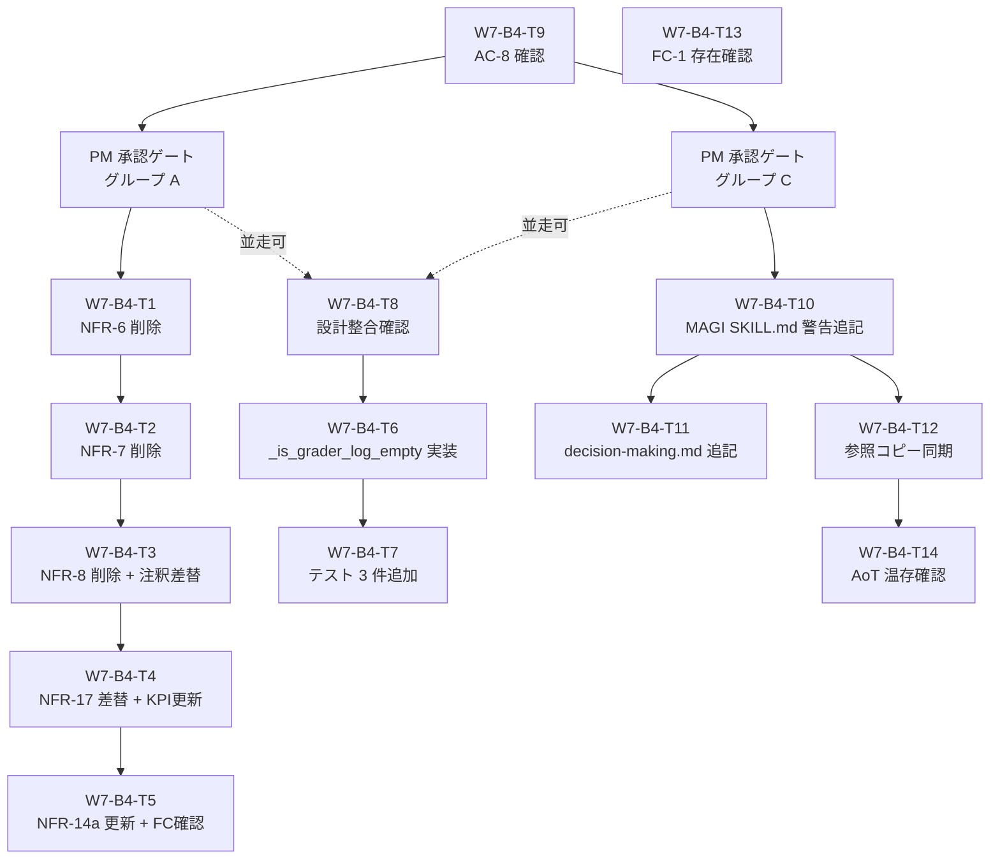

# タスク定義書: v5 fat 削減リファクタ

- バージョン: 1.0.0
- 作成日: 2026-06-20
- ステータス: Draft（PM 承認待ち）
- マイルストーン: B-4 ④
- 根拠文書:
  - `docs/specs/v5-fat-reduction/requirements.md`（FR-1.1〜FR-4.5、AC-1〜AC-11）
  - `docs/specs/v5-fat-reduction/design.md`（diff 範囲・関数シグネチャ・文言確定版）

---

## §1. 概要

### マイルストーン位置

B-4 ④「v5 fat 削減リファクタ」の BUILDING Wave 1 向けタスク定義。
要件定義書 §6「実施フェーズと優先順」を踏襲し、以下の 3 グループを Wave 1 で実施する。

| グループ | 章 | 権限等級 | Wave |
|---------|-----|---------|------|
| A: NFR cleanup | §1 FR-1.1〜1.5 | PM 級 | W1 |
| B: distill-lessons 改修 | §2 FR-2.1〜2.4 | SE 級 | W1（A と並走可） |
| C: MAGI 警告ラベル | §4 FR-4.1〜4.5 | PM 級 | W1（A/B と並走可） |
| D: 確認のみ | §3 AC-8 確認 | — | W1 先頭（5 分作業） |

### 並走方針

- グループ A（仕様書 `v4.0.0-immune-system-requirements.md` + `evaluation-kpi.md` 変更）、
  グループ B（`.claude/scripts/distill_lessons.py` 変更）、
  グループ C（`.claude/skills/magi/SKILL.md` 等変更）は
  **編集対象ファイルが完全独立**のため並走推奨。
- グループ A 内（T1〜T5）は同一ファイル `v4.0.0-immune-system-requirements.md` を複数タスクが変更するため
  **直列実施必須**（T1 → T2 → T3 → T4 の順。T5 は同ファイルだが T4 完了後）。
  ただし T4 は evaluation-kpi.md の変更を含むため、T1〜T3 完了後に同 PR でまとめても可。
- グループ D（T9: AC-8 確認）は 5 分以内の確認作業のため Wave 1 先頭で完了させる。
- **PM 級タスク（T1〜T5、T10、T11、T12）は BUILDING 着手前に PM 承認ゲートを通過すること**。

---

## §2. タスクリスト

### グループ D: 確認タスク（先行）

---

#### W7-B4-T9: §3 commit c674ec8 存在確認

| 項目 | 内容 |
|------|------|
| **Task ID** | W7-B4-T9 |
| **概要** | commit c674ec8 が master に存在し、4 Step の no-op マーカーが SKILL.md に追記されていることを確認する |
| **対応 FR** | （FR なし — 実施済み作業の受け入れ確認） |
| **対応 AC** | AC-8 |
| **権限等級** | PG 級（読取・確認のみ） |
| **推定工数** | S（15 分以内） |
| **依存** | なし（Wave 1 先頭で実施） |
| **関連ファイル** | `.claude/skills/full-review/SKILL.md` |

**完了条件（DoD）:**
- [ ] `git log --oneline \| grep c674ec8` の出力に当該コミットが存在する
- [ ] `grep -c "現状 no-op" .claude/skills/full-review/SKILL.md` の出力が `4` である
- [ ] Stage 1/3 の該当 Step が物理削除されていないことを確認（行が存在する）
- [ ] 確認結果を PR コメントまたは完了報告に記載する

**備考:** 本タスクは実施済み作業の確認のみ。実装不要。

---

### グループ A: NFR cleanup（PM 級・仕様書変更）

**注意: T1〜T5 は同一ファイルへの変更を含むため直列実施。実施前に PM 承認ゲートを通過すること。**

---

#### W7-B4-T1: NFR-6 削除 + HTML コメント挿入

| 項目 | 内容 |
|------|------|
| **Task ID** | W7-B4-T1 |
| **概要** | `v4.0.0-immune-system-requirements.md` §6.3 から NFR-6 行を削除し、参照先に HTML コメントを挿入する |
| **対応 FR** | FR-1.1 |
| **対応 AC** | AC-1（NFR-6/7/8 行削除の一部） |
| **権限等級** | PM 級（仕様書変更） |
| **推定工数** | S（30 分） |
| **依存** | PM 承認ゲート（グループ A 着手前） |
| **関連ファイル** | `docs/specs/v4.0.0-immune-system-requirements.md`（L549）、`docs/design/hooks-python-migration-design.md`（L289） |

**完了条件（DoD）:**
- [ ] `v4.0.0-immune-system-requirements.md` §6.3 の NFR-6 行（L549）が削除されている
- [ ] 実施前に `grep -rn "NFR-6" docs/` で参照先を再確認し、設計書 §1.6 の一覧と照合する
- [ ] `docs/design/hooks-python-migration-design.md` L289 に HTML コメント `<!-- NFR-6 は v5 fat 削減で削除済み (2026-06-20)。docs/specs/v5-fat-reduction/requirements.md 参照 -->` が挿入されている
- [ ] 監査記録・v5-fat-reduction 配下には HTML コメントを挿入しない（削除免除対象）

**備考:** T1・T2・T3 は同一ファイル §6.3 の変更。同一 PR にまとめることを推奨（T3 完了後に 1 PR）。

---

#### W7-B4-T2: NFR-7 削除 + HTML コメント挿入

| 項目 | 内容 |
|------|------|
| **Task ID** | W7-B4-T2 |
| **概要** | `v4.0.0-immune-system-requirements.md` §6.3 から NFR-7 行を削除し、参照先に HTML コメントを挿入する |
| **対応 FR** | FR-1.2 |
| **対応 AC** | AC-1（NFR-6/7/8 行削除の一部） |
| **権限等級** | PM 級（仕様書変更） |
| **推定工数** | S（15 分） |
| **依存** | W7-B4-T1 完了後（同一ファイル編集の直列制約） |
| **関連ファイル** | `docs/specs/v4.0.0-immune-system-requirements.md`（L550） |

**完了条件（DoD）:**
- [ ] `v4.0.0-immune-system-requirements.md` §6.3 の NFR-7 行（L550）が削除されている
- [ ] NFR-7 参照先が設計書 §1.6 の一覧以外に存在しないことを grep で確認する
- [ ] NFR-7 への参照先がある場合は HTML コメントを挿入する（FR-1.2 の「FR-1.1 と同様」条件）

**備考:** T1 と T2 は同一 §6.3 テーブルの隣接行の削除。T1→T2→T3 の順で実施後、1 PR でまとめることを推奨。

---

#### W7-B4-T3: NFR-8 削除 + §6.3 注釈差し替え

| 項目 | 内容 |
|------|------|
| **Task ID** | W7-B4-T3 |
| **概要** | `v4.0.0-immune-system-requirements.md` §6.3 から NFR-8 行を削除し、注釈を差し替える |
| **対応 FR** | FR-1.3 |
| **対応 AC** | AC-1（NFR-6/7/8 行削除の一部）、AC-2（§6.3 注釈差し替え） |
| **権限等級** | PM 級（仕様書変更） |
| **推定工数** | S（20 分） |
| **依存** | W7-B4-T2 完了後 |
| **関連ファイル** | `docs/specs/v4.0.0-immune-system-requirements.md`（L551、注釈行） |

**完了条件（DoD）:**
- [ ] `v4.0.0-immune-system-requirements.md` §6.3 の NFR-8 行（L551）が削除されている
- [ ] §6.3 の既存注釈（「NFR-6〜8 は厳密な制約ではなく…」）が削除されている
- [ ] 代替注釈「ループ実行時間の計測は NFR-15/16 の可観測性基盤が整備された後に実施する。」が挿入されている
- [ ] §6.3 テーブルに NFR-9 行のみが残っていることを確認する（設計書 §1.2 変更後イメージと照合）
- [ ] `grep "NFR-6\|NFR-7\|NFR-8" docs/specs/v4.0.0-immune-system-requirements.md` の出力に §6.3 テーブル行が存在しない

**備考:** AC-1 と AC-2 の両方をカバーする。T1/T2/T3 は 1 PR での提出を推奨。

---

#### W7-B4-T4: NFR-17 差し替え + evaluation-kpi.md §6.2 更新

| 項目 | 内容 |
|------|------|
| **Task ID** | W7-B4-T4 |
| **概要** | §6.5 の NFR-17 テキストを「手動スナップショット」に差し替え、`evaluation-kpi.md` §6.2 の「Wave 2 完了前」条件分岐を削除する |
| **対応 FR** | FR-1.4 |
| **対応 AC** | AC-4、AC-5 |
| **権限等級** | PM 級（仕様書変更） |
| **推定工数** | S（30 分） |
| **依存** | W7-B4-T3 完了後（`v4.0.0-immune-system-requirements.md` の直列制約） |
| **関連ファイル** | `docs/specs/v4.0.0-immune-system-requirements.md`（§6.5 L572）、`docs/specs/evaluation-kpi.md`（§6.2 L136〜L144） |

**完了条件（DoD）:**
- [ ] `v4.0.0-immune-system-requirements.md` §6.5 の NFR-17 が「運用 KPI の手動スナップショット（`/quick-save` 実行時に K1〜K5 の値を人間が記録する。自動集計スクリプトの実装はオプション）」に差し替えられている
- [ ] `evaluation-kpi.md` §6.2 の見出しが「任意集計時の出力」に更新されている
- [ ] `evaluation-kpi.md` §6.2 の「Wave 2 完了前は以下を表示」条件分岐ブロックが削除されている
- [ ] `evaluation-kpi.md` §6.2 に設計書 §1.5 の「変更後」テキストが反映されている
- [ ] `grep "Wave 2 完了前" docs/specs/evaluation-kpi.md` の出力が空である

---

#### W7-B4-T5: NFR-14a 更新 + future-candidates 起票確認

| 項目 | 内容 |
|------|------|
| **Task ID** | W7-B4-T5 |
| **概要** | §6.4 の NFR-14a テキストを「v5 Phase 1 で計測スクリプト実装」に更新し、FC-5 の存在を確認する |
| **対応 FR** | FR-1.5 |
| **対応 AC** | AC-3 |
| **権限等級** | PM 級（仕様書変更） |
| **推定工数** | S（20 分） |
| **依存** | W7-B4-T4 完了後（`v4.0.0-immune-system-requirements.md` の直列制約） |
| **関連ファイル** | `docs/specs/v4.0.0-immune-system-requirements.md`（§6.4 L564）、`docs/tasks/v4.0.0-immune-system-tasks.md`（L425）、`docs/specs/v5-fat-reduction/future-candidates.md` |

**完了条件（DoD）:**
- [ ] `v4.0.0-immune-system-requirements.md` §6.4 の NFR-14a が「v5 Phase 1 で計測スクリプトを実装し、ベースラインを確立する（現状: 実計測ゼロ・計測スクリプト未実装。Wave 1 完了チェック済みだが内容未達）」に更新されている
- [ ] `docs/tasks/v4.0.0-immune-system-tasks.md` L425 の完了チェック行に「（内容未達: 実計測ゼロ・計測スクリプト未実装）」の注釈が追加されている
- [ ] `docs/specs/v5-fat-reduction/future-candidates.md` に FC-5（NFR-14a 計測スクリプト実装）が存在することを確認する（要件定義 §7 に記録指示あり・既存 FC-5 で対応済みの場合は確認のみ）

**備考:** T1〜T5 の連続変更完了後、グループ A 全体を 1 PR で提出することを推奨。

---

### グループ B: distill-lessons 改修（SE 級・グループ A/C と並走可）

---

#### W7-B4-T8: design §2 整合確認（実装前ゲート）

| 項目 | 内容 |
|------|------|
| **Task ID** | W7-B4-T8 |
| **概要** | design §13（distill_lessons 設計書）の「未検証エントリを MUST で追記する」要件と FR-2.1 空スキップ条件に矛盾がないことを確認する |
| **対応 FR** | FR-2.4 |
| **対応 AC** | （実装前ゲート・AC 直接対応なし） |
| **権限等級** | SE 級（読取・確認のみ） |
| **推定工数** | S（20 分） |
| **依存** | なし（T6 着手前に完了） |
| **関連ファイル** | 設計書 §2（`docs/specs/v5-fat-reduction/design.md`）、`.claude/scripts/distill_lessons.py` |

**完了条件（DoD）:**
- [ ] `distill_lessons.py` の既存実装（L217〜L247）と design §2 の記述を照合し、矛盾が存在しないことを確認する
- [ ] 矛盾が存在する場合は **実装を中断し PM 判断を求める**（FR-2.4 MUST）
- [ ] 矛盾なしと判断した場合は確認結果を記録し T6 着手を許可する

**備考:** FR-2.4 は SHOULD 要件だが、矛盾発見時の PM エスカレーションは MUST。本タスクは T6 の前提ゲートとして設置する。

---

#### W7-B4-T6: distill_lessons.py `_is_grader_log_empty()` 実装

| 項目 | 内容 |
|------|------|
| **Task ID** | W7-B4-T6 |
| **概要** | `distill_lessons.py` に `_is_grader_log_empty()` を追加し、`distill()` 関数の L239 直後（L241 の重複チェック前）にスキップ分岐を挿入する |
| **対応 FR** | FR-2.1、FR-2.2 |
| **対応 AC** | AC-6 |
| **権限等級** | SE 級（内部ロジック変更・公開 API 不変） |
| **推定工数** | M（2〜3 時間） |
| **依存** | W7-B4-T8 完了（設計整合確認） |
| **関連ファイル** | `.claude/scripts/distill_lessons.py`（L217〜L247、L90〜L129、L175） |

**完了条件（DoD）:**
- [ ] `_is_grader_log_empty(grader_logs: list[dict]) -> bool` 関数が実装されている
- [ ] C-1〜C-4 の AND 条件が全て実装されている（設計書 §2.3 シグネチャと一致）
- [ ] C-4 の定型文判定が `build_lesson_entry()` L175 の実際の固定文字列と照合している
- [ ] C-2/C-3 の対象フィールドが `_extract_fail_reasons()` / `_extract_fix_summary()` の実装から特定されている
- [ ] `distill()` 内の挿入位置が `_load_grader_logs()` 呼び出し直後・`if target_path.exists():` ブロック直前であることを確認する（FR-2.2 処理順序 MUST）
- [ ] スキップ時に `logging.getLogger(__name__).info("distill-lessons: skipped (empty grader log)")` が出力される（`print()` / `sys.stderr.write()` は使用しない）

---

#### W7-B4-T7: distill_lessons テスト 3 件追加 + 既存 21 件 PASS 確認

| 項目 | 内容 |
|------|------|
| **Task ID** | W7-B4-T7 |
| **概要** | `test_distill_lessons.py` に FR-2.3 指定の 3 テストを追加し、既存 21 件含む全テストが PASS することを確認する |
| **対応 FR** | FR-2.3 |
| **対応 AC** | AC-7 |
| **権限等級** | SE 級（テスト追加） |
| **推定工数** | M（1〜2 時間） |
| **依存** | W7-B4-T6 完了（実装が存在しないとテストを書けない） |
| **関連ファイル** | `.claude/scripts/tests/test_distill_lessons.py`、`.claude/scripts/distill_lessons.py` |

**完了条件（DoD）:**
- [ ] `test_empty_grader_log_skips_entry` が追加されている（grader_log_paths に有効ファイルなしのとき lessons.md が作成されない）
- [ ] `test_partial_fields_not_skipped` が追加されている（C-1 が False のとき、C-2〜C-4 が True でもスキップしない）
- [ ] `test_skip_log_output` が追加されている（スキップ時に `caplog` で `distill-lessons: skipped (empty grader log)` が INFO レベルで捕捉できる）
- [ ] 実装前に `pytest .claude/scripts/tests/test_distill_lessons.py -v` を実行し、既存 21 件が PASS していることを確認する（ベースライン記録）
- [ ] 実装後に `pytest .claude/scripts/tests/` で FAIL=0 を確認する（NFR-V2）

---

### グループ C: MAGI 警告ラベル（PM 級・グループ A/B と並走可）

**注意: T10・T11・T12 は `.claude/skills/` / `.claude/rules/` 変更のため PM 級。実施前に PM 承認ゲートを通過すること。**

---

#### W7-B4-T10: MAGI SKILL.md Step 4 警告ラベル追記

| 項目 | 内容 |
|------|------|
| **Task ID** | W7-B4-T10 |
| **概要** | `.claude/skills/magi/SKILL.md` の Step 4（Reflection）冒頭に警告ラベルを追記する |
| **対応 FR** | FR-4.1 |
| **対応 AC** | AC-9 |
| **権限等級** | PM 級（`.claude/skills/` 変更） |
| **推定工数** | S（20 分） |
| **依存** | PM 承認ゲート（グループ C 着手前） |
| **関連ファイル** | `.claude/skills/magi/SKILL.md`（L79 直後） |

**完了条件（DoD）:**
- [ ] `### Step 4: Reflection（振り返り）` 行（現状 L79）の直後に警告ラベル 7 行が挿入されている
- [ ] 警告ラベルの文言が requirements.md FR-4.1 確定版と一字一句一致している
- [ ] Step 4 の既存本文（「全員で結論を検証する。**1 回限り**。」等）が変更されていない
- [ ] Step 0〜3 / Step 5 が変更されていないことを確認する（FR-4.5 MUST NOT）
- [ ] `grep "WARNING: temporary preserve" .claude/skills/magi/SKILL.md` が 1 件ヒットする

---

#### W7-B4-T11: decision-making.md Reflection 行への警告追記

| 項目 | 内容 |
|------|------|
| **Task ID** | W7-B4-T11 |
| **概要** | `.claude/rules/decision-making.md` の Step 4 該当行（L18）に警告コメントを追記する |
| **対応 FR** | FR-4.2 |
| **対応 AC** | （AC 直接対応なし — NFR-V3 に間接関与） |
| **権限等級** | PM 級（`.claude/rules/` 変更） |
| **推定工数** | S（15 分） |
| **依存** | W7-B4-T10 完了後（警告文言の確定後に追記する） |
| **関連ファイル** | `.claude/rules/decision-making.md`（L18） |

**完了条件（DoD）:**
- [ ] `decision-making.md` L18 の「Reflection（新規追加）」行末または直後に警告コメントが追記されている
- [ ] 追記内容: `> [WARNING] B-4 監査（2026-06-19）実機計測: 初回変更率 0% / v5 ② gabriel 統合予定`
- [ ] L18 以外の行（AoT Decomposition・MAGI Debate・Convergence）が変更されていない

**備考:** FR-4.2 は `rules/` 配下変更のため PM 級承認が必要。T10 の PM 承認と同時に取得することを推奨。

---

#### W7-B4-T12: lam-orchestrate 参照コピー同期

| 項目 | 内容 |
|------|------|
| **Task ID** | W7-B4-T12 |
| **概要** | `.claude/skills/lam-orchestrate/references/magi-skill.md` に T10 と同一文言の警告ラベルを追記し、diff で文言一致を検証する |
| **対応 FR** | FR-4.3 |
| **対応 AC** | AC-10 |
| **権限等級** | PM 級（`.claude/skills/` 変更） |
| **推定工数** | S（15 分） |
| **依存** | W7-B4-T10 完了後（SKILL.md の確定版テキストをコピーするため） |
| **関連ファイル** | `.claude/skills/lam-orchestrate/references/magi-skill.md`（L78 直後） |

**完了条件（DoD）:**
- [ ] `magi-skill.md` の `### Step 4: Reflection（振り返り）` 行（現状 L78）直後に同一警告ラベル 7 行が挿入されている
- [ ] 設計書 §4.4 の検証コマンドで diff が空（差分なし）であることを確認する:
  ```bash
  grep -A 7 "WARNING: temporary preserve" .claude/skills/magi/SKILL.md > /tmp/magi-warning.txt
  grep -A 7 "WARNING: temporary preserve" .claude/skills/lam-orchestrate/references/magi-skill.md > /tmp/ref-warning.txt
  diff /tmp/magi-warning.txt /tmp/ref-warning.txt
  ```
- [ ] `magi-skill.md` の Step 4 以外の行が変更されていない
- [ ] NFR-V3（SKILL.md と参照コピーの文言一致）が達成されている

---

#### W7-B4-T13: future-candidates.md gabriel 統合記録の確認

| 項目 | 内容 |
|------|------|
| **Task ID** | W7-B4-T13 |
| **概要** | `docs/specs/v5-fat-reduction/future-candidates.md` に FR-4.4 が要求する gabriel 統合設計記録（FC-1）が存在することを確認する |
| **対応 FR** | FR-4.4 |
| **対応 AC** | AC-11 |
| **権限等級** | SE 級（読取・確認のみ） |
| **推定工数** | S（10 分） |
| **依存** | なし（Wave 1 いつでも可） |
| **関連ファイル** | `docs/specs/v5-fat-reduction/future-candidates.md` |

**完了条件（DoD）:**
- [ ] `future-candidates.md` に FC-1（MAGI v2 gabriel 統合）が存在することを確認する
- [ ] FC-1 に以下の項目が記載されていることを確認する:
  - 対象（MAGI Reflection の gabriel adversarial probe への統合）
  - 設計根拠（ADR-0005 Reflection 追補）
  - 統合方針
  - 実施条件（v5 ② gabriel エージェント設計・ADR 新設との同時実施）
  - 権限等級（PM 級）
- [ ] 不足項目がある場合は追記する（SE 級作業）

**備考:** 作成日 2026-06-20 時点で `future-candidates.md` には FC-1 が既に記録されている。
本タスクはその内容が FR-4.4 の要求を満たしていることを確認し、不足があれば補完する。

---

#### W7-B4-T14: AoT 分解温存確認（FR-4.5 MUST NOT 検証）

| 項目 | 内容 |
|------|------|
| **Task ID** | W7-B4-T14 |
| **概要** | T10 完了後、SKILL.md の Step 0〜3 / Step 5 が変更されていないことを機械的に確認する |
| **対応 FR** | FR-4.5 |
| **対応 AC** | （AC 直接対応なし — FR-4.5 MUST NOT の事後検証） |
| **権限等級** | PG 級（読取・確認のみ） |
| **推定工数** | S（10 分） |
| **依存** | W7-B4-T10 完了後、W7-B4-T12 完了後 |
| **関連ファイル** | `.claude/skills/magi/SKILL.md`（L38〜L77、L94〜L105） |

**完了条件（DoD）:**
- [ ] SKILL.md の Step 0（AoT Decomposition / L38〜L54）が変更されていないことを git diff で確認する
- [ ] Step 1〜3（L56〜L77）が変更されていないことを git diff で確認する
- [ ] Step 5（AoT Synthesis / L94〜L105）が変更されていないことを git diff で確認する
- [ ] 変更箇所が Step 4 の警告ラベル挿入のみであることを確認する

**備考:** T10 の DoD にも AoT 温存確認を含めているが、本タスクは `diff` による機械的な事後検証として独立させる。T12 完了後に一括実施可。

---

## §3. 依存グラフ



### 実行フェーズ表

| フェーズ | タスク | 並列実行可否 | 備考 |
|---------|--------|------------|------|
| 0 | T9 | 単独 | 先行確認（5 分） |
| 1 | PM 承認ゲート A + C | 単独 | 承認前着手禁止 |
| 2 | T1、T8、T13 | Yes（A/B/C は独立） | T1 はグループ A 先頭 |
| 3 | T2 | No（T1 後） | 同一ファイル直列 |
| 4 | T3 | No（T2 後） | 同一ファイル直列 |
| 5 | T4、T10 | Yes | T4 は grp A / T10 は grp C |
| 6 | T5、T11、T12、T6 | Yes | T5 は grp A / T11・T12 は grp C / T6 は grp B |
| 7 | T7、T14 | Yes | T7 は grp B / T14 は grp C |

---

## §4. 並走戦略

### ファイル系列の独立性確認

| グループ | 主要変更ファイル | 他グループとの競合 |
|---------|--------------|----------------|
| A | `docs/specs/v4.0.0-immune-system-requirements.md`、`docs/specs/evaluation-kpi.md`、`docs/tasks/v4.0.0-immune-system-tasks.md`、`docs/design/hooks-python-migration-design.md` | なし |
| B | `.claude/scripts/distill_lessons.py`、`.claude/scripts/tests/test_distill_lessons.py` | なし |
| C | `.claude/skills/magi/SKILL.md`、`.claude/rules/decision-making.md`、`.claude/skills/lam-orchestrate/references/magi-skill.md`、`docs/specs/v5-fat-reduction/future-candidates.md` | なし |

**結論: A・B・C の 3 グループは全ファイルが独立しており、Wave 1 内での並走が可能。**

### 並走時の PR 構成案

| PR | タスク | 推奨タイミング |
|----|--------|-------------|
| PR-A | T1+T2+T3+T4+T5 | グループ A 全完了後（§1 仕様書変更をひとまとめ） |
| PR-B | T8+T6+T7 | グループ B 全完了後（SE 級・distill_lessons 改修） |
| PR-C | T10+T11+T12+T13+T14 | グループ C 全完了後（§4 MAGI 警告） |
| PR-D | T9 | Wave 1 先頭で即座（確認のみ・1 コミット） |

**注意:** PR-A・PR-C は PM 承認後に PR を作成する。PR-B は SE 級のためレビュー承認のみで可。

---

## §5. WBS 100% Rule 検証表

### AC 対応表（Gap チェック）

| AC | 条件 | 対応タスク | 状態 |
|----|------|----------|------|
| AC-1 | NFR-6/7/8 行が削除されている | T1、T2、T3 | covered |
| AC-2 | §6.3 注釈が差し替えられている | T3 | covered |
| AC-3 | NFR-14a が「v5 Phase 1」に更新されている | T5 | covered |
| AC-4 | NFR-17 が「手動スナップショット」に差し替えられている | T4 | covered |
| AC-5 | `evaluation-kpi.md` §6.2 の「Wave 2 完了前」が削除されている | T4 | covered |
| AC-6 | `distill()` に C-1〜C-4 空スキップが実装されている | T6 | covered |
| AC-7 | 3 件新規テスト追加 + 既存 21 件含む全テスト PASS | T7 | covered |
| AC-8 | commit c674ec8 の存在確認（実施済み） | T9 | covered |
| AC-9 | MAGI SKILL.md Step 4 に警告ラベルが追記されている | T10 | covered |
| AC-10 | `magi-skill.md` 参照コピーに同一文言の警告ラベル | T12 | covered |
| AC-11 | `future-candidates.md` に gabriel 統合設計記録が存在する | T13 | covered |

**Gap（仕様にあるがタスクにないもの）: 0 件**

### NFR 対応表

| NFR | 条件 | 対応タスク |
|-----|------|----------|
| NFR-V1 | §1 変更箇所に HTML コメントを残す | T1（NFR-6）、T2（NFR-7）、T3（NFR-8 / 注釈差替） |
| NFR-V2 | §2 変更後、既存テスト 21 件が PASS を維持 | T7 |
| NFR-V3 | §4 の警告ラベルが SKILL.md と参照コピーで文言一致 | T12、T14 |

### タスク → FR トレーサビリティ（Orphan チェック）

| タスク ID | 対応 FR | FR 存在確認 |
|----------|---------|-----------|
| T9 | AC-8（§3 実施済み確認） | 要件 §3 で定義済み |
| T1 | FR-1.1 | 要件 §1 で定義済み |
| T2 | FR-1.2 | 要件 §1 で定義済み |
| T3 | FR-1.3 | 要件 §1 で定義済み |
| T4 | FR-1.4 | 要件 §1 で定義済み |
| T5 | FR-1.5 | 要件 §1 で定義済み |
| T8 | FR-2.4 | 要件 §2 で定義済み |
| T6 | FR-2.1、FR-2.2 | 要件 §2 で定義済み |
| T7 | FR-2.3 | 要件 §2 で定義済み |
| T10 | FR-4.1 | 要件 §4 で定義済み |
| T11 | FR-4.2 | 要件 §4 で定義済み |
| T12 | FR-4.3 | 要件 §4 で定義済み |
| T13 | FR-4.4 | 要件 §4 で定義済み |
| T14 | FR-4.5 | 要件 §4 で定義済み |

**Orphan（タスクにあるが FR/AC にないもの）: 0 件**

### FR 完全カバレッジ確認

| FR | 対応タスク |
|----|----------|
| FR-1.1 | T1 |
| FR-1.2 | T2 |
| FR-1.3 | T3 |
| FR-1.4 | T4 |
| FR-1.5 | T5 |
| FR-2.1 | T6 |
| FR-2.2 | T6 |
| FR-2.3 | T7 |
| FR-2.4 | T8 |
| FR-4.1 | T10 |
| FR-4.2 | T11 |
| FR-4.3 | T12 |
| FR-4.4 | T13 |
| FR-4.5 | T14 |

**全 FR カバレッジ: 14/14（100%）**

---

## §6. リスク・前提

### R-1: グループ A 内の同一ファイル二重変更

T1〜T5 は `v4.0.0-immune-system-requirements.md` の異なるセクション（§6.3、§6.4、§6.5）を変更する。
直列実施（T1 → T2 → T3 → T4 → T5 の順）を守り、各タスク完了後にファイルを保存してから次のタスクに進む。
1 PR にまとめる場合は T5 完了後に 1 コミットとし、中間状態でのコミットは推奨しない。

### R-2: goal-driven-orchestration の NFR-6/7/8 と混同

設計書 §1.1 の注意事項通り、`docs/specs/goal-driven-orchestration/` 配下の NFR-6/7/8 は別番号体系。
T1〜T3 の実施前に `grep -rn "NFR-6\|NFR-7\|NFR-8" docs/` で参照箇所を網羅確認し、
`goal-driven-orchestration/` 配下の参照は変更対象外と明示する。

### R-3: グループ C での参照コピー同期失敗

T12 完了後に `diff` コマンドで文言一致を検証する（設計書 §4.4 手順）。
差分が発生した場合は T12 の修正後に T14 を実施する。

### R-4: T8 での矛盾検出時の停止

design §2.4 にて矛盾が発見された場合、T6・T7 の実施を中断し PM 判断を求める。
矛盾の内容・判断を `docs/artifacts/` に記録してから再開する。

### R-5: future-candidates.md FC-1 の内容不足

T13 で FC-1 の内容が FR-4.4 の要求を満たさない場合（gabriel 統合方針、設計根拠、権限等級等の欠落）、
SE 級の補完作業として追記する。追記後に AC-11 を再確認する。

---

## §7. Definition of Ready 最終チェック

### 全タスク共通

- [x] 対応する仕様書（requirements.md FR-X.X）が存在する
- [x] 受け入れ条件（DoD）がテスト可能な形式で定義されている（grep・diff・pytest の結果で検証可能）
- [x] 1 PR で完結するサイズである（最大でも PR-A の 5 タスク連続変更）

### タスク個別 DoR 確認

| タスク | 仕様リンク | テスト可能 | PR サイズ | 権限等級 |
|--------|---------|----------|---------|---------|
| T9 | AC-8 | git log | S | PG |
| T1 | FR-1.1 | grep | S | PM |
| T2 | FR-1.2 | grep | S | PM |
| T3 | FR-1.3、FR-1.4 | grep + テキスト照合 | S | PM |
| T4 | FR-1.4 | テキスト照合 | S | PM |
| T5 | FR-1.5 | テキスト照合 | S | PM |
| T8 | FR-2.4 | 手動確認 | S | SE |
| T6 | FR-2.1、FR-2.2 | pytest | M | SE |
| T7 | FR-2.3 | pytest | M | SE |
| T10 | FR-4.1 | grep + テキスト照合 | S | PM |
| T11 | FR-4.2 | テキスト照合 | S | PM |
| T12 | FR-4.3 | diff | S | PM |
| T13 | FR-4.4 | ファイル存在確認 + テキスト照合 | S | SE |
| T14 | FR-4.5 | git diff | S | PG |
